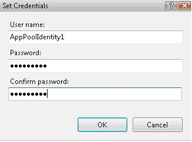
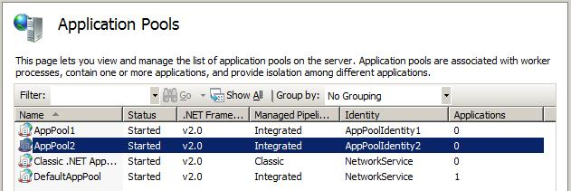

Using Encryption to Protect Passwords
====================
by [Saad Ladki](https://twitter.com/saadladki)

## Introduction

This document provides an overview of the steps required for setting both application pool and worker process isolation for IIS 7.0 and above servers. Application pool isolation entails protecting data that WAS (the IIS local system process) needs to access. An example of this data is the application pool passwords. Worker process isolation, on the other hand, entails protecting data that the application pool identity needs to access. An example of this data is the anonymous user account password.

This article contains:

- [Prerequisites](using-encryption-to-protect-passwords.md#Prerequisites)
- [Creating a New RSA Encryption Provider Application](using-encryption-to-protect-passwords.md#CreatingNew)
- [Creating User Accounts](using-encryption-to-protect-passwords.md#CreatingUser)
- [Application Pool Isolation](using-encryption-to-protect-passwords.md#Application)
- [Worker Process Isolation](using-encryption-to-protect-passwords.md#Worker)
- [Summary](using-encryption-to-protect-passwords.md#Summary)

## Prerequisites

To help simplify this process, two pieces of sample code are provided that:

- Create a new RSA encryption provider in machine.config.
- Set the name of the default provider in machine.config.

The final prerequisite section guides you in setting up four User accounts that will be used in later topics.

## Creating a New RSA Encryption Provider Application

> 1. Open Windows Notepad and create a file in a directory of your choosing named **createProvider.cs** that contains the following C# code:

[!code-csharp[Main](using-encryption-to-protect-passwords/samples/sample1.cs)]

> 2. Next, launch an elevated command prompt:

> a. Click the **Start** menu.   
> b. Right-click **Command Prompt.**   
> c. Select **Run as administrator.**

> 3. In the command prompt Window, navigate to the where location you saved the **createProvider.cs** file and run the following command to compile your code:  
> **%SystemRoot%\Microsoft.NET\Framework\v2.0.50727\csc.exe /reference:%SystemRoot%\System32\inetsrv\Microsoft.Web.Administration.dll createProvider.cs**

This step is now complete.

### Creating an Application to Change the Default Provider

> 1. Open Windows Notepad and create a file in a directory of your choosing named **setProvider.cs** that contains the following C# code:

[!code-csharp[Main](using-encryption-to-protect-passwords/samples/sample2.cs)]

> 2. Next, launch an elevated command prompt:

> a. Click the **Start** menu.   
> b. Right-click **Command Prompt.**   
> c. Select **Run as administrator.**

> 3. In the command prompt Window navigate to the location you saved the **setProvider.cs** file and run the following command to compile your code:  
> **%SystemRoot%\Microsoft.NET\Framework\v2.0.50727\csc.exe /reference:%SystemRoot%\System32\inetsrv\Microsoft.Web.Administration.dll setProvider.cs**

This step is now complete.

## Creating User Accounts

In this step, we create four new user accounts that will be used throughout this document.

To begin, open a command shell Window running under administrative rights using the following steps:

1. Click the **Start** menu.
2. Right-click **Command Prompt** .
3. Select **Run as administrator.**
4. In the command window, execute the following commands:

[!code-console[Main](using-encryption-to-protect-passwords/samples/sample3.cmd)]

This step is now complete.

## Application Pool Isolation

IIS has a process called WAS that runs under the context of LOCALSYSTEM and is the only process that needs access to the application pool passwords. In this task, we:

- Create a new RSA key (iisWasKey) that only LOCALSYSTEM and Administrators have access to. This key will be used to encrypt every application pool's passwords.
- Create two application pools.
- Configure each of these application pools to run under different identities and encrypt their passwords using the iisWasKey.
- Restrict NTFS file system permissions on the key files so only SYSTEM and Administrators have access.

### Create New RSA Key

1. Click the **Start** menu.
2. Right-click on **Command Prompt.**
3. Select **Run as administrator.**
4. In the command window navigate to where you saved your **createProvider.exe** and run the following command:

[!code-console[Main](using-encryption-to-protect-passwords/samples/sample4.cmd)]

Verify that these changes occurred correctly. Open your **%SystemRoot%\Microsoft.NET\Framework\v2.0.50727\config\machine.config** using Windows Notepad and verify the lines to the section are present for the new provider:

[!code-unknown[Main](using-encryption-to-protect-passwords/samples/sample-127009-5.unknown)]

### Encrypt the Application Pool Passwords

By default, whenever a property is encrypted, IIS uses the defaultProvider for encryption defined in machine.config. The default value for this is RsaProtectedConfigurationProvider.

In this step, we use the setProvider.exe application created earlier to change the provider to iisWasKey and then use the IIS Manager to change the passwords:

1. Click the **Start** menu.
2. Right-click on **Command Prompt.**
3. Select **Run as administrator.**
4. In the command window navigate to where you saved your **setProvider.exe** and run the following command:

[!code-console[Main](using-encryption-to-protect-passwords/samples/sample6.cmd)]

The default provider Rsa\_WAS has been successfully changed.

### Create New Application Pools

In this step, we create two new application pools that we isolate from one another. To do so, launch the IIS Manager:

1. Click **Start**, and type '**INetMgr.exe**' and press **Enter** (if prompted, select **Continue** to elevate your permissions).
2. Click the **+** button beside the name of your machine in the **Connections** section.
3. Click **Application Pools**.
4. Select the task on the right titled **Add Application Pool**.
5. Input the Name '**AppPool1**' and then press **OK** as shown:  
  
    
6. Repeat previous steps but this time use the name **AppPool2**.
7. You now see the following screen within the IIS Manager:  
  
    
8. Notice how the identity for both **AppPool1** and **AppPool2** are **NetworkService**. We will change this to be the accounts we created earlier by right clicking **AppPool1** and then selecting **Advanced Settings**
9. Under the title **Process Model**:   
a. Click the button to the right of the words **Identity**.  
b. In the **Application Pool Identiy** window select the "**Custom account**" radio button and click the "Set..." button.  
c. Input the following user name and password in the **Set Credentials** dialog.  
  
user name: **AppPoolIdentity1**  
password: **password1  
  
**

> 10. Now the **Identity** value should appear as shown below:  
>   
> 

> 11. Click **OK** to save your changes.  
> 12. Repeat the previous step for **AppPool2** and user the user name "**AppPoolIdentity2**" and the password "**password2**".   
> 13. You see the following displayed in the IIS Manager (mainly the Identities for the application pools have changed):  
>   
> 

> 14. Verify the changes by using Windows Notepad and opening the **%SystemRoot%\System32\Inetsrv\applicationHost.config file**. Navigate to the **applicationPools** section and you see that we encrypted the application pool passwords using the Rsa\_WAS key as intended:

[!code-unknown[Main](using-encryption-to-protect-passwords/samples/sample-127009-7.unknown)]

### Locking Down the Encryption Providers

By default, the IIS\_IUSRS is given read access to the keys when they are created. However, we can use the ASPNET\_REGIIS tool to remove that access. To do so, run the following commands from the elevated command prompt:

[!code-console[Main](using-encryption-to-protect-passwords/samples/sample8.cmd)]

This removed IIS\_IUSRS (the application pool identities group) from being able to read the **iisWasKey** which is intended for only Administrators and LOCALSYSTEM access.

## Worker Process Isolation

This topic tells how to setup worker process isolation by creating two new sites that are part of different application pools and have different anonymous authentication identities. We then create a new RSA provider for each application pool to encrypt the anonymous passwords.

### Create New Sites

In this section, we create two new sites and add each site to an application pool we created earlier. To begin, open a command shell running under administrative rights using the following steps:

1. Click the **Start** menu.
2. Right-click **Command Prompt.**
3. Select **Run as administrator.**
4. In the command window, navigate to your **wwwroot** directory using the following command:

[!code-console[Main](using-encryption-to-protect-passwords/samples/sample9.cmd)]

5. Create a new directory named "**one**" and a directory "**two**" using the following commands:

[!code-unknown[Main](using-encryption-to-protect-passwords/samples/sample-127009-10.unknown)]

[!code-unknown[Main](using-encryption-to-protect-passwords/samples/sample-127009-11.unknown)]

6. Create a basic **Default.htm** file in both the "**one**" and "**two**" directories that contain following HTML code:

[!code-html[Main](using-encryption-to-protect-passwords/samples/sample12.html)]

> [!NOTE]
> Replace 'X' with either 'one' or 'two' depending on the directory location of the file.

Now use the IIS manager to create two sites:

1. Click **Start**, type **INetMgr.exe** and press **Enter** (if prompted, select **Continue** to elevate your permissions).
2. Click on the **+** button beside the name of your machine in the **Connections** section.
3. Right click **Site** in the tree view under **Connections** and then select **Add Web Site**.
4. Use the following information to create your site:   
  
***Web Site Name: One   
Application Pool: AppPool1   
Physical Path: {location of your inetpub directory}\wwwroot\one   
Port: 81*** This should like the following when completed:[******](using-encryption-to-protect-passwords/_static/image18.jpg)
5. Click **OK** to save the changes.
6. Repeat the previous two steps but this time use the following information for the second site:   
  
    ***Web Site Name: Two   
Application Pool: AppPool2   
Physical Path: {location of your inetpub directory}\wwwroot\two   
Port: 82***

You have now created two new sites named **One** and **Two**, and added them to the **AppPool1** and **AppPool2** applications pools.

The URLs to test your sites are:

- http://localhost:81 for site **One**
- http://localhost:82 for site **Two**

### Create New Providers for Each Application Pool

In this section, we create a new RSA provider for each of the application pools:

1. Click the **Start menu.**
2. Right-click **Command Prompt.**
3. Select **Run as administrator.**
4. In the command window execute, navigate to where you saved your **createProvider.exe** and run the following command:

[!code-console[Main](using-encryption-to-protect-passwords/samples/sample13.cmd)]

### Set the Anonymous Account for Site One

In your elevated command prompt Window, run the following command:

[!code-console[Main](using-encryption-to-protect-passwords/samples/sample14.cmd)]

1. Return back to **IIS Manager** and double click site **One**.
2. Double click the **Authentication** item under the **Feature Name** heading.
3. Select **Anonymous Authentication** and then click **Edit** under the **Tasks** heading on the right side which brings up the **Edit Anonymous Authentication Credentials** dialog box.
4. Click the **Specific User** option and then click the **Set** button.
5. Input the username **AnonymousAccount1** and password **password3** and select **OK.**
6. This brings up the following dialog box:  
  
    
7. Press **OK** to save your changes.

### Set the Anonymous Account for Site Two

In your elevated command prompt Window, run the following command:

[!code-console[Main](using-encryption-to-protect-passwords/samples/sample15.cmd)]

1. Return back to **IIS Manager** and double click on site **Two**.
2. Double click the **Authentication** item under the **Feature Name** heading.
3. Select **Anonymous Authentication** and then click **Edit** under the **Tasks** heading on the right side which brings up the **Edit** **Anonymous Credentials** dialog box.
4. Click the **Specific User** option and click **Set**.
5. Input the username **AnonymousAccount2** and password **password4** and select **OK**.
6. Click **OK** to save your changes.

### Reset the Encryption Provider to the Default

- Return to your elevated command prompt Window and run the following command:

[!code-console[Main](using-encryption-to-protect-passwords/samples/sample16.cmd)]

> [!NOTE]
> This change ensures that all encrypted future properties use the default encryption provider.

### Verify the Changes

Verify that what we wanted did happen. Using Windows Notepad, open the **%SystemRoot%\System32\Inetsrv\applicationHost.config** file:

- Notice that the password for **AppPool1** and **AppPool2** are both still protected with the **Rsa\_Was** key
- Notice that the password for **AnonymousAccount1** is also protected with the **Rsa\_app1** key:

[!code-unknown[Main](using-encryption-to-protect-passwords/samples/sample-127009-17.unknown)]

- Finally, note that the **AnonymousAccount2** password is also protected with the **Rsa\_app2** key:

[!code-unknown[Main](using-encryption-to-protect-passwords/samples/sample-127009-18.unknown)]

### Locking Down the Encryption Providers

Secure the file permissions for our keys, as done previously, above. Run the following commands from the elevated command prompt:

[!code-console[Main](using-encryption-to-protect-passwords/samples/sample19.cmd)]

These commands have removed the ability of IIS\_IUSRS to read the keys and added only the application pool identity that needs access permission to the keys.

### Testing Your Sites

Now test your sites:

- Http://localhost:81
- Http://localhost:82

Everything should continue to work as it had before.

## Summary

In summary, we performed the following tasks to secure the application pool settings:

- Created two application pools
- Created two local user accounts and configured them as the application pool identities
- We created an Administration encryption key and used it to protect all the application pool identities passwords
- We used ASPNET\_REGIIS to remove IIS\_IUSRS (the application pool identities group) from accessing the key

These tasks effectively ensured that only the Administrators and SYSTEM accounts can read the passwords for the application pools. Therefore, if applications within an application pool tried to retrieve the passwords for their (or any) application pool, the attempt would fail.

To isolate the worker process settings, we:

- Created a new anonymous identity account
- We created a new provider for the application pool
- We encrypted the anonymous authentication password with the application pool key
- We removed access to the anonymous authentication provider for IIS\_IUSRS and granted access to just the application pool identity

This effectively ensured that the application pool identity can decrypt the anonymous password it belongs too and no one else.
  
  
[Discuss in IIS Forums](https://forums.iis.net/1043.aspx)