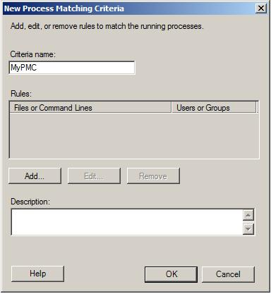

Using WSRM to manage IIS 7 AppPool CPU Utilization
====================
by [Walter Oliver](https://github.com/walterov)

## Introduction

In the past administrators used [CPULimit Metabase Property in IIS](https://www.microsoft.com/technet/prodtechnol/WindowsServer2003/Library/IIS/1b82ca25-5ea4-48b0-9ce7-a1c36765f1e2.mspx?mfr=true) to configure the maximum percentage of CPU time that the worker processes in an application pool are allowed to consume over a period of time. With the availability of Windows System Resource Manager (WSRM), setting CPULimit is no longer needed, moreover, it is not recommended.

WSRM enables administrators to control how CPU and memory resources are allocated to applications, services, and processes. Managing resources in this way improves system performance and reduces the chance that applications, services, or processes will interfere with the rest of the system. It also creates a more consistent and predictable experience for users of applications and services running on the computer.

WSRM integrates resource management with Web pools through a built-in policy called Equal\_Per\_IISAppPool. Policies in WSRM automatically switch to different resource allocations in response hardware to hot-add changes or cluster changes if running in a cluster configuration.

## Turning Off the CPULimit Metabase Property

1. Start the IIS Manager and connect to the target server
2. Click on the Application Pools node to view the available application pools, for each application pool open the **Advanced Settings** dialog by clicking **Advanced Settings** in the Actions panel. 

    
3. Under the CPU section ensure that the CPU Limit property is set to 0 (default value). 

    

## Using the Built-in IIS Policy

1. After installing the Web Role proceed to install Windows System Resource Manager.
2. Start WSRM by clicking the Windows Start button, select "Administrative Tool", and select "Windows System Resource Manager" 

    
3. Start the Equal\_Per\_IISAppPool built-in policy

    1. Open the Resource Allocation Policies node in the left-hand pane

        
    2. Right click on Equal\_Per\_IISAppPool in the left-hand pane
    3. Select Set as Managing Policy
    4. If prompted to disable the calendar, click OK

        
    5. Observe the behavior of the system under an IIS load. You could use WCAT for simulating a load on the server. This tools is part of IIS 6.0 Resource Kit which can be downloaded from the following link: [https://www.microsoft.com/downloads/details.aspx?FamilyID=56fc92ee-a71a-4c73-b628-ade629c89499&amp;DisplayLang=en](https://www.microsoft.com/downloads/details.aspx?FamilyID=56fc92ee-a71a-4c73-b628-ade629c89499&amp;DisplayLang=en)

## Creating a Custom IIS Policy (Optional)

1. Create at least 2 process matching criteria (PMC) for different AppPools 

    1. Right-click on the Process Matching Criteria node in the left-hand pane
    2. Select New Process Matching Criteria...
    3. The New Process Matching Criteria dialog appears 

        
    4. Enter a name for the PMC and click Add...
    5. The Add Rule dialog appears
    6. Select the Files or Command Lines tab
    7. Click in the area labeled "Included files or command lines" and type in a matching criteria.
    8. Use the following format (without the quotes): ["@w3wp.exe.\*&lt;AppPoolName](mailto:)&gt;" 

        
    9. Add lines to match additional AppPools (or any other processes) to this PMC
    10. Click OK
    11. Repeat the above steps for each additional PMC
2. Create a resource allocation policy (RAP) 

    1. Right click on the Resource Allocation Policy node in the left-hand pane
    2. Select New Resource Allocation Policy
    3. The New Resource Allocation Policy dialog appears
    4. Enter a name for the RAP 

        
    5. Click Add
    6. The Add or Edit Resource Allocation dialog appears
    7. Select the PMC (from the dropdown) this allocation should go to
    8. Enter the processor percentage to be allocated to the PMC 

        
    9. Click OK
    10. Add Resource Allocations for all other PMCs to be managed by RAP
    11. Click OK
3. Activate the policy 

    1. Right click on the RAP created above
    2. Select Set as Managing Policy
    3. If prompted to disable the calendar, click Yes
    4. Observe the behavior of the system while running an IIS load
