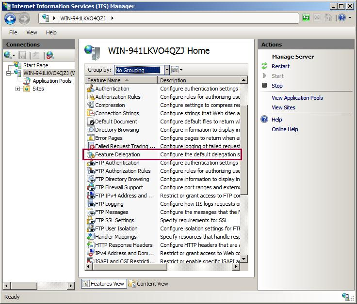
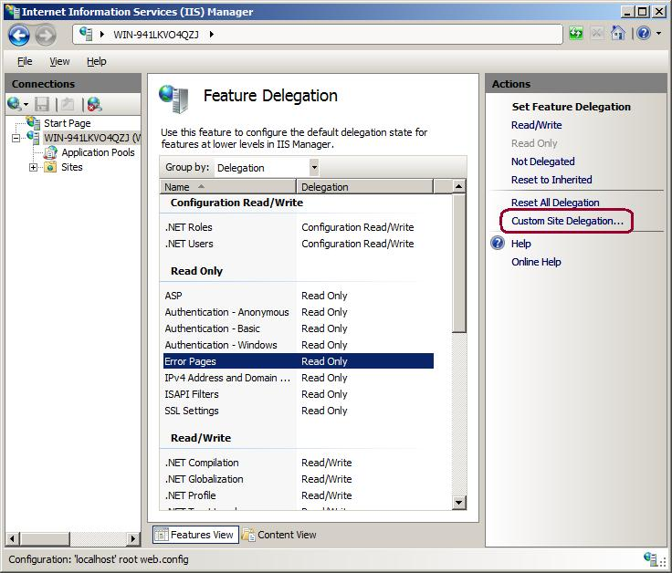
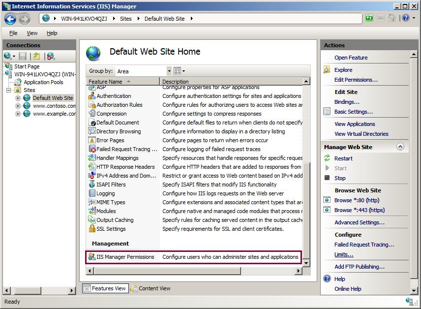
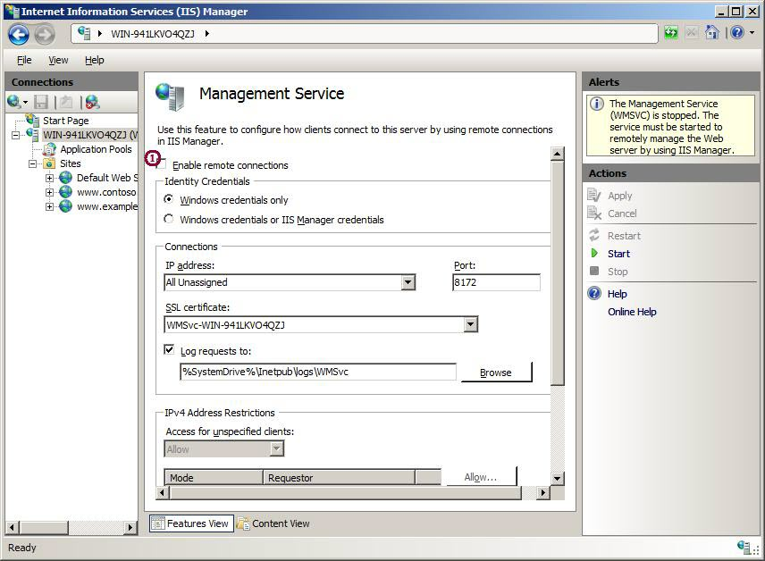
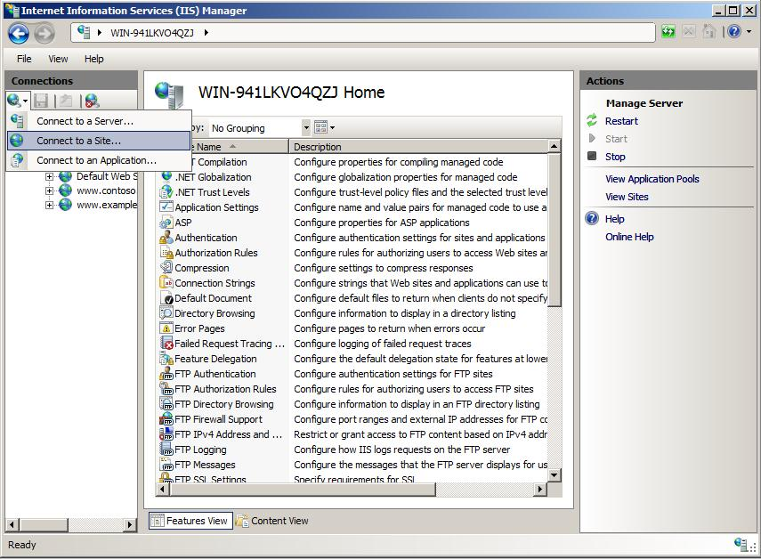

An Overview of Feature Delegation in IIS 7.0
====================
by [Saad Ladki](https://twitter.com/saadladki)

## Introduction

IIS feature delegation will interest you if you are one of the following:

- A server administrator and you are not the primary person providing content on your server.
- A developer and you want your server administrator to give you more control over IIS configuration for your application.

Of interest to server administrators is the fact that by default on IIS 7.0 and above, developers / site owners can put configuration for default documents, directory browsing, HTTP response headers, HTTP redirects, handlers and modules into their web.config files. This allows a developer to configure "start.aspx" to be their default document, and change the site URL structure so that all requests to www.contoso.com/techcareers/ are redirected to www.contoso.com/careers/technical/ - without the assistance of the server administrator.

You can accomplish this by unlocking more configuration. For example, unlock custom errors configuration so that developers can specify that all 404s be redirected to www.contoso.com/NotFound.aspx, or unlock failed request tracing configuration so that developers can trace 500 requests to pages \*.axd that return a status 500.  
  
For developers and site owners, IIS configuration eliminates the need for modifying the metabase. Config changes can be made directly in web.config alongside ASP.NET configuration. This solves issues such as needing to write an MSI for your applications to make custom IIS configuration changes; having a set of manual instructions for setting up your applications; or, trying to remember a year later the configuration details of an application on a production server.  
  
IIS feature delegation means managing:

- Configuration section locking to control what configuration can be set in web.config (generally, one IIS configuration section equals one IIS module).
- The set of site and application users that are permitted to use IIS Manager to view configuration and set configuration for features with unlocked configuration sections.

## Configuration Section Locking [appcmd]

> [!NOTE]
> The terms "configuration lock" or "configuration locking" in this article refer to overrideMode on configuration sections. Also, configuration locking alone cannot secure your configuration system – you must set ACL configuration files appropriately. Locking and setting file ACLs together make a complete configuration security plan.

Configuration locks can be managed using either IIS Manager or appcmd. We start with appcmd. The first step in the command prompt when working with **appcmd** is to add the inetsrv directory to the path so that you can use appcmd from anywhere.

> [!NOTE]
> Run these commands in an elevated cmd window if you are not running as the built-in Administrator account:

[!code-unknown[Main](an-overview-of-feature-delegation-in-iis/samples/sample-127034-1.unknown)]

Appcmd does not show the current lock state for configuration sections (you must use IIS Manager for this) – it only allows you to manipulate the locking. Here is how to unlock the custom errors configuration for all sites:

appcmd unlock config –section:httpErrors

Users new to IIS may ask how they know that httpErrors is the configuration section for custom errors. First, use this reference article that maps core server modules to their configuration. Second, find all IIS configuration settings in %windir%\system32\inetsrv\config\schema\IIS\_schema.xml.

Open the schema file in notepad, CTRL+F for Find, and type in a known config property or word that you associate with the feature. Try "customerror" first. If that does not find anything, try "errors" -- this finds the section "system.webServer\httpErrors" on the third try.

If you want to unlock the custom errors configuration for just one site instead of for all sites, the appcmd command below specifies that "Default Web Site" is what you are unlocking the configuration for:

[!code-console[Main](an-overview-of-feature-delegation-in-iis/samples/sample2.cmd)]

One more aspect on the basics: suppose you want to unlock custom errors configuration for all sites except a site called "UntrustedSite". When you do this, everyone who publishes content to all your sites will be able to put custom error configuration in their web.config files, except for the person who publishes to UntrustedSite. This is accomplished by:

[!code-console[Main](an-overview-of-feature-delegation-in-iis/samples/sample3.cmd)]

This completes locking and unlocking configuration sections using appcmd in Beta3.

## Configuration Section Locking [IIS Manager]

Now to do the same thing in IIS Manager.

1. Open IIS Manager (Start, Run, type inetmgr.exe) and click the connection to the local server in the tree view on the left side. Scroll down the feature list, find **Feature Delegation**, and double-click to open.

    
2. The Feature Delegation page shows all the features and their default delegation state for all sites ( "features" means all the items that appear in the home page feature list). Try Grouping by Delegation.

    
3. Notice that most of the IIS features like Windows Authentication and IPv4 Address and Domain Restrictions are Read Only, while ASP.NET configuration like Forms Authentication, Machine Key, and Session State are Read/Write. 

    > [!NOTE]
    > You see the Windows Authentication, Compression, or IP and Domain Restrictions features if they are installed.
4. Click a feature to see the delegation options in the task pane on the right.

    

    Error Pagescan be set to Read/Write.

    - Read/Write means that the feature's corresponding configuration section is unlocked and can be configured in web.config.
    - Both Read Only and Remove Delegation mean that the feature's corresponding configuration section is locked and cannot be configured in web.config without causing runtime errors.

    Do the same thing here as with appcmd above. When you change this delegation state, you change the default delegation for all sites.
5. If you want to configure delegation for just one site, click the Custom Site Delegation link at the top of the task pane.

    The Custom Site Delegation page displays, allows you to customize delegation for one site. This page looks similar to the Feature Delegation page, except that there is a drop-down at the top to select the site for which you want to configure delegation. This page also allows you to copy delegation from site to site to save time if you have a site with the same delegation that you want for a new site.

     /p>

## IIS Manager – Creating Site and Application Administrators

So far, the article has discussed how to control *what* the developers (or content providers, or site owners) can configure in web.config files, but it has not covered *how* they're going to set configuration once it is unlocked. Visual Studio is very good for ASP.NET and other framework configuration – IntelliSense makes it especially easy. Unfortunately, there is no IntelliSense for IIS configuration sections (hopefully, this will be addressed in the near future). Notepadcis an option, but Notepad is only as good as your memory and typing skills.

With IIS, a server administrator can configure IIS Manager to allow non-administrators to connect to a site or application and set configuration in their web.config files. There are two steps to make this work:

1. Specify the users that can connect to a site or application.
2. Start the Web Management Service (WMSVC) and enable remote connections if your users are not local

Start with creating site and application administrators.

1. Navigate to the Default Web Site, find the IIS Manager Permissions feature, and double-click to open.

    
2. Click **Allow User...** in the task pane to add a new user for the Default Web Site.
3. You have two options here: Windows User or Group, or IIS Manager user.

    An IIS Manager user is a username and password stored in %windir%\system32\inetsrv\config\administration.config. Most situations call for Windows Users. For example, a developer who publishes content directly to a web server through a file share or FTP already has read/write permission to the content folder. Since IIS Manager will impersonate that user when making configuration changes, the Windows user account has to have read/write access to the content folder where the web.config files will be written.

    On the other hand, perhaps the content provider publishes to a staging server and the content is replicated from the staging server out to the server farm. In this case, the content provider does not have access to the production servers; i.e., there is no Windows account to add. In this case, creating an IIS Manager user by adding a username/password as a site administrator allows the end user to view configuration for their application without making them a Windows user on the server.

    Add a Windows user (not an administrator) as a site administrator for the Default Web Site. Now you have a site administrator – but they still cannot connect to the server yet. This is discussed below.

## IIS Manager – Enabling Site and Application Administrators to Connect

The first step is installing the Web Management Service (WMSVC).

1. Open Server Manager (right-click Computer and click Manage), select the Web Server role, and install the Management Service component from under the Management Tools node.

    

    The Web Management Service (WMSVC) is a stripped down, stand-alone web server. When installed and started, WMSVC listens on port 8172. The IIS Manager client, the UI with buttons and text boxes, communicates over HTTP through web service calls to WMSVC when the user wants to take an action. WMSVC hosts the logic that implements the action, such as setting a configuration property or stopping a web site.
2. Open the Management Service page by navigating to the server home page. Find Management Service, and double-click to open.

    

    - Enable remote management so that WMSVC serves all requests instead of only requests that originate on the local server. WMSVC cannot be configured when running, so look at the HTTPS binding and IP and domain restrictions and decide whether or not you want to make any other changes.
    - Start WMSVC by clicking Start in the task pane. WMSVC listens on all unassigned IP addresses by default. If your web servers have more than one network card (NIC) and you want WMSVC to listen on one specific NIC, you have to configure that explicitly.

        

        At this point WMSVC is listening on port 8172, waiting for management requests.

        [!code-unknown[Main](an-overview-of-feature-delegation-in-iis/samples/sample-127034-4.unknown)]

## Testing

Now that everything is configured, test it to make sure it works. Do a sanity check on the local server first because local site and application administrators actions are routed through WMSVC.

If that works, then try to connect from a remote machine.

1. Click the drop-down arrow beside the Connect icon on top of the tree view and select Connect to a Site.

    
2. On the first page of the connection wizard, select "Manually enter the connection details on the next page" (the other option was removed in post-Beta 2 builds, so ignore it).
3. On the second page, fill in "localhost" for the server name, and "Default Web Site" for the site name.
4. On the credentials page, enter the credentials for the Windows user you added earlier as a site administrator. When you successfully connect, the final page of the wizard gives you the option to name the connection. 

    The new connection should look similar to the one in the screen shot below. The bottom right corner of the tool shows that you are connected to localhost on port 8172 as Alexis, and the lock icon indicates that the connection is over SSL. Your user name is in parentheses at the end of the connection name in the tree view.

    Also notice that a number of the site tasks are missing from the task pane – this is because site and application administrators are not permitted to take any administrator actions, for example, managing site bindings which are stored in the applicationHost.config file.

    

[Discuss in IIS Forums](https://forums.iis.net/1111.aspx)