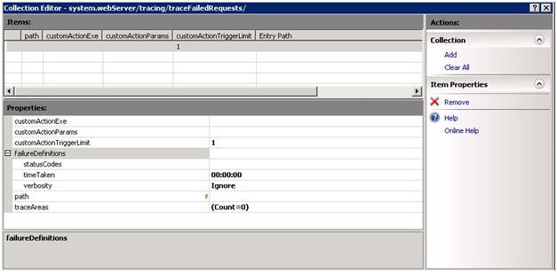

Editing Collections using Configuration Editor: Complex Sections
====================
by [Crystal Hoyer](https://github.com/crystalhoyer)

## Walkthrough Goal

Use the Collection Editor within the Configuration Editor module to add a new failed request tracing rule for an aspx request that either returns a status code of 401 and/or takes more than a minute to respond. This task can be accomplished using the current user interface, but the steps taken will expose an important feature within the new Administration Pack Configuration Editor module.

## Prerequisites

This walkthrough requires the following prerequisites:

- [Administration Pack V1 for IIS](https://www.iis.net/downloads/microsoft/administration-pack "Install Administration Pack")

## Accessing the system.webServer/tracing/traceFailedRequests Section

1. Open IIS Manager
2. Select the Server in the Connections Tree View
3. Open the Configuration Editor User Interface module

    
4. In the Configuration Editor Section combo box, Select system.webServer – tracing - traceFailedRequests or type system.webServer/tracing/traceFailedRequests

    

## Use Collection Editor to add a new failed tracing request rule

1. Select the **(Collection)** entry within Configuration Editor and click the … button next to **(Count=0)**. This will open the Collection Editor to edit the tracefailedRequests collection.

    
2. In the Actions Task Pane on the right hand side, click Add. You will now have a new entry in the Items section as well as a property listing.

    
3. The Properties section of collection editor comes pre-populated with the schema defaults for the defined collection. In this case, you get the schema defaults for system.webServer/tracing/traceFailedRequests collection elements.
4. There is a key next to the **path** property entry. This means that this is the unique key for this collection entry. Gold keys mean that this key must be unique for each item within the collection. A silver key means that this is a shared key. The combination of shared keys must be unique for a collection item in this case.
5. Change the **path** entry to be **\*.aspx** to create a rule for all asp.net paths.
6. Change the **statusCodes** entry to be **401**
7. Change the **timeTaken** entry **00:01:00**
8. Select the **(traceAreas)** entry within Collection Editor and click the … button next to **(Count=0)**. This will open the Collection Editor to edit the traceAreas collection.

    
9. In the Actions Task Pane on the right hand side, click Add. You will now have a new entry in the Items section as well as a property listing.

    
10. The Properties section of collection editor comes pre-populated with the schema defaults for the defined collection. In this case, you get the schema defaults for system.webServer/tracing/traceFailedRequests/add/traceAreas collection elements.
11. There is a key next to the **provider** property entry. This means that this is the unique key for this collection entry. Gold keys mean that this key must be unique for each item within the collection. A silver key means that this is a shared key. The combination of shared keys must be unique for a collection item in this case.
12. Change the **provider** entry to be **ASPNET**
13. Change the **areas** entry to be **Infrastructure, Module, Page, AppServices** [*Note:* You can get the provider name and the corresponding areas from the system.webServer/tracing/traceProviderDefinitions section]
14. Let the **verbosity** entry to be **Warning**
15. Close Collection Editor for traceAreas
16. Close Collection Editor for traceFailedRequests
17. In order to set the changes you must click **Apply** in the Actions Task Pane. Before you do that, click **Generate Script** in the Actions Task Pane. Now you have script code to add a failed trace request rule for aspx requests that either return a 401 or take more than a minute to respond
18. Click **Apply** in the Actions Task pane to make the changes to config.
19. You can quickly verify the new failed request tracing rule added by going to the Failed Request Tracing Rules feature page

    
20. The rule we just added using the configuration editor feature should be listed on the failed request tracing rules page

    
21. [*Extra Step*] If you don't want to keep any of the failed trace request rules that you created, edit the tracefailedRequests collections again and click **Clear All** in the Actions Task Pane. Click **Apply** within Configuration editor and the newly added rule will be removed.

## Summary

You have now created a new failed tracing request rule using Configuration Editor's Collection Editor tool. Collection Editor exposes all of the configuration settings for a given collection.

[Discuss in IIS Forums](https://forums.iis.net/1149.aspx)