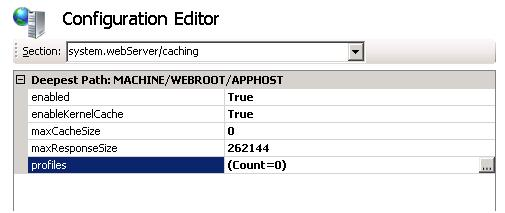
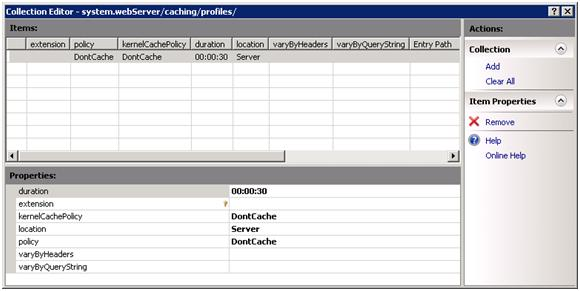

Editing Collections with Configuration Editor
====================
by Robert Lucero

## Walkthrough Goal

Learn how to use Configuration Editor to edit collections. For this example we will be configuring Output Caching to highlight the new functionality.

## Prerequisites

This walkthrough requires the following prerequisites:

- [Administration Pack V1 for IIS](https://learn.iis.net/page.aspx/415/install-the-administration-pack/ "Install Administration Pack")

## Accessing the system.webServer/caching Configuration Section

1. Open IIS Manager

2. Select the Server in the Connections Tree View

3. Open the Configuration Editor User Interface module

4. In the Configuration Editor Section combo box, Select system.webServer – caching or type system.webServer/caching

## Use Collection Editor to Add Three Cache Rules

1. Select the **profiles** entry within Configuration Editor and click the **…** button next to **(Count=0)**. This will open the Collection Editor to edit the caching collection.

2. In the Actions Task Pane on the right hand side, click Add. You will now have a new entry in the Items section as well as a property listing.

3. The Properties section of collection editor comes pre-populated with the schema defaults for the defined collection. In this case, you get the schema defaults for system.webServer/caching collection elements.

4. There is a key next to the **extension** property entry. This means that this is the unique key for this collection entry. Gold keys mean that this key must be unique for each item within the collection. A silver key means that this is a shared key. The combination of shared keys must be unique for a collection item in this case.

5. Change the **extension** entry to be ".html" to create a static content caching rule.

6. Change the **location** entry to be **ServerAndClient.**

7. Change the **policy** entry to cache for **CacheForTimePeriod**, this will cache this static content for 30 seconds.

8. Add two more cache rules by clicking **Add** in the Actions task pane. Configure them how you like.

9. Close Collection Editor.

10. In order to set the changes you must click **Apply** in the Actions Task Pane. Before you do that, click **Generate Script** in the Actions Task Pane. Now you have script code to set the three cache rules that were created.

11. Click **Apply** in the Actions Task pane to make the changes to config.

12. [*Extra Step*] If you don't want to keep any of the cache rules that you created, edit the caching collection again and click **Clear All** in the Actions Task Pane. Click **Apply** within Configuration editor and all of your rules will be removed.

## Summary

You have now created three output caching rules using Configuration Editor's Collection Editor. Collection Editor exposes all of the configuration settings for a given collection, just as Configuration Editor does.
  
  
[Discuss in IIS Forums](https://forums.iis.net/1149.aspx)