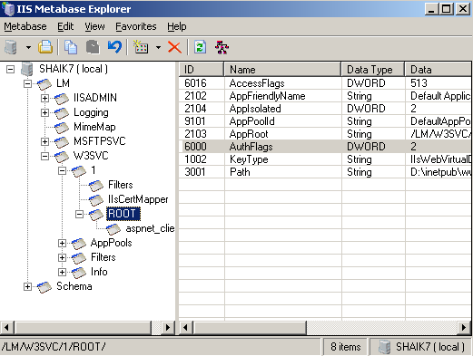

How to Use Metabase Compatibility with IIS 7 and Above
====================
by [Tobin Titus](https://github.com/tobint)

## Introduction

IIS 7 and and IIS 8 allow legacy configuration scripts and applications to continue running. There is an optional setup component that enables the Metabase system with its programmatic interfaces: Admin Base Objects (ABO), and ADSI and WMI providers on top of it. The system intercepts calls to ABO and maps them to the new configuration system. The data is persisted in applicationHost.config but the ABO caller is presented with a legacy view of the configuration structure.

This article contains:

- Prerequisites
- [Writing a Global Settings Using ABO](how-to-use-metabase-compatibility-with-iis-7-and-above.md#Writing)
- [Writing a Virtual Directory Setting Using ABO](how-to-use-metabase-compatibility-with-iis-7-and-above.md#WritingVDir)
- [Summary](how-to-use-metabase-compatibility-with-iis-7-and-above.md#Summary)

## Prerequisites

1. Make sure IIS is installed on the machine by selecting http://LocalHost from IE and see that you get the default "Under Construction" page. If IIS is not installed, refer to the Setup How-To for installation instructions.
2. Make sure you have administrative privileges on the machine: By default, you do not have them if you're logged on as a user other than the built-in Administrator account, even if this user was added to the local Administrators group on the machine (this is a new security feature in Windows Server® 2008 and above with IIS, called LUA, which is beyond the scope of IIS). Make sure to either log-on as the built-in Administrator account, or explicitly invoke applications as the built-in Administrator as needed, using the "runas" cmd-line tool. For example, to launch notepad.exe you could run this command: "runas /user:administrator notepad.exe". You will be prompted for the password of the Administrator account. It is useful to have a cmd-box shell that is already elevated, by running "runas /user:administrator cmd.exe". Every application you run from that cmd-box will be elevated as well, and you will not need to use the "runas" syntax from that cmd-box.
3. Make sure the master configuration file is backed up. Simply copy applicationHost.config to a different file, so that you can restore it later. You will find applicationHost.config under the inetsrv\ directory, which in turn is under the system directory. Note that you will need to be an administrator to do this – see previous point above.
4. Before you start, make sure you are in a "clean state". To do so, revert changes you may have done to the applicationHost.config file in previous exercises. (If you are using a VPC image, the easiest way to do that is to restart the image without saving its state).
5. It is also recommended that you turn off friendly HTTP error messages in IE (Tools &gt; Options &gt; Advanced) for quicker troubleshooting.

> [!NOTE]
> When copying text from .html files, you also copy hidden characters. When you paste the text into an editor such as Visual Studio, or into a command-box window, the text might appear as if it had been copied correctly, but the text you pasted might not work properly because it contains hidden characters. This situation can be difficult to debug.

The best way to copy text from .MHT files is to copy it, then paste it into Notepad, and then copy it again from Notepad. This removes any hidden characters. If the text is short, sometimes it is easier to just type it yourself instead of copying and pasting it.

## Writing a Global Settings Using ABO

In this step, you will learn how to change a value on a global setting using AdminBaseObjects interface and have it written through to the applicationHost.config file. You will use the MBExplorer.exe tool to perform this task.

First, verify that the Metabase Compatibility component of IIS is installed on the machine. This component is not installed by default. On Windows Server® 2008 and above builds, you can use the Server Manager tool (Start-&gt;Administrative Tools-&gt;Server Manager), and check the "IIS 6.0 Management Compatibility" component to install it. From a cmd-box, verify that the NT service IISADMIN is up and running, by running "net start iisadmin". You should get a message indicating that IISADMIN is already running.

Next, you need to download the MBExplorer tool off the web. Use MSN Search to look it up--it will direct you to the download center on Microsoft.com, where you will need to download and install the IIS 6.0 Resource Kit. The MBExplorer tool is included in the resource kit. After installation, you will typically find it under \Program Files\IIS Resources\Metabase Explorer\MBExplorer.exe.

1. Run MBExplorer.exe. This tool works on top of the AdminBaseObjects (ABO) interface, so it presents an ABO view of the configuration hierarchy.
2. In the left pane, navigate to the LM &gt; W3SVC level. This is the global level of the configuration hierarchy, in an ABO view.
3. Locate the **AuthFlags** property. **Tip**: It is easier to locate the property if you sort the properties by clicking the Name column header. The default value is 1.
4. Change the value to an integer between 1 and 7, inclusive.
5. Using a text editor such as Notepad, open the ApplicationHost.config file in the following location: `%windir%\system32\inetsrv\config\ApplicationHost.config`
6. Locate the &lt;authentication&gt; section group. The &lt;authentication&gt; sections are enabled per the value you set. For example, if you set **AuthFlags**=2, then only **BasicAuthentication** will have enabled="true", and other authentication sections will have enabled="false". This is because "2" maps to "**AUTH\_BASIC**" in the IIS 6.0 schema.
7. Change the value in MBExplorer and refresh your view of the ApplicationHost.config file. By changing **AuthFlags** property in the metabase, you indirectly enable and disable authentication schemes in the ApplicationHost.config file.

## Writing a Virtual Directory Setting Using ABO

In this step, you will learn how to change a value under a virtual directory using ABO, and have the value write through to applicationHost.config. Because you are not changing a global setting, the ABO compatibility layer generates a location tag in the applicationHost.config file, with a path that corresponds to the virtual directory you changed. Note that web.config files are not handled by the Metabase Compatibility component.

  
  

1. Run the MBExplorer.exe tool.
2. In the left pane, navigate to the **LM** &gt; **W3SVC** &gt; 1 &gt;**ROOT** level. This is the root application under the default Web site.
3. Set a value for the **AuthFlags** property. Click ROOT in the left pane, from the Edit menu select **New DWORD Record**, and then enter 6000 as the record ID.
4. This creates an **AuthFlags** property at this level with the value 0. Double-click the property in the right pane and change the value to an integer between 1 and 7, inclusive.
5. Using a text editor such as Notepad, open the ApplicationHost.config file in the following location: `%windir%\system32\inetsrv\config\ApplicationHost.config`
6. At the bottom of the file, note a new &lt;location path="Default Web Site":&gt; tag with the authentication sections enabled or disabled per the value you set.

## Summary

In this document, you learned how to enable and use the compatibility feature of the configuration system. You used a legacy tool to change settings at the global, and virtual directory, levels and have them written through to applicationHost.config. You might want to use other tools, like adsutil.vbs, to perform the mapping and write-through. You might want to verify that your existing ABO/ADSI/WMI scripts and applications continue to work in this environment. You can also experiment with the reverse direction: change values in applicationHost.config, and verify that they are reflected in the ABO view in MBExplorer or any other tool or script.