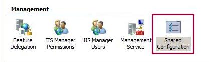

Shared Configuration
====================
by [IIS Team](https://twitter.com/inetsrv)

## Introduction

The Internet changes the ways in which companies handle their day-to-day business and how they compete in the marketplace. With the advent of new Web technologies and an increase in the number of customers accessing resources that are available through the Web, there is a pressing need for improved scalability, availability, reliability, and manageability of applications. The applications should rely on systems that provide the capability to deliver high uptime, improved request throughput, increased concurrent user transactions and better return-on-investment value, such as a better quality of service, than competing systems.

Web farms - server clusters - have become a standard in helping to deliver highly scalable, available, and manageable applications by distributing load. More specifically, these application attributes are the main reasons behind Web farms and load balancing. By using a Web farm, an organization can provide a scalable way to increase the capacity of the user base that accesses the application and its resources concurrently.

The server cluster provides improved availability by having multiple servers distribute the load. The cluster also scales better to an increased number of customers at any given point in time. Finally, the cluster provides an improved management experience by handling the provisioning and administration of the Web farm architecture with ease and without straining operational resources.

### Overview

This article focuses on the shared centralized global configuration feature. This feature helps support homogeneous Web farms where servers share the same configuration across a server group. By using a UNC share, any changes to a central master configuration file will propagate across different servers without extra tools or programmatic support.

The first part of this article describes how to use the IIS 7 and above administration UI to enable and use shared configuration. The second part describes how to enable and use shared configuration from the command line.

In this article:

- [Prerequisites](shared-configuration_264.md#01)
- [Centralized Configuration – Using the UI](shared-configuration_264.md#02)
- [Command-Line Prompt](shared-configuration_264.md#03)
- [Backing Up the Current applicationHost.config](shared-configuration_264.md#04)
- [Have a User Available to Access the UNC Share for Configuration](shared-configuration_264.md#05)
- [Create the UNC Shares for Central Configuration and Content](shared-configuration_264.md#06)
- [Give Permissions to the Accounts for the UNC Shares That Host Central Configuration and Content](shared-configuration_264.md#07)
- [Redirecting the Configuration](shared-configuration_264.md#08)
- [Testing the Configuration](shared-configuration_264.md#09)
- [Summary](shared-configuration_264.md#10)
- [Appendix 1: Accessing Redirection.config Programmatically to Read the Values](shared-configuration_264.md#11)
- [Appendix 2: Accessing redirection.config Programmatically to Write the Values](shared-configuration_264.md#12)
- [Appendix 3: Dealing With Machine-specific Encrypted Properties](shared-configuration_264.md#13)

### Non-Goals: What This Article Does Not Cover

Multiple aspects contribute to a successful Web farm environment, including correct supportability, manageability, accessibility, scalability, etc.

Shared configuration focuses only on the configuration management aspect of a Web farm and deals with configuration across servers. There are tools and other features that can help with managing multiple servers, copying content, deploying modules, synchronizing application binaries, setting up third-party components, etc. These tools, features, and aspects are out of the scope of this article.

This article only details how to maintain the configuration by using a central file across servers.

Therefore, note that sharedconfiguration enables a server to access a configuration file in a back-end UNC share as if it were its local configuration. As a result, when you update the configuration by using a front-end Web server, the updates are made to all other servers.

It is important to take into consideration other situations, such as installing a third-party module or adding configuration settings, and include properties that only one server can understand and has the binaries and schema available to function correctly. Otherwise, this type of usage can break the other servers.

To avoid this problem in homogeneous farms, you should disable shared configuration on the cluster, update the local applicationHost file so that it mirrors the remote file, deploy and update modules and the configuration on a single server, and then re-enable shared configuration on that server. Then you can deploy and update the binaries and modules on the rest of the servers before enabling shared configuration again.

### Domain and Non-domain Environments

Some administrators deploy Web server clusters in a domain environment, while others deploy in a workgroup (non-domain). This article discusses both scenarios and points out the differences and caveats. It is recommended that you set up IIS in a cluster in a domain, with the help and security that Active Directory provides by using a domain controller.

## Prerequisites

You must complete the following steps in order:

1. Install IIS on your server, which will be referred to as the Web Server throughout this article.
2. Ensure access to a second server, which will be referred to as the File Server throughout this article. The File Server will house the share for configuration and basic content, which can be accessed by using UNC.
3. Each step of this article assumes that the previous step was completed. Perform all steps in order.
4. For some steps, there is an equivalent step that can be done by using the UI. Perform only one type of step, unless specified otherwise.

## Centralized Configuration

The IIS administration UI includes support for setting up configuration redirection and exporting configuration files and necessary encryption keys to a specified path.

### To export files and set up configuration redirection by using the UI:

1. Open IIS Manager.
2. In the tree view, select the server connection for which you want to set up configuration redirection.
3. Double-click **Shared Configuration**.

4. In the **Actions** pane, click **Export Configuration...** to export the necessary configuration files from the local server to another location (e.g., a UNC share).

 

5. In the **Export Configuration** dialog box, enter the path to which you want to export the files. Enter a password to protect the encryption keys that are also exported. Click **OK** to export the configuration files and password-protected encryption keys.  

6. Select the **Enable shared configuration** check box to enable configuration redirection.

7. Specify the path where the configuration and encryption keys are located, and specify the credentials to use to access that path. Click **Connect As...** and enter the credentials.

[](shared-configuration_264/_static/image15.jpg)

8. Click **Apply** to save the settings. In the **Shared Configuration** dialog box, enter the password that you specified to protect the encryption keys.

9. Click **OK** to finish setting up configuration redirection.

The steps above describe how to export the configuration and turn on centralized configuration. However, you only need to export the configuration once. Perform steps 6 to 9 on each subsequent server that will use the centralized configuration.

### Notes About Using the UI

When setting up configuration redirection, the exported files are expected to have been exported by using the UI. This is because the UI exports and imports items such as the password-protected encryption keys by using its own custom format.

For example, if you manually copied the administration.config and applicationHost.config files to a share and then manually exported the encryption keys, you would not be able to use the UI to set up configuration redirection to point to those files. This is because the exported encryption keys would not be in the format that is required by the UI.

## Command Prompt

Throughout the remainder of this article, you must use a command prompt to run certain commands. It is recommended that you use a command prompt with elevated user rights, since certain commands will not work if you run a normal command prompt.

**To open a command prompt with elevated user rights:** 

1. Click **Start**.
2. Click **All Programs**.
3. Click **Accessories**.
4. Right-click **Command Prompt** and select **Run as administrator**.
5. Follow the prompts in any dialog boxes that appear.

## Backing Up the Current applicationHost.config File

When trying new features or changing multiple configuration settings, it is good practice to back up the current applicationHost.config file.

### To back up the applicationHost.config file:

1. Open a command prompt.

2. Navigate to the IIS directory, which is located in %WINDIR%\System32\InetSrv by default. The configuration files are stored in the InetSrv\Config directory. Use the AppCmd tool to create a backup object and back up the applicationHost.config file by running the following command:

[!code-console[Main](shared-configuration_264/samples/sample1.cmd)]

> [!NOTE]
> The AppCmd tool resides in the InetSrv directory. You must access the tool from this directory, unless the tool's path is added to the system's environment variables.

3. Ensure that the backup object, which includes the applicationHost.config file and the legacy metabase file for SMTP and other non-Web server settings, is present by running the following command:

[!code-console[Main](shared-configuration_264/samples/sample2.cmd)]
 

**To replace the current configuration file with the backup file:** 

1. Open a command prompt.

2. Navigate to the IIS directory, which is located in the InetSrv directory by default. Restore the AppCmd backup file object by running the following command:

[!code-console[Main](shared-configuration_264/samples/sample3.cmd)]
 

## Creating a User to Access the UNC Share for Configuration

In a domain environment, an administrator must provide or create an account in the domain to use with Active Directory. This account must be set up with the correct user rights to access the UNC share.

In a non-domain environment, an administrator must create on both servers a local user with user rights to access content. The user name and password must be the same across servers to work in this setup. The following steps help in the creation of a user to read the share where the shared configuration resides.

### To create a user that can read the share where the shared configuration resides (non-domain):

1. Open a command prompt.

2. On the Web Server (front-end server where IIS is installed), create a user called ConfigUser1 with the password ConfigPass1 by running the following command:

[!code-console[Main](shared-configuration_264/samples/sample4.cmd)]

3. On the File Server (back-end server where the central configuration will reside), create a user called ConfigUser1 with the password ConfigPass1 by running the following command:

[!code-console[Main](shared-configuration_264/samples/sample5.cmd)]
 

## Creating the UNC Shares for Central Configuration and Content

The UNC share for configuration hosts the applicationHost.config file for any servers that want to pick up configuration data from this centralized location.

### To create the UNC share:

1. On the File Server, open a command prompt.

2. Navigate to the root of the drive. Run the following command to create a directory for configuration and share this directory, making sure to grant users with the user rights to read and write to the directory:

[!code-unknown[Main](shared-configuration_264/samples/sample-127037-6.unknown)]
 

> [!NOTE]
> This command automatically grants user rights to the users group to this share. The user created for the non-domain scenario is granted change rights automatically, which can be further restricted if needed. For the domain scenario, the user must either have user rights set explicitly to access the share or be added to the users group in the system.

3. Non-domain scenario: To increase the security of the share, you can substitute the Users,Change portion of the /grant switch with the ConfigUser1,Change parameters. Only the specified user will have access to the share.

4. Domain scenario: To increase the security of the share, you can substitute the Users,Change portion of the /grant switch with the domain\user,Change parameters. Only the specified user will have remote access to the share.

> [!NOTE]
> The user rights on a share are a union between remote and local file system user rights. You must set the appropriate user rights to the directory for a domain account to be able to read the configuration share successfully.

## Granting User Rights to the Accounts for the UNC Shares That Host Central Configuration and Content

You must ensure that the account that is used to access the configuration has the appropriate user rights. This account is used by IIS to access the UNC share in the same manner that it accesses content when a virtual directory is mapped to a UNC share. The read user rights for this account are useful when accessing the share only. After that point, whenever IIS reads the configuration file, it reverts back to the identity that the caller has: either the API, the administration tool that is being used, or the user that is logged in at that moment.

> [!NOTE]
> The ConfigUser1 account - or the equivalent domain account that is used to read the configuration - is not the same as the account that is used for writing the configuration. These accounts are not required to have write user rights to the share or configuration file.

### To grant user rights to the accounts for the UNC share (domain):

1. If the domain account is part of the local users group and the users were granted access when the share was created, you can skip the next steps for the domain setup. However, if the domain account to access the local file share is not part of any local user groups, you must execute the command to grant user rights.

2. On the File Server, open a command prompt.

3. Provide user rights to the domain account to read the directory where the configuration is stored by running the following command:

[!code-unknown[Main](shared-configuration_264/samples/sample-127037-7.unknown)]

### To add the UNC user (non-domain and domain):

For domain and non-domain scenarios, the user name must include the logon batch job configuration. This is not a default setting in Windows Servers® 2008; you must manually add it to the Web server.

1. Click **Start**. Click **Administrative Tools** and select **Local Security Policy**.

2. Under **Local Policies**, select **User Rights Assignments**.

3. Double-click **Log on as a batch job** and add the UNC user that you created.

## Redirecting the Configuration

### Introduction

Now that you have completed the preceding steps, the Web server is functional and the front-end Web server should be serving its Default Web Site by using the localhost loop back address.

You can now move the configuration to a central location. This allows you to declare a file as the master file and save it in a UNC share for the configuration of multiple servers. Changing this file once will provision and update all server configurations at once.

### To store the configuration in a UNC share:

1. Copy the **applicationHost.config** and **administration.config** files from the **%windir%\system32\inetsrv\config** directory on the front-end Web server to share on the back-end file server. If the user account that is currently logged in has write access to the back-end share, you can drop the file in the directory. If not, then you must authenticate the user account to the back-end to complete this step.

2. Access the existing redirection.config XML file in the front-end server's configuration directory:

a. Use Windows Explorer to navigate to %windir%\system32\inetsrv\config.

b. Open the redirection.config file. This file and its contents are created when the Web server is set up. Tools and APIs can access this file to determine whether or not this feature is enabled.

3. Open the redirection.config file. Set the following configuration with the correct server name, user name, and password for your environment.

[!code-xml[Main](shared-configuration_264/samples/sample8.xml)]

4. Save your redirection.config file. You can access the sites again, but the configuration is now stored in a UNC share.

## Testing the Configuration

With the configuration being referenced from the back-end, there are two key scenarios for which this feature was designed. You can update the configuration in the front-end Web servers in two ways:

1. You can edit the applicationHost.config file directly in the file share. Once this is done, change notifications take place and the Web servers pick up the changes in the file.
2. You can add a second applicationHost.config file in the back-end file share and change the Web server's redirection.config file to point to the new version of the file. This is useful for rollback purposes or staged deployments.

## Summary

This article introduced the new centralized configuration feature. This feature lets administrators that have homogeneous clusters in a Web farm environment set up and deploy a configuration to all servers in a seamless way.

Once the feature is setup, whether a change is made in the file at the UNC share, or a server is redirected to another location, the changes are picked up immediately by the Web server. Only the global changes that affect multiple sites and applications will cause them to recycle, but if changes are made in a localized scope, then the rest of the sites and applications will not be restarted.

## Appendix 1: Accessing Redirection.config File Programmatically to Read the Values

This step provides a sample of how to access the redirection.config file programmatically by taking advantage of the new COM AHADMIN API. Use the AHADMIN COM API to implement this API from native code or from script and managed code.

### To read the values programmatically:

1. Create a text file and save it with the .js extension. The following script provides a sample of how to read the enabled attribute, server name, user name, and password for your environment:

[!code-unknown[Main](shared-configuration_264/samples/sample-127037-9.unknown)]

2. Save your redirection.js file. You can now run this file from a command prompt because of the Windows Script Host (WSH).

## Appendix 2: Accessing the redirection.config File Programmatically to Write the Values

This step provides a sample of how to access the redirection.config file programmatically by taking advantage of the new COM AHADMIN API. Use this API from native code or from script and managed code from its COM object.

### To write the values programmatically:

1. Create a text file and save it with the .js extension. The following script provides a sample of how to write the enabled attribute, server name, user name, and password for your environment:

[!code-unknown[Main](shared-configuration_264/samples/sample-127037-10.unknown)]

2. Save your redirection.js file.

3. You can now run this file from a command prompt because of the Windows Script Host (WSH).

## Appendix 3: Dealing With Machine-specific Encrypted Properties

By default, IIS includes two main providers for securing properties. These providers are located in the applicationHost.config file's &lt;configProtectedData&gt; configuration section and are defined in the &lt;providers&gt; element.

The AesProvider is specific to dealing with encryption and decryption for properties that are in the system.webServer section.

The IISWASOnlyRsaProvider is specific to dealing with encryption and decryption for properties that are in the system.applicationHost section.

These keys are in the iisConfigurationKey and iisWasKey key containers and are machine-specific. In a Web farm scenario, if encryption is required, then a key from one machine - usually the one that created the applicationHost.config file - is exported and brought into the other machines so that secure properties can be decrypted and used by the Web server.

### Steps

1. Open a command-prompt. Navigate to the Framework directory, which is located in **%windir%\Microsoft.NET\Framework\v2.0.50727\** by default.   
> [!NOTE]
> For reference, the machine keys for the system are located in **%ALLUSERSPROFILE%\Microsoft\Crypto\RSA\MachineKeys\**

2. Use the aspnet\_regiis tool to export the key. The command to transfer the configuration key is stated below. The px switch identifies that you want to export an RSA key pair. The pri switch identifies that you also want to include both the private and public key.

This switch identification is necessary to do both encryption and decryption; otherwise, you can only encrypt data with the exported key. The parameter after the **-px** is the name of the key container to be exported. In this case, it is the "iisConfigurationKey" key container. The other key container that IIS uses is the "iisWasKey" key container.

[!code-console[Main](shared-configuration_264/samples/sample11.cmd)]

3. Once exporting completes successfully, copy the XML file to the other machine in the cluster to prepare to import it there.

4. Navigate to the Framework directory and use the aspnet\_regiis tool to import the key from the XML file. The command to finalize the transfer for the key is stated below.

The parameter after the **-pi** is the name of the key container to be imported. In this case, it is the "iisConfigurationKey" key container. The other key container that IIS uses is the "iisWasKey" key container.

[!code-console[Main](shared-configuration_264/samples/sample12.cmd)]
  
  
[Discuss in IIS Forums](https://forums.iis.net/1050.aspx)