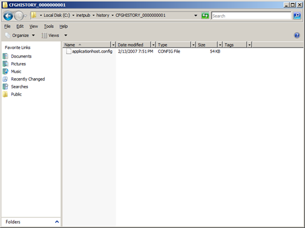
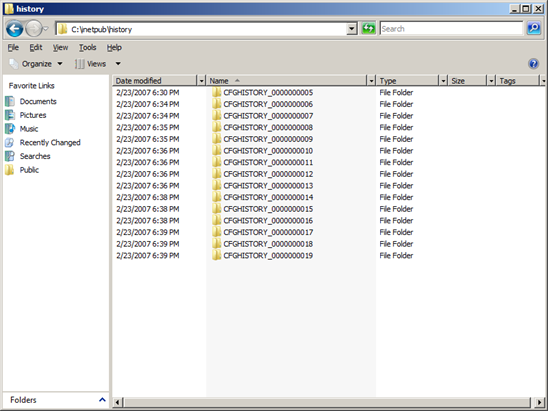

Using Configuration History with IIS 7 and IIS 8
====================
by [Tobin Titus](https://github.com/tobint)

## Introduction

In IIS 6.0, administrators had a safety net that allowed them to easily ascertain what changed in the IIS configuration. It was implemented as a history file that could be restored easily, and served as a usable history of events that happened to the configuration. In case anything went wrong during application installs, upgrades, or individual changes to the metabase, the user could restore to a working state.

With IIS 7.0 and above, the IIS team wanted the same "safety net," yet we could not use the IIS 6.0 history feature because of changes in the configuration architecture. In IIS 7.0 and above, we resolved this problem by creating a service that monitors for changes to the master configuration file, ApplicationHost.config, and periodically creates snapshots to later retrieve if necessary.

This feature is called IIS Configuration History. This walkthrough illustrates how this feature works.

## Task 1: Reviewing configHistory Default Configuration Settings

In this task, you review the configuration options available after a default IIS installation. In later tasks, you later modify some of these settings to show the flexibility of the feature to fit the environment.

### Step 1: Open applicationHost.config

1. Click **Start**, click **Run**, and in the **Open:** dialog box, type notepad and **Click** OK.  
      
    **Figure 1: Opening Configuration with Notepad**
2. **Click** File, then **Open**, and in the **File name:** dialog box, type `%windir%\system32\inetsrv\config\applicationHost.config`. **Click** Open.  
      
    **Figure 2: ApplicationHost.config Path**
3. To locate configHistory section, click **CTRL**-**F** and enter configHistory and Click **Find Next**.

After opening the master file, you see an entry like the following for configHistory:

[!code-xml[Main](using-configuration-history-with-iis-7-and-iis-8/samples/sample1.xml)]

Notice that there are no further settings for this feature in applicationHost.config. This is expected behavior because by default, IIS uses the values stored in the IIS schema. To see the default settings, open the IIS schema file (IIS\_schema.xml.)

### Step 2: Locate configHistory Defaults in IIS Schema

1. Click **Start**, click **Run**, and in the **Open:** dialog box, type notepad and Click **OK**.
2. Click **File**, then **Open**, and in the **File name:** dialog box, type `%windir%\system32\inetsrv\config\schema\iis\_schema.xml`.  
      
    **Figure 3: IIS Schema**- To locate configHistory section, click **CTRL-F** and enter configHistory.
3. On Windows Server® 2008, you see the following:  
       

     **Figure 4: configHistory Schema Definition**

     There are four configurable settings (attributes) for the configHistory section:

     | Attribute | Default Setting | Definition |
     | --- | --- | --- |
     | **enabled** | True | This value indicates whether configuration history is enabled or disabled |
     | **path** | `%systemdrive%\inetpub\history` | The path where history directories are created and stored |
     | **maxHistories** | 10 | The maximum number of directories retained |
     | **period** | 00:02:00 | The time between each check made for changes |

### Summary

Despite its relative simplicity, do not overlook this task. It offers direct insight into configuration attributes available for the configHistory section. You later modify these settings as a demonstration of the features flexibility based on the environment.

## Task 2: Validating configHistory Functionality is Working Properly

The goal of this task is to see configHistory in action. Furthermore, for experienced administrators who understand the IIS 6.0 metabase history, this task aids in learning the differences between the two features.

Metabase history was a file-based, rather than directory-based, like the IIS 7.0 and above configuration history. For example, all backups in IIS 6.0 were stored in the same location that was not customizable. In IIS 7.0 and above, each unique copy is stored in its own directory at creation time. In this task, you make some changes to the IIS configuration file using IIS Manager and review the results of these changes.

### Step 1: Create a Website

1. Click **Start**, **Run**, and type Inetmgr and Click **OK**.  
      
    **Figure 5: Opening IIS Manager**- Double-click your server name, for example IIs7Server, to expand the navigation tree.
2. Right-click the server, and choose Add Web Site.  
       
     **Figure 6: Add Web Site**
3. In the **Add Web Site** wizard, enter information to create a new Website. For example:  
       
     **Figure 7: Add Web Site Wizard**
4. Click **OK**.
5. You now see the new Website created in your IIS Manager, as in the following:  
       
     **Figure 8: IIS Manager Homepage**

     Now, we validate that a successful backup of the configuration changes has been captured by the Application Host Helper Service.

### Step 2: Locate History Files for applicationHost.config

> [!NOTE]
> It is likely that your copy will not show immediately after following these steps. This is based on the default value of two minutes. If you find that no copy is created, check to make sure that you have waited two minutes.

1. Click **Start**, **Run**, and open `%systemdrive%\inetpub\history`.    
  
    **Figure 9: Configuration History Default Path**
2. Double-click the history folder and locate the most recent change.  
      
    **Figure 10: History File of ApplicationHost.config**

    > [!NOTE]
    > If you fail to locate your copy in the history folder, verify that the Application Host Helper Service is running. Check your Event Viewer for any potential errors thrown by IIS-AppHstSvc.

  
**Figure 11: Application Host Helper Service**

### Summary

In this task, we took a few steps toward understanding how the IIS configuration history feature works. First, we made changes to ApplicationHost.config, triggering the Application Host Helper Service to create a copy at the next scheduled period. Further, we located the copy and validated that we successfully created the copy in `%systemdrive%\inetpub\history`.

## Task 3: Modifying the Number of Directories (maxHistories) Retained and the Period Attributes

The goal of this task is to successfully modify the number of history files retained by IIS 7.0 and above. Because the defaults are stored in the schema, we must create the configHistory section in applicationHost.config and add the appropriate attributes and values for the maxHistories and period attributes.

In this task, use Notepad to modify this attribute to show the flexibility and simplicity of editing ApplicationHost.config.

### Step 1: Open applicationHost.config

1. Click **Start**, click **Run**, and in the **Open:** dialog box, type notepad and Click **OK**.
2. **Click** File, then **Open**, and in the **File name:** dialog box, type `%windir%\system32\inetsrv\config\applicationHost.config` and **Click** Open.

The next step is to add the configuration section, and then add the attribute with value.

### Step 2: Add configHistory Section and Add maxHistory

1. To locate configHistory section, click **CTRL-F** and enter &lt;system.applicationHost.  
      
    **Figure 12: Locating system.applicationHost Section Group**
2. Now that you are in the right section, add the correct attribute and value for maxHistory. Type the following text into your system.applicationHost section group: 

    [!code-xml[Main](using-configuration-history-with-iis-7-and-iis-8/samples/sample2.xml)]

> [!NOTE]
> To save time in your next step, leave notepad open after completing this task.

Last, validate that the change has taken place. We know that by default that we should only see 10 directories at a time as defined by the IIS schema.

After we increase the maximum values kept by IIS, we need an easy method to trigger many directories to be created. To simulate this, we lower the default value for the period attribute to its default minimum of 10 seconds. This increases the interval for checking for changes and hence potentially creates more copies of the files in a dynamic environment.

### Step 3: Set Period Attribute for configHistory

1. Using the previous session, add the period attribute by adding the period="00:00:10".
2. Click **File**, **Save** to commit changes.

After completing, the configHistory section looks like the following:

[!code-xml[Main](using-configuration-history-with-iis-7-and-iis-8/samples/sample3.xml)]

### Step 4: Execute Script to Cause History Creation

1. Open Notepad. Copy and paste the following: 

    [!code-vb[Main](using-configuration-history-with-iis-7-and-iis-8/samples/sample4.vb)]
2. Save this as ConfigHst.vbs (ensure that you choose All Files to avoid saving as a text file).  
      
    **Figure 13: Saving VBS Script**
3. Run this VBS file by opening a command prompt, locating the file location where saved, and type the following: 

    [!code-console[Main](using-configuration-history-with-iis-7-and-iis-8/samples/sample5.cmd)]

    This script makes calls to modify the configuration of IIS every 15 seconds. This is enough time for the configuration history to check for changes and create a backup. After completing this, we see a multitude of configuration backups in our backup directory.
4. Next, open the default path for the configHistory by clicking **Start**, then **Run**, and typing `%systemdrive%\inetpub\history`
5. You see a backup folder such as CFGHISTORY\_0000001, CFGHISTORY\_0000002, and so on.

After running this script, notice how this feature pushes the oldest out when hitting the maximum (i.e. maxHistories.) In our case, after reaching CFGHISTORY\_0000000015, the oldest item was deleted before creating the sixteenth directory.

  
**Figure 14: History Directory with maxistories value of 15**

### Summary

In this task, we successfully modified the number of backups stored by IIS. The default setting of 10 is sufficient for many; yet, for dynamic environments such as shared hosting servers where customers are signing up for sites randomly and often, it is good practice to have a more thorough history.

In this task, we modified the maxHistories and period attributes for configHistory section and then produced multiple changes that would show that we stored more than 10 (the default) copies.

## Task 4: Changing the Default Path for Saving configHistory Backups

The number of history directories and associated files stored by IIS is configurable to be flexible depending on the environment. For many cases, storing the history files on the system path (i.e. `%systemdrive%inetpub\history`) is not desirable. Unlike history in IIS 6.0, which had no configurable mechanism for configuration history, the IIS 7.0 and above configuration history now offers the ability to change where IIS stores the history directories and files.

We use in this task a method to modify the configuration--in this case, the IIS command-line interface. The goal of this task is not only to learn about changing the path for configuration history directories, but also to become familiar with AppCmd.exe, the IIS command-line interface to configuration and runtime data.

### Step 1: Create Directory for History

1. **Click** Start, select **Run**, and thentype **CMD** and Click **OK**.
2. At the command prompt, create your directory by typing the following: 

    md MyWebHistory

This step is required because no directory is automatically created if it does not exist. If you fail to do this step, you see the following:  
  
**Figure 15: Event Message if Permissions Inadequate to History Path**

### Step 2: Locate AppCmd.exe

1. **Click** Start, select **Run**, and thentype **CMD** and Click **OK**.
2. At the command prompt, change directories by typing the following:

    [!code-console[Main](using-configuration-history-with-iis-7-and-iis-8/samples/sample6.cmd)]
3. To familiarize yourself with AppCmd's syntax, type the following: 

    [!code-console[Main](using-configuration-history-with-iis-7-and-iis-8/samples/sample7.cmd)]

At this point, change the value for the path attribute to a value that is more appropriate in your environment. In this case, change it to a custom directory on the system partition – the `%systemdrive%\MyWebHistory` directory.

> [!NOTE]
> Often you must move this data to a separate partition, or better, to a drive on a different controller, such as D:\, etc. Change the path value using AppCmd: -

#### Step 3: Change Path Value for configHistory

1. To familiarize yourself further with AppCmd.exe, open a command prompt and type the following:

    [!code-console[Main](using-configuration-history-with-iis-7-and-iis-8/samples/sample8.cmd)]

    This command helps you learn how to review the currently available sections allowed for editing.

    [!code-console[Main](using-configuration-history-with-iis-7-and-iis-8/samples/sample9.cmd)]

    This command help you understand what the currently set attributes and values are on our system.
2. Now issue the following command to change the path attribute from the default of `%systemdrive%inetpub\history` to `%systemdrive%MyWebHistory` – 

    [!code-console[Main](using-configuration-history-with-iis-7-and-iis-8/samples/sample10.cmd)]
3. To validate the change, type the following and verify that maxHistories and period are set appropriately.

[!code-xml[Main](using-configuration-history-with-iis-7-and-iis-8/samples/sample11.xml)]

You see the following:  
  
**Figure 16: Using AppCmd to list Configuration**

Last, we will produce changes to the configuration causing a backup to be triggered -- notice the new location for the directories and files.

### Step 4: Re-run the Earlier Script

- Execute ConfigHst.vbs by typing the following:

[!code-console[Main](using-configuration-history-with-iis-7-and-iis-8/samples/sample12.cmd)]

If you check `%systemdrive%\MyWebHistory`, you see several directories with folder names similar to CFGHISTORY\_0000001, 2, and so on.

### Summary

It is standard practice to move important, volatile data off the server system partition (`%systemdrive%` by default) to other partitions or drives. In this task, you successfully changed the target location for the IIS configuration history directories.

## Task 5: Restoring Configuration from a Backup File

It is not useful to have a history feature without offering a method for restoring a previously working configuration. The purpose of this task is to walk you through a manual process for restoring from a copy of your configuration created earlier.

### Step 1: List the available backups

1. Click **Start**, **Run**, and type **CMD** and Click **OK**.
2. Change to the inetsrv directory using the following command: `cd %windir%\system32\inetsrv`.
3. To get the currently configured path for the configHistory section, type the following:

[!code-console[Main](using-configuration-history-with-iis-7-and-iis-8/samples/sample13.cmd)]

 This command will list the available backups, including manual backups made with the appcmd add backup command, as well as backups made by the configuration history service. You can use the appcmd restore backup command to restore any one of these, as shown in the next step 

### Step 2: Restore the backup

Having followed the instructions in the step above to list the backups, select the backup you'd like to restore and restore it by typing the following:  
  
 appcmd restore backup *BACKUPNAME*

Where *BACKUPNAME* is one of the backups listed in step 1, for example, CFGHISTORY\_0000000016.

You can also manually search the configuration files in the backup folder to determine which backup you'd like to restore:

Click **Start**, **Run**, and type **CMD** and Click **OK**.

1. Change to the history directory using information in Step 1, above.
2. Use Windows findstr command to locate the change you are looking for. In this case, locate the configuration with directoryBrowse set to false.

[!code-console[Main](using-configuration-history-with-iis-7-and-iis-8/samples/sample14.cmd)]

This searches the current directory and all sub-directories for the string directoryBrowse is equal to false. This returns only one item, for example CFGHISTORY\_0000000016, that indicates what we will restore.

### Summary

In this task, we located a history copy and restored it. This task is the most important illustration of the configuration history feature, as it offers the ability to roll-back to a previously working configuration with ease.