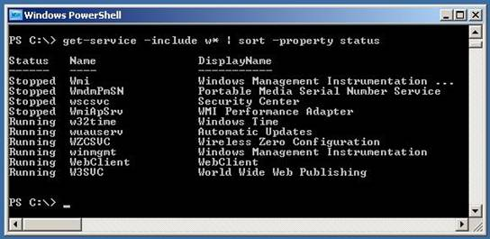

# An Introduction to Windows PowerShell and IIS 7.0

by [Saad Ladki](https://twitter.com/saadladki)

## Introduction

Windows PowerShell is Microsoft's shell and scripting language. This short article provides a brief tour of Windows PowerShell and IIS. Reading this article, you gain a solid understanding of exactly what Windows PowerShell is, learn about the relationship between Windows PowerShell and IIS, and discover some of the ways in which Windows PowerShell simplifes performing IIS management tasks.

The information presented here is useful to IT administrators, software developers, software testers, and managers. Even the skeptical will be convinced that Windows PowerShell is a must-have tool.

## About Windows PowerShell

Windows PowerShell is Microsoft's comprehensive next generation shell environment and scripting language. Consider Windows PowerShell as a dramatic upgrade to the old cmd.exe command shell and .BAT files. Users may ask why there is a new command shell, when Cmd.exe works well--and there is no time to learn yet another scripting language. Windows PowerShell is an improvement over previous Microsoft command line scripting technologies--this means that Windows PowerShell is easier to use for both simple and complex tasks, and is surprisingly easy to learn.

Some of the improvements from Windows PowerShell include:

- An updated and consistent scripting language
- Intrinsic regular expression capabilities
- The ability to call into the .NET Framework, WMI extensions, and the Windows registry

This section provides concrete examples and highlights a few of Windows PowerShell's features. In the following sections, it then discusses how Windows PowerShell works together with IIS.

To get a feel for Windows PowerShell, look at an example. Consider the screen shot in Figure 1.

*Figure 1 - Windows PowerShell Basics*

First, notice that the shell in Windows PowerShell looks like a traditional Windows command prompt. Using Windows PowerShell will quickly feel quite natural after a brief ramp-up period.

The first command is:

[!code-powershell[Main](an-introduction-to-windows-powershell-and-iis/samples/sample1.ps1)]

This invokes a Windows PowerShell cmdlet (pronounced "command-let") to change the current working directory from `C:\` to `C:\Data`. This is the functional equivalent of the old cd (change directory) command. You may note that having to type "set-location" every time you change the current directory is too much typing; this is correct.

Windows PowerShell has an extensive set of shortcut aliases you can use. The set-location cmdlet is aliased to sl (a shortened version of the full cmdlet name), and to cd (the "old" way). This article uses the full version of cmdlet names for improved readability.

The second command is:

[!code-powershell[Main](an-introduction-to-windows-powershell-and-iis/samples/sample2.ps1)]

This lists the contents in the current directory which start with "Pow". Windows PowerShell is not case sensitive, so you can type Get-ChildItem or GET-ChildItem. This article uses all lower-case. The get-childitem cmdlet is aliased to both dir (for Windows familiarity) and ls (for Unix users), and aliased to gci for ease of typing.

Next, use the copy-item cmdlet to copy the Windows PowerShell directory, including all sub-directories, to a new directory named PSBackup:

[!code-powershell[Main](an-introduction-to-windows-powershell-and-iis/samples/sample3.ps1)]

Then immediately delete the newly created directory and all its contents using the remove-item cmdlet:

[!code-powershell[Main](an-introduction-to-windows-powershell-and-iis/samples/sample4.ps1)]

The next command uses the get-content cmdlet to fetch the contents of file Hello.txt and then save those contents to a new HelloCopy.txt file in the current directory by piping (with the '|' character) to the out-file cmdlet:

[!code-powershell[Main](an-introduction-to-windows-powershell-and-iis/samples/sample5.ps1)]

The next to last command uses get-content to display the contents of the new file:

[!code-powershell[Main](an-introduction-to-windows-powershell-and-iis/samples/sample6.ps1)]

The get-content cmdlet is roughly equivalent to the type (Windows) or cat (Unix) commands. Finish the mini-demo by using the sl alias to change the working directory to the root drive:

[!code-powershell[Main](an-introduction-to-windows-powershell-and-iis/samples/sample7.ps1)]

Now, if all there were to Windows PowerShell was performing common file system navigation and manipulation tasks using a new set of commands, there would be no point in reading further. A brief, one-paragraph introduction could lead to that incorrect assumption. However, Windows PowerShell has many advantages over many current shell environments.

To conclude this introductory Windows PowerShell discussion: Windows PowerShell has a learning curve. New technology is useless unless there is a way to quickly learn the technology. Programmers call this process discoverability. Windows PowerShell was designed with excellent discoverability characteristics, making it much easier to learn.

For example, you can get a list of all cmdlets simply by typing get-command at the Windows PowerShell prompt. You can also get detailed information about a particular cmdlet by typing get-help followed by the cmdlet name. Extensive experience teaching Windows PowerShell to engineers and managers shows that most engineers can become adept at using Windows PowerShell with a single day of practice.

## Windows PowerShell in a Typical IIS Environment

The previous section of this article gave a short, basic overview of Windows PowerShell. However, a real advantage of using Windows PowerShell comes from the Windows PowerShell ability to interact with and manage IIS. Engineers reading this article might be skeptical of "latest and greatest" claims. This article will shortly show the power behind Windows PowerShell: many IIS management tasks can be accomplished using Windows PowerShell commands and scripts as well as the IIS GUI tools.

With IIS, you now have the ability to perform many management tasks using any of the following:

- Graphical user interface (GUI)
- Interactive Windows PowerShell commands
- Windows PowerShell scripts

Those users with significant experience managing server software using shells and scripts do not need any more motivation; but those used to using strictly GUI tools may ask what is special about being able to manage IIS through a command line or a script, when they have managed well enough with MMC. The end of this article points out six significant advantages of managing IIS using Windows PowerShell.

The following are some Windows PowerShell examples based on a Web cast featuring Windows PowerShell architect Jeffrey Snover and IIS Product Unit Manager Bill Staples. (Find the Web cast at [https://docs.microsoft.com/en-us/teamblog/channel9joinedmicrosoftlearn](/teamblog/channel9joinedmicrosoftlearn)).

Suppose you want to examine IIS-related services running on your computer -- a very common task. One "GUI approach" to do this is to launch MMC and then expand the Services and Application category, and then select the Services category. The result looks like the screenshot in Figure 2.

*Figure 2 - Using MMC to Get Service Information*

Listing Windows services using Windows PowerShell is easy. For example, from the Windows PowerShell prompt, use the get-service cmdlet:

[!code-powershell[Main](an-introduction-to-windows-powershell-and-iis/samples/sample8.ps1)]

This is not very compelling, but suppose you want to list only services that begin with the letter 'w' and sort them by status. One way to do this is:

[!code-powershell[Main](an-introduction-to-windows-powershell-and-iis/samples/sample9.ps1)]

You can interpret this command as meaning fetch all Windows service information but then filter to include just those services that have a name beginning with the letter 'W'; then, sort those results according to the service status (running, stopped, paused). The result looks like the screenshot in Figure 3.

*Figure 3 - Using Windows PowerShell to Get Service Information*

As pointed out in the previous section, you can type terse PowerShell commands; the previous command can be shortened to:

[!code-powershell[Main](an-introduction-to-windows-powershell-and-iis/samples/sample10.ps1)]

Here, gsv is used, which is an alias for get-service; It takes advantage of the fact that the -include switch is in the first parameter position, using sort which is an alias for the sort-object cmdlet. The -property switch is in the first parameter position. Now suppose that you want to stop the World Wide Web Publishing service. Without PowerShell, you can right-click on the W3SVC service to get its context menu, and click the Stop item. Using Windows PowerShell you can issue the command:

[!code-powershell[Main](an-introduction-to-windows-powershell-and-iis/samples/sample11.ps1)]

or, in shortened form:

[!code-powershell[Main](an-introduction-to-windows-powershell-and-iis/samples/sample12.ps1)]

Another common task is examining the processes running on a machine. At this point, you can predict how to do this using Windows PowerShell -- Windows PowerShell's consistent and logical cmdlet naming scheme makes guessing commands easy rather than frustrating:

[!code-powershell[Main](an-introduction-to-windows-powershell-and-iis/samples/sample13.ps1)]

Suppose you want to view running processes sorted by the number of handles owned by each process:

[!code-powershell[Main](an-introduction-to-windows-powershell-and-iis/samples/sample14.ps1)]

You can get this information as easily using the GUI-based Windows Task Manager. But consider what these three Windows PowerShell commands do:

[!code-powershell[Main](an-introduction-to-windows-powershell-and-iis/samples/sample15.ps1)]

The first command, $p = get-process, fetches all the information about processes currently running on the host machine, and stores that information into variable $p.

The second command, $result = $p | measure-object -property handles -sum -max, sends the captured process information to the measure-object cmdlet which computes the sum, average, and max value for all the handles in use by the currently running processes, and stores that information into variable $result. If you examined $result at this point, you see something like:

***Count : 54  
Average : 273.148148148148  
Sum : 14750  
Maximum : 1625  
Minimum :  
Property : Handles***

Notice that in this example there are a total of 54 processes running, and a total of 14,750 handles in use, which is an average of about 273 handles per process. The largest number of handles used by a process is 1625 handles.

The third line, $results | out-file '.\ProcessHandleStats.txt', saves the results to a text file. Experienced Windows PowerShell users would likely combine the three commands just described into a single command like:

[!code-powershell[Main](an-introduction-to-windows-powershell-and-iis/samples/sample16.ps1)]

One characteristic of the Windows PowerShell architecture is that Windows PowerShell is easily extensible at all levels by both users and third party companies. Windows PowerShell extensibility is a topic in its own right, and here is but one example.

In the Web cast demonstration referenced at the end of this article, Jeffrey Snover and Bill Staples demonstrate a remarkable Windows PowerShell visualization output cmdlet developed by a third party company. This cmdlet is named out-gauge. Notice the semantic similarity to the intrinsic out-file cmdlet. Instead of sending output to a file as out-file does, out-gauge sends output to a visually rich set of controls. For example, one of the commands demonstrated in the Web cast is:

[!code-powershell[Main](an-introduction-to-windows-powershell-and-iis/samples/sample17.ps1)]

This command produces a floating-on-the-screen, digital-style gauge which displays the total number of handles in use in real time, and updates the display every second. All this demonstrates that a wide range of useful, Windows PowerShell-based tools will be soon available.

Next, look at an example of IIS Web site deployment using Windows PowerShell. Because previous versions of IIS store configuration in the metabase, copying a Web site from one machine to another is not possible. IIS makes Web site deployment a simple matter of copying files. Consider this Windows PowerShell script:

[!code-powershell[Main](an-introduction-to-windows-powershell-and-iis/samples/sample18.ps1)]

This script is complex but instructive. When saved as file Deploy-Application.ps1 and then executed from a Windows PowerShell command line, it looks like this:

[!code-powershell[Main](an-introduction-to-windows-powershell-and-iis/samples/sample19.ps1)]

The net effect is to copy all files listed in file AppManifest.txt, located on machine DemoServer1, to all the machines listed in file RestOfFarm.txt. One feature of Windows PowerShell is that well-written scripts are easy to understand, relative to the alternatives such as VBScript or Perl. The script uses the get-content cmdlet to read machine names from file RestOfFarm.txt and file names from file AppManifest.txt.

The foreach loop may be new to you. The outer loop iterates through each machine name stored in variable $farmList, storing each name into variable $targetMachine in turn. The inner loop is similar and stores each file into $file in turn. The join-path cmdlet is used to intelligently concatenate strings to produce complete source and destination paths.

Finally, the copy-item cmdlet performs the copy actions, where the -recurse switch copies all sub-directories and the -force switch causes existing files to be overwritten. Notice that this script has all the information about source and destination locations hard-coded into it. Windows PowerShell has excellent parameter passing capabilities, so this example script could be parameterized to accept information from the command line--however, that topic is outside the scope of this article.

## Windows PowerShell with IIS

So far, this article has presented Windows PowerShell examples that apply to any server machine. Now we examine some Windows PowerShell cmdlets that are specific to IIS.

IIS adds the powerful ability to cache dynamically created content. IIS has long had the ability to cache static pages. When the server receives new client requests for recently requested content, the following occurs: instead of having to retrieve that content from external storage, the requested content can be pulled immediately from cache memory and returned to the client. The result is big performance improvement. IIS extends this idea by enabling caching dynamically created pages as well. Consider this pre-release, IIS Windows PowerShell cmdlet:

[!code-powershell[Main](an-introduction-to-windows-powershell-and-iis/samples/sample20.ps1)]

Writing custom cmdlets is a topic outside the scope of this article, but this example givea an idea of the kinds of cmdlets you can write and which the IIS community will write. The cmdlet name is add-iiscaching. As mentioned earlier, Windows PowerShell has an extensible architecture that allows the IIS development team to create custom cmdlets which work directly with IIS. The net effect of this command is to enable dynamic caching for page requests with Qwd, Qif, Qiv, and Qis in the query string against a particular PHP application on all the IIS servers whose names are stored in variable $computerlist.

Although the main point should be clear -- that IIS you can easily enable a powerful performance improvement using a simple Windows PowerShell command -- the article continues with details of the switch parameters in this example.

The first argument, -computer $computerlist, specifies which machines to perform the add-iiscaching command on. For example, if you had a simple text file named "MyServers.txt" with machine names like:

***demo1server  
demo2server  
demo3server  
demo4server***

then the command

[!code-powershell[Main](an-introduction-to-windows-powershell-and-iis/samples/sample21.ps1)]

reads the list of servers into variable $computerlist.

The second argument, -path Demo, points to the root path of the application on which you wish to enable caching. In this example, because the path value does not have spaces, it is possible to omit quote characters, although they could have been used like this: -path "Demo".

The third argument, -location index.php, points to the target application. The fourth argument, -credential $cred, holds authentication information in variable $cred. This is necessary because we will copy files to remote machines. This information can also be captured by the intrinsic get-credential cmdlet, like:

[!code-powershell[Main](an-introduction-to-windows-powershell-and-iis/samples/sample22.ps1)]

This command launches a GUI control in which the user could specify a user name and password, and the results would be stored into the $cred variable.

The fifth argument, -extension .php, specifies the type of application to cache.

The sixth argument, -kernelcachepolicy 0, tells the add-iiscaching cmdlet not to cache kernel information.

The seventh argument, -itemlocation 0, specifies where to cache response information; 0 means store on either client or server.

The eighth argument, -policy 1, means to continue caching until there is a change in the underlying cache element (as opposed to caching for a specified time interval).

The final argument, -varybyquerystring "Qwd,Qif,Qiv,Qis", tells IIS which type of response to cache-- in this case, responses to requests which contain Qwd, Qif, Qiv, and Qis in the query string. (These are specific name parts of name-value pairs used by the PHP application in this example.)

## Wrapping Up

This article first presented a quick look at Windows PowerShell, Microsoft's new shell environment and scripting language. It showed some typical Windows PowerShell file navigation and manipulation examples and made the claim that Windows PowerShell goes far beyond existing shell environments.

The second section of this article demonstrated how to use Windows PowerShell in a typical environment in which IIS is running. The examples included examining Windows services and processes on a host machine. It also promised a list of a few of the advantages of using Windows PowerShell to manage and interact with IIS.

Here are six comments on such advantages from early Windows PowerShell adopters. They also include advantages that the IIS Team has experienced.

1. Because Windows PowerShell commands can be stored as scripts, they can be saved and executed unattended. This advantage is true of any scripting-based technique, but Windows PowerShell is significantly easier to use than other existing scripting languages.
2. Because Windows PowerShell commands can be stored and used as scripts, they create a self-documenting record of IIS management activity. How often have you tried to remember how you modified some registry key using the regedit.exe GUI?
3. Compared with using GUI-based management interfaces, Windows PowerShell commands "remove the magic" and let you see exactly what is going on. GUI-based tools are good for lighter management activity. However, using GUI-based tools can lead to thoughts like, "I'm not sure exactly why it works, but when I double-click on this, it usually fixes the problem."
4. Because many other Microsoft server products will be based on Windows PowerShell, every time you use Windows PowerShell commands and scripts to manage IIS, you indirectly get training on other systems.
5. Using Windows PowerShell creates a common management paradigm and means of communication: Windows PowerShell communities are growing quickly and it is much easier to understand documentation or blog entries which are in the form of Windows PowerShell commands than it is to understand documentation which reads like, "Open MMC then click here, then click there, then double-click up there . . ."
6. Because Windows PowerShell is a comprehensive environment, you can perform the majority of your work in Windows PowerShell. There is no need to constantly jump from a GUI-based program, to a cmd.exe shell, to another GUI-based program. This is similar to the way in which software development activities have evolved from using separate compilers, linkers, debuggers, and so on, to using an integrated environment like Visual Studio.

The second section of this paper also showed an example of a Windows PowerShell script which showcases the ability of IIS to deploy Web servers across multiple machines using simple file-copy operations.

The third section of this paper explained how the Windows PowerShell design allows the IIS community to create and share custom Windows PowerShell cmdlets which operate directly with native IIS functionality. In particular, it presented add-iiscaching, a pre-release cmdlet which can enable IIS's ability to cache dynamically created pages.

Though this article has just scratched the surface of how Windows PowerShell and IIS work together, it should have convinced you that the two in tandem provide an easier, more efficient, and more enjoyable IT management experience.

## Windows PowerShell and IIS Resources

See [https://www.microsoft.com/windowsserver2003/technologies/management/powershell/default.mspx](https://www.microsoft.com/windowsserver2003/technologies/management/powershell/default.mspx) for Windows PowerShell documentation and examples, and to download Windows PowerShell.

Search [https://docs.microsoft.com/en-us/teamblog/channel9joinedmicrosoftlearn](/teamblog/channel9joinedmicrosoftlearn) for the Web cast featuring Windows PowerShell Architect Jeffrey Snover and IIS Product Unit Manager Bill Staples, which served as the basis for the article.

See [https://blogs.msdn.com/PowerShell/](https://blogs.msdn.com/PowerShell/) to view useful examples created by the Windows PowerShell team.

See [http://www.powergadgets.com](http://www.powergadgets.com/) to learn more about the visualization tools based on Windows PowerShell.

See [https://www.iis.net](https://www.iis.net/) for information about Microsoft IIS.

## About the Author

Dr. James McCaffrey works for Volt Information Sciences, Inc., where he manages technical training for software engineers working at Microsoft's Redmond, Washington campus. He has worked as a lead engineer on several key Microsoft products including Internet Explorer and MSN Search, and is the author of ".NET Test Automation: A Problem-Solution Approach", Apress, 2006.
