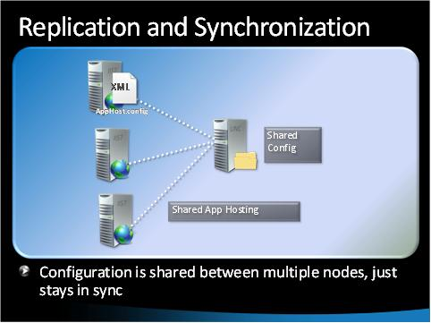
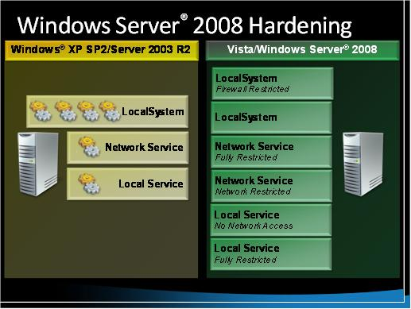

IIS Management and Administration
====================
by [Walter Oliver](https://github.com/walterov)

## Introduction

This article provides a map to download locations for presentations, videos, and links to existing articles about IIS management and administration: Web farms, performance tuning, troubleshooting, remote administration, and a hosting management sample.

For further details about this topic, visit [Managing and Maintaining IIS 7.0](../index.md).

This [video](https://mediadl.microsoft.com/mediadl/IISNET/Media/HDA20-IIS/RemoteManager.wmv) provides an overview of how to use the new IIS Manager for IIS management.

## Deploying and Managing Web Farms

This [video](https://mediadl.microsoft.com/mediadl/IISNET/Media/HDA20-IIS/Managing%20and%20Deploying%20Web%20Farms.wmv) provides an overview of IIS 7.0 Web farm features, along with best practices and demonstrations of how to deploy and manage Web farms. The video covers:

- Challenges with IIS 6.0
- What's new in IIS 7.0 for Web Farms
- Demonstrations
- Lessons Learned and Guidance

## Performance Tuning

This [guide](https://download.microsoft.com/download/E/7/5/E75F1B3E-C341-4E67-906A-24ABB0E59278/PerformanceTuningWS2008.zip) describes important tuning parameters and settings that can result in improved performance for the Windows Server® 2008 operating system. Each setting and its potential effect are described to help you make an informed judgment about its relevance to your system, workload, and performance goals. The guide uses a holistic approach toward tuning Windows Server's various roles, including the Web Server role.

## Diagnostics and Troubleshooting

The following [video](https://mediadl.microsoft.com/mediadl/IISNET/Media/HDA20-IIS/Internet%20Information%20Services%207.0%20Diagnostics%20and%20Troubleshooting.wmv) provides diagnostic and troubleshooting guidance and demonstrations using:

Runtime Status and Control (RTSC) features

HTTP substatus codes, detailed errors, and custom error pages

Failed Request Tracing (FREB) and Event Tracing for Windows (ETW)

The following [download](https://download.microsoft.com/download/E/7/5/E75F1B3E-C341-4E67-906A-24ABB0E59278/IIS7DiagnosticsTroubleshooting.zip) contains guidance about IIS 7.0 features used in the Diagnostics and Troubleshooting video.

The following [section](../../troubleshoot/index.md) provides further video demonstrations and step-by-step guidance for troubleshooting errors in IIS 7.0.

This [article](../../troubleshoot/remote-administration-issues/diagnosing-failures-with-remote-administration.md) will help you diagnose and fix issues found while using remote management. This is based on frequently asked questions on the IIS.net forums.

## Remote Administration

The following [video](https://mediadl.microsoft.com/mediadl/IISNET/Media/HDA20-IIS/Securely%20Delegating%20remote%20Web%20Site%20Administration.wmv) provides an overview of the new IIS 7.0 Remote Administration features. It includes demonstrations, non-administrator capabilities, and tips and tricks.

The following download &lt;link: [https://download.microsoft.com/download/A/2/F/A2F199C0-672E-44E6-BF1D-878E233C3F08/RemoteManagement.zip](https://download.microsoft.com/download/A/2/F/A2F199C0-672E-44E6-BF1D-878E233C3F08/RemoteManagement.zip)&gt; provides the presentation used in this video, as well as a remote management user access matrix that compares the administrator, Windows user, and IIS Manager user accounts (also available here &lt;link: [https://www.iis.net/learn/manage/remote-administration/remote-administration-behavior-matrix](../remote-administration/remote-administration-behavior-matrix.md)&gt;).

Guidance articles:

- The Remote Administration tool is available at: [https://www.iis.net/downloads/default.aspx?tabid=34&amp;i=1524&amp;g=6](https://www.iis.net/downloads?tabid=34&i=1524&g=6).
- For more learning and guidance material, see Managing IIS 7.0 Remotely &lt;link: [https://www.iis.net/learn/manage/remote-administration](../remote-administration/index.md)&gt;.
- This article &lt;link: [https://www.iis.net/learn/manage/remote-administration/configuring-remote-administration-and-feature-delegation-in-iis-7](../remote-administration/configuring-remote-administration-and-feature-delegation-in-iis-7.md)&gt; provides a step-by-step guide for configuring Remote Administration and Feature Delegation in IIS 7.0.
- This article &lt;link: [https://www.iis.net/learn/web-hosting/web-server-for-shared-hosting/delegated-administration](../../web-hosting/web-server-for-shared-hosting/delegated-administration.md)&gt; has a list of feature delegation settings that are relevant to shared hosting, and instructions about how to configure them and how to enable remote connections (the latter is also covered in the article cited under the previous bullet).

## Security

The following [video](https://mediadl.microsoft.com/mediadl/IISNET/Media/SecuringandTuningIIS7.wmv) provides an overview of IIS 7.0 security and performance features.  
  
 

The following [video](https://mediadl.microsoft.com/mediadl/IISNET/Media/WindowsServer2008Security.wmv) details the new Windows Server 2008 security enhancements in the areas of kernel/core, host, network, data protection, compliance, and management. It also includes demonstrations.

This [download](https://download.microsoft.com/download/E/7/5/E75F1B3E-C341-4E67-906A-24ABB0E59278/WS2008Security.zip) includes the presentations and demonstration used in the videos in this section.

## A Hosting Management Sample

This [download](https://download.microsoft.com/download/A/2/F/A2F199C0-672E-44E6-BF1D-878E233C3F08/IIS7HostingManagement.zip) contains a video that describes a sample hosting management system based on the sample source code and documentation found in [Hosting Services Code Sample](index.md).

This [download](https://download.microsoft.com/download/A/2/F/A2F199C0-672E-44E6-BF1D-878E233C3F08/ManagementServicesforHosters.zip) contains the presentation and documents from the sample demonstrated in this video.

## Conclusion

This article helps you manage Windows Server 2008 Web servers by providing a map to IIS management and administration videos, demonstrations, step-by-step guidance topics, and downloads.