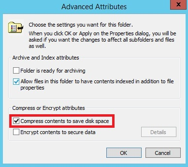
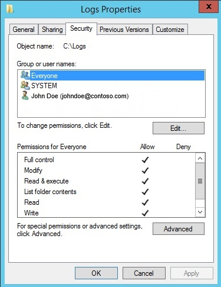
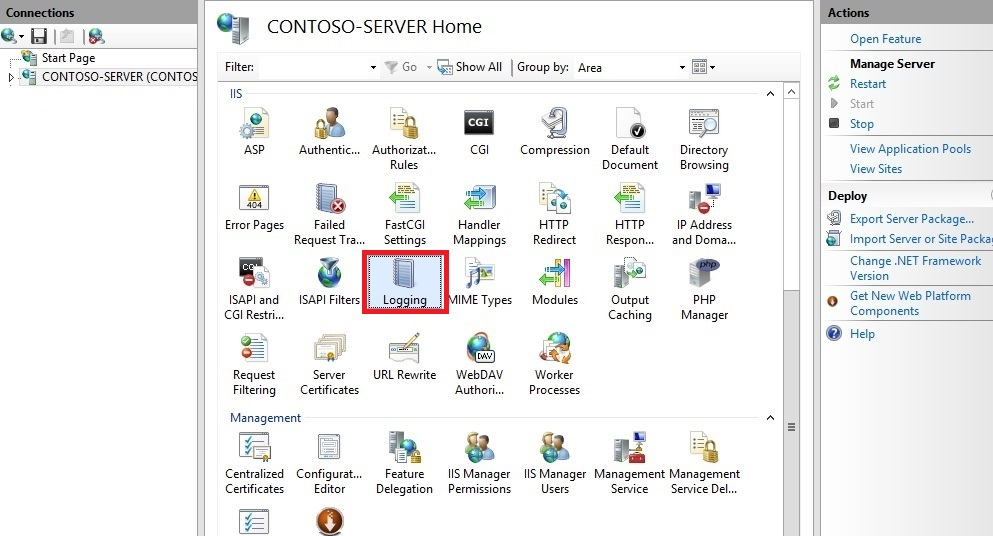
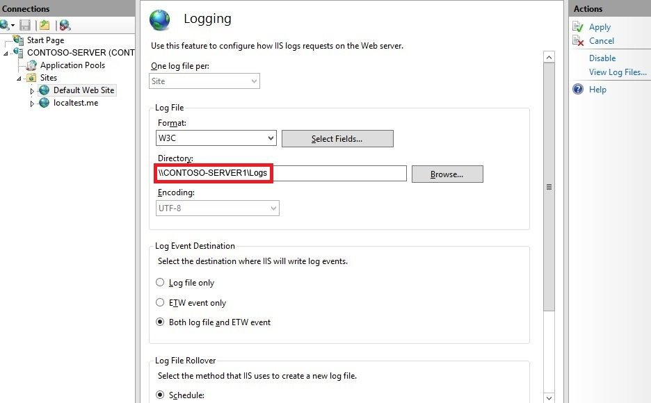
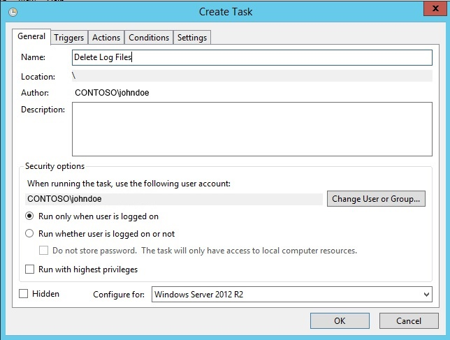
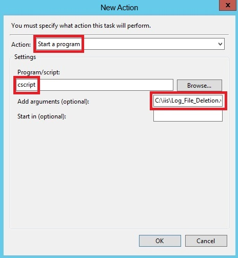
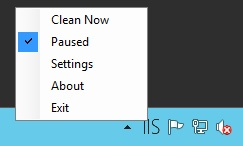

Managing IIS Log File Storage
====================
by [Jim van de Erve](https://twitter.com/jimvde)

You can manage the amount of server disk space that Internet Information Services (IIS) log files consume by using compression, remote storage, scripted deletion, and an IIS Log Cleaner Tool.

## Overview

The log files that IIS generates can, over time, consume a large amount of disk space. Logs can potentially fill up an entire hard drive. To mitigate this problem, many users turn off logging completely. Fortunately, there are alternatives to doing so, such as the following:

- [Enable folder compression](#00)
- [Move the log folder to a remote system](#01)
- [Delete old log files by script.](#02)
- [Delete old log files by the IIS Log File Cleaner.](#03)

The above mitigations are described in the sections below. You may also want to do the following to control disk usage:

- Limit log size by omitting unneeded property fields
- Create separate logs for Web sites and applications
- Preserve memory resources by using centralized binary logging.

For more information, see [Configuring Logging in IIS](configure-logging-in-iis.md).

## Enable Folder Compression

IIS log files compress to about 2% of their original size. Enable compression of a log file as follows. You must be an administrator to perform this procedure.

1. Click the **File Manager** icon in the icon bar.
2. Move to the folder containing IIS log files (by default, `%SystemDrive%\inetpub\logs\LogFiles`).
3. Right-click on the folder and click **Properties**.
4. On the **General** tab of the **Properties** page, click **Advanced**.
5. Click **Compress contents to save disk space**, and then click **OK**.
    
6. Click **Apply**, and then select whether to compress the folder only, or the folder, its subfolders, and its files.
7. Click **OK**. Verify that the folder contents are compressed. The name of the folder and the name of each file should be colored blue, and the size of a compression file should be smaller.

This is a simple way to lower disk usage. It is not a final solution, however, because disk usage still grows over time, and could eventually fill up the hard drive.

If the folder already contains a significant amount of data, it could take the computer a while to compress its contents. Also note that this one-time process could slow down the computer during the initial compression, so if this is a production server, perform this operation during off-peak hours to prevent service degradation.

## Move the Log Folder to a Remote System

IIS log files are stored by default in the `%SystemDrive%\inetpub\logs\LogFiles` folder of your IIS server. The folder is configured in the Directory property on the Logging page for either the server or an individual site. To lessen the problem of log disk usage, you can move your IIS log files to a folder on another server that has more space. This server can either be in the same domain as the local IIS server, or a different domain. You can save log files remotely either for the entire server or for individual Web sites.

This solution can help the security of the system, because if a local hard drive crashes, the log data is still available on remote storage. In addition, the log files can be consumed by analysis systems.

Change the location of an IIS log file to a remote share as follows:

1. Create a log-file directory on a remote server that is in the same domain as your local Web server running IIS.
2. In the folder's **Properties** page, on the **Sharing** tab, click **Share** so that the directory is shared. On the **Security** tab, assign groups and users with the appropriate permissions. Ensure that the appropriate groups and users are able to read and write to the log files.
    

    For more information, see [Configuring Permissions for Remote Logging](https://technet.microsoft.com/en-us/library/cc779701(v=ws.10).aspx).

    Note: If you want to write log files to a remote server in a different domain, see [Setting Up a Null Session for Cross-Domain Logging](https://technet.microsoft.com/en-us/library/cc728059(v=ws.10).aspx).
3. Open **IIS Manager** on your local Web server.
4. In **IIS Manager**, in the **Connections** pane, click the server or a Web site.
5. Double-click **Logging**.
    
6. In the **Directory** text box, enter the full UNC path of the directory that you created on the remote server. For example, type \\servername\Logs, where "servername" represents the name of the remote server, and "Logs" represents the name of the share where the log files are stored.
    
7. In the **Actions** pane, click **Apply**, and then click **OK**. All Web sites within the directory should begin logging data to the remote share.

    For more information, see [Remote Logging](https://technet.microsoft.com/en-us/library/cc786172(v=ws.10).aspx).

## Delete Old Log Files by Script

You can control disk usage of log files by running a script that automatically deletes log files that are older than a certain age. Running this script in a scheduled task will keep the problem of a disk filling up under control without constant maintenance.

The following VBScript will check the age of each log file in a folder and will delete any log file older than a specified age. To customize the script for your purposes, simply change the name and path of the folder in line 1 of the script, and change the maximum age to the desired value in days, in line 2.

[!code-vb[Main](managing-iis-log-file-storage/samples/sample1.vb)]

The script above will scan all subfolders, so it will process logs for ALL sites in and under the folder specified. If you want to limit the process to just a single site, change the path appropriately.

To run the script manually, execute the following script in an administrator command line: `cscript.exe c:\scripts\retentionscript.vbs`

Using a script to delete log files is a long-term, reliable solution to the problem of log files consuming disk space. If you automate the process, as shown below, it doesn't require constant maintenance.

### Run the script as a scheduled task

You can automate the task of deleting log files by script by creating a Windows task schedule to run the script periodically. You can schedule the script to run at any time using the Windows Task Scheduler. How you configure the scheduled task should be coordinated with the configuration of the log file rollover options.

1. Open **Server Manager**, click the **Tools** menu, and then click **Task Scheduler**.
2. In the **Actions** pane of the **Task Scheduler** dialog box, click **Create Task**.
    
3. On the **General** tab of the **Create Task** dialog box, enter a name for the task, such as "Delete Log Files". Set the security properties, selecting a user account with sufficient privileges to run the script.
    
4. Click the **Triggers** tab, and then click **New**. In the **New Trigger** dialog box, set **Begin the task** to **On a schedule**. Select the periodicity, for example, **Daily**. Enter the **Start** date, select more advanced settings, and ensure that **Enabled** is selected if you are ready to initiate the schedule. Click **OK**.
    
5. Click the **Actions** tab, and then click **New**. In the **New Action** dialog box, select a value for **Action**, in this case, **Start a program**. In **Program/script**, enter **cscript**, and in **Add arguments (optional)**, enter the path and name of the script file, for example, `C:\iis\Log\_File\_Deletion.vbs`. Click **OK**.
    
6. Click **OK**.
7. Verify that the task has been added to the **Active Tasks** pane.
8. Right-click on the new task, and select **Run**.
    
9. Navigate to the folder that the script ran on, and verify that the appropriate log files were deleted.
10. Navigate back to the Task Scheduler, right-click on the task, and click **End** so the status returns to **Ready** and the task is ready for scheduled runs.

## Delete Old Log Files by the IIS Log Cleaner Tool

IIS Log Cleaner is a simple tool for enacting a log retention policy for IIS. The tool runs in the background (once every hour) and cleans up the IIS log folder automatically, deleting log files older than a maximum age that you set. The log files are moved to the Recycle bin to avoid potential data loss. You can also run the cleaning process manually, and you can pause the automated process.

This is a third-party tool that is not supported by Microsoft.

### Cleaner Tool Files

The IIS Log Cleaner consists of the following:

- The **IISLogCleaner.exe** application that executes the log cleaning process. The application is stored in a local folder that you select when you download the tool.
- The **settings.txt** file that specifies the log file folder to be cleaned and the maximum age at which a log file is deleted. The default settings are the default IIS log folder (ex: `c:\inetpub\logs\LogFiles`), and a maximum age (in days) of 30. These settings are configurable by either opening settings.txt in a text editor or by using a command in the notification area (see below). The settings.txt file is created automatically when IISLogCleaner.exe is first run. The settings.txt file is stored in the same folder as IISLogCleaner.exe.
- The **IIS Log Cleaner** icon in the notification area (labeled IIS). Right-clicking the IIS notification icon displays a list of action commands and status settings: 

    - **Clean Now** executes the cleaning process immediately instead of on a timed basis.
    - **Paused** stops the automated cleaning process. If **Paused** is selected, you can click it to re-start the automated cleaning process.
    - **Settings** enables you to configure the settings in settings.txt.
    - **Exit** to exit the tool.

### Use the Cleaner Tool

To download, configure, and run the IIS Log Cleaner tool, proceed as follows:

1. Download the executable by executing http://www.erezbenari.com/apps/IISLogCleaner.exe and saving the executable in a folder of your choice on the server (there is no installer).
2. Click through the security popups.
3. Execute IISLogCleaner.exe in the folder. This creates the settings.txt file in the same folder.
4. To make changes to the settings.txt file, open the file with a text editor, or right-click the **IIS** icon in the notification area, and then click **Settings**.
5. If you change the settings file, exit the tool by right-clicking the IIS notification icon and then clicking **Exit**, and then launch the tool again.
6. Right-click the **IIS** icon in the notifications area, and then click **Paused** to un-pause the application.
    
7. The application will run once an hour and move log files older than the specified period to the recycle bin. To run the cleaning tool manually, right-click the **IIS** icon in the notifications area, and then click **Clean Now**.
8. Optionally, adjust the recycle bin size to control how much log data is kept before being purged from the recycle bin by the operating system.

Usage notes:

- The application is set by default for the IIS root log folder, so it will scan the logs for all sites (all subfolders). If you want it to clean up only a specific site, point it at the site's folder.
- The application will only move files with the .LOG extension.
- The application is not a service, so the user must remain logged on to use it.
- The application requires that the logged-on user have write permissions to the log folder to work correctly.
- If the system is restarted, the application needs to be re-run. You can drag it to your Startup folder to make it run on boot.
