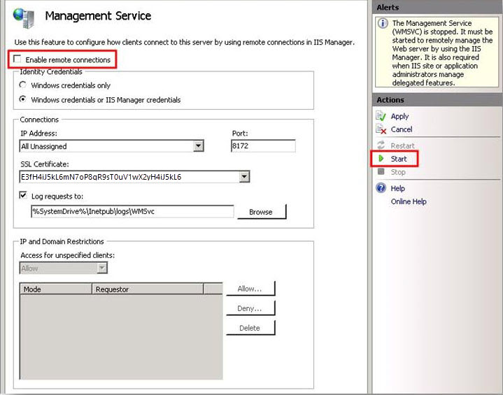
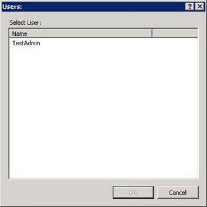
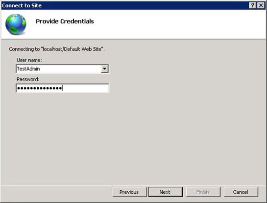
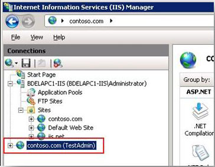
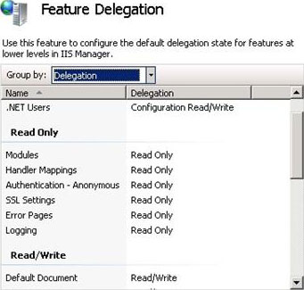
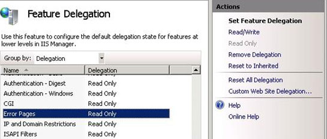

Configuring Remote Administration and Feature Delegation in IIS 7
====================
by [Saad Ladki](https://twitter.com/saadladki)

## Introduction

IIS provides administrators and developers with a new configuration system that is accessible, extensible and distributable. The new XML-based format allows for easy configuration of the modules and features available in IIS 7 and above. It also enables granular control of the locations at which settings for individual features can be configured (for example, at the server level in the applicationHost.config file, or at a site or an application level in a Web.config file).

The new IIS administration user interface (UI), IIS Manager, fully supports this new configuration system and adds additional features that provide a powerful and granular system for configuring the Web server. Two of these additional features are remote administration of servers, sites and applications, and support for user-based authentication and authorization.

This article explains how to enable remote connections, configure users and permissions, and delegate features to a site or application level. There are many scenarios where an IIS server administrator might want to delegate administrative control of a certain feature or features to someone, or where the administrator might want to prevent others from viewing existing configuration. Take the following scenario, for example.

Edward is a server administrator on a computer that hosts several sites. The computer is part of a domain, and some of the site owners belong to the same domain. However, some of the site owners are outside of the domain, and Edward must create IIS Manager user accounts for them by creating a user name and password for each owner. After he has created the necessary IIS Manager user accounts, Edward sets up IIS Manager permissions for each site to specify which of the users are allowed to connect to a particular site. To do this, Edward opens the IIS Manager Permissions feature in each site and adds Windows users and IIS Manager users. This action does two things. First, it configures IIS to allow a user to connect to the site when the user provides valid credentials. Second, it permits users who successfully connect to configure any delegated features in that site.

Edward also wants to delegate configuration of some features that he trusts to be configured by a site owner in his or her own site. This eliminates the need for a site owner to request that Edward configure features that vary by site, such as default documents. He decides to delegate configuration for the following features in all sites on his server: Default Documents, Directory Browsing, and Error Pages. In addition, Edward decides to delegate configuration of an additional feature, HTTP Redirect, to the site Contoso, because he knows that the site often needs to be redirected and trusts the site owners to configure those settings. He sets all other features to be Read Only so that site owners can see the settings but not configure them in their sites.

Julian and Catherine are site owners for the site Contoso on Edward's computer. Julian has a Windows user account, and Catherine has an IIS Manager user account for which Edward has provided her credentials. They can both open IIS Manager on their own computers, and connect to Contoso because Edward has permitted their accounts to configure the Contoso site. They each see all of the features that have been delegated to the site level. They can configure Default Documents, Directory Browsing, Error Pages, and HTTP Redirect because Edward delegated configuration of those settings to their site.

## Prerequisites

The following items are required to be installed to complete the procedures in this article:

- IIS 7.0 on Windows Server® 2008 or IIS 7.5 on Windows Server 2008 R2
- IIS Manager

## Configuring Remote Connections in IIS Manager

In IIS, IIS Manager makes it easy to perform remote administration. In addition to managing IIS on the local computer, IIS Manager can manage remote servers, sites, and applications. The server administrator uses remote administration features to add IIS Manager user accounts and to allow those users to connect to any sites or applications for which they have permission.

Configuring remote administration involves enabling remote connections in IIS Manager and configuring the type of credentials required to connect to the server. Optionally, you can change default connection and logging settings, and add connection restrictions based on IP addresses or domain names.

**Install the Management Service**

The default IIS installation options do not include the Management Service (also referred to as the Web Management Service (WMSVC)), which is required for remote administration. If you have not installed the Management Service, follow the steps in this procedure to install it.

**To install the Management Service:** 

1. Click **Start**, type **Server Manager** in the **Search** box, and press ENTER to open Server Manager.
2. In the tree, under **Roles**, select **Web Server (IIS)**.
3. Click **Add role services**, and then select **Management Service** as shown in the image below.
4. Click **Next** and follow the instructions to complete the installation.

## Enable Remote Connections and Configure Identity Credentials

Enable remote connections so that Windows users and IIS Manager users (configured later in this article) can connect to this computer by using IIS Manager on their computers. By default, the Management Service allows connections only from users that have Windows credentials, but you can configure it to also allow connections from users with IIS Manager credentials. For the purposes of this article, configure the Management Service to allow both credential types as shown in the image below.

> [!NOTE]
> The next section in this article explains IIS Manager credentials.

**To enable remote connections and allow connections from Windows users and IIS Manager users:** 

1. In IIS Manager, in the Connections pane, click the server node in the tree.
2. Double-click Management Service to open the Management Service feature page.
3. Select the **Enable remote connections** check-box.
4. Under **Identity Credentials**, select **Windows credentials or IIS Manager credentials**.
5. In the **Actions** pane, click **Apply** to save the changes, and then click **Start** to start the Management Service.  
    

**Additional Information**

You do not have to enable remote connections to start the Management Service. If remote connections are disabled and the Management Service is started, you can connect to the Management Service from the local computer but not from a remote computer. If you cannot connect from a remote computer, make sure that remote connections are enabled.

You should check your firewall settings to ensure that connections are allowed to the Management Service. When the Management Service is installed, the setup process adds a firewall rule that allows traffic to the Management Service on port 8172 (the default port) which is on by default. If you ever change the port that the Management Service uses, you must add a new firewall rule to allow traffic to the Management Service on that port.

## Configure Connection and Logging Settings for the Management Service

In addition to the Management Service settings that were configured in the above section, you can configure connection settings and specify where to log requests. The following table describes each field and its default setting. If you change any settings, make sure to click **Apply** in the **Actions** pane and then restart the Management Service.

| Property | Description | Default Setting |
| --- | --- | --- |
| IP Address | Specifies the IP address to which the service is bound. | All Unassigned |
| Port | Specifies the port number that the service uses for requests. | 8172 |
| SSL Certificate | Specifies the SSL certificate used by the service. All requests to the service use HTTPS over the port specified in the **Port** field. This list contains the SSL certificates that are available to the server. If you want to add additional SSL certificates, use the **Server Certificates** feature at the server level. | Self-signed certificate that is installed during setup |
| Log requests to | Specifies the path to the log files for the Management Service. | `%SystemDrive%\Inetpub\logs\WMSVC` |

## Configure IP and Domain Restrictions for the Management Service

By default, the Management Service accepts all requests made to its configured IP address and port, and users are allowed to connect when they are added to IIS Manager (as explained in the next section). However, you can configure the service to deny access for unspecified requests and instead add specific allow rules so that only requests made from a specific IP address or domain are accepted. For more information about allowing or denying requests from IP addresses or domains, see the procedures under Configuring Remote Management on Microsoft TechNet.

## Configuring Users and Permissions for IIS Manager

When you configured the Management Service in the above section, you selected the **Windows credentials or IIS Manager credentials** option. This option enables users with either Windows user accounts or IIS Manager user accounts to connect to a site or application on the remote computer by using IIS Manager. Both types of users must provide valid credentials (a user name and password pair) when they connect remotely. A Windows user must provide valid Windows credentials for a user account on the remote computer or for a user account in the domain if the computer is a member of a domain. An IIS Manager user must provide valid IIS Manager credentials, which are configured in IIS Manager by a server administrator on the remote computer. In both cases, a user is able to use IIS Manager to connect to sites or applications for which the server administrator has given the user permission.

## Add an IIS Manager User

The following procedures explain how to open the IIS Manager Users feature and add a user. When the **IIS Manager Users** feature page opens, the list displays each IIS Manager user name and whether the account is enabled or disabled. Only enabled accounts are allowed to connect to sites or applications for which they have been granted permission.

**To add an IIS Manager user:** 

1. In IIS Manager, in the **Connections** pane, click the server node in the tree.
2. On the server home page, double-click **IIS Manager Users**.  
    
3. On the **IIS Manager Users** page, in the **Actions** pane, click **Add** **User**.
4. In the **User** name box, type a user name.
5. In the **Password** box, type a password and then retype the password in the **Confirm** password box.
6. Click **OK**.  
    

## Configure IIS Manager Permissions for a Site or an Application

In order for a user to remotely connect to a site or application on the server, they must be granted permission to a site or application by the server administrator. After they are granted permission, they can use IIS Manager to connect to the site or application using either their Windows credentials (if they are a Windows user) or their IIS Manager user credentials (if they are an IIS Manager user).

**To permit an IIS Manager user to connect to a site or an application:** 

1. In IIS Manager, in the **Connections** pane, select the site or application for which you want to configure permissions.
2. On the home page for the site or application, double-click **IIS Manager Permissions**.  
    
3. On the **IIS Manager Permissions** page, in the **Actions** pane, click **Allow User**.
4. On the **Allow User** dialog box, select **IIS Manager** and click **Select**.  
    
5. On the **Users** dialog box, select one or more IIS Manager users from the list and then click **OK**.  
    
6. Click **OK** to dismiss the **Allow User** dialog box.

**To permit a Windows user to connect to a site or an application:** 

1. On the **IIS Manager Permissions** page, in the **Actions** pane, click **Allow User**.
2. On the **Allow User** dialog box, select **Windows** and then click **Select**.
3. On the **Select User or Group** dialog box, type a user name or search for a user account, and then click **OK**.  
    
4. Click **OK** to dismiss the **Allow User** dialog box.

## Configure Access Control Lists (ACLs) for Content Directories

In order for IIS Manager to work correctly when a user connects to a site or an application, the ACLs must be configured properly for the physical directory of the site or application. For Windows users, you must configure directory and file ACLs for each Windows user or group that needs to access the directories and files. For IIS Manager users, you must configure directory and file ACLs for the WMSVC user (NT Service\WMSVC by default).

For the physical directory of a site or an application, configure read, write, and execute permissions for the WMSVC user (if you are permitting IIS Manager users to connect) and for any Windows users who need to connect to that site or application.

If the physical directory of the site or application is on a different machine (i.e. on a UNC share) then you will need to configure WMSVC to run as a user which has read, write, and execute permissions for the content on that UNC share (the default user, NT Service\WMSVC, cannot access items on a different machine).

## Connect to a Site or an Application in IIS Manager

After you have configured the Management Service and configured users and permissions, a user can connect to his or her site or application.

**To connect to a site or an application**

1. In IIS Manager, click **File** and then click **Connect to a Site**(or **Connect to an Application**).
2. On the **Connect to Site** or **Connect to Application** wizard, type the server name and the site name to which you want to connect. If you are connecting to an application, type the application name also. Then click **Next**.  
    
3. On the **Provide Credentials** page of the **Connect to Site** or **Connect to Application** wizard, select whether you want to use current credentials or to specify the credentials to connect to the site. When you specify credentials, the default is Windows credentials unless you select the **Use IIS Manager credentials** check-box. After you specify the credentials, click **Next** to connect to the server.  
    
4. If the connection succeeds, IIS Manager will display a final page on the **Connect to Site** or **Connect to Application** wizard to name the connection. As shown in the image below, the TestAdmin user has created a site connection to the Contoso.com site.  
    

**Additional Information**

In the next section, we look at Feature Delegation. However, before we do that, and to better explain Feature Delegation and what it does, we look at one feature of the site we have just connected to. The site should be highlighted and the site home page should be displayed. On the home page, double-click **Error Pages**.

As shown in the image below, on the right-hand side of the page there is an alert saying "This feature has been locked and is read only." This alert is displayed when a feature has been locked; the next section explains Feature Delegation and locking in more detail.

## Delegating Features in IIS Manager

The **Feature Delegation** feature page lets a server administrator configure the delegation state of features that are configurable in *Web.config* files at the site and application levels in IIS Manager. He or she might want to delegate configuration of certain features, such as Default Documents and Directory Browsing, to an individual site owner so that the owner can configure those delegated features in his or her site.

Or a server administrator might delegate a feature as read only so that a site owner can view the configuration of a feature but cannot change the settings. The server administrator can even prevent features from appearing in IIS Manager at the site and application levels.

There are several different delegation states, each of which determines whether a feature is delegated to lower levels in the configuration system and whether the feature displays in IIS Manager when users are connected at lower levels. The following table describes each delegation state.

| Delegation Type | Description |
| --- | --- |
| Not Delegated | The configuration is locked and any configuration of the feature in a *Web.config* file will cause a runtime error. The feature is not visible or configurable in IIS Manager when a user is connected at levels below where this state is set. For example, if a feature is configured to be **Not Delegated** at a site level, users connected to applications in that site will not see the feature and cannot configure it in IIS Manager. |
| Read Only | The configuration is locked and any configuration of the feature in a *Web.config* file will cause a runtime error. The feature is visible in IIS Manager when a user is connected at lower levels, but the configuration is locked so that changes cannot be made. |
| Read/Write | The feature can be configured in *Web.config*. The feature appears in IIS Manager and can be configured when a user is connected at lower levels (site or application level). |
| Configuration Read Only | The meaning is the same as **Read Only**; however, there are settings or data for the feature that are stored and managed outside of IIS, such as in a database. |
| Configuration Read/Write | The meaning is the same as **Read/Write**; however, there are settings or data for the feature that are stored and managed outside of IIS, such as in a database. |

> [!NOTE]
> Server administrators can modify the configuration for all features, so if they are connected to the server, they will see all features at all levels even if a feature has been configured to not display at lower levels.

## Configure Default Delegation States for Features in IIS Manager

When you first open the **Feature Delegation** feature page, you can configure the default delegation state of features in IIS Manager. These delegation states are the default settings used by IIS Manager for all sites and applications on the server.

**To configure default delegation states for features in IIS Manager**

1. In IIS Manager, in the **Connections** pane, click the server node in the tree.
2. On the server home page, double-click **Feature Delegation**. 
3. Select **Delegation** from the **Group by** list to organize the list of features by their current delegation states.  
    
4. Select **Error Pages** in the **Feature Delegation** list, and then review the available delegation states in the **Actions** pane. The **Error Pages** feature is selected and the available options under **Set Feature Delegation** are **Read/Write**, **Remove Delegation** and **Reset to Inherited**.  
    
5. Select **Error Pages.** In the **Actions** pane, click **Read/Write** to unlock the configuration section that is related to the **Error Pages** feature. This makes the feature configurable in *Web.config* files and in IIS Manager at the site and application levels.

### Additional Information

The following excerpt from the IIS configuration files shows that the values can be overridden at every location (also referred to as "path"):

[!code-xml[Main](configuring-remote-administration-and-feature-delegation-in-iis-7/samples/sample1.xml)]

To further demonstrate what this action does, look at **Error Pages** feature at a site level. In the **Connections** pane, connect to a site and then double-click **Error Pages** on the site home page. As shown in the image below, the **Error Pages** feature can now be configured by the user connected to the site level.

## Configure Custom Delegation States for Features in a Site or an Application

The steps above configured the default delegation state for the **Error Pages** feature in all sites on the server. There may also be a time when you do not want the delegation state that you configure to be applicable to all sites. In this case, you can configure a custom delegation state for a specific site. You can also copy custom delegation states of all features from one site to another site.

**To configure custom delegation states for features in a specific site**

1. In IIS Manager, double-click **Feature Delegation**.
2. On the **Feature Delegation** page, in the **Actions** pane, click **Custom Web Site Delegation**.
3. From the **Sites** list, select the site for which you want to configure custom delegation settings.  
    
4. Select a feature, and then click a delegation state in the **Actions** pane.

**To copy custom delegation states from one site to another site**

1. On the **Custom Web Site Delegation** page, in the **Sites** list, select the site from which you want to copy delegation to another site.
2. Click **Copy Delegation**.
3. On the **Copy Delegation** dialog box, select the site or sites to which you want to copy the delegation states and then click **OK**.

### Reset Feature Delegation States

There may be a time in which it is necessary to undo the changes that have been made to the delegation states of features. Perhaps the changes were made to a particular site or application by accident, or some 'experimentation' with the feature has gone wrong. In this case, reset the delegation states of all features back to their default states. Or, reset only one feature back to its default state.

**To reset feature delegation states**

1. Open the **Feature Delegation** feature page.
2. To reset all feature delegation states, in the **Actions** pane click **Reset All Delegation**.

To reset the delegation state of a specific feature, select the feature in the list, and in the **Actions** pane click **Reset to Inherited**.