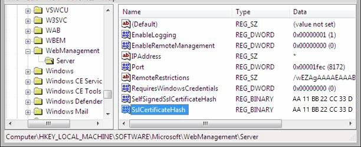

Remote Administration for IIS Manager
====================
by [Saad Ladki](https://twitter.com/saadladki)

## Introduction

Remote management of IIS 7.0 and above through Internet Information Services (IIS) Manager must be explicitly enabled. This has changed from IIS 6.0 where IIS Manager remoting was through MMC and was always enabled. This document describes how to enable remote management of IIS on Windows Server® 2008 through IIS Manager.

First, you must be on Windows Server 2008. IIS on Windows Vista will not be remotely manageable when it released. You must also be logged in as the built-in Administrator account, or be a member of the Administrators group using elevated privileges.

These are the steps for enabling remote administration of your IIS server.

1. Install the Web Management Service (WMSVC).
2. Enable remote connections.
3. Optionally set other configuration, e.g.:   
  
   a. HTTPS binding (port, IP address, and/or SSL certificate)   
   b. IP and domain restrictions.

4. Start WMSVC, and optionally change the service Startup Type from Manual to Automatic.

Starting WMSVC is the last step because WMSVC cannot be configured while running.

> [!NOTE]
> This document only describes how to enable remoting. For an overview of how IIS Manager remoting works, please see the [Getting Started with IIS Manager](../../get-started/getting-started-with-iis/getting-started-with-the-iis-manager-in-iis-7-and-iis-8.md).

### Install Web Management Service (WMSVC)

Click **Server Manager** in the Start menu, select the **Roles** node in the left-hand tree view, and scan down to find the **Web Server (IIS)** role. Click **Add Role Services** and select the **Management Service** component.

## Enable Remote Connections

To enable remote connections using IIS Manager, click the server node in the tree view, open the **Management Service** feature, and check the **Enable Remote Connections** check box under Remote Connections.  

This configuration is stored in the dword registry value "EnableRemoteManagement" under the registry key HKEY\_LOCAL\_MACHINE\SOFTWARE\Microsoft\WebManagement\Server. The easiest way to enable remote management from the command line is to save this text in a file called EnableRemoteMgmt.reg and run it:

[!code-console[Main](remote-administration-for-iis-manager/samples/sample1.cmd)]

## Configure WMSVC Settings

There are a few other WMSVC settings you might want to configure:

- **Binding** – By default, WMSVC is bound to all unassigned IP addresses on port 8172 using a self-signed certificate (WMSVC only communicates over HTTPS).
- **IPv4 Restrictions** – After remote connections are enabled, WMSVC accepts connects from any IP address. You may want to refuse connections from a set of known clients, or lock down connections to only a set of known clients.
- **Acceptable for unspecified clients** – By default, WMSVC accepts both Windows credentials and IIS Manager credentials (i.e. non-Windows credentials stored in administration.config). You can choose to restrict this to just Windows credentials.

To configure these settings using IIS Manager, click the server node in the tree view and open the **Management Service** feature. This configuration is stored in the registry and can be manipulated many different ways (e.g. regedit, .reg files, WMI, etc.):

## Start WMSVC

To start WMSVC using IIS Manager, click the server node in the tree view, open the **Management Service** feature, and click **Start** in the task pane. To start WMSVC from the command line, type:

[!code-console[Main](remote-administration-for-iis-manager/samples/sample2.cmd)]

WMSVC installs with Startup Type set to Manual, which means that the service has to be manually restarted each time the server reboots or if HTTP.sys is stopped (WMSVC depends on HTTP.sys). Set the Startup Type to Automatic if you want WMSVC to start on system boot. Do this in the Services MMC console, or using this command line:

[!code-console[Main](remote-administration-for-iis-manager/samples/sample3.cmd)]

