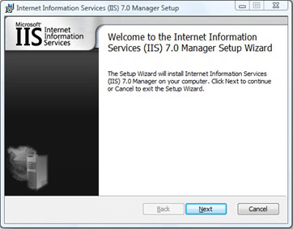
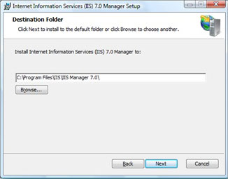

# Remote Manager for Windows 2003, XP and Vista SP1

by [Brian Delahunty](https://github.com/briandela)

These requirements must be met in order to continue with the procedures in this article:

- You must have Windows Vista® SP1 installed.
- You must have the Microsoft .NET Framework® version 2.0 or greater installed.
- You must have the Internet Information Services 7.0 or above Management Console® installed (click [here](https://blogs.iis.net/bdela/#InstallingMgtConsole) to see how to install).

> [!NOTE]
> If at any stage during the install process you receive a User Access Control dialog, you can continue the installation by clicking **Continue** or **Allow**.

## Installing on Windows Vista

1. Ensure that you meet the installation requirements for Windows Vista®. Note that you must install the IIS Management Console (see how by clicking [here](https://blogs.iis.net/bdela/#InstallingMgtConsole)).
2. Download the Remote Manager installer from:   
 32 bit (x86) - [https://www.iis.net/go/1626](https://www.iis.net/downloads/microsoft/iis-manager)  
 64 bit (x64) - [https://www.iis.net/go/1633](https://www.iis.net/downloads/microsoft/iis-manager)  
 If you are running the 64 bit version of Windows Vista, ensure that you download the 64 bit installer. The 32 bit installer will not work on 64 bit Windows Vista.
3. After downloading the installer, simply double click on it to run it.  
    
4. Click **Next** to display the License agreement page.
5. To continue, you must agree to the license agreement and then click **Next**.  
    
6. Select the location where you want to install Remote Manager and click **Next** to continue.  
    
7. On the next screen, click **Install** to start the installation.

### Using Remote Manager on Windows Vista

After installing Remote Manager on Windows Vista, start the IIS Management Console as you did before. For example:

1. Click the Windows **Start** button  to display the start menu.
2. Type "inetmgr.exe" into the search box and press **Enter**.  
      
 If you are prompted by "User Access Control", click **Continue**.
3. When the Management Console starts, you may notice that it is different than before. There is now a Start Page and additional options such as "Connect to Server", "Connect to Site" and so on. You can also connect to a Server, Site or Application by going to the File menu and selecting the appropriate option.  
    
4. After you select which type of connection you want to make a wizard will be displayed. Follow the wizard and enter the request details to make a remote connection.

### Known Issue

The following issue is known for Remote Manager:

- The 32 bit version of Internet Information Services (IIS) Manager will not function correctly on 64 bit version of Windows XP®, Windows Server® 2003 and Windows Vista. Ensure that you install the 64 bit version Internet Information Services (IIS) Manager on 64 bit operating systems.

## Installing the Management Console on Windows Vista (a prerequisite for installing Remote Manager on Vista)

To install the Internet Information Services (IIS) Management Console on Windows Vista, follow the steps below:

1. Click the Windows Start button  to display the start menu.
2. Type "optionalfeatures.exe" into the search box and press enter.  If you are prompted by "User Account Control," click **Continue**.  
   
3. When the Windows Features dialog is finished loading, expand the "Internet Information Services" node.
4. Next, expand the "Web Management Tools" node.
5. To install the IIS Management Console, check the check box beside "IIS Management Console" and click **OK**. If the check box is already checked, the Management Console is already installed.  
   

## Installing on Windows XP and Windows Server 2003

The following prerequisites must be fulfilled in order to install Remote Manager on Windows XP or Windows Server 2003:

- You must have **Windows XP Service Pack 2** installed if you are using **Windows XP**
- You must have **Windows Server 2003 Service Pack 1** installed if you are using **Windows Server 2003**
- You must have the Microsoft .NET Framework version 2.0 or greater installed

### Install instructions

1. Ensure that you meet the installation requirements for Windows XP and Windows Server 2003 as discussed earlier.
2. Download the Remote Manager installer from:
   32 bit (x86) or 64 bit (x64) - <https://www.iis.net/downloads/microsoft/iis-manager>
3. After downloading the installer, double click it to run.  
    
4. Click **Next** to display the License agreement page.
5. To continue, you must agree to the license agreement and then click **Next**.  
    
6. Select the location where you want to install Remote Manager and click **Next** to continue.  
    
7. On the next screen, click **Install** to start the installation.

## Using Remote Manager on Windows XP and Windows Server 2003

To start Remote Manager after installation, follow these instructions:

1. Click the Windows **Start** button to display the start menu.
2. Go to the Programs (or All Programs) menu and click Internet **Information Services (IIS) 7.0 Manager**.  
    
3. After Remote Manager starts you can connect to a server, site or application by going to the site menu and clicking the appropriate options.  
    
4. After you select which type of connection you want to make, a wizard displays. Follow the wizard and enter the request details to make a remote connection.