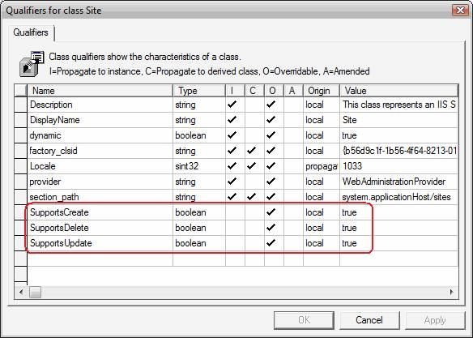

Managing Sites with IIS 7.0's WMI Provider
====================
by [Saad Ladki](https://twitter.com/saadladki)

## Introduction

This document provides an introducation to WMI by walking through Site management using the IIS WebAdministration namespace. Learn how to create, delete, stop, start, and modify sites – all tasks that can be translated easily to objects like Application Pools and Virtual Directories.

If you need to view properties for a specific site, want to create and or delete a Site, or see all of the sites on your server, you have come to the right place. This document walks you through most tasks related to Sites, and provides a basic introduction to WMI.

Tasks and sections in this article include:

- [Before You Start](managing-sites-with-the-iis-wmi-provider.md#01)
- [Getting a Site Instance (single-key object)](managing-sites-with-the-iis-wmi-provider.md#02)
- [Getting an Application Instance (multi-key object)](managing-sites-with-the-iis-wmi-provider.md#03)
- [Creating a Site](managing-sites-with-the-iis-wmi-provider.md#04)
- [Enumerating All Sites](managing-sites-with-the-iis-wmi-provider.md#05)
- [Stopping and Starting a Site](managing-sites-with-the-iis-wmi-provider.md#06)
- [Deleting a Site](managing-sites-with-the-iis-wmi-provider.md#07)
- [Summary](managing-sites-with-the-iis-wmi-provider.md#08)

Many of these tasks are performed in a similar manner for other objects, like ApplicationPool. Challenge yourself at the end of this article to see whether or not you can use what you learn here to create, delete and modify ApplicationPool objects.

This document makes extensive use of CIM Studio; if you're not already familiar with it, see [CIM Studio](https://msdn.microsoft.com/en-us/library/ms525342(vs.85).aspx).

## Before You Start

### Install IIS

IIS 7.0 or above must be installed to complete the steps in this document. If you can browse to [http://localhost/](http://localhost/) and receive the standard IIS "Under Construction" page, then IIS is installed on your machine. If IIS is not installed, please refer to [Installing IIS on Windows Vista](../../install/installing-iis-7/installing-iis-on-windows-vista-and-windows-7.md) for installation instructions.

### Install WMI Provider

Install the IIS WMI provider by selecting the **IIS Management Scripts and Tools** component under **Management Tools** (or Web Management Tools). In Windows Vista, this is in the Windows Features dialog under Internet Information Services. On Windows Server® 2008, this is in the Server Manager under the Web Server (IIS) role.

### Install WMI Tools (includes CIM Studio)

Install the WMI Tools suite from the [Microsoft Download Center](https://www.microsoft.com/downloads/details.aspx?FamilyID=6430f853-1120-48db-8cc5-f2abdc3ed314&amp;DisplayLang=en.).

### Required Privileges and User Account Control (UAC)

You must be an administrator to connect to the WebAdministration WMI namespace. This means that you are logged in as one of the following:

- The built-in Administrator account on Windows Server 2008
- A member of the Administrators group and you have disabled User Account Control (UAC), or
- A member of the Administrators group and UAC is enabled.

If you are in the first or second situation, you will not encounter any permissions problems with this article.

If you are in the third situation, you will encounter **Access is Denied** errors. Avoid these problems by always opening command prompts as Administrator and by launching CIM Studio from an elevated command prompt.

To open a command prompt as Administrator, click **Start**, click **All Programs**, click **Accessories**, right-click **Command Prompt**, and select **Run as Administrator**.

To launch CIM Studio from an elevated command prompt:

1. Open a command prompt as Administrator.
2. Type **"%systemdrive%\Program Files\WMI Tools\studio.htm"** andpress Enter.

### Make a Backup

Backup key IIS configuration files before beginning so that you can restore the system to its original state after you have finished.

1. Open a command prompt.
2. Type **%windir%\system32\inetsrv\appcmd add backup IIS7\_WMI\_CIMStudioLab.**

Expected output:

[!code-console[Main](managing-sites-with-the-iis-wmi-provider/samples/sample1.cmd)]

- After you have finished, restore IIS to its original state by opening the command prompt as administrator and typing **%windir%\system32\inetsrv\appcmd restore backup IIS7\_WMI\_CIMStudioLab**.

Expected output:

[!code-console[Main](managing-sites-with-the-iis-wmi-provider/samples/sample2.cmd)]

## 1. Get a Site Instance

To get a site instance, click **Start**, click the **Start Search** box, type **notepad.exe**, and then press **Enter**. Paste the following line of script into notepad:

[!code-console[Main](managing-sites-with-the-iis-wmi-provider/samples/sample3.cmd)]

Click **File**, **Save As...** to open the Save dialog. Find the **Save as type:** textbox at the bottom of the dialog and change its value from "Text Documents (\*.txt)" to "All Files". Save the file to the Desktop as "GetSite.vbs".

Click **Start**, click the **Start Search** box, type **cmd.exe**, and then press **Enter**. Type **cd %SystemDrive%\Users\Administrator\Desktop**, then press **Enter**. Type **cscript //h:cscript**, and press **Enter**. This sets the default script host to cscript.exe which sends its output to the command window in which it was started. For more information, read [Running Scripts from Windows](https://msdn.microsoft.com/en-us/library/xazzc41b.aspx).

Type **GetSite.vbs**, and press **Enter**. If your script runs without error, it means you have successfully connected to the "WebAdministration" namespace. For more information on the "winmgmts:root\WebAdministration" string, read [Constructing a Moniker String](https://msdn.microsoft.com/library/default.asp?url=/library/en-us/wmisdk/wmi/constructing_a_moniker_string.asp). We will add four more lines to our GetSite.vbs script. These four lines of script will get the Default Web Site and then confirm success by printing two of its properties.

[!code-console[Main](managing-sites-with-the-iis-wmi-provider/samples/sample4.cmd)]

Go back to your cmd prompt and run GetSite.vbs. You should see the following output:

***Retrieved an instance of Site***

***Name: Default Web Site***

***ID: 1***

To see how the "Get" works, click **Start**, **All Programs**, **WMI Tools**, and finally **WMI CIM Studio**. Connect to the WebAdministration namespace (see [Get to Know the IIS WMI Provider Using CIM Studio](get-to-know-the-iis-wmi-provider-using-cim-studio.md)), and search for the Site class. The right pane in CIM Studio shows Site properties. The Name property is beside a key icon, shown circled in red below.

A class can have one or more "key" properties; this set of one or more keys uniquely identifies an object. Read [Describing an Instance Object Path](https://msdn.microsoft.com/en-us/library/aa389977.aspx) for more details; in effect, the string "Site.Name='Default Web Site'" is saying "get the instance of the Site object, with key property Name equal to 'Default Web Site'". If this makes sense, try something a little more difficult.

## 2. Get an Application Instance

To get an application instance, open CIM Studio and search for the Application class. Notice that the Application class has two key properties: "SiteName" and "Path", as shown in the screenshot below.

Click **Start**, click the **Start Search** box, type **notepad.exe**, and then press **Enter**. Paste the following lines of script into notepad. The second line of script specifies values for both of the Application key properties. Note that the format of this string is: &lt;object\_name&gt;.&lt;key\_property&gt;='&lt;value&gt;',&lt;key\_property&gt;='&lt;value&gt;' where the key properties and their values are separated by commas.

[!code-console[Main](managing-sites-with-the-iis-wmi-provider/samples/sample5.cmd)]

Click **File**, **Save As...** to open the Save dialog. Find the **Save as type:** textbox at the bottom of the dialog and change its value from "Text Documents (\*.txt)" to "All Files". Save the file to the Desktop as "GetApp.vbs".

Click **Start**, click the **Start Search** box, type **cmd.exe**, and then press **Enter**.

Type **cd %SystemDrive%\Users\Administrator\Desktop**, then press **Enter**.

Type **GetApp.vbs**, and press **Enter**. You see the following output:

***Successfully retrieved: 'Default Web Site/'***

## 3. Create a Site Instance

To create a site instance, view the method parameters again from the CIM Studio article. Search for the Site class in CIM Studio. Select the Methods tab in the right pane.

Right-click on the **Create** method and select **Edit Method Parameters**. You see the dialog below showing the parameters for the Create method. Click **Cancel**.

As we now know what parameters this method takes, we will create variables for these parameters by pasting the following lines of script into notepad.

[!code-vb[Main](managing-sites-with-the-iis-wmi-provider/samples/sample6.vb)]

Click **File**, **Save As...** to open the Save dialog. Find the **Save as type:** textbox at the bottom of the dialog and change its value from "Text Documents (\*.txt)" to "All Files". Save the file to the Desktop as "CreateSite.vbs".

Click **Start**, click the **Start Search** box, type **cmd.exe**, and then press **Enter**.

Type **cd %SystemDrive%\Users\Administrator\Desktop**, then press **Enter**.

Type **CreateSite.vbs**, and press **Enter**. Your script should run without error.

Go back to CIM Studio, right-click on the Create method again, and this time select "**Method Qualifiers...**". The resulting dialog, shown below, shows that the "Create" method is a Static method. Click **Cancel**.

Static methods must be called from the object definition. The script sample below shows the difference between retrieving an object instance, and retrieving the object's definition:

[!code-vb[Main](managing-sites-with-the-iis-wmi-provider/samples/sample7.vb)]

Add a few lines to our CreateSite.vbs script to create the Site:

[!code-vb[Main](managing-sites-with-the-iis-wmi-provider/samples/sample8.vb)]

Go back to your cmd prompt and run CreateSite.vbs. You see the following output:

***Site created successfully!***

To see proof that the site was created, type **notepad %windir%\system32\inetsrv\ApplicationHost.config**. Type **Ctrl+F** to bring up notepad's Find dialog. Type **NewSite** in the "Find what:" text box, and click the **Find Next** button. This brings you to the &lt;sites&gt; section where the new site has been defined:

[!code-xml[Main](managing-sites-with-the-iis-wmi-provider/samples/sample9.xml)]

### An Additional Note on Object Creation/Deletion/Modification

Not all objects in the WebAdministration namespace can be created or deleted. For example, the server manages the lifecycle of the WorkerProcess and AppDomain objects and they cannot be created or deleted through WMI.

To know a general way to find out whether an object can be created, deleted, or modified, search for Site in CIM Studio. Right-click in the property grid on the Properties tab and click **Object Qualifiers...**. You see the dialog below:

The object qualifiers SupportsCreate, SupportsDelete, and SupportsUpdate describe whether an object can be created, delete, or modified. Site can be created, deleted and modified, so Site has all three of these qualifiers and they are all true.

Search for WorkerProcess in CIM Studio. Right-click in the property grid on the Properties tab and click **Object Qualifiers...**. The dialog below shows that the WorkerProcess object does not have these three qualifiers; the value of these qualifiers is false by default (for more information, see [Standard Qualifiers](https://msdn.microsoft.com/en-us/library/aa393650.aspx)). Therefore, the WorkerProcess object cannot be created, deleted or modified.

## 4. Enumerate All Site Instances

The script below uses the "InstancesOf" method to retrieve all instances of the Site object. Paste the script below into a new notepad window and Save As "EnumSites.vbs".

[!code-vb[Main](managing-sites-with-the-iis-wmi-provider/samples/sample10.vb)]

Run the EnumSites.vbs script. You see the following output, i.e. the Default Web Site, and the site that we created in Task 3.

***Default Web Site (1)***

***NewSite (2)***

### The Details

You may ask where the InstancesOf method came from, and where you can read more about it. The first line of the script is the same line used many times before to connect to the WebAdministration WMI namespace:

[!code-console[Main](managing-sites-with-the-iis-wmi-provider/samples/sample11.cmd)]

The GetObject call returns an SWbemServices object that can be used to perform operations against a namespace. This object has an InstancesOf method, as well as a number of other useful methods. To read more about InstancesOf or other available methods, see the [Platform SDK article on SWbemServices](https://msdn.microsoft.com/en-us/library/aa393854.aspx).

## 5. Starting and Stopping Sites

Before we modify the Site state, we find out what state the Site is in. The script below connects to the WebAdministration namespace, gets the Site instance, and then calls the GetState method on the Site instance. The GetState method returns a numeric status, so this script includes a helper function to convert the numeric status to a more descriptive string. Paste this script into a new notepad window and save it as **GetSiteStatus.vbs**.

[!code-vb[Main](managing-sites-with-the-iis-wmi-provider/samples/sample12.vb)]

Run GetSiteStatus.vbs from the cmd prompt, and you see the following output:

[!code-console[Main](managing-sites-with-the-iis-wmi-provider/samples/sample13.cmd)]

The Site is started, so write a script to stop it. We copy the script code from GetSiteStatus.vbs, but we add a few lines to stop the site (all new or updated lines are in bold). Paste this script into a new notepad window and save it as **StopSite.vbs**.

[!code-vb[Main](managing-sites-with-the-iis-wmi-provider/samples/sample14.vb)]

Run the StopSite.vbs script and you see the following results:

***NewSite is Started***

***NewSite is Stopped***

Now we just have to start the Site again. Copy StopSite.vbs to a new script called StartSite.vbs. Open StartSite.vbs and change the line **oSite.Stop** to read **oSite.Start**. Run StartSite.vbs and you should see the following output:

***NewSite is Stopped***

***NewSite is Started***

## 6. Delete a Site

Run the EnumSites.vbs script that you created in Task 4. You should see the following output, meaning that you have two sites on the server:

***Default Web Site (1)***

***NewSite (2)***

The script below connects to the WebAdministration namespace, gets the NewSite instance of Site, and deletes it. Paste this script into a new notepad window and save it as **DeleteSite.vbs**.

[!code-vb[Main](managing-sites-with-the-iis-wmi-provider/samples/sample15.vb)]

Run DeleteSite.vbs from the cmd prompt.

Run EnumSites.vbs again to confirm that NewSite was successfully deleted. You see the following output showing that the Default Web Site is the only remaining Site on the server:

***Default Web Site (1)***

## Summary

You have learned how to retrieve a specific instance of a Site or Application object, create a site, enumerate all Site instances, stop and start Sites, and finally, delete Sites. Much of this information is applicable for other namespace objects; for example, Application and ApplicationPool objects are created and deleted in the same manner as sites.