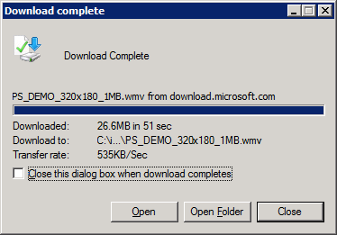
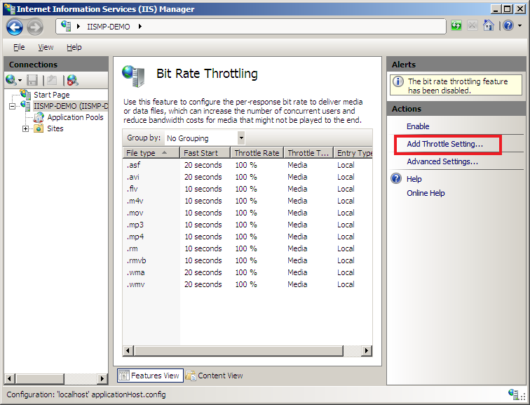
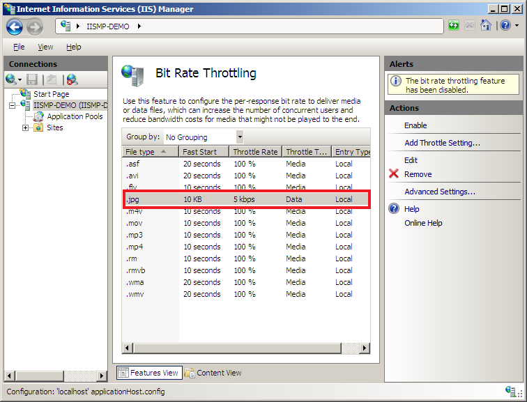
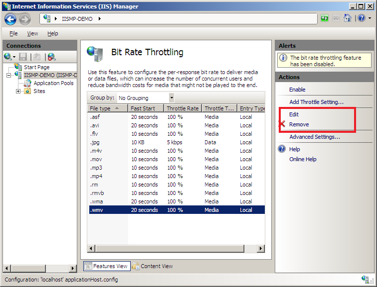
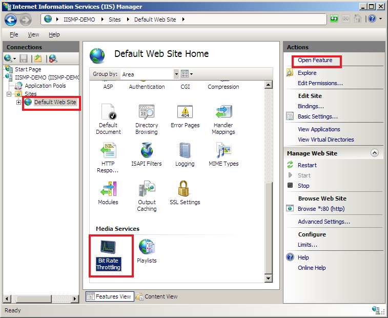
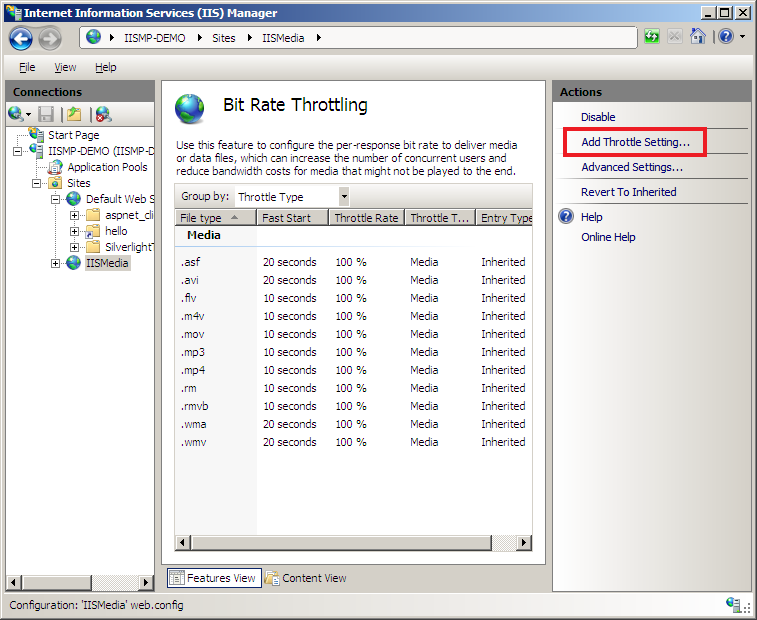
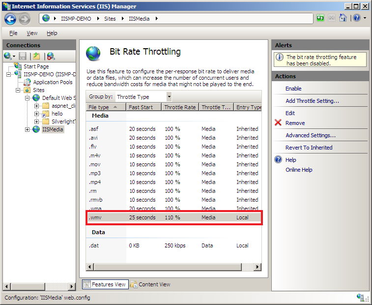
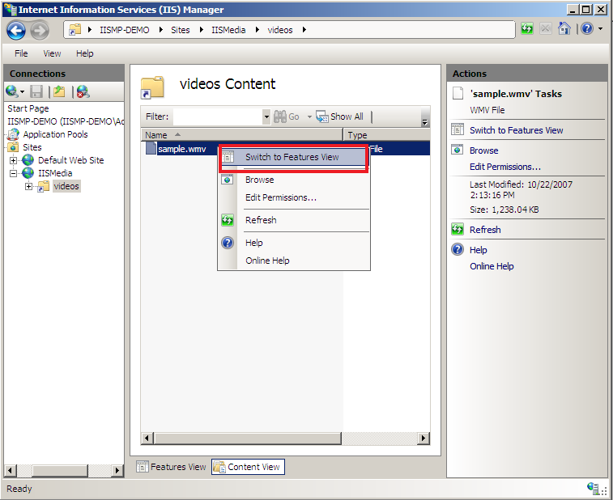
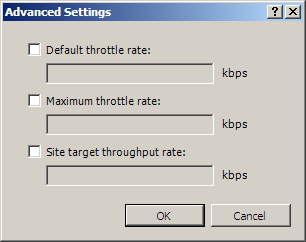

Bit Rate Throttling Configuration Walkthrough
====================
by [Chris Knowlton](https://twitter.com/chris_knowlton)

The Bit Rate Throttling extension for Internet Information Services (IIS) provides the ability to throttle progressive downloads of media files (in which audio/video playback starts as soon as sufficient data has been buffered on the client) based on the content bit rate. For sites that deliver audio and video files that may not be watched in their entirety, this extension can significantly reduce your media-related bandwidth costs. A secondary feature of Bit Rate Throttling is that it can also be used to throttle non-media ("Data") file types at specified bit rates.

For media files, automatic bit-rate detection and throttling are executed according to settings specified in the IIS configuration settings. New settings can be added, and existing settings can be adjusted, to achieve significant bandwidth savings without compromising the user experience. The media throttling settings can only be applied to defined media file types, so Bit Rate Throttling also includes a way to extend support to other media file types, or override the definitions for existing file types, through an extensible XML schema interface.

The list of supported media file types is determined by the settings in the IIS configuration file. By default, Bit Rate Throttling includes support for the following media file types:

- .asf
- .avi
- .flv
- .m4v
- .mov
- .mp3
- .mp4
- .rm
- .rmvb
- .wma
- .wmv

This article will detail the steps needed to configure the Bit Rate Throttling extension at the server, site, virtual directory, and file levels.

## Prerequisites

To install the Bit Rate Throttling extension for IIS 7.0 and above, see the **Installation Notes** section in the [IIS Media Services Readme](../iis-media-services/iis-media-services-readme.md).

To complete the procedures in this article, it is also helpful to have a good understanding of IIS configuration (a good starting point would be [Deep Dive into IIS Configuration](../../get-started/planning-your-iis-architecture/deep-dive-into-iis-configuration-with-iis-7-and-iis-8.md)).

## Verify that Bit Rate Throttling is working

To ensure that you have already installed Bit Rate Throttling, open the IIS Manager window (shown below). Click a server in the **Connections** pane. On the Home Page (displayed in the central pane), you see an area titled **Media Services** with a **Bit Rate Throttling** icon below it. This indicates that you are ready to verify that Bit Rate Throttling is working.

If you still have the Default Web Site on your IIS server, follow these instructions to test Bit Rate Throttling. First, download a sample video file to your server that is at least one minute in length. If you do not have any content readily available, right-click the following link to a sample Windows Media Video file and click **Save As**: [Serving New Content with IIS7](https://download.microsoft.com/download/3/c/a/3ca6a2de-5060-494d-a8a4-ed45088c24c2/final_3.wmv "Serving New Content").

In the **Save As** dialog box:

1. Set the path to your Default Web Site directory (for example, **C:\inetpub\wwwroot**).
2. To simplify things, change the file name to **test.wmv**.
3. Click **Save**.

When the download to your server is complete, click **Close**.

On your IIS server, open Windows Task Manager (for example, press Ctrl + Shift + Esc). Click the **Networking** tab. Assuming you have little network activity, you should see something like the following.

On a client computer that has network access to your IIS server, open Windows Media Player, and then launch the **Open URL** dialog box (for example, press Ctrl + U). Type in the address of the IIS server Default Web Site in the **Open** field (for example, http://&lt;*server*\_*name*&gt;/test.wmv) as shown below, and click **OK**.

After nearly two minutes of video clip payback on your client machine, the Networking graph on your IIS server should look something like the one below.

We see that there was an initial burst of data to fill the pre-roll buffer on Windows Media Player, followed by a throttled delivery of content at just about 1 Mbps, which is the encoded bit rate of the content.

If these results are similar to those you saw, congratulations! You have successfully installed the IIS Bit Rate Throttling module. Now, let us move on to an overview of how to change the default settings.

## Configure throttling at the server level

First, we examine the default Bit Rate Throttle settings, how to add new settings, and how to change existing settings.

1. Click your server in the Connections pane click on Bitrate Throttling in the Home Page pane, and then click Open Feature in the Actions Pane.

    
2. In the Bit Rate Throttling page, note the ten media file types that are defined by default in the module (see below).
3. Note that each **File Type** has four attributes associated with it:  

    - **Throttle Type**, which can be either Media or Data (here, each is Media)
    - **Fast Start**, which defines how much content to blast down to the client to minimize startup latency (in either seconds worth of content for Media file types or kB of content for Data file types
    - **Throttle Rate**, which defines the download speed of the file upon completion of the Fast Start burst (if applicable)
    - **Entry Type** (Local or Inherited).

        
4. Click Add Throttling Setting… in the Actions pane. The Add Throttle Setting dialog box appears.

    
5. Note that the File Type dropdown has no entries. This is by design. There are ten media file types defined, and each of them already has a default Throttle Setting configured. Adding new media file types requires that you first define those media formats using the extensibility schema in the ApplicationHost.config file. To learn more about how to do this, see the [Bit Rate Throttling Extensibility Walkthrough](https://go.microsoft.com/?LinkID=7439974).

    
6. Enter a new file extension in the File Type box. For example, enter .jpg. (Why choose .jpg? Consider a 6MB [progressive JPEG](http://en.wikipedia.org/wiki/JPEG) file. With Bit Rate Throttling, the first pass of the file could be blasted down with Fast Start, and the subsequent passes in a throttled manner. Should the end user decide they had started downloading the wrong image after the first pass and cancelled the download, you might save considerable bandwidth by not downloading the rest of the file to them at full connection bandwidth.)

    Since the .jpg extension is not a recognized audio or video format, it is assumed to be a Data (non-Media) file type, and only fields in the Data Type Settings section are editable.
7. Since we expect to download progressive JPEG images, and want to see the first pass of the image as soon as possible, set the Fast Start field to 10, which is measured in kilobytes (KB) and configures the Bit Rate Throttling module to blast down the first 10KB of each image as fast as the network will allow.
8. Set the Throttle Rate to 5, which configures the Bit Rate Throttling module to download the rest of the file at 5 kilobits per second (kbps).
9. Click OK.

       
 Note that .jpg has been added to the list of File Types.

    
10. Now, we could add the same throttle settings for jpg by using the MIME type for jpg. Click Add Throttling Setting… in the Actions pane. The Add Throttle Setting dialog box appears 

    Note: we have changed the grouping below to group by Throttle Type

    
11. Enter the MIME type for .jpg (image/jpeg) and the same throttle settings as above.

    
12. Click OK.

    
13. Click on the .wmv File Type. Note that Edit and Remove options are available in the Actions pane when a File Type is selected from the list.

    
14. Click Edit in the Actions pane. The Edit Throttle Setting dialog box appears (below).

    Note that the File Type dropdown box and Media Type Settings are pre-populated with the existing .wmv settings. Also note that you can change the .wmv extension to be a Data Type.

    
15. Change the existing .wmv Fast Start value from 20 to 25, and the Throttle Rate from 100 to 110 (above). This configures the module to quickly download the first 25 seconds worth of content in any given .wmv file as fast as the connection will allow, and then to throttle the rest of the delivery at 110% of the encoded bit rate. 

    For example, if the end user has a cable connection to the Internet, their connection speed might be 2 Mbps. This is the speed at which the first 25 seconds worth of content will be delivered. If the file was encoded at 300 kbps, the remainder of the file would be delivered at 110% of that bit rate, or 330 kbps. This one-two approach allows the media client to quickly acquire content and start playing it back, and then to continue to deliver it at a rate which should ensure little or no user impact should there be any minor network interruptions later.
16. Click OK. Note that the settings for .wmv are now shown in the list of File Types.

    
17. Now, enable the Bit Rate Throttling module by clicking on enable

    

**Summary**: In this section, you saw the default server-level settings for Bit Rate Throttling, you added settings for a Data File Type, and edited settings for a Media File Type.

## Configure throttling at the site level

In this section, we will take a look at how to add settings and change existing settings at the site level in the IIS configuration hierarchy.

IIS allows machine administrators to delegate the task of setting and changing configuration to site and application owners. This is done by using web.config files in the content directories. These files can specify configuration sections which will take effect on their level in the hierarchy and downwards. The machine administrator has to explicitly unlock sections at the server (also referred to as global) level, to enable such delegation. By default, most IIS sections (now including Bit Rate Throttling) are not locked at the server level, but are locked down for delegation at lower levels (for example, site, virtual directory).

The initial steps below will help you get started with configuration delegation. See the [How to Use Configuration Delegation in IIS7](../../manage/managing-your-configuration-settings/how-to-use-configuration-delegation-in-iis.md) article for more information on using this functionality.

1. Make sure you have administrative privileges on the machine: By default, you do not have them if you're logged on as a user other than the built-in Administrator account, even if this user was added to the local Administrators group on the machine (this is a new security feature in Windows Server 2008, called LUA, which is beyond the scope of IIS). Make sure to either log on as the built-in Administrator account, or explicitly invoke applications as the built-in Administrator, as needed, using the "runas" cmd-line tool. For example, to launch notepad.exe you could run this command: "runas /user:administrator notepad.exe". You will be prompted for the password of the Administrator account. It's useful to have a command-line window (also referred to as a cmd-box shell) that is already elevated, by running "runas /user:administrator cmd.exe". Every application you run from that cmd-box will be elevated as well, and you will not need to use the "runas" syntax from that cmd-box.
2. Make sure the master configuration file is backed up. Simply copy applicationHost.config to a different file, so that you can restore it later. You will find applicationHost.config under the %windir%\System32\inetsrv\config directory. Note that you will need to be an administrator to do this – see previous bullet.

    In applicationHost.config, the Bit Rate Throttling configuration section in the media section group is locked:

    [!code-xml[Main](bit-rate-throttling-configuration-walkthrough/samples/sample1.xml)]

    When the configuration section is locked, Bit Rate Throttling entries at all lower levels will show an Entry Type of Local in the user interface, and any throttling changes you make at those levels will have no effect on throttling. By unlocking this section at the server level, you can modify various Bit Rate Throttling properties in web.config files for lower levels that override the global server settings defined in applicationHost.config. When this section is unlocked, delegation of Bit Rate Throttling is enabled, and Throttling entries at all lower levels will show a default Entry Type of Inherited.

    To unlock the Bit Rate Throttling configuration section and enable delegation of this feature:
3. In applicationHost.config, change the Bit Rate Throttling configuration section in the media section group from "Deny" to "Allow"

[!code-xml[Main](bit-rate-throttling-configuration-walkthrough/samples/sample2.xml)]

    Once you have unlocked the Bit Rate Throttling configuration section of applicationHost.config, the following steps will demonstrate how to make basic throttling changes at the site level.
4. As shown below, click on a Web site in the Connections pane tree view.
5. On the Home Page displayed in the central pane, click on the Bit Rate Throttling icon in the Media area.
6. Click on Open Feature in the Actions pane.

    
7. In the Bit Rate Throttling page (see below), note the eleven file types that have settings defined for the module, reflecting the changes we made in [Configure throttling at the server level](bit-rate-throttling-configuration-walkthrough.md#server). If you were successful in Step 3 of this section, all of these have the Entry Type of Inherited from the Server level. 

    
8. Click on Add Throttling Setting… in the Actions pane.

    
9. The Add Throttle Setting dialog box appears (below).
10. Note that the File Type dropdown box has no entries. Again, this is by design. There are ten media file types defined, and each of them already has a default Throttle Setting configured. To add new media file types requires that you first define those media formats using the extensibility schema in the ApplicationHost.config file. To learn more about how to do this, see the [Bit Rate Throttling Extensibility Walk-through](https://go.microsoft.com/?linkid=7439974).
11. Enter a new file extension in the File Type box (see below). As an example, enter .dat. (Why throttle .dat files? Perhaps these are large files that do not have a requirement to be downloaded quickly, but you do have a requirement to support a maximum number of concurrent connections. Throttlling very large low-priority files will allow you to scale your servers to serve more users.)
12. Since the .dat extension is not a recognized audio or video format, it is assumed to be a Data (non-Media) file type, and only fields in the Data group box are editable.
13. Since we have no need to blast down the first part of the file, leave the Fast start field at the default value of 0.
14. Set the Throttle rate to 250, which configures the Bit Rate Throttling module to download the rest of the file at 250 kilobits per second (kbps).
15. Click OK.

    
16. Note that .dat has been added to the list of File Types (see below), with the Entry Type listed as Local. Therefore, this Throttle setting will only apply to this site and levels below it, but not to peer sites or the overall server.
17. Also note that we now have a Revert to Inherited option in the Actions pane. This allows us to quickly revert *all* changes we have made at this level in favor of the inherited rules from higher configuration levels. *Use the Revert to Inherited option carefully! If you have made changes to several File Types, and just need to revert changes for one of those File Type, make the corrections manually.* (For example, if you decided you did not want the .dat File Type defined at the site level, you could simply select it on the Bit Rate Throttling page and then click on Remove in the Actions pane.)

    
18. Click on the .wmv File Type.
19. Note that Edit and Remove options are available in the Actions pane when a File Type is selected from the list.

    
20. Click on Edit in the Actions pane.
21. The Edit Throttle Setting dialog box appears (below).
22. Note that the File Type dropdown box and Media Type Settings are pre-populated with the existing .wmv settings. Also note that you could change the .wmv extension to be a Data Type if you wanted to throttle .wmv files at a flat rate on this site, rather than using automatic detection of the encoded bit rate for each .wmv file.
23. Change the inherited .wmv Fast Start value from 20 to 25, and the Throttle Rate from 100 to 110. This configures the module to blast down the first 25 seconds worth of content in any given .wmv file *at the site level* as fast as the connection will allow, and then to throttle the rest of the delivery at 110% of the encoded bit rate.
24. Click OK.

    
25. Note that the new *site level* settings for .wmv are now shown in the list of File Types (below), and that just like the .dat File Type we added above, this is now labeled with an Entry Type of Local.

    

**Summary**: In this section, you saw the default site-level settings for Bit Rate Throttling, you added new settings for a Data File Type, and you edited settings for a Media File Type.

## Configure throttling at the virtual directory level

In this section, we highlight that a Virtual Directory can be configured using the same basic settings that were shown for Sites on a previous page. For example, if we add a virtual directory called "videos" to the Default Web Site (see below), we could easily add or edit Throttle Settings for the content contained in this directory.

## Configure throttling at the file level

If you need to change throttle settings at the File level, you can do this also, although it is not as intuitive as the Server, Site, and Virtual Directory levels. In this case, we will assume that there is a file called sample.wmv in your videos virtual directory that you wish to set unique throttle settings for. Click on the videos virtual directory, and then click on Content View at the bottom of the Home Page pane (see below).

Right-click on sample.wmv in the Home Page pane, and then click on Switch to Features View from the context menu (see below).

Now sample.wmv appears in the Connections pane (see below).

Double-click on the Bit Rate Throttling icon, and then adjust the throttle settings for the .wmv File Type.

**Tip**: One way to ensure that you are applying settings to the correct configuration level is to check the path shown at the top of the Internet Information Services (IIS) Manager window; another is to check the status bar at the bottom of the window (see below).

## Configure advanced throttle settings at the site level

Bit Rate Throttling includes limits to help site administrators manage server resources. The limits apply to bandwidth per connection and the number of connections allowed. Limits set at the Site level apply to all of the content on that site.

Let us continue on with the Site example used in [Configure throttling at the site level](bit-rate-throttling-configuration-walkthrough.md#site). We will start first by looking at the limits that apply to bandwidth used per connection.

1. As shown below, go to the Bit Rate Throttling feature on the Default Web site.

    
2. Click on Advanced Settings… in the Actions pane.
3. Note the two settings available in the Advanced Settings dialog box (see below):  

    - **Default throttle rate**: A setting that applies to media files for which the encoded bit rate cannot be determined (for example, when metadata in a media file is missing or corrupted), or when no throttle rate is specified for any given media or data file type. Using this as a limit prevents any file or file type from using a disproportionate amount of bandwidth.
    - **Maximum throttle rate**: A setting that limits the throttle rate for all known media or data files to a specific value. You can set this maximum value for files to limit the throttle rate, even if the throttle rate setting for a specific file type is higher.

        
4. Here is a usage example (see below):  

    - Enable the Default throttle rate and set it to 300 kbps.
    - Enable the Maximum throttle rate and set it to 1000 kbps.

        
5. With the settings shown above, the results will be:  

    - Any file delivered by this IIS site that is *not* currently listed in the Site level Bit Rate Throttle settings will be delivered at a constant 300 kbps. This does not take precedence over file types that are already configured to use throttling.
    - Any file type that *is* already listed in the Site level Bit Rate Throttle settings will be constrained during throttling to a maximum of 1000 kbps, even if the throttle setting for that file type were set higher (e.g. 1200 kbps). Note that the Maximum throttle rate only applies to throttled responses, so Fast Start data will still be sent without throttling to the client as fast as the network connection will allow.

        The other type of limit added to the Bit Rate Throttling feature allows an administrator to enforce connection limits per site for a set of file types. Unlike the bandwidth limits, the connection limits are configured by editing the main IIS configuration file, applicationHost.config.

        There are two primary steps to setting up connection limits: create connection groups and associate file types to those groups. By default, the ten media file types that are pre-defined in the Bit Rate Throttling feature are assigned to one of two connection limit groups, called AudioFiles and VideoFiles. For example, if you ran a Web site that delivers a lot of video in different formats, you might want to limit the number of concurrent connections to that content to protect server resources and thereby ensure connected users have a good experience.
6. First, as noted in steps 1 and 2 of [Configure throttling at the site level](bit-rate-throttling-configuration-walkthrough.md#site), make sure you are a local administrator on the IIS server, and make a back-up of %windir%\System32\inetsrv\config\applicationHost.config file before making edits.
7. In applicationHost.config, search for the string "&lt;media&gt;", which you will find in the system.webserver section. Just below this, you should see the bitrateThrottling section. Relevant portions of this section are shown below.

[!code-xml[Main](bit-rate-throttling-configuration-walkthrough/samples/sample3.xml)]
8. Notice in the configuration XML above that you can associate a given file type with a connection group by setting an optional connectionLimitGroup attribute on the &lt;add&gt; node within &lt;throttleSettings&gt;.
9. In the separate node called "connectionLimitGroups" (also a child of &lt;throttleSettings&gt;), notice that you can define a connection group that allows you to enforce a connection limit for a group of file types. By default, the connection limits are set to "0", which allows unlimited connections.
10. Let's go back to the video site example. If you wanted to enforce limits on the number of concurrent video connections to your site, you could change this node of the configuration file as follows:

[!code-xml[Main](bit-rate-throttling-configuration-walkthrough/samples/sample4.xml)]

    The example above allows up to 5000 simultaneous client connections to video files on the Web server. Assuming the average encoded bit rate of your video content is 300 kbps, this limit would allow an aggregate of 1.5Gbps of content to be delivered to those clients.

    When a connection limit is reached for a given connection group, clients that request the file type receive an HTTP 503 (Service Unavailable) error. Clients cannot connect and receive throttled content until a connection becomes available.

    You can specify unlimited connections to a given file type by setting connectionLimit="0" or by omitting the connectionLimitGroup for a given file type.

    Note: A site with many applications that each run in different Application Pools will have independent connection group limits on a per-worker-process basis. Aggregate connection limits on a per-server basis are not currently supported.

**Summary**: In this section, you learned how to apply advanced site-level limits, using advanced bandwidth throttling settings and connection limits grouped by file types.

## Summary

Congratulations! You have just gotten hands-on practice configuring the IIS Media Services - Bit Rate Throttling module on your server! At this point, you should be able to adjust Bit Rate Throttle properties at the Server, Site, Virtual Directory, and File levels.

Check for other articles on the [IIS Media Services Web site](https://www.iis.net/media) that describe how to extend the functionality provided in this module, such as the [Bit Rate Throttling Extensibility Walkthrough](https://go.microsoft.com/?linkid=7439974).

[Discuss in IIS Forums](https://forums.iis.net/1145.aspx)