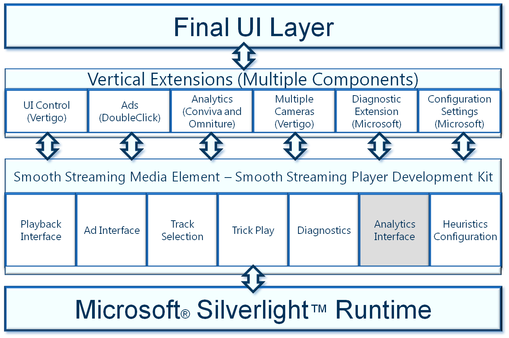

Sunday Night Football Extra: Live in HD with Microsoft Silverlight and IIS Smooth Streaming
====================
by Daniel Karuppiah, Jason Suess, Alex Zambelli

Shortly before the 2009 National Football League (NFL) season began, NBC, in partnership with the NFL, announced plans to offer live streaming of Sunday Night Football in the United States on NBCSports.com and NFL.com. This was nothing new—during the first two years of its coverage of Sunday Night Football, NBC offered a simultaneous webcast of each game through a video player built on the Adobe® Flash® Platform. However, the stream-switching capabilities of the HTTP Dynamic Streaming feature in the Platform couldn't dynamically adapt the video stream bitrate, meaning that viewers with lower bandwidth and/or slower processors experienced periods of video buffering, stuttering, and degraded picture quality.

For the 2009 season, NBC and the NFL improved the video quality and also offered something more in a new video player called Sunday Night Football Extra (Figure 1).  
  
**Figure 1. Sunday Night Football Extra video player, featuring DVR controls, five camera angles, social networking feeds, and interactive chats.**

The new player's features included the following:

- A live webcast of the NBC Sports broadcast of Sunday Night Football, with four additional camera angles and new interactive features.
- Full high-definition (HD) quality for viewers with high bandwidth/fast processors while still offering viewers with lower bandwidth/slower processors a good experience.
- Full DVR functionality, allowing users to pause and scroll back and forth, and even review plays in slow motion, all while watching live video. Beyond that, the video player let fans replay highlights from the game without rewinding the live stream.
- Live expert analysis, including fantasy tips, in-game chats, and breakdowns of each play.
- Live delivery of advertisements based on user behavior in order to monetize the programming.

This article describes the development of Sunday Night Football Extra, including the planning, tools, technology, and resources used to create the front-end, back-end, and everything in-between.

## Solution Overview

NBC took the lead on development, production, and management of the video player and partnered with the NFL to ensure that the experience was successful and cost-effective. The success of the project depended on a positive user experience and meeting increasing viewer demands for HD video without buffering delays and stutters. To be cost-effective, the solution had to be flexible to support easy modification and monetization. Many [partners](sunday-night-football-extra-live-in-hd-with-microsoft-silverlight-and-iis-smooth-streaming.md#partners) assisted with parts of the project, including the video player design, video encoding, content delivery, advertising, and analytics.

NBC chose to create this offering by using the [Microsoft Media Platform: Player Framework](https://go.microsoft.com/?linkid=9738808) and [IIS Live Smooth Streaming](https://go.microsoft.com/?linkid=9738819), an IIS Media Services extension for IIS 7 and above. Smooth Streaming technology enables adaptive streaming of media to Silverlight-based clients over HTTP. Smooth Streaming provides a high-quality viewing experience that scales massively on content distribution networks, making true HD 720p media experiences a reality.

Smooth Streaming is a hybrid media delivery method that acts like streaming but is based on HTTP progressive download rather than a traditional streaming protocol. The HTTP downloads are delivered as a series of small chunks, enabling the media to be easily and cost-effectively cached on the edge of a network, closer to clients. Providing multiple bitrates of the same media source also lets Silverlight-based Smooth Streaming clients seamlessly and dynamically switch to an optimal bitrate for current network conditions and client processing power. The result is a reliable, consistent playback experience with no stuttering, buffering, or "last mile" congestion.

## Server Technologies and Techniques

NBC worked closely with Microsoft business and technical leaders and with a number of independent network infrastructure, content distribution, and application development firms to create the complete Sunday Night Football Extra program. Creating an efficient workflow (as seen in Figure 2) was essential for seamlessly inserting incoming content, such as advertisements and the NFL's Game Statistic and Information System (GSIS) data, into the program in real-time.  
  
**Figure 2. Sunday Night Football Extra workflow.**

The basic steps of the live broadcast included the following:

- **Production**. Receiving and encoding the video.
- **Content acquisition**. Encoding video and GSIS feeds and inserting advertisements.
- **Content delivery**. Streaming video, audio, and related content.
- **Playback and analytics**. Providing a DVR–like experience for viewers and user statistics to NBC.

| Fast Facts |
| --- |
| Total number of football games | 17 |
| Average viewing time | 29 minutes |
| Amount of video streamed | Approximately 1 million hours |
| Total number of unique visitors | 2.2 million (over 17 games) |
| Total peak concurrent users | 38,500 |
| Video support | - One 720p HD main broadcast feed - Four 480p SD alternate camera angles |
| Tools and technologies | - IIS 7 - IIS Media Services 3.0 - Silverlight 3 - Microsoft Media Platform Video Editor - iStreamPlanet CMS |

The server-side portion of this offering was based on IIS Media Services, an integrated HTTP–based media delivery platform that delivers true HD (720p+) streaming and provides real-time logging to measure media investments.

### Production

iStreamPlanet delivered the full value of Smooth Streaming to the player through a process that captured the video feed and encoded it to multiple bitrates using Inlet encoders. For each bitrate, the encoders produced two-second chunks of video, with the chunks picture-aligned across bitrates so that players could switch between bitrates without loss of progressive playback when reconstructing the chunks. The chunks were passed from the encoders to a Web server running IIS 7.0 and IIS Media Services 3.0, which encapsulated the chunks into a fragmented-MP4 (fMP4) file. The Web server served the chunks to players when requested through Akamai's Content Delivery Network (CDN).

To keep the video feeds synchronized, four SD video feeds were timed to match with the main HD feed. To accomplish this, iStreamPlanet muxed (multiplexed) the SD feeds into a single ASI feed, uplinked the feed to to an AMC-6 satellite, and then downlinked the feed in Las Vegas. The feed was then demuxed (demultiplexed) back into the individual feeds, fed into Smooth Streaming-compatible encoders (in this case, 10 Inlet Spinnaker 7000 encoders), with the encoded output (31 streams) pushed to Microsoft edge-caching network (ECN) facilities in San Antonio and Virginia, which in turn distributed the content to Akamai's CDN in order to scale the webcast to viewers.

| Production Solution Facts |
| --- |
| Time frame | 3 months |
| Tools and technologies | - IIS 7 - IIS Media Services 3.0 - Microsoft Media Platform: Player Framework - Microsoft Media Platform Video Editor |
| Encoder | - 10 Inlet Spinnaker 7000 encoders - 2 operators to manage the encoders during production |
| Average number of viewers per game | 38,500 |
| GSIS timeline tool | - 4 developers - 60 days |
| Microsoft Media Platform Video Editor integration | 3 weeks |

### Ad and Video Clip Insertion

A Smooth Streaming client manifest contains rich metadata about the presentation and the Smooth Streaming Media Element (SSME) exposes parts of this metadata through a well-defined application programming interface (API) in an arrangement of streams and tracks within each stream. The SSME is at the core of Microsoft Media Platform: Player Framework (MMPPF), which enables developers to quickly deploy a robust, scalable, and customizable media player for rendering Smooth Streaming presentations.

For the Sunday Night Football Extra project, advertisements and game highlights were added to a sparse track at the point of Web server ingest. A 30-second delay was added in the delivery of the video streams, during which operators could deliver the ads and highlight clips via the sparse track before the streams moved to the CDN. Figure 3 illustrates this process and notes which partners and third parties were involved with specific aspects.  

**Figure 3. Inserting ads and game highlights into the webcast.**

### GSIS Timeline Incorporation

A key part of the Sunday Night Football Extra user experience is the timeline and highlights feature, which lets viewers see all of the game highlights, such as touchdowns, long passes, and fumbles, at any time during the game. The NFL collects this data, called Game Statistic and Information System (GSIS) data, live from the sideline at every game. Four iStreamPlanet developers created an application to receive and parse the GSIS XML data. To coordinate the game's video and audio feeds with the statistics and other data, iStreamPlanet used RESTful APIs to extract the manifest start time and then synchronize the video feed with play-by-play data.

### Highlight Clip Creation

Another requirement was for the Content Management System (CMS) to be integrated with the Microsoft Video Platform Video Editor (MMP Video Editor), which a production editor uses to create video clips of the game's highlights. The MMP Video Editor is a standalone component proxy- and metadata-editing solution. iStreamPlanet integrated the components by building the RESTful APIs that enable communication between the iStreamPlanet CMS and MMP Video Editor.

### Live Ad Insertion

A program's manifest file can also include an ad-insertion track, which contains information about live ads or ad pods—all tightly synchronized to the program's video and audio content. Much like the highlight clips and GSIS data, ads were dynamically inserted in the single manifest that also included the live-game video. As the operator viewed the game in-progress, he or she decided which ad pods to deliver at any given time. iStreamPlanet developed a tool by using an sparse track support in IIS Media Services to insert ad content to a specified track in the manifest.

### Content Ingestion

After iStreamPlanet encoded the video and related content, the output was pushed to a Microsoft edge-caching network (ECN), where the feeds were ingested, provisioned, and load-balanced. The origin servers ran the Windows Server® 2008 operating system with the Web server role (IIS 7.0) installed. [IIS Live Smooth Streaming](https://go.microsoft.com/?linkid=9738819) was installed to enable the Web server to deliver the Smooth Streaming media assets to clients.

### Content Delivery and Analytics

The beauty of Smooth Streaming is derived partly from its ability to scale because it's distributed across HTTP–based Web servers rather than using streaming-specific protocols. In the case of Sunday Night Football Extra, Akamai HD for Microsoft Silverlight Streaming provided the massive, geographically distributed HTTP network, which when combined with Smooth Streaming technologies, offered the scalability and efficiency necessary for this project.

NBC realized that the Sunday Night Football Extra program offered a great opportunity to gain a better understanding of Sunday Night Football fans and to serve targeted ads based on user behavior. California-based Conviva offered real-time audience measurement and inference services during the streamed sessions. By using Conviva's Pulse management console, NBC gained unprecedented insights into per-viewer video quality and experience, viewer engagement, content popularity trends, distribution resource performance, and operational diagnostics.

## Player Design and Development

The goals for the video player raised several design and development challenges, including:

- How to provide a good experience, regardless of the bandwidth and processing power of the user's computer.
- How to deliver five streams of video, audio, and text most efficiently without disrupting the user experience.
- How to deliver Game Statistic and Information System (GSIS) data without disrupting the overall user experience.
- How to take advantage of dynamic (live) ad-insertion opportunities.

NBC tapped California-based Vertigo, a user experience design and software development consulting firm, to build the Sunday Night Football Extra client application (as seen in Figure 1) based on Silverlight 3, the cross-browser, cross-platform, and cross-device browser plug-in. This section provides an overview of the tools and technologies that the player design and development team used to create the video player.

| Video Player Development Facts |
| --- |
| Developers | 4 |
| Designers | 2 |
| Testers | 2 |
| Time frame | 3 months |
| Developer tools | - Expression Blend 3 - MVVM architectural pattern - Microsoft Media Platform: Player Framework - IIS Smooth Streaming Client (formerly called the Smooth Streaming Platform Development Kit) - Visual Studio Team System with Visual Studio Team System 2008 Team Foundation Server |
| Lines of code | 16,000 (C#) |

### Features and Requirements

The video player had to include full DVR functionality to let the user pause and scroll back and forth—even review plays in slow motion—all while watching live video. Beyond that, the player had to let fans play game highlights without rewinding and searching.  
  
**Figure 4. Sunday Night Football Extra player controls.**

### Smooth Streaming Components

Vertigo used the IIS Smooth Streaming Player Development Kit (PDK) to build a rich Silverlight-based user experience that incorporates the many live Smooth Streaming capabilities. The PDK includes the following components:

- **Smooth Streaming PDK**. Enables developers and designers to build rich Smooth Streaming client experiences and includes a Microsoft .NET Framework–based PDK for Silverlight with full [XAML](https://go.microsoft.com/?linkid=9738818) support.
- **Push Encoder**. A tool that simulates a live encoded Smooth Streaming video feed for testing purposes, using prerecorded content and a computer running [IIS Media Services 3.0](https://go.microsoft.com/?linkid=9738809).
- **Sample Smooth Streaming Player**. A sample Silverlight-based media player based on the IIS Smooth Streaming PDK, which is used for testing Smooth Streaming functionality from a server running IIS Media Services 3.0.

> [!NOTE]
> The IIS Smooth Streaming PDK has been replaced by the [IIS Smooth Streaming Client](https://go.microsoft.com/?linkid=9738813).

The core of this infrastructure is the IIS Smooth Streaming Media Element (SSME), which is part of the broader, open-source [Microsoft Media Platform: Player Framework (MMPPF)](https://go.microsoft.com/?linkid=9738808). The SSME is at the core of MMPPF, which enables developers to quickly deploy a robust, scalable, and customizable media player for rendering Smooth Streaming content. The Smooth Streaming Media Element APIs in the PDK provided an easy interface for Vertigo designers and developers to quickly build the Smooth Streaming video player.

Microsoft Silverlight 3 introduced major media enhancements that benefited this development effort, including significant graphics improvements with perspective 3-D graphics support; GPU acceleration and H.264 video support; and many features to improve rich Internet application development productivity.

Silverlight, when combined with Smooth Streaming, delivers great video performance from both a content delivery and user point of view, including support for specific features such as:

- **Multiple camera angles**. To support seamless viewing of the five video feeds, Vertigo used an API to filter each stream so that the main screen was at full bitrate (3.5 Mbps) and the smaller screens were played at a low bitrate (50 Kbps, with no buffering).
- **Live ad insertion**. The video player included the following advertising support features: 

    - Video preroll ads, when a user first started the player.
    - Video midroll and companion ads, which were dynamically inserted into the player during the course of the game.
    - Sponsorship of game highlights and sideline interviews.
    - Banner ads during video playback.
- **Analytics**. The video player supported real-time audience measurement and inference services, provided by Conviva, during the streamed sessions. By using Conviva's Pulse management console, NBC gained unprecedented insights into per-viewer video quality and experience, viewer engagement, content popularity trends, distribution resource performance, and operational diagnostics.
- **Track selection**. The player allowed the viewer to choose which live video stream or highlight clip to view on the main screen.
- **User interface**. In addition to the APIs provided in the Smooth Streaming Media Element, Vertigo leveraged capabilities found in the Silverlight 3 web browser plug-in and Expression Blend 3. Without writing any code, designers quickly prototyped UI elements, adding interactivity, animation, and transitions through drag-and-drop behaviors in Silverlight. In addition, the team relied on support for XAML editing across Silverlight, Expression Blend, and Visual Studio to efficiently share information while iterating code and design elements of the application simultaneously.

### Development Environment and Design Pattern

The Vertigo team of four developers, two designers, and two testers created the player in just three months, working in the Visual Studio Team System development system with Microsoft Visual Studio Team System 2008 Team Foundation Server. The team employed the MVVM pattern of design and development, which provides a data model and behavior to the view but allows the view to declaratively bind to the view model. The view becomes a mix of XAML and C#, the model represents the data available to the application, and the view model prepares the model to bind it to the view.

Vertigo delivered a client experience that was stable, scalable, accessible, reliable, and secure. Figure 5 illustrates the architecture behind the video player and how the video player consumes content, including ads and video feeds.  
  
**Figure 5. Architecture showing how the video player applies a variety of content from multiple resources.**

## Resources

- [Delivering Live and On-Demand Smooth Streaming](https://go.microsoft.com/?linkid=9738804) (presented by iStreamPlanet)
- [IIS Media Services](https://go.microsoft.com/?linkid=9738800) (IIS.net)
- [IIS Smooth Streaming Client](https://go.microsoft.com/?linkid=9738813)
- [Microsoft Expression](https://go.microsoft.com/?linkid=9738811)
- [Microsoft Media Platform: Player Framework](https://go.microsoft.com/?linkid=9738808)
- [Microsoft Media Platform Video Editor](https://go.microsoft.com/?linkid=9738810)
- [NBC Streams Sunday Night Football in HD to Millions of Fans Through Interactive Player](https://go.microsoft.com/?linkid=9738803) (Microsoft Case Study)
- [Powering Smooth Streaming with Inlet Technologies](https://go.microsoft.com/?linkid=9738815)
- [Silverlight Ad Publishing and Serving Guide](https://go.microsoft.com/?linkid=9738807)
- [Silverlight Community](https://go.microsoft.com/?linkid=9738814)
- [Silverlight Developer Center](https://go.microsoft.com/?linkid=9738812)
- [Silverlight Media Framework Screencasts and Training Videos](https://go.microsoft.com/?linkid=9738802)
- [Silverlight Migration Guide](https://go.microsoft.com/?linkid=9738805)
- [Smooth Streaming Technical Overview](https://go.microsoft.com/?linkid=9738806)

## Appendix: Partners

Partners involved with the Sunday Night Football Extra program include:

- **Akamai** is the leading global service provider for accelerating content and business processes online. The company has created a digital operating environment for the web. Its global platform of thousands of specially equipped servers helps the Internet withstand the crush of daily requests for rich, dynamic, and interactive content, transactions, and applications. When delivering on these requests, Akamai detects and avoids Internet problem spots and vulnerabilities to ensure that websites perform optimally, media and software download flawlessly, and applications perform reliably.
- **Conviva** delivers the highest-quality video experience for both viewers and premium-content owners. Backed by Foundation Capital, NEA, and UV Ventures, Conviva's express purpose is to optimize the experience and economics of online video while providing content owners real-time insights.
- **DoubleClick** is a provider of digital marketing technology and services. The world's top marketers, publishers, and agencies take advantage of DoubleClick's expertise in ad serving, rich media, video, search, and affiliate marketing to help them make the most of the digital medium. From its position at the nerve center of digital marketing, DoubleClick provides superior insights and insider knowledge to its customers.
- **Inlet Technologies** is redefining the online video experience with innovative solutions for media preparation that combine striking video quality with surprising simplicity and reliability, enabling content owners to expand their audience and realize greater value from their content. Industry leaders such as Major League Baseball, Microsoft, Yahoo!, France Télévisions, and Home Shopping Network rely on Inlet for easy implementation, technical prowess, and enterprise scale for their mission-critical operations.
- **iStreamPlanet** has created a variety of managed and hosted services for getting content onto the web. Its nationwide footprint of webcast producers, each with many years of experience in producing the largest webcasts, makes the process of putting live events on the web painless. iStreamPlanet also has strategically located, specially equipped encoders and satellites and fiber-content acquisition facilities to reduce the costs of getting content to the web.
- **Omniture** is the leader in web analytics. The Omniture Online Marketing Suite is the leading solution to optimize ad spend and conversion. It includes a comprehensive portfolio of applications for visitor acquisition, conversion, online analytics, and multichannel analytics built on an open business analytics platform.
- **Vertigo** is a Microsoft Gold Certified Partner, providing design and development assistance by using the latest Microsoft technology to redefine the human and computer interface.
  
  
[Discuss in IIS Forums](https://forums.iis.net/1145.aspx)