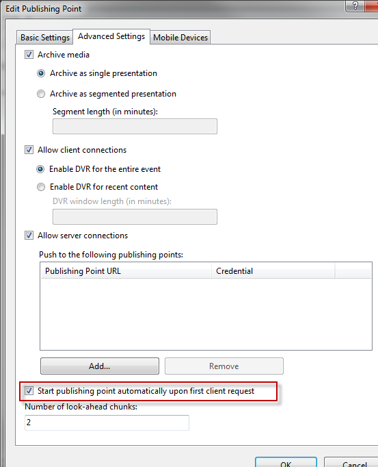
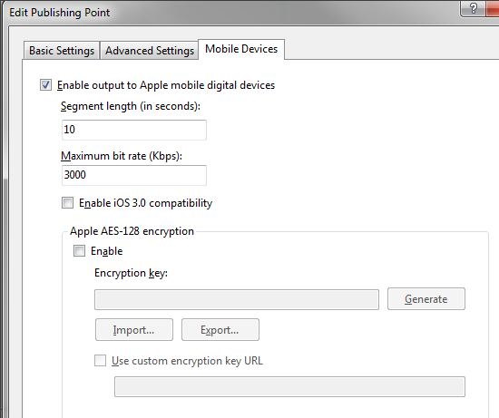
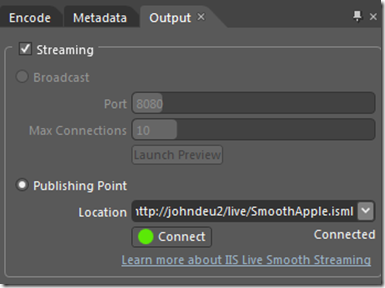
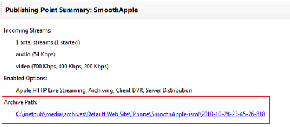
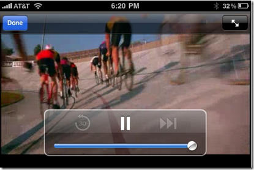

Apple HTTP Live Streaming with IIS Media Services
====================
by [John Deutscher](https://github.com/johndeu)

Applies To: [IIS Media Services 4](https://go.microsoft.com/?linkid=9734739)

[IIS Live Smooth Streaming](https://go.microsoft.com/?linkid=9733029) enables delivery of live Smooth Streaming presentations in multiple formats without re-encoding: Smooth Streaming format for Microsoft® Silverlight® clients and Apple HTTP Live Streaming format for Apple® "iDevices." This walkthrough shows you how to configure the IIS Live Smooth Streaming feature to enable Apple HTTP Live Streaming.

### Introduction

In IIS Media Services 4, you can configure IIS Live Smooth Streaming to "transmux" the incoming Smooth Streaming fragmented-MP4 fragments into MPEG-2 Transport Stream (MPEG-2 TS) segments and generate an Apple HTTP Live Streaming manifest file (a file with an .m3u8 file name extension) that describes the segments for Apple mobile digital devices.

This feature provides a highly efficient method to encode "just once" from your favorite Live Smooth Streaming encoder and deliver to multiple screens without duplicating required bandwidth, segmenting into hundreds of small transport stream files, or managing all of the tiny .ts files in your content management system. IIS Live Smooth Streaming converts incoming fragmented-MP4 streams that contain H.264 (AVC) video and AAC audio into one .ts file per stream in the server archive and then chunks the file on-demand when an Apple device requests it. This simplifies archive management, file movement, and asset management downstream.

You get the added benefit that the MPEG-2 TS files can be played in their entirety using common video players and video production tools without having to re-stitch thousands of files together. Additionally, the .ts files can be moved from the server archive into an on-demand IIS Smooth Streaming presentation folder. The Smooth Streaming handler recognizes the files and streams them as a standard Smooth Streaming on-demand presentation.

IIS Live Smooth Streaming in IIS Media Services 4 supports the following features for Apple HTTP Live Streaming:

- DVR "sliding window"
- Segmented archives
- B-frames
- High-Efficiency Advanced Audio Coding (HE-AAC) for streaming audio
- Improved live to video on-demand workflow. The MPEG-2 TS files and playlists are now stored in the same folder as Smooth Streaming-formatted content.
- iOS 3.0 compatibility. Play on Apple devices that run on the legacy iOS 3.0 mobile operating system and require .ts and .m3u8 extensions in their URLs.
- AES-128 encryption

### Requirements

To stream content to an Apple® mobile digital device, you must have access to a Live Smooth Streaming-capable encoder that supports encoding content using the H.264 video with AAC low complexity (AAC-LC) audio codecs. This walkthrough demonstrates the Apple HTTP Live Streaming feature using [Microsoft® Expression® Encoder 4 Pro](https://go.microsoft.com/?linkid=9733031), which supports Live Smooth Streaming, H.264, and AAC-LC.

> [!NOTE]
> The full version of Expression Encoder 4 Pro must be used to encode to Smooth Streaming format with H.264/AAC-LC codecs. If you purchased Expression Studio 3 from a store, and it's installed on your computer, you can download a trial version of Expression Studio 4 Ultimate or Expression Studio 4 Web Professional, and the full version of Expression Studio 4 (which includes Expression Encoder 4 Pro) will automatically be enabled.

**Supported encoding profiles**

The following video and audio formats are supported by the Apple HTTP Live Streaming feature in IIS Live Smooth Streaming:

- **Video**. H.264 Baseline Profile Level 3.0 (iPhone®/iPod®/iPod touch®), Main Profile Level 3.1 (iPad®)
- **Audio**. AAC-LC up to 48 kHz, stereo audio.

For more information about the supported encoding profiles for Apple mobile digital devices, see [Recommended Encoding Settings for HTTP Live Streaming Media](https://go.microsoft.com/?linkid=9733033) on the Apple Developer website.

**Supported Apple devices**

The following Apple mobile digital devices/iOS mobile operating systems are currently supported by the Apple HTTP Live Streaming feature:

- iPhone, iPod touch: iOS 3.0, iOS 3.0.1, iOS 3.1, iOS 3.1.2, iOS 3.1.3, iOS 4.0, iOS 4.1, iOS 5.0
- iPad: iOS 3.2, iOS 4.2.1, iOS 5.0

**Notes**

- The Apple HTTP Live Streaming feature can't transmux a video-only stream. The encoded live stream received by the publishing point must contain both audio and video.
- Apple recommends that you not use B-frames when targeting iPhone and iPod devices.
- While the iPhone 3GS or later can play content that is at a level higher than Baseline 3.0, it's not recommended if you plan to target older iPhone devices and iPod touch devices.
- It's not recommended to use AAC-LC audio at bitrates higher than 64 Kbps when targeting iPhone/iPod devices.

### Installation

To enable the Apple HTTP Live Streaming feature, remove any previous installations of IIS Media Services and then [install IIS Media Services 4](https://go.microsoft.com/?linkid=9733030).

### Configuring the Live Smooth Streaming publishing point

To configure your first Live Smooth Streaming publishing point, do the following:

1. Start IIS Manager (click **Start** &gt; **Administrative Tools** &gt; **Internet Information Services (IIS) Manager**).
2. In **Default Web Site**, select an existing folder or create a new virtual directory that will host the publishing point.
3. Double-click the **Live Smooth Streaming Publishing Points** icon to open the feature page.  
    
4. In the **Actions** pane, click **Add**.  
    
5. In the **Add Publishing Point** dialog box, on the **Basic Settings** tab, in **File name**, enter a name for the Live Smooth Streaming publishing point definition file (.isml).  
      
 In this example and throughout the rest of this article, we'll use a publishing point definition file named **SmoothApple**. If you specify a different file name, be sure to substitute it appropriately as you follow the steps in this article.
6. Use the default values for the rest of the fields on this tab. To learn more about the rest of the options that you can configure in the dialog box, see [IIS Media Services Help](https://go.microsoft.com/?linkid=9733032).
7. On the **Advanced Settings** tab, select the **Start publishing point automatically upon first client request** check box. This option allows Expression Encoder 4 to connect to the publishing point when the broadcast starts. Connection errors might occur if you don't select this option.  
    
8. On the **Mobile Devices** tab, select **Enable output to Apple mobile digital devices**. This setting enables the publishing point to transmux incoming Smooth Streaming fragments to MPEG-2 TS files on the server.  
    
9. Set **Segment length** to **10** seconds. This sets the size of the MPEG-2 TS "chunks" that are delivered to the device. Lowering this value will decrease the amount of buffering latency on the client. The Apple-recommended setting is **10** seconds and you shouldn't set this lower than **2** seconds.
10. Set the **Maximum bit rate** to the value of the highest bitrate stream for which you want to enable MPEG-2 TS conversion. The maximum recommended bitrate for delivery to Apple iPhone® and Apple iPad® is 1600 kilobits per second (Kbps). Lowering this value reduces the number of streams that are transmuxed to MPEG-2 TS. Raising it allows more streams to be converted. For example, you might have the following typical spectrum of bitrates targeting Smooth Streaming clients: 200 Kbps, 400 Kbps, 800 Kbps, 1,600 Kbps, 3200 Kbps, and 4000 Kbps. To filter out the top two bandwidths (3200 Kbps and 4000 Kbps), which aren't supported by the iPhone, you would set **Maximum bit rate (Kbps)** to **1600**. This prevents the two highest bitrates from being transmuxed on the server. 

    > **Important** In IIS Media Services 4.0, the default value was set to **3000** Kbps to account for a known issue in Microsoft Expression Encoder 4 where the audio bitrate wasn't reported correctly. Lowering this value to **1600** Kbps removed all video tracks, leaving an audio-only stream.  
    >   
    > This issue is fixed in [Expression Encoder 4 with Service Pack 1](https://go.microsoft.com/?linkid=9734740). If you're using this version of Expression Encoder to encode live Smooth Streams, lower the **Maximum bit rate** value to **1600** Kbps to filter the bitrates correctly.
11. Click **OK** to create the publishing point.
12. In the **Live Smooth Streaming Publishing Points** page, select the **SmoothApple** publishing point, and then in the **Actions** pane, click **Start Publishing Point**.  
    

The new Live Smooth Streaming publishing point file, named **SmoothApple.isml**, is added to the website. The publishing point is now started and ready to accept a live stream pushed to it from a Live Smooth Streaming encoder.  
  
See the next section, which describes how to configure Expression Encoder 4 to accomplish that task.

### Configuring a Live Smooth Streaming broadcast using Expression Encoder 4

This section describes how to use the Live Smooth Streaming feature in Expression Encoder 4 to encode Smooth Streaming content and deliver it to the Live Smooth Streaming publishing point.

To begin broadcasting from Expression Encoder 4, do the following:

1. Start Expression Encoder (click **Start** &gt; **All Programs** &gt; **Microsoft Expression** &gt; **Microsoft Expression Encoder 4**).
2. In the **Load a new project** dialog box, select **Live Broadcasting Project**, and then click **OK**.  
    
3. In this walkthrough, we'll set up a looping video file to simulate a live source. To do this, do the following:  

    1. On the **Preview** tab, click **Add a File Source**...  
          
 ...and then select a video file in the **Add File Source** dialog box.
    2. On the **File Sources** tab, select the video file that you added in the previous step...  
        
    3. ...and then, in the **Play then** dropdown list, select **Loop** to keep the file looping continuously.  
        

    > [!NOTE]
    > If you attached a camera or capture card to the encoding computer, you can add a live source from the **Preview** tab, and then use the **Live Sources** tab to set up a live capture device, rather than using a file source. For more information, see [Set Live Sources](https://go.microsoft.com/?linkid=9749758).
4. On the **Presets** tab, choose an encoding preset that supports the bitrates and encoding requirements for the Apple HTTP Live Streaming feature and for our target Apple mobile digital devices. In this example, we're going to broadcast to iPhone/iPod-class devices over a WiFi network, so we select the **H.264 IIS Smooth Streaming iPhone WiFi** preset, and then click **Apply**.  
      

    Expression Encoder 4 comes with presets for iPhone and iPad for both cellular and WiFi networks. The **H.264 IIS Smooth Streaming iPhone WiFi** preset uses the Apple-recommended settings for delivering content to an iPhone device over a WiFi network. The profile uses H.264 Baseline, Level 3.0 at 3 different bitrates: 700 Kbps, 400 Kbps, and 200 Kbps. It's a 1-pass CBR encode with no B-frames.  
  
> [!NOTE]
> Apple recommends that you not use B-frames when targeting iPhone and iPod devices. While the iPhone 3GS or later can play content that is at a level higher than Baseline 3.0, it's not recommended if you plan to target older iPhone devices and iPod touch® devices. If you use B-frames in your encoding, your streams will load, but then might suddenly stop playing on iPhone or iPod devices. Also note that it's not recommended to use AAC-LC audio at bitrates higher than 64 Kbps when targeting iPhone/iPod devices.  
  
The following video and audio formats are supported by the Live Smooth Streaming MPEG-2 TS transmux feature:

    - Video: H.264 Baseline Profile Level 3.0 (iPhone/iPod touch), Main Profile Level 3.1 (iPad)
    - Audio: AAC-LC up to 48 kHz, stereo audio.

    For more information about the supported encoding profiles for iPhone, iPod, and iPad mobile digital devices, see [Recommended Encoding Settings for HTTP Live Streaming Media](https://go.microsoft.com/?linkid=9733033) on the Apple Developer website.
5. On the **Output** tab, select the **Streaming** check box, and then in **Location**, enter the URL of the publishing point that you created in the previous section. Click **Connect** to establish the connection with the publishing point.  
    
6. Return to the **File Sources** tab and click **Cue** for your asset to enable it for broadcasting.  
    
7. Click **Start** to begin broadcasting.  
    

> [!NOTE]
> The following message is displayed if the publishing point isn't started. Return to the **Live Smooth Streaming Publishing Points** page in IIS Manager and make sure that the publishing point is started.  
> 

### Verifying the Live Smooth Streaming publishing point

To verify that the Live Smooth Streaming publishing point is up and running properly, return to IIS Manager and do the following:

1. To verify that the Live Smooth Streaming publishing point is started, open the **Live Smooth Streaming Publishing Points** page for the website or virtual directory that you created earlier and then press F5 on your keyboard to refresh the user interface. The **State** for **SmoothApple.isml** should be set to **Started**, and **Archive**, **Client DVR**, and **Server Distribution** should also be **Started**.  
    
2. Click the row for the publishing point to display the **Publishing Point Summary** panel. This area provides information about the incoming streams, enabled options, and archive path for the selected publishing point. Note that the Apple HTTP Live Streaming option is enabled, and that a stream is started with audio and multiple-bitrate video tracks.  
    
3. In the **Actions** pane, click **Details**.  
      
 The **Publishing Point Details** page displays even more information about the individual incoming streams. Here you can inspect the incoming bitrates, stream names, states of the individual streams, and so on. This page updates the information every two seconds.  
    
4. To verify that an archive is being created for the MPEG-2 TS files, in Windows Explorer, navigate to the IIS Media Services archives folder, which is set by default to `%SystemDrive%\inetpub\media\archives`. Or click the **Archive Path** shortcut link on the **Publishing Point Summary** panel for the publishing point.  
    
5. In the archives folder, you should see a folder for the Default Web Site. This folder contains a folder for the virtual directory that we created earlier (in our example, this is the "Live" folder). Inside this folder is a folder that uses the same name as the publishing point (in our example, the folder is named "SmoothApple-isml"). This folder contains multiple folders if you've started and stopped the encoder several times for the publishing point. Each folder is identified with a date and timestamp. If we open the most recent folder, we find a series of numbered Segment folders (depending on the duration of your archive segment) that contain both the Smooth Streaming format files (.ismv, .isma, .ism, .ismc) and the Apple HTTP Live Streaming format files (.m3u8, and .ts).  
  
 In our example, an MPEG-2 TS file (with a .ts file name extension) is created for each of the streams that are generated by the encoder. If you don't see these files, or if they have 0 KB sizes (some of the manifest files will show as 0 KB until the publishing point is stopped), it's likely that the encoder profile is incorrect or isn't set to use H.264 video and AAC-LC audio. Check the Application Event Log in Event Viewer for errors that might have occurred during the transmux. In addition to the MPEG-2 TS files, you'll find the .m3u8 playlist files for each stream, and a root .m3u8 file that identifies the full adaptive playlist. You'll also notice two other files that might be unfamiliar to you if you're familiar with the Apple Live HTTP specification. The .ismx and the "-m3u8-aapl.ism" files are used by the on-demand Smooth Streaming feature to serve the content in an on-demand mode. The .ismx file is an index of the MPEG-2 TS files, and the .ism file is a standard Smooth Streaming SMIL 2.0-compliant server manifest that is used by the on-demand Smooth Streaming module.  
    
6. If you're running IIS on the Windows® 7 operating system, or on the Windows Server 2008 operating system with the Desktop Experience role service installed, you can double-click the MPEG-2 TS video files to play them in Windows Media® Player to check that they are valid.  
  
 The MPEG-2 TS files on IIS aren't stored in multiple segments on disk like other solutions for Apple HTTP Live Streaming. IIS Media Services dynamically serves the segments on request and leaves the full MPEG-2 TS files available to make asset management and post-production easier.

We have now validated that the live Smooth Streams encoded by Expression Encoder are being transmuxed to Apple HTTP Live Streaming format successfully.

### Creating an HTML 5 page for use in Safari

You can create an HTML 5 page that can be used by iPhone and iPad devices to play the Live Smooth Streaming presentation. To create an HTML 5 page, do the following:

1. In Windows Explorer, navigate to a folder for your website. You can use any website folder, create a new one, or use the same one where the Live Smooth Streaming publishing point was created. In our example, we'll use the same "Live" folder in which we created the SmoothApple.isml publishing point.
2. Right-click in the folder and create a new text document. In this example, we'll rename the document to **iphone.htm**. Make sure that the .txt file name extension is removed.  
    
3. Open the **iphone.htm** file in Notepad or your favorite text editor and add the following sample HTML:

[!code-html[Main](apple-http-live-streaming-with-iis-media-services/samples/sample1.html)]
  
    **video**    *publishingPointName*
The important tag here is the HTML 5tag. A new manifest request URL is also required to get access to the .m3u8 file from the IIS Media server. This new URL is in the format:.isml/Manifest(format=m3u8-aapl).m3u8. The important part is the section in the parenthesis and the final .m3u8 extension, which specifies that the format of the manifest that we want is in m3u8. The extension at the end is required by iOS on certain devices. You can sometimes leave this extension off if you're serving directly from IIS Origin, but if you're serving from a CDN or edge cache, it's required for the Quicktime player in iOS to function properly. You can, optionally, add other HTML 5 video tags that support attributes such as autoplay, controls, and a poster frame. Note that the released version of the iPad device requires a few of these video tag attributes to be set or the video tag doesn't work properly.4. On an Apple device, open the Safari® Web browser and enter the URL of the iphone.htm page in the browser, and then click **GO**. The page will load with the default HTML 5 video tag, which has a simple **Play** button on it.  
    
5. Click the **Play** button on the HTML 5 video element. The device will open the QuickTime® player and begin loading the Live Smooth Stream.  
    
6. Wait a few seconds for the video to start...  

    Playback as seen on the iPhone/iPod:  
    

    Playback as seen on the iPad:  
    

If the video plays smoothly, you've successfully enabled Apple HTTP Live Streaming using the IIS Live Smooth Streaming feature in IIS Media Services 4.

> [!NOTE]
> If the device displays a message box that says "Can't open Movie," it's likely that you're using a profile that is of a higher level than is supported by that device. Typically this error message is seen when sending a Baseline Level 3.1 profile or Main Level 3.1 to a device that only supports Baseline Level 3.0 (older iPhone devices and iPod touch devices). You might also see the error message if you try to play the stream when there are fewer than 3 segments available in the playlist. This can happen if you don't wait for 3 times the segment length; for example, 30 seconds when the default segment length is set to 10 seconds.

### About the Microsoft Media Platform: Player Framework

You can use [Microsoft's open source media player framework (MMPPF)](https://go.microsoft.com/?linkid=9733035) to quickly deploy a robust, scalable, customizable media player for IIS Smooth Streaming delivery. Deploy the media player to the same website and point it to the same Live Smooth Streaming publishing point to enable playback to Silverlight clients on computers running Windows, Macintosh®, and Linux operating systems. IIS Media Services 4 can deliver media to more screens from a single set of live streams than other solutions available on the market today.  
  
The MMPPF builds on the core functionality of the [IIS Smooth Streaming Client](https://go.microsoft.com/?linkid=9733034).