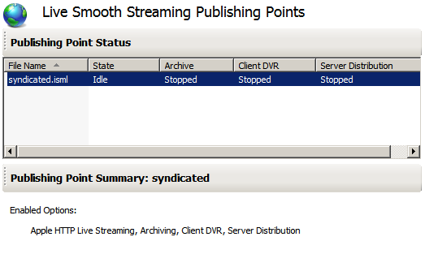
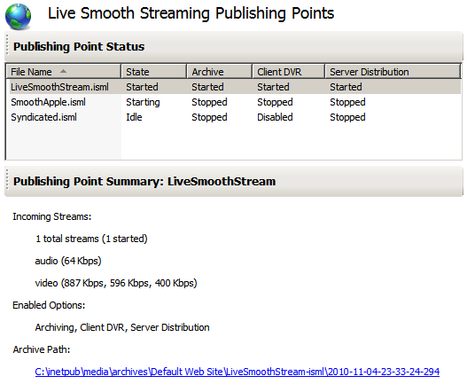
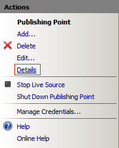
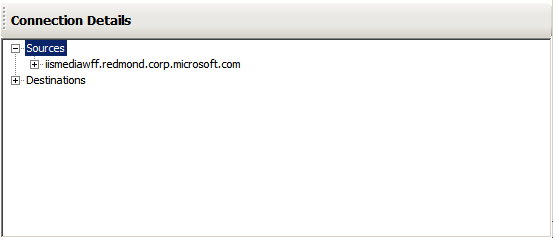
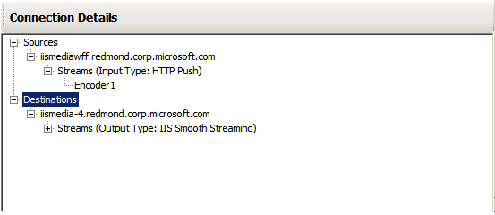

Creating and Managing Live Smooth Streaming Publishing Points
====================
by Dave Nelson

Applies To: IIS Media Services 4

When you create Live Smooth Streaming publishing points in IIS Manager, you can choose from different options to support the following live media delivery scenarios (multiple scenarios can apply):

- Deliver a live presentation to users
- Deliver a live presentation to other Web servers
- Deliver a live presentation from another Web server
- Automatically publish a live presentation to other Web servers
- Archive a live presentation

This walkthrough contains the following topics that describe how to create publishing points and configure them for each of these scenarios:

- [Requirements](creating-and-managing-live-smooth-streaming-publishing-points.md#requirements)
- [Creating a Publishing Point](creating-and-managing-live-smooth-streaming-publishing-points.md#create)
- [About Publishing Point Options](creating-and-managing-live-smooth-streaming-publishing-points.md#options)
- [Live Smooth Streaming Scenarios](creating-and-managing-live-smooth-streaming-publishing-points.md#scenarios)
- [About Publishing Point States](creating-and-managing-live-smooth-streaming-publishing-points.md#lifetime)
- [Viewing Publishing Point Status](creating-and-managing-live-smooth-streaming-publishing-points.md#status)
- [Viewing Publishing Point Details](creating-and-managing-live-smooth-streaming-publishing-points.md#details)

> [!NOTE]
> The latest release of IIS Media Services (IIS Media Services 4.1) supports programmatic management of Live Smooth Streaming Publishing Points by using Representational State Transfer (REST) APIs. You can use the REST APIs to create or delete publishing points; enumerate the publishing points on a website; query the setting, state, or statistics of publishing points; or update the state of publishing points in IIS Media Services 4.1. For more information, see [IIS Smooth Streaming Management REST Services](https://go.microsoft.com/?linkid=9787749).

## Requirements

This walkthrough requires that you install the the IIS Live Smooth Streaming extension in IIS Media Services 4 on a Web server running [Internet Information Services (IIS) 7](https://go.microsoft.com/?linkid=9738612). For more information about how to set up this configuration, see [Getting Started with IIS Live Smooth Streaming](getting-started-with-iis-live-smooth-streaming.md).

## Creating a Publishing Point

To create a Live Smooth Streaming publishing point in IIS Manager, do the following:

1. In the **Connections** pane, select a website or virtual directory.
2. On the **Home** page, under **Media Services**, double-click **Live Smooth Streaming Publishing Points**.  
  
    
3. In the **Actions** pane, click **Add** to open the **Add Publishing Point** dialog box.  
    

For details about the **Add Publishing Point** dialog box options, see [About Publishing Point Options](creating-and-managing-live-smooth-streaming-publishing-points.md#options). The combination of publishing point options that you can select differ for each Live Smooth Streaming scenario.

> [!NOTE]
> If the application pool for Live Smooth Streaming is configured to use worker process recycling, the following alert might be displayed above the **Actions** pane when you open the feature:  
>   
>   
> Live Smooth Streaming requires that worker process recycling be disabled to ensure uninterrupted playback of a live presentation. If other applications that run in the same application pool require worker process recycling to function well, you should create a separate application pool for the website or virtual directory for use with Live Smooth Streaming before creating a publishing point.
> 
> To disable worker process recycling for the current application pool, click the alert text and then click **OK** in the following message:  
> 

## About Publishing Point Options

The configuration of publishing point options depends on the Live Smooth Streaming scenario that you want to implement. This section describes the options that are available in the **Add Publishing Points** dialog box. The [Live Smooth Streaming Scenarios](creating-and-managing-live-smooth-streaming-publishing-points.md#scenarios) section describes which options to choose for specific scenarios.

The **Add Publishing Point Dialog Box** has three tabs: **Basic Settings**, **Advanced Settings**, and **Mobile Devices**. For detailed information about publishing point settings, see [Add/Edit Publishing Point Dialog Box](https://go.microsoft.com/?linkid=9750564).

- [About Basic Settings](creating-and-managing-live-smooth-streaming-publishing-points.md#basic)
- [About Advanced Settings](creating-and-managing-live-smooth-streaming-publishing-points.md#advanced)
- [About Mobile Devices](creating-and-managing-live-smooth-streaming-publishing-points.md#mobile)

#### About Basic Settings

The settings on this tab are used to specify general publishing point settings, such as the name of the file that stores the publishing point settings and how it's configured to receive live streams.

- **File name**. The name of the publishing point.
- **Title**. The display name of the publishing point.
- **Estimated duration**. The estimated duration of the event, in *hours*:*minutes*:*seconds*. If the duration of the live stream is known, entering the value allows a client to scale its **Seek** bar to the content length.
- **Live source type**. The source of the live stream. A **Push** source (typically an encoder) posts the encoded live stream data to the Web server. The Web server gets the encoded live stream data by requesting it from a **Pull** source (typically, another Live Smooth Streaming publishing point).

    - **Publishing Point URL**. The primary and failover URLs and corresponding credentials, if any, for a **Pull** source.
    - **Add**. Add a pull publishing point URL.
    - **Remove**. Remove the selected pull publishing point URL.

> [!NOTE]
> The pull **Publishing Point URL**, **Add**, and **Remove** controls are only visible when **Live source type** is set to **Pull**.

#### About Advanced Settings

The settings on this tab are used to specify one or more roles that the publishing point performs: archiving, user publishing, or server syndication. A publishing point can perform any combination of these roles.

- **Archive media**. Enables archiving of live streams to on-demand Smooth Streaming presentations.

    - **Archive as single presentation**. Configures the server to create a single on-demand Smooth Streaming presentation from the live presentation archive.
    - **Archive as segmented presentation**. Configures the server to create a set of on-demand Smooth Streaming presentations, or segments, from the live presentation archive. The length of each segment, in minutes, is specified in the **Segment length** box.
- **Allow client connections**. Enables user publishing.

    - **Enable DVR for the entire event**. Enables DVR functionality (fast-forward, rewind, and seek) for users to access any part of the live stream that has been published.
    - **Enable DVR for recent content**. Enables DVR functionality for users to access only a part of the live stream that has been published. The portion of the published live stream, in minutes, that is made available for DVR is specified in the **DVR window length** box.
- **Allow server connections**. Enables syndication. For more information about how to configure Live Smooth Streaming server-to-server syndication, see [Syndicating Live Smooth Streams between Servers](syndicating-live-smooth-streams-between-servers.md). 

    - **Publishing Point URL**. The set of publishing point URLs to which the server will post any incoming content automatically. This data appears as a push source to the servers with publishing points in the list.
    - **Add**. Add a push publishing point URL.
    - **Remove**. Remove the selected push publishing point URL.  

        > [!NOTE]
        > The push **Publishing Point URL**, **Add**, and **Remove** controls are only visible when **Live source type** is set to **Push** on the **Basic Settings** tab.
- **Start publishing point automatically upon first client request**. A setting for cache servers that conserves resources when no clients are connected. If you select this option, the publishing point will start automatically when it receives a request. The request can be an HTTP GET request for live streams from a client or from a publishing point on another Live Smooth Streaming server. It can also be an HTTP POST request with live streams from an encoder or from a publishing point on another Live Smooth Streaming server.
- **Number of lookahead fragments**.The number of fragments that will be buffered by the server. Clients use the information about the buffered fragments, which is stored in the current response, to optimize requests for the subsequent buffered fragments in a stream. This enables smoother playback of video.

#### About Mobile Devices

The settings on this tab are used to configure the delivery of Live Smooth Streams to Apple® mobile digital devices. For more information about how to configure Live Smooth Streaming publishing points to serve live broadcasts to Apple devices, see [Apple HTTP Live Streaming with IIS Media Services](apple-http-live-streaming-with-iis-media-services.md).

## Live Smooth Streaming Scenarios

When you create a Live Smooth Streaming publishing point in IIS Manager, you can choose from different options to support the following live media delivery scenarios (multiple scenarios can apply):

- [Deliver a Live Presentation to Users](creating-and-managing-live-smooth-streaming-publishing-points.md#clients)
- [Deliver a Live Presentation to other Web Servers](creating-and-managing-live-smooth-streaming-publishing-points.md#syndicate)
- [Deliver a Live Presentation from another Web Server](creating-and-managing-live-smooth-streaming-publishing-points.md#pull)
- [Automatically Syndicate a Live Presentation to other Web Servers](creating-and-managing-live-smooth-streaming-publishing-points.md#automatic)
- [Archive a Live Presentation](creating-and-managing-live-smooth-streaming-publishing-points.md#long)

### Deliver a Live Presentation to Users

If the purpose of your publishing point is to deliver a live presentation directly to users, select or specify values for the following options in the **Add Publishing Point** dialog box:

- **File name**
- **Title** (optional)
- **Estimated duration** (optional)
- **Live source type**. Select **Push** unless delivering a presentation from another server.
- **Allow client connections**. Enable DVR functionality for the live broadcast if required. For more information, see [About Advanced Settings](creating-and-managing-live-smooth-streaming-publishing-points.md#advanced).
- **Enable output to Apple mobile digital devices**. If your audience will use an Apple mobile digital device, such as an iPhone® or iPad® device, select this option and then see [Apple HTTP Live Streaming with IIS Media Services](apple-http-live-streaming-with-iis-media-services.md) for more information about how configure Apple HTTP Live Streaming in the IIS Live Smooth Streaming feature.

### Deliver a Live Presentation to other Web Servers

If the purpose of your publishing point is to deliver a live presentation to another Web server, select or specify values for the following options in the **Add Publishing Point** dialog box:

- **File name**
- **Title** (optional)
- **Estimated duration** (optional)
- **Live source type**. Select **Push** unless delivering a presentation from another server.
- **Allow server connections**. Select this option, and then specify the URLs of the downstream publishing points to which this publishing point will push the live presentation.

> [!NOTE]
> A publishing point that delivers content to publishing points on other servers is often called an *upstream publishing point* (the server is closer to the encoder in the delivery chain) while the publishing points that receive the distributed content are called *downstream publishing points* (the servers are closer to the client in the delivery chain).

### Deliver a Live Presentation from another Web Server

If the purpose of your publishing point is to syndicate a live presentation provided by another Web server and deliver it directly to users, select or specify values for the following options in the **Add Publishing Point** dialog box:

- **File name**
- **Title**
- **Estimated duration**. Leave the default value: **00:00:00**.
- **Live source type**. Select **Pull**. See [Specifying Pull Source URLs](creating-and-managing-live-smooth-streaming-publishing-points.md#pull) (below) for more information about how to configure this live source type.
- **Allow client connections**. Enable DVR functionality for the live broadcast if required. For more information, see [About Advanced Settings](creating-and-managing-live-smooth-streaming-publishing-points.md#advanced).

#### Specifying Pull Source URLs

When you select the **Live source type** option **Pull** on the **Basic Settings** tab in the **Add Publishing Point** dialog box, additional controls are displayed for configuring a pull source URL (the URL of the Web server from which this server requests content).

To specify a pull source URL, do the following:

1. Click **Add**.  
    
2. In the **Add Publishing Point URL** dialog box, in **URL**, enter the URL of the publishing point on the syndicating Web server from which to obtain the content.  
      
  
    > [!NOTE]
    > If the publishing point on the syndicating Web server (the upstream publishing point) requires that this publishing point (the downstream publishing point) provide credentials to access the content, select the credential with the appropriate user name and password in the     **Credential** dropdown list. For more information about creating and applying credentials, see     [Syndicating Live Smooth Streams between Servers](syndicating-live-smooth-streams-between-servers.md) . This example shows that credentials aren't required (    **Credential** =     **(None)** ).
3. Click **OK**. The pull source URL is added to the list of pull source publishing points.  
    
4. Click **OK**. The syndicating publishing point is added to the **Live Smooth Streaming Publishing Points** feature page.  
    

### Automatically Syndicate a Live Presentation to other Web Servers

This scenario is applicable when used in the context of one of the following scenarios:

- [Deliver a Live Presentation to Users](creating-and-managing-live-smooth-streaming-publishing-points.md#clients)
- [Deliver a Live Presentation to other Web Servers](creating-and-managing-live-smooth-streaming-publishing-points.md#syndicate)

To automatically syndicate to other servers, do the following:

1. On the **Basic Settings** tab, set **Live source type** to **Push**.
2. On the **Advanced Settings** tab, click **Add**.  
    
3. In the **Add Publishing Point URL** dialog box, in **URL**, enter the URL of the publishing point to which to automatically syndicate the content. Content coming from this server will appear as a push source to the specified publishing point.  
      
  
    > [!NOTE]
    > If the publishing point on the syndicating Web server (the downstream publishing point) requires that this publishing point (the upstream publishing point) provide credentials to deliver the content, select the credential with the appropriate user name and password in the     **Credential** dropdown list. For more information about creating and applying credentials, see     [Syndicating Live Smooth Streams between Servers](syndicating-live-smooth-streams-between-servers.md) . This example shows that credentials aren't required (    **Credential** =     **(None)** ).

### Archive a Live Presentation

This scenario is applicable when used in the context of one the following scenarios:

- [Deliver a Live Presentation to Users](creating-and-managing-live-smooth-streaming-publishing-points.md#clients)
- [Deliver a Live Presentation to other Web Servers](creating-and-managing-live-smooth-streaming-publishing-points.md#syndicate)

To archive a live presentation, do the following:

1. On the **Advanced Settings** tab, select the **Archive media** checkbox.  
      
  
 Select one of the following archiving options for the live broadcast:

    - **Archive as single presentation**. Configures the server to create a single on-demand Smooth Streaming presentation from the live presentation archive.
    - **Archive as segmented presentation**. Configures the server to create a set of on-demand Smooth Streaming presentations ("segments") from the live presentation archive. If you choose this option, specify the length of each segment, in minutes, in the **Segment length** box.

## About Publishing Point States

Every publishing point is shutdown when it's created and progresses through the following states during its lifetime before returning to the shutdown state:

- **[Shutdown](creating-and-managing-live-smooth-streaming-publishing-points.md#shutdown)**. The publishing point can't receive or serve data.
- **[Starting](creating-and-managing-live-smooth-streaming-publishing-points.md#starting)**. The publishing point is ready to start receiving data.
- **[Live](creating-and-managing-live-smooth-streaming-publishing-points.md#live)**. The publishing point is sourcing and delivering a live stream.
- **[DVR-only](creating-and-managing-live-smooth-streaming-publishing-points.md#dvr)**. The publishing point isn't receiving live data, but continues to serve DVR requests.
- **[Shutdown](creating-and-managing-live-smooth-streaming-publishing-points.md#shutdown)**. The publishing point is ready to repeat the cycle.

This section provides more information about the publishing point states, their allowed transitions, and how those transitions are effected. Note that some transitions occur due to external events, such as the acquisition or loss of an encoder connection.

### Shutdown

The publishing point can't receive data from an encoder. To start it, select the publishing point in the **Live Smooth Streaming Publishing Points** page, and then click the **Start Publishing Point** link in the **Actions** pane:  

The publishing point transitions to the **Starting** state.

### Starting

The publishing point is ready to receive content from an encoder. When an encoder connects to the publishing point, it automatically transitions to the **Live** state.

> [!NOTE]
> You can effect a transition to the **DVR-only** or **Shutdown** states by clicking the **Stop Live Source** or **Shut Down Publishing Point** links, respectively, in the **Actions** pane.  
> 

### Live

The publishing point is receiving and archiving content, and delivering it to users or syndicating it to other Web servers, depending on its configuration settings. When the presentation is finished, the sourcing point (an encoder or another Web server) stops providing data, which automatically causes the publishing point to transition to the **DVR-only** state.

> [!NOTE]
> You can effect a transition to the **DVR-only** or **Shutdown** states by clicking the **Stop Live Source** or **Shut Down Publishing Point** links, respectively, in the **Actions** pane.  
> 

### DVR-only

The publishing point serves requests for Network Digital Video Recoder (DVR) playback of content that is archived during the **Live** state by delivering fragments to clients, if the **Allow client connections** option for the publishing point is enabled.  

No live content is sourced or delivered. You can shut down the publishing point when ready by clicking the **Shut Down Publishing Point** link in the **Actions** pane.  

The publishing point transitions to the **Shutdown** state.

## Viewing Publishing Point Status

You can view the status of publishing points when you open the **Live Smooth Streaming Publishing Points** feature page.  
  

Publishing points support the following behaviors and will show the current status of each:

- **State**. Sourcing content from an encoder or server.
- **Archive**. Archiving content to disk.
- **Client DVR**. Delivering fragments for client playback.
- **Server Distribution**. Delivering streams to other Web servers for syndication.

The status for each behavior can be one of the following:

- **Disabled**. The behavior isn't enabled for the publishing point.
- **Idle**. The behavior is enabled, but the publishing point is shutdown.
- **Starting**. The publishing point is waiting for external data (for example, from an encoder).
- **Started**. The behavior is actively running.
- **Stopped**. The behavior is enabled but isn't currently running.

For a publishing point that you select in the **Publishing Point Status** pane, you can view summary information about the live Smooth Streams that are received from all live sources (such as encoders or other Live Smooth Streaming publishing points) by the selected publishing point in a **Publishing Point Summary** pane. If the publishing point is started, this section displays the total number of streams that are being received and their overall status, such as the number of streams that are started, stopped, and so on. It also displays summary information about the tracks within all of the presentations that are received, such as the track type (for example, audio or video) and their encoded bitrates.  
  

The **Publishing Point Summary** pane also displays the following information about the selected publishing point:

- **Enabled Options**. Displays the role options that are selected for the publishing point. The enabled role options are displayed for a publishing point, even if it's not started. Role options enable different outputs from the publishing point and are specified when you create it by using the **Add Publishing Point** dialog box. At least one of the following values is displayed:

    - **Apple HTTP Live Streaming**. The **Enable output to Apple mobile digital devices** option is selected on the **Mobile Devices** tab.
    - **Archiving**. The **Archive media** option is selected on the **Advanced Settings** tab.
    - **Client DVR**. The **Allow client connections** option is selected on the **Advanced Settings** tab.
    - **Server Distribution**. The **Allow server connections** option is selected on the **Advanced Settings** tab.

If the selected publishing point is started, and if archiving is enabled for the publishing point, the **Archive Path** value is also displayed.

## Viewing Publishing Point Details

For publishing points that are started, you can view details about the tracks within all of the live streams that are received by the publishing point, and stream origin and destination information. Select the publishing point in the **Publishing Point Status** pane, and then in the **Actions** pane, click **Details**.  

The **Publishing Point Details** page, which is new in IIS Media Services 4.0, displays the summary information about the live Smooth Streams that are received by the publishing point in the **Stream Summary** pane. (You can also view this information for the selected publishing point on the **Live Smooth Streaming Publishing Points** page.) Below the **Stream Summary** pane, are two additional panes that display track and connection details.

### Track Details

The **Track Details** pane displays information about the tracks within all of the live streams that are received by the publishing point.  

- **Encoded Bit Rate**. The encoded bitrate setting of the track, as configured on the encoder, in kilobits per second (Kbps). The value might differ slightly from the actual encoded bitrate.
- **Incoming Bit Rate**. The incoming bitrate of the track, in Kbps. This is the rate at which the live source is sending the track data to the publishing point. The value will vary slightly from the encoded bitrate value due to network conditions.
- **Request Rate**. The number of client requests every second for fragments from the track.
- **Fragment Timestamp**. The timestamp of the last fragment that was received for the track. The timestamp value is a fragment-level metadata value and is measured in timescale units of the encoder, typically 100-nanosecond (ns) increments. The encoder creates the timestamp in each fragment header.
- **Fragment Duration**. The duration of the last fragment that was received for the track. The duration is measured in timescale units of the encoder.
- **Type**. The track type, which is usually audio or video. It can also be a custom track type created by an encoder, such as a textstream type.
- **Stream Name**. The name of the incoming Smooth Stream that contains the track. The stream name is created by the encoder.
- **Stream State**. The current status of the Smooth Stream that contains the track (either started or stopped).

The track details are updated every two seconds.

### Connection Details

The **Connection Details** pane maps incoming streams to their live sources in a **Sources** hierarchical list. The **Sources** list displays information about the sources that are sending live streams to the publishing point and how the live stream data is sent. The **Connection Details** pane also maps outgoing streams to their destinations in a **Destinations** hierarchical list. The **Destinations** list displays information about how the publishing point is delivering live streams to clients and the type of output.  

The connection details are updated every two seconds.

**To view information about Live Smooth Streaming sources**

1. Expand the **Sources** root node. Each of the additional nodes that are displayed is the domain name and/or IP address of a live source.  
    
2. Expand a node for a live source to reveal the stream's **Input Type** to the publishing point.  
      
  
 The stream input type can be one of the following:  

    - **HTTP Push**. The live streams are being posted to the publishing point from the live source.
    - **HTTP Pull**. The publishing point is getting the live streams by requesting them from the live source.
3. Expand a node for an input type to display the names of the streams that the publishing point is receiving from the live source.  
    

**To view information about Live Smooth Streaming destinations**

1. Expand the **Destinations** root node. Each of the additional nodes that are displayed is the domain name and/or IP address of a client.  
      
  
 Each of the additional nodes can be one of the following:  

    - The domain name and/or IP address of the local Live Smooth Streaming server. In this case, the publishing point is configured to deliver fragments from incoming live streams to clients, such as a Silverlight player or an Apple® mobile digital device. It might also be configured to distribute the incoming live stream to another publishing point on the local server.
    - The domain name and/or IP address of a remote Live Smooth Streaming server. In this case, the publishing point is configured to distribute the incoming live stream to a publishing point on another Live Smooth Streaming server.
2. Expand a node for a destination to reveal the stream **Output Type** from the publishing point to the destination.  
      
  
 The stream output type can be any or all of the following, depending on the publishing point configuration: 

    - **IIS Smooth Streaming**. The publishing point is returning MPEG-4 (MP4) fragments from incoming live streams to Silverlight-based clients that request them.
    - **Apple HTTP Live Streaming**. The publishing point is converting MP4 fragments in incoming live streams to MPEG-2 Transport Stream (MPEG-2 TS) segments and delivering the segments to Apple mobile digital devices that request them.  
        > [!NOTE]
        > For more information about how to configure a publishing point to deliver live streams to Apple devices, see         [Apple HTTP Live Streaming with IIS Media Services](apple-http-live-streaming-with-iis-media-services.md) .
    - **HTTP Push**. The publishing point is pushing the incoming live streams to another publishing point, either on the local server or on a remote Live Smooth Streaming server.
    - **HTTP Pull**. Another publishing point, either on the local server or on a remote Live Smooth Streaming server, is pulling the incoming live streams from this publishing point.
3. Expand a node for an output type to display the names of the streams that the publishing point is delivering to clients.  
    

> [!NOTE]
> For an overview of how you can use track and connection details for server monitoring and troubleshooting, see Sam Zhang's blog post, [New Live Smooth Streaming UI Explained](https://go.microsoft.com/?linkid=9750580).
  
  
[Discuss in IIS Forums](https://forums.iis.net/1145.aspx)