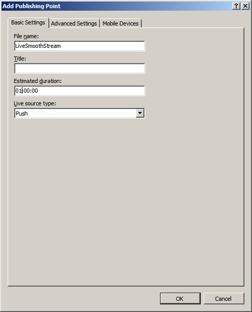
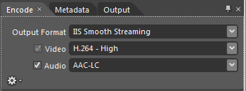
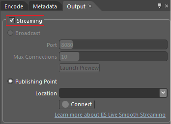
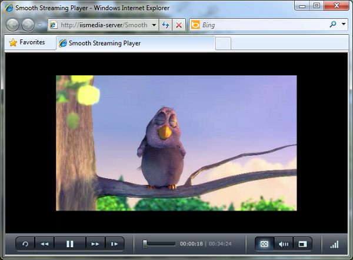

Getting Started with IIS Live Smooth Streaming
====================
by Dave Nelson

Applies To: IIS Media Services 4

The IIS Live Smooth Streaming extension for [Internet Information Services (IIS)](https://go.microsoft.com/?linkid=9656601) allows you to set up a web server as a Live Smooth Streaming server that delivers compelling, uninterrupted live video streams that instantly adjust quality (bitrate) to match changing network and CPU conditions at the client.

Live Smooth Streaming enables adaptive streaming of live events to Smooth Streaming-compatible clients, such as [Microsoft Silverlight](https://go.microsoft.com/?linkid=9656602). Using HTTP to deliver a live web broadcast leverages the scale of existing HTTP networks by keeping content close to the user and making true HD (720p+) a realistic option for web broadcasts. The additional advantage of using HTTP-based delivery for live events is that the existing HTTP infrastructure provides much more availability. For many popular live web broadcasts, content providers and content distribution networks (CDNs) want to know how much capacity they can dedicate on their resource-constrained streaming networks. By using their primary HTTP networks, which are typically 10-to-20-times larger than their streaming networks, they don't have to worry about maximizing network capacity and limiting the number of users for live events.

A Live Smooth Streaming server sources content from Live Smooth Streaming-capable encoders for delivery to Smooth-Streaming compatible clients. In addition to [Microsoft Expression Encoder](https://go.microsoft.com/?linkid=9656607), there are many third-party encoding solutions available for encoding both live and on-demand Smooth Streaming video in production environments. To help you determine which encoding solution is best-suited for your Smooth Streaming configuration, see our list of [encoding partners](https://go.microsoft.com/?linkid=9656604).

In this walkthrough:

- [Setting Up a Live Smooth Streaming Web Server](getting-started-with-iis-live-smooth-streaming.md#install)
- [Creating a Live Smooth Streaming Publishing Point](getting-started-with-iis-live-smooth-streaming.md#pubpt)
- [Pushing a Stream to the Live Smooth Streaming Publishing Point](getting-started-with-iis-live-smooth-streaming.md#encoder)
- [Serving the Live Stream to Clients](getting-started-with-iis-live-smooth-streaming.md#client)

## Setting Up a Live Smooth Streaming Web Server

To install IIS Live Smooth Streaming, see the IIS Media Services Readme [Installation Notes](https://go.microsoft.com/?linkid=9689898). This walkthrough describes how to set up a Live Smooth Streaming server using IIS Live Smooth Streaming in IIS Media Services 4.0, so be sure to select this version of IIS Media Services for installation.

After installation is completed, to verify that the Live Smooth Streaming extension is installed correctly, click the server name in the **Connections** pane in IIS Manager and then locate the **Live Smooth Streaming** icon in the **Media Services** area.  

> [!NOTE]
> If IIS Manager was running during the installation process, you might need to restart it to see **Live Smooth Streaming**.

## Creating a Live Smooth Streaming Publishing Point

This section describes how to create a publishing point that can accept a live broadcast from a Live Smooth Streaming-capable encoder.

1. In IIS Manager, select the desired website or virtual directory, and then double-click the **Live Smooth Streaming Publishing Points** icon.  
    
2. On the **Live Smooth Streaming Publishing Points** page, in the **Actions** pane, click **Add**.  
    
3. In the **Add Publishing Point** dialog box, on the **Basic Settings** tab, enter the following information:  
    

    - **File name**. Enter a name for the Live Smooth Streaming publishing point definition file. In this example and throughout the rest of this walkthrough, we'll use the file name **LiveSmoothStream**. If you specify a different file name, be sure to substitute it appropriately as you follow the steps in this walkthrough.
    - **Estimated duration**. If known, enter the duration (in *hours*:*minutes*:*seconds*) of the live event so that the Silverlight-based client can scale its **Seek** bar to the length of the content. In our example, we use an event duration of 1 hour (**01:00:00**).
    - **Live source type**. In our example, the Live Smooth Streaming server is an "origin server" that receives the content that's pushed to it from an encoder; therefore, we select the default **Push** option.  
  
        > [!NOTE]
        > The **Pull** option for **Live source type** configures the publishing point to "pull" content from a publishing point on another Live Smooth Streaming server. This is a common configuration for content syndication. For more information, see [Syndicating Live Smooth Streams between Servers](https://go.microsoft.com/?linkid=9656606).
4. On the **Advanced Settings** tab, select the **Start publishing point automatically upon first client request** check box. This setting allows an encoder to connect to the publishing point when the broadcast starts. Connection errors might occur if you don't enable this setting.  
      
  
 For more information about the additional settings that you can configure on the **Advanced Settings** tab, see [Add/Edit Publishing Point Dialog Box](https://go.microsoft.com/?linkid=9750332) .
5. If you want to deliver live streams to Apple® mobile digital devices, on the **Mobile Devices** tab, select the **Enable output to Apple mobile digital devices** check box.  
      
  
    > [!IMPORTANT]
    > Before proceeding, be sure to check out the following walkthrough article for more information about the requirements and publishing point configuration for Apple HTTP Live Smooth Streaming: [Apple HTTP Live Streaming with IIS Media Services](https://go.microsoft.com/?linkid=9750336) .
6. In the **Add Publishing Point** dialog box, click **OK**. A new Live Smooth Streaming publishing point definition file named **LiveSmoothStream.isml** is added to the website root.  
    
7. On the **Live Smooth Streaming Publishing Points** page, select the publishing point, and then in the **Actions** pane, click **Start Publishing Point**.  
    
8. The publishing point **State** value changes from **Idle** to **Starting**, which means it's waiting for external data (in this case, a live stream pushed to it from an encoder).  
      
  
 Because we haven't configured an encoder to push live streams to the publishing point yet, the **Publishing Point Summary** panel shows that there are no incoming streams.  
  
    > [!NOTE]
    > The **Summary** panel for Live Smooth Streaming publishing points in IIS Media Services 4 displays summary information about the live Smooth Streams that are received from all live sources (such as encoders or other Live Smooth Streaming publishing points) by the selected publishing point. You can also view details about the tracks within all of the live streams, and stream origin and destination information, in the **Publishing Point Details** page. For more information, see [Viewing Publishing Point Details](https://go.microsoft.com/?linkid=9750363) .  
  
    > [!NOTE]
    > After the publishing point begins receiving data from an encoder, its **State** value changes to **Started**. However, due to a known issue, the change in the **State** value isn't visible until after you refresh the **Live Smooth Streaming Publishing Points** page in IIS Manager.
9. See the [next section](getting-started-with-iis-live-smooth-streaming.md#encoder), which describes how to configure Microsoft Expression Encoder to push data to this publishing point.

## Pushing a Stream to the Live Smooth Streaming Publishing Point

This section describes how to create a Live Smooth Streaming broadcast in [Microsoft Expression Encoder 4](https://go.microsoft.com/?linkid=9656607) and push it to the Live Smooth Streaming publishing point that you configured in the [previous section](getting-started-with-iis-live-smooth-streaming.md#pubpt). The steps in this section outline a general workflow, with details only on the specific tasks that you need to create Live Smooth Streaming output. For detailed information about how to create a live broadcast from various live and file-based sources in Expression Encoder 4, including how to assemble a complete program, encode it, encrypt it with Digital Rights Management (DRM), and instantly distribute it to your audience using Smooth Streaming technology, see [Creating a Live Broadcasting Project](https://go.microsoft.com/?linkid=9656611).

> [!IMPORTANT]
> If you enabled the publishing point to stream content to Apple devices, such as iPhone® and iPad™ devices, be sure to review the encoding requirements and settings outlined in [Apple HTTP Live Streaming with IIS Media Services](https://go.microsoft.com/?linkid=9750336).

> [!NOTE]
> Live Smooth Streaming is available only in Microsoft Expression Encoder Pro.

1. Start Expression Encoder (click **Start** &gt; **All Programs** &gt; **Microsoft Expression** &gt; **Microsoft Expression Encoder 4**).
2. In the **Load a new project** dialog box, select **Live Broadcasting Project**.  
    
3. Set up the source to use for your live broadcast. For [File Sources](https://go.microsoft.com/?linkid=9656610), you can use audio or video sources in any file format that Expression Encoder can import. For [Live Sources](https://go.microsoft.com/?linkid=9656616), you can connect multiple camera devices, such as USB webcams or FireWire (IEEE 1394) digital video cameras. Although you can connect multiple live sources, you can stream only one at a time.
4. On the **Presets** tab, choose an encoding preset that supports the bit rates and encoding requirements for your Live Smooth Streaming scenario. Be sure to choose a preset with **IIS Smooth Streaming** in the preset name, and then click **Apply**.  
      
  
 To find out more information about a preset, such as the numbers of streams in the output and the codecs used, hover your mouse pointer over a preset name. The preset information is displayed in a box.  
  
    > [!NOTE]
    > Clicking the **Apply** button automatically updates the **Output Format**, **Video**, and **Audio** settings on the **Encode** tab with the values used by the selected preset.  
      
  
 You can choose to not select a preset and specify your own values for the [Output Format](https://go.microsoft.com/?linkid=9656620), [Video](https://go.microsoft.com/?linkid=9634174), and [Audio](https://go.microsoft.com/?linkid=9634175) options on the **Encode** tab instead.
5. On the **Output** tab, if the **Streaming** check box is present, select it to activate streaming.  
      
  
 To publish your content, select **Publishing Point**, and then in the **Location** box, type the URL of the Live Smooth Streaming publishing point that you want to publish your live broadcast to.  
      
  
 URL syntax: http://*ServerName*/*SiteName*/*DirectoryName*/*PublishingPointDefinitionFileName*.isml  
  
 For the example Live Smooth Streaming publishing point that we created in the [previous section](getting-started-with-iis-live-smooth-streaming.md#pubpt), the URL would be:  
  
    `http://IISMedia-Server/LiveSmoothStream.isml`  
  
    > [!NOTE]
    > You can click the **Connect** button to test the connection to the publishing point after you specify its URL in the **Location** box. The publishing point must be started for the connection to be validated.
6. If you want to add Digital Rights Management (DRM) to your content, select **Digital Rights Management** on the **Output** tab, and then specify DRM options. For more information, see [Set DRM options](https://go.microsoft.com/?linkid=9689725).  
  
    > [!NOTE]
    > The license provided for a Live Smooth Streaming session is non-persistent, meaning that after the user closes the client application being used to view the web broadcast, the license expires.  
  
    > [!IMPORTANT]
    > You shouldn't use the DRM setting if you want to stream the content to Apple devices. To provide protected content to Apple devices, you can configure the Live Smooth Streaming publishing point to encrypt the content by using the Advanced Encryption Standard (AES) with a 128-bit key. For more information about how to configure Apple AES-128 encryption, see [Add/Edit Publishing Point Dialog Box](https://go.microsoft.com/?linkid=9750332).
7. Click **Cue** to enable your source for broadcasting (a cued file source is shown in the following figure)...  
      
  
 ...and then click **Start** to begin your live broadcast.  
      
  
 As the broadcast runs, you can monitor [Statistics](https://go.microsoft.com/?linkid=9738257) and [Connections](https://go.microsoft.com/?linkid=9738258) data in the corresponding panels.

## Serving the Live Stream to Clients

This section describes how to use the Microsoft Silverlight Media Framework 2.0 SmoothStreamingPlayer.XAP, a sample player that can easily be embedded in your website to enable client playback of Smooth Streaming media.

> [!IMPORTANT]
> Apple devices use an HTML 5 webpage to play the Live Smooth Streaming presentation. If you enabled the publishing point to stream content to Apple devices, see [Creating an HTML 5 page for use in Safari](https://go.microsoft.com/?linkid=9750364).

> [!NOTE]
> The latest version of [Microsoft Silverlight](https://go.microsoft.com/?linkid=9656602) must be installed on the client computer that you want to use to observe Live Smooth Streaming.

1. On the web server, click the following link to download the sample player executable file: [SmoothStreamingPlayer.exe](https://go.microsoft.com/?linkid=9738294).
2. To extract the sample player files immediately, click **Run**.  
 -or-  
 To copy the sample player files to your web server in order to extract them at a later time, click **Save**, and then open the file from the saved location.
3. When you are prompted for a location to store the extracted sample player files, enter the directory path of a temporary folder on your desktop. For example:  
    
4. Open the temporary desktop folder, review the terms in the End User License Agreement (EULA) file, and then right-click the zipped folder and click **Extract All** to extract the sample player files.  
    
5. When you are asked to select the destination folder to which the sample player files will be extracted, select a website or virtual directory that you want to use for client access to the live broadcast. In our example, we extract the files to the default website, which also contains the Live Smooth Streaming publishing point definition file (LiveSmoothStream.isml).  
    
6. To view the sample player files, in IIS Manager, open the website or virtual directory in **Content View**.  
      
  
 The following files are included in the download: 

    - **Smooth Streaming Player-ReadMe.doc**. Configuration instructions.
    - **SmoothStreamingPlayer.html**. A sample webpage in which you must update the media reference to your live broadcast, and if necessary, width and height attributes to achieve a presentation size that fits your website design.
    - **SmoothStreamingPlayer.xap**. A sample Smooth Streaming player.
7. In a text editor, such as Notepad, open SmoothStreamingPlayer.html and update the **mediaurl** attribute value with the fully qualified URL of the Live Smooth Streaming publishing point definition (.isml) file. In our example, this is:  

    [!code-console[Main](getting-started-with-iis-live-smooth-streaming/samples/sample1.cmd)]

 If necessary, also update the **width** and **height** attributes to appropriate values for your website design. For complete instructions, see the Readme file (Smooth Streaming Player-ReadMe.doc).
8. In a web browser on the client computer, download the sample webpage from the web server and begin viewing the stream. In our example, in the web browser address bar, type `http://IISMedia-Server/SmoothStreamingPlayer.html`.  
  
 The Live Smooth Streaming broadcast opens in the web browser, using the Silverlight browser plug-in for Live Smooth Streaming.  
    

For more information about how to build rich Silverlight user experiences that take full advantage of live and on-demand IIS Smooth Streaming capabilities, see [Smooth Streaming Client](https://go.microsoft.com/?linkid=9738295).
