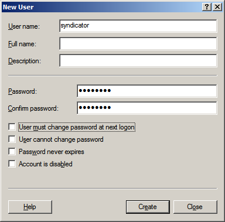

Syndicating Live Smooth Streams between Servers
====================
by [John A. Bocharov](https://github.com/jbocharov)

This walkthrough describes how to configure Live Smooth Streaming server-to-server syndication and uses the following terms to distinguish the servers involved:

- **Downstream**. The server that is closer to the client in the delivery chain.
- **Upstream**. The server that is closer to the encoder in the delivery chain.

## Requirements

- This walkthrough requires that you install the IIS Live Smooth Streaming extension in IIS Media Services 4.0 on a Web server running [Internet Information Services (IIS)](https://go.microsoft.com/?linkid=9656601). For more information about setting up this configuration, see [Getting Started with IIS Live Smooth Streaming](getting-started-with-iis-live-smooth-streaming.md).
- [Microsoft Silverlight](https://go.microsoft.com/?linkid=9656602) is required to view the playback experience in a Web browser.
- The URL Authorization module for IIS is required on the upstream server. For more information about setting up this configuration, see [Understanding IIS URL Authorization](../../manage/configuring-security/understanding-iis-url-authorization.md).
- The Windows Authentication module for IIS is required on the upstream server. For more information about setting up this configuration, see [Windows Authentication &lt;windowsAuthentication&gt;](https://www.iis.net/configreference/system.webserver/security/authentication/windowsauthentication).

## Usage Scenario

Live Smooth Streaming servers can be configured to receive content pushed from an encoder, or to pull content directly from another Live Smooth Streaming server. This walkthrough describes how to configure the servers for content syndication, and outlines steps to help secure the communication against misuse. The scenario is enabled through the following steps:

- [Configuring the Upstream Publishing Point](syndicating-live-smooth-streams-between-servers.md#configuring_upstream)
- [Securing the Upstream Publishing Point](syndicating-live-smooth-streams-between-servers.md#securing_upstream)
- [Configuring Credentials for the Downstream Publishing Point](syndicating-live-smooth-streams-between-servers.md#configuring_credentials)
- [Configuring the Downstream Publishing Point](syndicating-live-smooth-streams-between-servers.md#configuring_downstream)

## Security Best Practices

When communicating on an untrusted or partially trusted network, the following precautions are recommended:

- Only enable **Allow client connections** for Live Smooth Streaming publishing points that you plan to use for streaming content to users.
- Only enable **Allow server connections** for Live Smooth Streaming publishing points that you plan to use as an upstream source for server-to-server content syndication.
- For any publishing points that use a "Push" **Live source type**, configure URL Authorization to restrict unauthorized POST attempts by following the steps in [Securing the Upstream Publishing Point](syndicating-live-smooth-streams-between-servers.md#securing_upstream).
- For any publishing points that allow server connections, follow all of the steps in this walkthrough to configure URL Authorization to help prevent unauthorized server-to-server syndication attempts.

## Configuring the Upstream Publishing Point

To configure the Live Smooth Streaming publishing point on the upstream server, follow the steps in the [Creating a Publishing Point](creating-and-managing-live-smooth-streaming-publishing-points.md#create) section of [Creating and Managing Publishing Points](creating-and-managing-live-smooth-streaming-publishing-points.md). The applicable scenario is: **Deliver a Live Presentation to Other Web Servers**.

## Securing the Upstream Publishing Point

To help secure the publishing point on the upstream server, do the following:

1. [Create a user account for syndication](syndicating-live-smooth-streams-between-servers.md#create)
2. [Disable anonymous access](syndicating-live-smooth-streams-between-servers.md#disable)
3. [Enable access for approved servers](syndicating-live-smooth-streams-between-servers.md#enable)

### Create a user account for syndication

Create a user account for use by authorized servers by doing the following (skip to [Disable anonymous access](syndicating-live-smooth-streams-between-servers.md#disable) if using an existing account): 

1. Open **Server Manager** (click **Start** &gt; **Administrative Tools** &gt; **Server Manager**).
2. In the contents pane, navigate to the **Users** folder (**Configuration** &gt; **Local Users and Groups** &gt; **Users**).
3. On the **Action** menu, click **New User**. - In the **New User** dialog box, enter a user name and password for the user, and clear the **User must change password at next logon** check box.  
    

### Disable anonymous access

Disable anonymous access for the Web site or server by doing the following:

1. Open **IIS Manager** (click **Start** &gt; **Administrative Tools** &gt; **Internet Information Services (IIS) Manager**).
2. In **IIS Manager**, navigate to the appropriate level in the **Connections** pane. Choose the folder, Web site, or the entire server such that the scope covers the publishing points for which you do not want to allow anonymous access.
3. Select **Features View** in the center pane, if it is not already selected.
4. In the **Home** page, in the **IIS** area, open the **Authorization Rules** feature.  
  
    
5. In the **Authorization Rules** feature page, locate the rules whose **Mode** column is set to **Allow** and whose **Users** column is either **All Users** or **Anonymous Users**.
6. For each such rule, select the rule and then in the **Actions** pane, click **Remove**.  
    

### Enable access for approved servers

Add a rule that allows access for authorized users and servers by doing the following:

1. Open **IIS Manager** (click **Start** &gt; **Administrative Tools** &gt; **Internet Information Services (IIS) Manager**).
2. In **IIS Manager**, navigate to the appropriate level in the **Connections** pane. Choose the folder, Web site, or the entire server such that the scope covers the publishing points for which you do not want to allow anonymous access.
3. Select **Features View** in the center pane, if it is not already selected.
4. In the **Home** page, in the **IIS** area, open the **Authorization Rules** feature.
5. In the **Authorization Rules** feature page, in the Actions pane, click **Add Allow Rule**.
6. In the **Add Allow Authorization Rule** dialog box, select **Specified users**, and then enter the user name that you chose when creating a user account for syndication.  
    

## Configuring Credentials for the Downstream Publishing Point

To configure credentials on the downstream publishing point, do the following:

1. In **IIS Manager**, in the **Connections** pane, click a Web site.
2. Select **Features View** in the center pane, if it is not already selected.
3. In the **Home** page, in the **Media Services** area, open the **Live Smooth Streaming Publishing Points** feature.  
  
    
4. In the **Actions** pane, click **Manage Credentials**.  
    
5. In the **Manage Credentials** dialog box, click **Add**.  
    ****
6. In the **Add Credential** dialog box, enter the user name and password that matches an authorized account on the upstream publishing point and a friendly name for the credential, and then click **OK**.  
    

## Configuring the Downstream Publishing Point

To configure the publishing point on the downstream server, follow the steps in the [Creating a Publishing Point](creating-and-managing-live-smooth-streaming-publishing-points.md#create) section of [Creating and Managing Publishing Points](creating-and-managing-live-smooth-streaming-publishing-points.md). The applicable scenario is: **Deliver a Live Presentation from Another Web Server**.

### Basic Settings

1. In the **Live Smooth Streaming Publishing Points** feature page, in the **Actions** pane, click **Add**.  
      
  
   -or-  
  
   If the downstream publishing point has already been created, in the **Live Smooth Streaming Publishing Points** feature page, click the publishing point name, and then in the **Actions** pane, click **Edit** .  
    
2. In the **Add Publishing Point** (or **Edit Publishing Point** dialog box), on the **Basic Settings** tab, do the following:  
    

    - In **File name**, enter the file name for the publishing point.
    - (Optional) In **Title**, enter a title for the presentation.
    - (Optional) In **Estimated duration**, specify the duration of the presentation.
    - In **Live source type**, select **Pull**.
3. Click **Add**.  
    
4. In the **Add Publishing Point URL** dialog box, enter the URL of the publishing point on the upstream server in the **URL** text box, and select the friendly name of the corresponding credential in the **Credential** drop down list. Click **OK** to accept.  
    

### Advanced Settings

On the **Advanced Settings** tab, clearing the **Allow server connections** check box is recommended unless the publishing point will be used for further syndication.  

