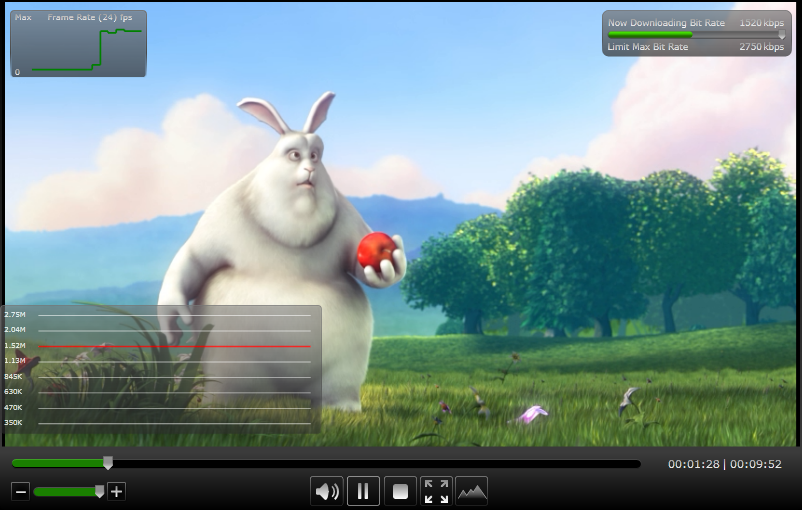
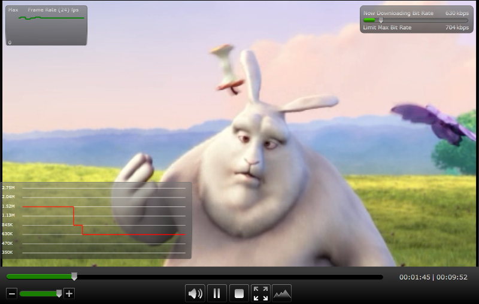
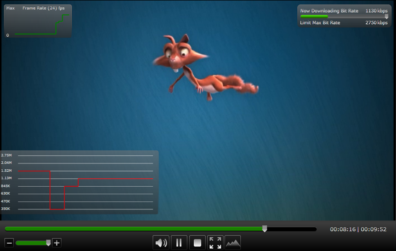

Exploring Bit Rate Changes
====================
by Dave Nelson

Applies To: IIS Media Services 4, IIS Media Services 3.0

To create Smooth Streaming presentations, source content is encoded at several quality levels (bit rates) using [Microsoft Expression Encoder](https://go.microsoft.com/?linkid=9737541) or a compression tool from one of our many [Encoding Partners](https://www.iis.net/media). [Microsoft Silverlight](https://go.microsoft.com/?linkid=9737580)-based clients host Smooth Streaming heuristic algorithms that make download bit rate decisions every few seconds, appropriate for the currently available bandwidth and video rendering capabilities. When the Smooth Streaming Web server receives a request for media at a specific bit rate from the client, it dynamically creates cacheable virtual fragments from the corresponding bit rate video file. The client optimizes playback of content in real-time by requesting a bit rate from the presentation that is most appropriate for current conditions, receiving the best content possible as conditions change.

This article describes how to simulate client experiences under varying conditions by simulating drops and recoveries in bandwidth in the [Smooth Streaming User Experience Simulator](https://www.iis.net/media/experiencesmoothstreaming).

- [Using the Smooth Streaming User Experience Simulator](exploring-bit-rate-changes.md#simulator)
- [Simulating a Drop in Available Bandwidth](exploring-bit-rate-changes.md#drop)
- [Simulating a Recovery of Available Bandwidth](exploring-bit-rate-changes.md#recover)
- [User Experience for Seeking](exploring-bit-rate-changes.md#seek)

## Using the Smooth Streaming User Experience Simulator

The [Smooth Streaming User Experience Simulator](https://www.iis.net/media/experiencesmoothstreaming) displays a user interface similar to the following figure.  

The interface contains the following components that help simulate conditions and quantify the playback experience:

**Bit Rate Bar**

The **Now Downloading Bit Rate** bar (top-right) displays the network connection's current throughput, in kilobits per second. The following figure shows that the network throughput is **2436 Kbps**.  

The **Limit Max Bit Rate** slider control (top-right) allows you to emulate lower bandwidths, so that you can see how Smooth Streaming adapts to varying network conditions. The following figure shows that the maximum allowed throughput is **5436 Kbps**.  

**Bit Rate History**

The **Bit Rate History** panel displays the encoded bit rates that are available. The red line displays a history of the bit rates used during playback. The right end of the line always represents the current bit rate at which content is playing. Download bit rate decisions are made every few seconds by the Smooth Streaming heuristic algorithms that are hosted in Silverlight. A change in the downloaded bit rate may lag behind changes in the simulated available bit rate by several seconds.  

**Frame Rate History**

The **Frame Rate History** panel displays the recent history and the current state of the playback frame rate, as a percentage of the encoded frame rate. You can use this information to determine if the available decoding power is a limiting factor in the bit rate decision. As the needs of the video decoder and renderer begin to exceed available CPU resources (either due to hardware limitations or CPU used by other processes), Silverlight skips frames to keep the stream playing in real time, resulting in a detectable drop of the playback frame rate relative to its possible maximum (the encoded frame rate of the media). If the playback frame rate falls too low, video playback might cease to appear smooth, and decoding artifacts might start to appear. To ensure a great playback experience, the Smooth Streaming algorithms limit the bit rate of the media if excessive skipping of frames occurs. This ensures that the CPU load required for decoding stays within the limits of the CPU power available.  

## Simulating a Drop in Available Bandwidth

To simulate a drop in the available throughput, move the **Limit Max Bit Rate** slider to the left. The following figure shows a simulated drop to **704 Kbps**.  

At the next available bit rate decision point (a few seconds later), the Smooth Streaming heuristics algorithms adjust the download bit rate accordingly. This can be seen by looking at the **Now Downloading Bit Rate** value (**630 Kbps**). The Smooth Streaming client will play content that is already downloaded at the higher bit rate to maintain high quality for as long as possible, then play the content that is downloaded at the new reduced bit rate, as can be seen by examining the red line in the **Bit Rate History** panel.

## Simulating a Recovery of Available Bandwidth

The ability to seamlessly upgrade the experience as conditions recover is crucial to ensuring that all users get the best quality they can at any moment. Starting from a low simulated bit rate state, we can see how the Smooth Streaming client heuristics respond when conditions improve. Select a higher simulated bit rate by moving the **Limit Max Bit Rate** slider to the right. The following figure shows a simulated recovery to **2750 Kbps**.  

At the next available bit rate decision point (a few seconds later), the Smooth Streaming heuristics algorithms begin to adjust the download bit rate accordingly. This can be seen by looking at the **Now Downloading Bit Rate** value (**1520 Kbps**). Shortly thereafter, content downloaded at the new improved bit rate begins to play, as can be seen in the **Bit Rate History** panel. The change in bit rate occurs gradually to prevent a jarring visual quality change.

## User Experience for Seeking

The Smooth Streaming heuristics algorithms ensure that the experience is extremely responsive to seek operations by downloading media at the desired seek position at a reduced bandwidth to reduce the lag between a seek event and playback at the new position, and then quickly recovering to the available bit rate to maintain a quality experience. This can be seen in the **Bit Rate History** panel after a seek event.  

## Legal Notice

Big Buck Bunny images and content © copyright 2008, Blender Foundation | [http://www.bigbuckbunny.org/](http://www.bigbuckbunny.org/).