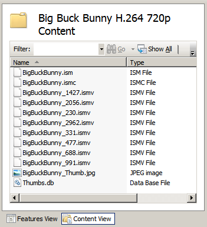
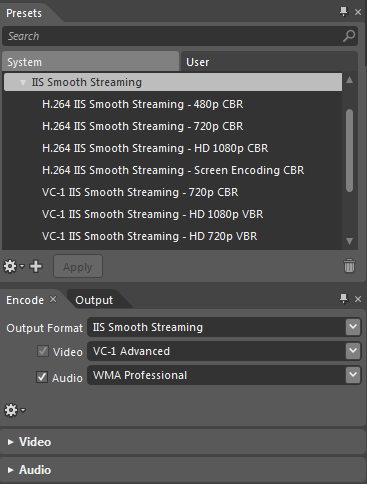
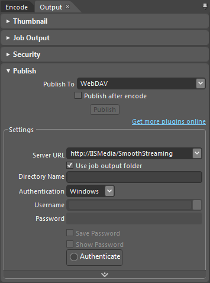

Getting Started with IIS Smooth Streaming
====================
by Dave Nelson

Applies To: IIS Media Services 4

The IIS Smooth Streaming extension for [Internet Information Services (IIS)](https://go.microsoft.com/?linkid=9652406) allows you to set up a Web server as a Smooth Streaming server with a default [Microsoft Silverlight](https://go.microsoft.com/?linkid=9652120) client implementation. This walkthrough covers the following scenarios:

- [Setting Up a Smooth Streaming Web Server](getting-started-with-iis-smooth-streaming.md#setup)
- [Deploying and Playing the Sample Content](getting-started-with-iis-smooth-streaming.md#content)
- [Creating and Publishing Your Own Content](getting-started-with-iis-smooth-streaming.md#encode)

## Setting Up a Smooth Streaming Web Server

To install IIS Smooth Streaming, see the IIS Media Services Readme [Installation Notes](https://go.microsoft.com/?linkid=9752847). This walkthrough describes how to set up an on-demand Smooth Streaming server using IIS Smooth Streaming in IIS Media Services 4, so be sure to select this version of IIS Media Services for installation.

After installation is completed, no additional configuration steps are required to deliver on-demand Smooth Streaming presentations. To verify that the Smooth Streaming extension is installed correctly, select a website or virtual directory in IIS Manager and then locate the **Smooth Streaming Presentations** icon in the **Media Services** area.  
  

> [!NOTE]
> If IIS Manager was running during the installation process, you might need to restart it to see **Smooth Streaming Presentations**.

## Deploying and Playing the Sample Content

To experience Smooth Streaming without creating your own content or Silverlight player, you can download and install high-definition (HD) sample content encoded for Smooth Streaming and Silverlight player templates. The following downloads are available:

- **IIS Smooth Streaming HD Sample Content**
- **SMF Smooth Streaming Sample Client**

You can also create your own Smooth Streaming content by using Microsoft Expression Encoder. For more information, see the next section, [Creating and Publishing Your Own Content](getting-started-with-iis-smooth-streaming.md#encode).

### Installing the Sample Content

The following [IIS Smooth Streaming HD Sample Content](https://go.microsoft.com/?linkid=9652408) downloads are encoded with Microsoft Expression Encoder 4 into multiple bitrates that let you experience on-demand Smooth Streaming without encoding your own video:

- **Big Buck Bunny H.264 720p.zip**. A sample Smooth Streaming video presentation, in a compressed (zipped) folder, which is encoded with H.264 video and AAC audio codecs in 8 standard bitrates.
- **Elephants Dream H.264 720p.zip**. A sample Smooth Streaming video presentation, in a zipped folder, which is encoded with H.264 video and AAC audio codecs in 8 standard bitrates. In addition, this presentation includes alternate language and director's commentary audio tracks, and a textstream track that contains caption text in Timed Text Markup Language (TTML) format.

**To install the sample content**

1. On your Smooth Streaming Web server, go to the [IIS Smooth Streaming HD Sample Content page](https://go.microsoft.com/?linkid=9652408) and click the **Download** button for the desired sample video.
2. To extract the Smooth Streaming presentation folder immediately, click **Open**.  
   -or-  
   To copy the zipped folder to your Web server in order to extract the presentation folder at a later time, click **Save**, and then open the zipped folder from the saved location.
3. Extract the Smooth Streaming presentation folder to a website or virtual directory on the Web server. This walkthrough describes a Smooth Streaming Web server with the Big Buck Bunny H.264 720p sample content stored in the Default Web site. For example:  
      
  
   If you want to use another website or virtual directory to store the sample content, enter its physical path. Be sure to substitute your chosen website or virtual directory appropriately in the rest of the procedures in this article.
4. To view the Smooth Streaming sample content files, in IIS Manager, open the Smooth Streaming presentation folder in **Content View**.  
    

### Installing the Sample Client

The Microsoft Silverlight Media Framework 2.0 SmoothStreamingPlayer.XAP is a prepackaged player that you can embed in a webpage to enable client playback of Smooth Streaming media.

**To install the sample client**

1. If you haven't already done so, install the Sample Content on your Smooth Streaming Web server as described above.
2. On the Web server, click the following link to download the Sample Client executable file: [SmoothStreamingPlayer.exe](https://go.microsoft.com/?linkid=9752687).
3. To extract the Sample Client files immediately, click **Run**.  
   -or-  
   To copy the Sample Client files to your Web server in order to extract them at a later time, click **Save**, and then open the file from the saved location.
4. When you're prompted for a location to store the extracted Sample Client files, enter the directory path of a temporary folder on your desktop. For example:  
    
5. Open the temporary desktop folder, review the terms in the End User License Agreement (EULA) file, and then right-click the zipped folder and click **Extract All** to extract the Sample Client files.  
    
6. When you're asked to select the destination folder to which the Sample Client files will be extracted, select the sample Smooth Streaming presentation folder on the Web server. For example:  
    
7. To view the Sample Client files, in IIS Manager, open the Smooth Streaming presentation folder in **Content View**.  
      
  
   The following Sample Client files are included in the download: 

    - **Smooth Streaming Player-ReadMe.doc**. Configuration instructions.
    - **SmoothStreamingPlayer.html**. A sample webpage in which you must update the media reference to the on-demand Smooth Streaming presentation, and if necessary, width and height attributes to achieve a presentation size that fits your website design.
    - **SmoothStreamingPlayer.xap**. The sample Smooth Streaming player.

### Playing the Sample Content in Silverlight

This section describes how to use the Sample Content and Sample Client files to enable client playback of Smooth Streaming media.

> [!NOTE]
> The latest version of [Microsoft Silverlight](https://go.microsoft.com/?linkid=9652120) must be installed on the client computer that you want to use to observe the on-demand Smooth Stream.

1. In a text editor, such as Notepad, open SmoothStreamingPlayer.html and update the **mediaurl** attribute value with the fully qualified URL of the on-demand Smooth Streaming presentation server manifest (.ism) file. In our example, this value is:  

    [!code-console[Main](getting-started-with-iis-smooth-streaming/samples/sample1.cmd)]

   If necessary, also update the **width** and **height** attributes to appropriate values for your website design. For complete instructions, see the Readme file (Smooth Streaming Player-ReadMe.doc).
2. In a web browser on the client computer, download the sample webpage from the Web server and begin viewing the stream. In our example, in the web browser address bar, type `http://%ServerName%/Big Buck Bunny H.264 720p/`**SmoothStreamingPlayer.html**.  
  
   The on-demand Smooth Stream opens in the web browser, using the Silverlight browser plug-in for Smooth Streaming.  
    

For more information about how to build rich Silverlight user experiences that take full advantage of on-demand and live IIS Smooth Streaming capabilities, see the [Smooth Streaming Client webpage](https://go.microsoft.com/?linkid=9752845).

> [!NOTE]
> To view a demonstration of how IIS Smooth Streaming works under varying bandwidth conditions, see the [Experience Smooth Streaming webpage](https://go.microsoft.com/?linkid=9752846). On this webpage, you can use a demonstration player to simulate drops and recoveries in bandwidth and see Smooth Streaming in action.

## Creating and Publishing Your Own Content

You can create your own Smooth Streaming content by getting a copy of [Microsoft Expression Encoder](https://go.microsoft.com/?linkid=9652410), which includes **IIS Smooth Streaming** presets that make it easy to create Smooth Streaming presentations.  

> [!NOTE]
> VC-1 encoding codecs are available in a free download of Expression Encoder 4. If you want to encode Smooth Streaming video with H.264 video codecs, or encode live Smooth Streams, you must purchase Expression Encoder 4 Pro.

When you encode Smooth Streaming video using Expression Encoder, the video is output in Smooth Streaming format. The video files can then be published directly to your Smooth Streaming Web server by using the WebDAV publishing plug-in, which is available by default in the **Publish** area of the **Output** tab.  

To publish directly from Expression Encoder to your Web server by using WebDAV, the free [WebDAV Extension for IIS](https://go.microsoft.com/?linkid=9652412) must be installed on the Web server.

For step-by-step guidance about how to encode Smooth Streaming video using Expression Encoder and deliver it to clients from your Smooth Streaming Web server, see the [Smooth Streaming Deployment Guide](https://go.microsoft.com/?linkid=9689879).