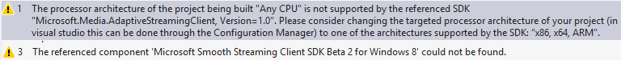

Smooth Streaming Client SDK for Windows 8 - Release Notes
====================
by [Cenk Dingiloglu](https://github.com/cenkdin)

The Smooth Streaming Client SDK for Windows 8 Apps enables developers to build Windows 8 applications that can play on-demand and live Smooth Streaming content with or without Microsoft PlayReady protection. This document describes the important known issues that occur in this release of the SDK.

> [!NOTE]
> 
> - Unless otherwise specified, these Release Notes apply to x64, x86, and ARM editions of the SDK.
> - This build was tested with the Windows 8 RTM and Visual Studio 2012 RTM releases. Unexpected results might occur if you run the SDK on different versions of this software.

## Supported Features

This release of the SDK includes support for the following:

- X86, x64, and ARM platform support
- VOD (Play, Pause, Seek, Stop)
- Live (Play)
- Live DVR (Pause, Seek, Go to Live) \*\*
- Support for video codecs – H.264, VC-1
- Support for Audio codecs – AAC, Dolby DD+, WMA Pro
- Multiple audio language switching with APIs \*\*
- Track-selection for playback (for example, restrict the available bitrates)\*\*
- Offline playback scenarios via Downloader Plugin \*\*
- Text and Sparse Track APIs \*\*
- Content protection – Microsoft PlayReady integration for VC-1/WMA - H.264/AAC content
- Trickplay (slow motion, fast-forward, and rewind)
- Microsoft PlayReady Key rotation
- Multiple Smooth Streaming asset playback.(Such as; Picture in Picture - PIP, Multi-Camera and Video wall) \* Please see known issues section for limitations.

(\*\*) These features aren't supported with Windows 8 default APIs. To enable these features, you need to use Smooth Streaming Client SDK APIs.

## Known Issues

- There is a known issue where on demand content beginning with non-zero offset time doesn't support seeking with default HTML5 controls. It is recommended to use the SDK APIs to paint the control bar and support seeking.
- Live content with the VC-1 codec might hang when seeking.
- Trickplay on ARM platforms have some known issues where the playback rate isn't honored and playback still continues on x1.
- The performance and the count of play backing multiple Smooth Streaming assets at the same time will vary depending on your hardware performance (CPU/GPU) and available bandwidth. For better results it is recommended to restrict/select qualities based on your window size.
- When you navigate from a Smooth Streaming application, Windows will suspend the application. This might cause unexpected behavior. To overcome this, have the application listen to the Suspend/Resume event and call (Pause)/(Play) accordingly.
- On Windows 8 apps, screen saver isn't disabled automatically when there is video playback, This might cause issues. To avoid this, disable the screen saver for Smooth Streaming applications by using [DisplayRequest.RequestActive](https://msdn.microsoft.com/en-us/library/windows/apps/windows.system.display.displayrequest.requestactive.aspx).
- You must change the build platform from **Any Cpu** to the targeted architecture (x64/x86/ARM) before compiling the project in Visual Studio. Otherwise, you might get compilation errors and warnings such as the following:  
      
  
 Leaving the **Any CPU** option selected will display the following warning in the References section in Visual Studio:  
    
- The SDK depends on the Microsoft Visual C++ Runtime Package. Failing to add this dependency to the project references will cause Visual Studio to generate compilation errors and warnings, such as the following:  
    
- To support PlayReady-protected content playback, build version 1678 or later of the Microsoft PlayReady Client SDK for Windows 8 Apps is required.

## Building Player Applications

When you develop your Smooth Streaming player application, we encourage you to use the latest version of the [Microsoft Media Platform Player Framework for Windows 8](http://playerframework.codeplex.com/). If you don't want to use the Player Framework, see [How to build your first HTML5 Windows 8 Smooth Streaming Application](https://blogs.iis.net/cenkd/archive/2012/03/28/How-to-build-your-first-html5-metro-style-smooth-streaming-player.aspx), [A Simple Windows 8 Smooth Streaming Media Player](https://code.msdn.microsoft.com/Smooth-Streaming-Client-0bb1471f) and [How to build a Smooth Streaming Windows 8 JavaScript application with advanced features](https://blogs.iis.net/cenkd/archive/2012/08/09/how-to-build-a-smooth-streaming-windows-8-javascript-application-with-advanced-features.aspx) to learn how to build a basic HTML5 Smooth Streaming Player using this SDK.

## Product Support and Feedback

For more information about new or changed features and fixes in this release, see the documentation and announcements provided by the specific feature teams.

To report issues and to provide feedback, please submit a post to the [Smooth Streaming Client SDK for Windows 8 Apps Announcement & Feedback thread](https://forums.iis.net/p/1187882/2016642.aspx#2016642) on the IIS Media forum.

## Legal Notice

Copyright ©2012 Microsoft Corporation. All rights reserved.