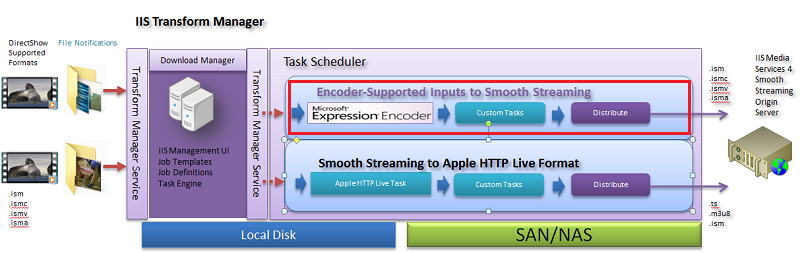
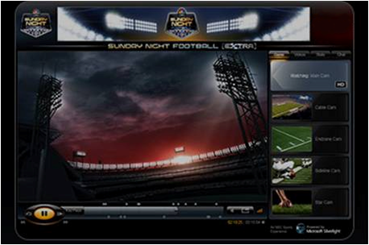

Smooth Streaming Primer
====================
by [John Deutscher](https://github.com/johndeu)

Last Updated: August 2010

[IIS Media Services](https://go.microsoft.com/?linkid=9740295), an integrated HTTP-based media delivery platform, delivers true HD (720p+) live and on-demand streaming, DVR functionality, and real-time analytics support to computers, TVs, and mobile devices. By offering a complete multi-format media delivery platform and a proven web server, highly immersive websites can now be managed from a single web platform: IIS.

Smooth Streaming, an IIS Media Services extension, enables adaptive streaming of media to Silverlight and other clients over HTTP. Smooth Streaming provides a high-quality viewing experience that scales massively on content distribution networks (CDNs), making true HD 1080p media experiences a reality.

Smooth Streaming is the productized version of technology first used by Microsoft to deliver on-demand video of the 2008 Summer Olympics for [NBCOlympics.com](https://go.microsoft.com/?linkid=9740296). By dynamically monitoring both local bandwidth and video-rendering performance, Smooth Streaming optimizes content playback by switching video quality in real-time.

Smooth Streaming is built on top of technologies that Microsoft has released via the [Community Promise Initiative](https://go.microsoft.com/?linkid=9740297), including the Protected Interoperable File Format (PIFF) and the IIS Smooth Streaming Transport Protocol (SSTP). The [Protected Interoperable File Format (PIFF) Specification](https://go.microsoft.com/?linkid=9740298) defines a standard multimedia file format for multimedia content delivery and playback. It includes the audio-video container, stream encryption, and metadata to support content delivery for multiple bitrate adaptive streaming, optionally using a standard encryption scheme that can support multiple digital rights management (DRM) systems. The [IIS Smooth Streaming Transport Protocol Specification](https://go.microsoft.com/?linkid=9740299) describes how live and on-demand Smooth Streaming audio/video content is distributed and cached over an HTTP network. It enables third parties to build their own client implementations that interoperate with IIS Media Services.

## About IIS Smooth Streaming

In October 2008, Microsoft announced that Internet Information Services (IIS) 7.0 would feature a new HTTP-based adaptive streaming extension: Smooth Streaming.

Smooth Streaming dynamically detects local bandwidth and CPU conditions and seamlessly switches, in near real time, the video quality of a media file that a player receives. Consumers with high-bandwidth connections can experience high definition (HD) quality streaming while others with lower bandwidth speeds receive the appropriate stream for their connectivity, allowing consumers across the board to enjoy a compelling, uninterrupted streaming experience and alleviating the need for media companies to cater to the lowest common denominator quality level within their audience base.

This enables companies to boost brand awareness and advertising revenues by extending average viewing times through higher quality true HD (resolution greater than 720p) experiences. They can also benefit from unprecedented network scalability using distributed HTTP-based web servers and offer better quality to more customers.

Documentation providing a detailed technical overview of Smooth Streaming is available [here](https://go.microsoft.com/?linkid=9740300).

## About the Protected Interoperable File Format (PIFF)

The [Protected Interoperable File Format (PIFF) Specification](https://go.microsoft.com/?linkid=9740298) defines a standard multimedia file format for multimedia content delivery and playback. It includes the audio-video container, stream encryption, and metadata to support content delivery for multiple bitrate adaptive streaming, optionally using a standard encryption scheme that can support multiple DRM systems. IIS Smooth Streaming uses the PIFF container as its file format. In this respect, Smooth Streaming files and PIFF files can be used synonymously – as Smooth Streaming is a brand name used by Microsoft on top of the PIFF container.  
  
**Figure 1 PIFF file format**

PIFF provides a simple, efficient solution to the DRM interoperability problem. It enables content to be encrypted once – rather than once for each DRM technology used – for delivery in a variety of scenarios. PIFF is standards-based and provides new efficiencies in the creation and delivery of protected content.

## Creating PIFF Content

There are many options for creating valid PIFF content, including:

- [Microsoft Expression Encoder](https://go.microsoft.com/?linkid=9740301), which supports live and video-on-demand (VOD) encoding, both H.264 and VC-1 output, and PlayReady encryption.
- Third-party encoders and content protection service providers for live and VOD (see the list of our [Partners](https://go.microsoft.com/?linkid=9740302)).
- Custom encoding applications developed by using the [IIS Smooth Streaming Format SDK](https://go.microsoft.com/?linkid=9740303).
- Custom encoding applications developed based on the [PIFF Specification](https://go.microsoft.com/?linkid=9740298).

The Smooth Streaming Format Software Development Kit (SDK) provides application developers the ability to mux encoded video and audio elementary streams into the Smooth Streaming fragmented-MP4 format that is compliant with the Smooth Streaming Format and Protected Interoperable File Format (PIFF) specifications. The Smooth Streaming Format SDK includes a native C++ static library that can be linked into your applications to support the muxing of fragmented-MP4 into files or sent via HTTP POST to a server running Internet Information Services (IIS) and IIS Media Services 3.0 and IIS Media Services 4.0.

The primary purpose of the Smooth Streaming Format SDK is to enable developers to create applications that can generate PIFF-compliant fragmented-MP4 files for use in VOD and live streaming scenarios. In addition, the SDK can be used to encrypt content using standard AES encryption as required by the PIFF specification (the current release of the SDK only supports the PlayReady-specific protection headers).

The Smooth Streaming Format SDK includes the following components:

- A static-linked packaging library (ssfsdk.lib), along with appropriate header files, that delivers f-MP4 wrapping capability to an application for use with the following video and audio codec combinations:

    - Closed GOP encoded VC-1 with Elementary Stream Sequence Headers and WMA Pro, or WMA audio
    - H.264 (AVC1 only - not Annex B) and AAC-LC audio
- Sample source code for basic VOD and live applications.

Additionally, there are tools on the market that validate the output of the Smooth Streaming SDK, custom encoders, and third-party encoders. One such tool is [SceneScope](https://go.microsoft.com/?linkid=9740304) from M4Scene. This tool analyzes PIFF files and validates them against the PIFF 1.1 specification, as well as the ISO Base Media File Format Part 12 specification (ISO 14496-12).

Detailed documentation for the IIS Smooth Streaming Format SDK is available on [MSDN](https://go.microsoft.com/?linkid=9740305).

## Enabling PlayReady DRM with Smooth Streaming

To enable [PlayReady](https://go.microsoft.com/?linkid=9740462) digital rights management (DRM) with IIS Smooth Streaming, you first must have access to a PlayReady licensing server that is configured to serve licenses to clients. The PlayReady Server SDK is available for licensing from the PlayReady team for a fee. This SDK provides the capability to create customized licensing models and server licenses to client player applications including Silverlight. Alternatively there are a number of DRM service providers in the market that provide PlayReady licensing as a service.

After you have established a license server, you can encrypt on-demand Smooth Streaming content using the methods outlined in [Encrypting PIFF Content](smooth-streaming-primer.md#encrypt_piff). Encryption of live Smooth Streams is supported by several major [Encoding Partners](https://go.microsoft.com/?linkid=9740302) and [Microsoft Expression Encoder 4](https://go.microsoft.com/?linkid=9740301).

PlayReady and Smooth Streaming support encryption of both VC-1/WMA and H.264/AAC content and the DRM-protected content can be played by Silverlight-based clients. A detailed overview of content protection in Microsoft Silverlight is available in the [Content Protection in Silverlight white paper](https://go.microsoft.com/?linkid=9740306).

### Encrypting PIFF Content

The [PIFF Specification](https://go.microsoft.com/?linkid=9740298) allows for multiple encryption and DRM systems to be used in a single file container. To encrypt content for PIFF, standard AES 128-bit encryption is used (see section 6 of the PIFF Specification).

Encrypted track level data in PIFF files MUST use AES 128-bit encryption either in counter mode (AES-CTR) or cipher block chaining mode (AES-CBC). Encrypted AVC video tracks MUST follow the scheme outlined in section 6.2 of the PIFF Specification, which describes a Network Abstraction Layer (NAL) unit-based encryption scheme that allows reformatting of H.264-encoded streams by decoders that don't understand AVC-formatted streams natively. All other track types MUST follow the scheme outlined in section 6.3 of the specification, which describes a sample-based encryption scheme.

The following table describes the input file types, tools, usage scenarios, and options currently available for encrypting PIFF content.  

| **Input File Type** | **Tool** | **Tool Availability** | **Required Information** | **Output** | **Notes** |
| --- | --- | --- | --- | --- | --- |
| **Smooth Streaming (PIFF) .ismv, .isma files** | PIFF Encryptor 1.1 as .NET source code | IIS Media Services TAP (by invitation only). No production usage rights. | PlayReady Server Key Seed License Acquisition URL Unique Key ID (per presentation or group of bitrates) | AES 128-bit encrypted PIFF files (.ismv, .isma) | Used by service providers to batch-encrypt "clear" .ismv and .isma content received from outside sources. Usage in production environments isn't supported in order to help our ISVs implement the technology. |
| **Other supported input formats (Mezzanine files, DirectShow supported formats, AVI, Quicktime, etc.)** | [Expression Encoder 4 Pro](https://go.microsoft.com/?linkid=9740301) Third-party encoders and content protection (see our list of [Partners](https://go.microsoft.com/?linkid=9740302)) | Expression Encoder 4 available on Microsoft online store. Other ISVs available now. | PlayReady Server Key Seed License Acquisition URL Unique Key ID (per presentation or group of bitrates) | AES 128-bit encrypted PIFF files (.ismv, .isma) | Used to batch-encode non-Smooth Streaming content to Smooth Streaming format. |
| **Live input sources (HD-SDI, SDI, Cable, webcam, etc.)** | [Expression Encoder 4 Pro](https://go.microsoft.com/?linkid=9740301) Third-party encoders and content protection (see our list of [Partners](https://go.microsoft.com/?linkid=9740302)) | Expression Encoder 4 available on Microsoft online store. Other ISVs available now. | PlayReady Server Key Seed License Acquisition URL Unique Key ID (per presentation or group of bitrates) | AES 128-bit encrypted PIFF files (.ismv, .isma) | Used to encrypt a live broadcast |
| **Smooth Streaming (PIFF) .ismv, .isma files** | [IIS Transform Manager](https://go.microsoft.com/?linkid=9740438) running MP4 Protect task | Fall 2010. | PlayReady Server Key Seed License Acquisition URL Unique Key ID (per presentation or group of bitrates) | AES 128-bit encrypted PIFF files (.ismv, .isma) | Will replace the current PIFF Encryptor tool so that we can support users who want to move to production with a supported tool |
| **All formats** | [Smooth Streaming Format SDK](https://go.microsoft.com/?linkid=9740303) | Beta 2 version available now with "Go-Live" rights | PlayReady Server Key Seed License Acquisition URL Unique Key ID (per presentation or group of bitrates) | AES 128-bit encrypted PIFF files (.ismv, .isma) | For customers who want to create their own encoding or custom muxing applications that support the creation of PlayReady encrypted PIFF content |

## Setting Up IIS Origin Servers for Live &amp; On-Demand Smooth Streaming

The [Smooth Streaming Deployment Guide](https://go.microsoft.com/?linkid=9740321) outlines the requirements and steps needed to set up and deploy IIS Origin Servers for both live and on-demand Smooth Streaming. Additionally, the team at iStreamPlanet® developed a deployment guide ([Delivering Live and On-Demand Smooth Streaming](https://go.microsoft.com/?linkid=9740322)) based on its real-world experiences to power several successful online video events using Microsoft platform technologies, including Silverlight and IIS Smooth Streaming. This guide introduces the considerations for acquiring, creating, delivering, and managing live and on-demand SD and HD video. It also touches on a wide range of new tools and technologies that are emerging and essential components to deployed solutions, including applications and tools for live and on-demand encoding, delivery, Content Management (CMS) and Digital Asset Management (DAM) editing, data synchronization, and advertisement management.

Deployment articles and tutorials are available on IIS.net:

- [On-Demand Smooth Streaming Deployment Articles](https://go.microsoft.com/?linkid=9740323)
- [Live Smooth Streaming Deployment Articles](https://go.microsoft.com/?linkid=9740324)
- [Live Smooth Streaming Tutorials](https://go.microsoft.com/?linkid=9740325)

## Enabling Server &amp; Encoder Failover for Live Smooth Streaming

IIS Media Services supports failover at both the server and the encoder through a scalable architecture.

Live Smooth Streaming servers accept encoded live streams from the encoders and then make them available to clients. To build server networks for scale and redundancy, they can also accept input from other servers and provide output to other servers. Using this model, a number of server roles are used in Smooth Streaming deployments to ensure scalability and guarantee delivery of the streams. The following figure shows the different server roles.  
  
**Figure 2 Encoder and server failover configuration**

The figure shows a typical server architecture for live streaming, which includes five layers: encoder, ingest, origin, distribution, and client. The solid lines show the normal data-flow path while the dotted lines show the backup ("failover") paths. The roles for the encoder and server layers are described in the following sections:

- [Encoders](smooth-streaming-primer.md#encode)
- [Ingest Servers](smooth-streaming-primer.md#ingest)
- [Origin Servers](smooth-streaming-primer.md#originate)
- [Distribution Servers](smooth-streaming-primer.md#distribute)

### Encoders

Encoders take in live source feeds and encode them into Smooth Streaming formats. The encoder uses HTTP POST to send the streams to Ingest servers that are configured with push input streams.

Encoders can be configured for failover and redundancy by deploying them in the following configurations based on requirements for uptime:

- **1+1 (Highest Availability)** – Deploy encoders in a 1+1 configuration for mission-critical live streaming. This requires that two encoders publish the same set of streams to publishing points on two ingest servers. Each encoder can send streams to both ingest servers for maximum failover. It's required that both encoders be timecode "ganged" using a common source clock, such as embedded SMPTE timecode (VITC) on the source signal. By using similar clocks, the Smooth Streaming servers will disregard "redundant" fragments that they receive that have similar timestamps.  
  
  If enough bandwidth between the encoders and the ingest servers is available, the backup encoders can behave as hot backups, meaning that they can encode and push to the same publishing points simultaneously. Then in the encoder-failover case, because a hot backup exists, the live stream can continue without interruption.
- **N+M (Economic Availability)** – In this configuration, multiple encoders (N) are streaming live channels with a small number of encoders configured as passive backups (M). A software monitoring and management layer is provided by the encoder manufacturer that watches for failed encoders. After detecting a failed encoder, the management software can "wake up" a passive encoder, copy the failed encoder's profile and configuration settings, re-route any SDI signals, and begin encoding again to the Smooth Streaming server. A critical component of this failover is that the server will enter into an idle state when it stops receiving fragments. The server will wait for the next "future" timestamp fragment to arrive and then continue.  
  
  From the client's perspective, there is a brief pause during which the latest live fragments for the broken streams/bitrates aren't available. "Live" players that are on those bitrates will try to switch to other bitrates while players on other bitrates won't be affected.  
  
  Players in DVR mode also won't be affected because all servers can still serve archived content, even when the live streams are offline.

### Ingest Servers

Ingest servers mainly accept encoder streams and then fan them out to origin servers. To effectively achieve stream fan-out and redundancy, ingest servers use PUSH output streams to push to multiple (two in the above figure) origin servers simultaneously. Because ingest servers typically don't need to directly serve client requests or save local archives, these two configuration options can be disabled on the servers.

In normal conditions, primary encoders push to primary ingest servers that, in turn, push the same streams to two origin servers simultaneously. If, say, the primary ingest server fails, all connections among primary encoder, primary ingest server, and origin servers will be broken. The encoder can detect this failure and start pushing streams to a backup ingest server. The backup ingest server is configured exactly the same way as the primary ingest server and it will also, in turn, push the streams to the same origin servers, which will resume the live streams. The client-side experience is similar to the encoder-failover case.

If bandwidth isn't a concern, another option is to have the primary encoder push streams to the primary ingest server and the backup ingest server simultaneously. In that case, any single ingest server failover won't interrupt the live stream.

### Origin Servers

The origin server tier holds all the information about the live stream. Multiple origin servers run simultaneously to provide scalability and redundancy. An origin server can directly serve client requests. Transmuxing can also occur directly at the origin server to convert content to other formats required by mobile devices. It can also be the source for distribution servers and synchronize past information with them if needed. To serve distribution servers, origin servers must have the pull stream output option enabled. To serve client requests, either directly or indirectly through a generic HTTP network that contains HTTP cache/proxy/edge servers, they must have archive and client output options configured accordingly.

If one origin server fails, additional origin servers can immediately serve as backups because they are all running and have the same data. Distribution servers know where to re-request and retry the stream from a backup in the case of origin server failure.

### Distribution Servers

Distribution servers can further scale out a network by offloading archiving and client request serving from the origin server tier. Distribution servers use the pull input stream option and are configured with multiple origin server URLs for redundancy. Distribution servers don't have to be started at the beginning of the event because they know how to synchronize with origin servers to provide full DVR access to the entire live event.

Like origin servers, distribution servers are hot backups and can smoothly recover from a server failure. This is especially true if the distribution server is used with [IIS Application Request Routing (ARR)](https://go.microsoft.com/?linkid=9740326).

For more information about failover and scale-out scenarios, see [How to Build Scalable and Robust Live Smooth Streaming Server Solutions](https://go.microsoft.com/?linkid=9740327).

Additional deployment articles and tutorials for Live Smooth Streaming are available on IIS.net:

- [Live Smooth Streaming Deployment Articles](https://go.microsoft.com/?linkid=9740324)
- [Live Smooth Streaming Tutorials](https://go.microsoft.com/?linkid=9740325)

## Building a Smooth Streaming Client with Silverlight

The [Smooth Streaming Client](https://go.microsoft.com/?linkid=9740396) allows you to create rich user experiences that take full advantage of live and on-demand Smooth Streaming capabilities on the Silverlight platform. Examples of available client-side features include simple controls, such as Play, Pause, and Stop, as well as more complex functions, such as Instant Replay, Live Ad Insertion, Multiple Camera Angles, and Fast Forward/Rewind. Documentation for the Smooth Streaming Client APIs is available on [MSDN](https://go.microsoft.com/?linkid=9740399).

The Smooth Streaming Client consists of the Smooth Streaming Media Element (SSME) SDK. It enables developers and designers to build rich Smooth Streaming player experiences using a .NET Framework-based SDK for Silverlight with full [XAML](https://go.microsoft.com/?linkid=9740397) support. It's a core component of the broader open source [Microsoft Media Platform: Player Framework](https://go.microsoft.com/?linkid=9740398) (MMPPF). For most scenarios, the MMPPF is the simplest, most robust way to build a new Silverlight player that supports Smooth Streaming, skinning, analytics, live ad insertion, and so on. The Smooth Streaming Client may be ideal for some scenarios, however, such as adding rich Smooth Streaming features to a Silverlight media player based on a different framework, or where unique scenarios can't otherwise be addressed.

For more information see the following additional resources:

- [Smooth Streaming Client Developer Documentation (MSDN)](https://go.microsoft.com/?linkid=9740428)
- [Creating End-to-End Smooth Streaming Video Solutions with Silverlight and IIS Media Services (Video)](https://go.microsoft.com/?linkid=9740430)
- [Behind the Scenes with Silverlight and IIS at the 2010 Winter Games in Vancouver (Video)](https://go.microsoft.com/?linkid=9740431)
- [Sunday Night Football Extra: Live in HD with Microsoft Silverlight and IIS Smooth Streaming](https://go.microsoft.com/?linkid=9740432)

## Building a Smooth Streaming Client for Embedded Platforms without Silverlight

The Microsoft Smooth Streaming Client Porting Kit is available to provide Smooth Streaming playback capabilities to non-Silverlight-based clients. For more details, watch for announcements on [IIS.net](https://go.microsoft.com/?linkid=9740435) or contact the [IIS Media Services team](mailto:smooth@microsoft.com).

## Getting Started with Expression Encoder, IIS Media Services, and Smooth Streaming to Silverlight Clients

Microsoft Expression Encoder 4 supports both live and on-demand Smooth Streaming to IIS Media Services and both Silverlight clients and Apple® devices. The article [Apple HTTP Live Streaming with IIS Media Services](https://go.microsoft.com/?linkid=9740436) walks through end-to-end delivery of live Smooth Streams to Apple mobile devices and to Silverlight clients using IIS Media Services 4.

In addition, the article [Transforming Media Files to On-Demand Smooth Streams](https://go.microsoft.com/?linkid=9740437) walks through the delivery of on-demand Smooth Streams using Expression Encoder 4 as a batch-processing tool in combination with [IIS Transform Manager](https://go.microsoft.com/?linkid=9740438).  
  
**Figure 3 IIS Transform Manager Expression Encoder 4 task**

## Setting Up Smooth Streaming to Apple Devices

IIS Media Services 4 supports a new feature that enables re-muxing of ingested Smooth Streaming content to Apple® HTTP Live Streaming (HLS) format. The incoming Smooth Streaming content must be encoded using H.264 (AVC) video and AAC-LC audio codecs to support this scenario. For more information about how to configure IIS Media Services and enable a publishing point to receive and re-mux Smooth Streams to the HLS format, see [Apple HTTP Live Streaming with IIS Media Services](https://go.microsoft.com/?linkid=9740436).

Additionally, to support the creation of on-demand content for Apple HLS from existing Smooth Streaming assets or new assets, [IIS Transform Manager](https://go.microsoft.com/?linkid=9740438) provides an extensible media transform engine for IIS Media Services 4 that enables "watch folder" job submission, queuing, management, integrated media transcoding/transmuxing, and batch-encryption of on-demand audio and video files. Examples of such transforms include transmuxing Smooth Streaming files encoded with H.264 video and AAC-LC audio codecs into MPEG-2 Transport Stream (MPEG-2 TS) format for delivery to Apple mobile digital devices. Transform Manager facilitates the execution of transform tasks after media arrives at a watch folder, which is a defined valid drive on your local computer, a mapped network drive or UNC path to a shared network resource, or FTP/WebDav locations on the server. For more information, see [Transforming Media Files to Apple HTTP Live Streams](../transform-manager/transforming-media-files-to-apple-http-live-streams.md).

## About the End-to-End Setup for Sunday Night Football &amp; Winter Olympics Events

Shortly before the 2009 National Football League (NFL) season began, NBC, in partnership with the NFL, announced plans to offer live streaming of Sunday Night Football in the United States on NBCSports.com and NFL.com. This was nothing new—during the first two years of its coverage of Sunday Night Football, NBC offered a simultaneous webcast of each game through a video player built on the Adobe® Flash® Platform. However, the stream-switching capabilities of the HTTP Dynamic Streaming feature in the Platform couldn't dynamically adapt the video stream bitrate, meaning that viewers with lower bandwidth and/or slower processors experienced periods of video buffering, stuttering, and degraded picture quality.

For the 2009 season, NBC and the NFL improved the video quality and also offered something more in a new video player called Sunday Night Football Extra.  
  
**Figure 4 Sunday Night Football Extra video player, featuring DVR controls, five camera angles, social networking feeds, and interactive chats**

The 2010 Winter Olympics in Vancouver marked the sixth of seven consecutive Olympic Games broadcast by NBC Universal and presented the opportunity to build on the success of the 2008 Summer Olympics in Beijing. NBC teamed with premier technology vendors, led by Microsoft, to cover 4,485 hours of events in HD via IIS Smooth Streaming to a Silverlight-based video player. In addition to pleasing sports fans, the programming offered an audience of more than 15.8 million unique visitors to NBC's many advertising partners.

For more information, see the following resources on IIS.net:

- [Sunday Night Football Extra: Live in HD with Microsoft Silverlight and IIS Smooth Streaming](https://go.microsoft.com/?linkid=9740432)
- [NBC Online Video Monetization and Highlights Creation for the 2010 Winter Olympics](https://go.microsoft.com/?linkid=9740464)
- [Behind the Scenes with Silverlight and IIS at the 2010 Winter Games in Vancouver (Video)](https://go.microsoft.com/?linkid=9740431)

## Comparing Smooth Streaming to Other Adaptive Streaming Technologies

IIS Smooth Streaming is based on standard protocols, scales out using existing HTTP delivery and caching infrastructures, and ensures simplified file management by using as few as one contiguous video files to deliver multiple video quality levels. Combined with the Microsoft Media Platform: Player Framework (MMPPF) and the Microsoft Smooth Streaming Client Porting Kit, IIS Smooth Streaming provides built-in sophisticated stream-switching, full DVR controls, and support for multiple camera angles. In addition, IIS Media Services 4 also provides the option for streaming to iPhone® and iPad™ devices using Apple HTTP live Streaming.

To compare the features available in the latest adaptive streaming technologies from Microsoft, Adobe, and Apple, see the [Adaptive Streaming Comparison](https://go.microsoft.com/?linkid=9740465).

## Live Smooth Streaming Publising Point Settings

Publishing points on IIS Media Services are simple XML files with the.isml extension. The user interface in IIS Manager allows you to easily create and edit this publising point files. However, there are times when you need to edit them directly to gain access to some of the more advanced features of IIS Media Services. Details on all of the available settings in the .isml files is provided in the blog posting [Live Smooth Streaming Publishing Point Advanced Settings](https://go.microsoft.com/?linkid=9778297).

## FAQs

We're preparing answers to our most frequently-asked questions and we'll publish the results in an FAQ article on IIS.net soon. Check back here for more information about the availability of this resource.
