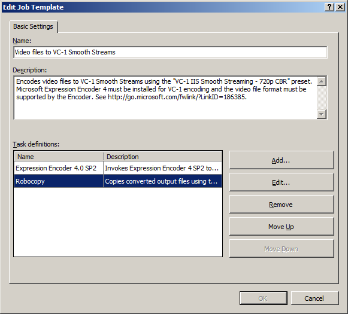
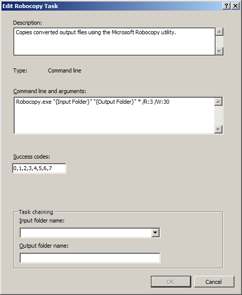

# Chaining the Robocopy Task to your Transformed Output

by Dave Nelson

The built-in **Robocopy** task in IIS Transform Manager 1.0 is a useful task that you can add to your job templates to copy the transformed output from tasks that precede it to an alternate location on a network. As jobs are run, the transformed output for completed jobs, which can be very large, accumulate on the disk and can impact performance as disk space is consumed. Before [file maintenance](https://technet.microsoft.com/library/hh147635.aspx) is performed, you can copy these files from the Transform Manager computer to network-attached storage, or even directly to a Smooth Streaming website for delivery to clients.

This article describes how to attach the **Robocopy** task in Transform Manager to a job template, and then configure it so that it acts on the output of a task that precedes it in a task-chaining workflow.

## Licensing

IIS Transform Manager is designed to work with other programs, such as programs that handle audio or video signals. It's solely your responsibility to ensure your compliance with any terms accompanying such other programs, and that you have obtained any necessary rights for your use of the programs.

## Configuring the Robocopy Task

1. In the **Job Templates** page, select a job template that you'll use to transform media content, and then click **Edit** in the **Actions** pane.
2. In the **Edit Job Template** dialog box, click **Add**.  
   
3. In the **Add Tasks** dialog box, in the **Available tasks** list, select **Robocopy**, and then click **OK**.  
   
4. In the **Edit Job Template** dialog box, select the **Robocopy** task in the **Task definitions** list, and then click **Move Up** or **Move Down** until it's displayed below the task that's creating the output that you want to copy.  
     
  
   The **Task definitions** list displays tasks in the order that they run, from top (the first task that's run) to bottom (the last task that's run). In the above example, the **Robocopy** task will act on the Smooth Streaming output that's created by the **Expression Encoder 4.0 SP2** task.
5. Select the **Robocopy** task in the **Task definitions** list, and then click **Edit**.  
   
6. In the **Edit Robocopy Task** dialog box, edit the **Command line and arguments** string to specify a location to which to copy the transformed output files.  
   

   1. In the **Command line and arguments** string, replace `{Input Folder}` with the virtual **Output folder name** of the preceding task. This is the virtual folder name where the **Robocopy** task will look for transformed files created by the preceding task. For example:

      [!code-console[Main](chaining-the-robocopy-task-to-your-transformed-output/samples/sample1.cmd?highlight=1)]

   2. Replace `{Output Folder}` with the UNC path of a network share or website. This is the location to which the transformed output files from the preceding task will be copied. For example:

      [!code-console[Main](chaining-the-robocopy-task-to-your-transformed-output/samples/sample2.cmd?highlight=1)]

      A watch folder's job manager runs tasks, including the **Robocopy** task, under the security context of a user account that you configure while configuring the watch folder that the job template is bound to. Make sure that this user account has the necessary permissions to copy files to the `{Output Folder}` location that you specify. For more information, see [Creating Watch Folder Impersonation Accounts](https://technet.microsoft.com/library/hh147633.aspx) .

   3. If desired, specify the file types that the task will copy by updating the file filter. The default value (`*`) means that the task will copy all of the transformed output generated by the preceding task. If you want to copy specific file types from the transformed output, specify the file name extension of those files. For example:

      [!code-console[Main](chaining-the-robocopy-task-to-your-transformed-output/samples/sample3.cmd?highlight=1)]

   4. Specify the number of times that the task will try to copy a transformed output file if it fails the first time (`/R:3`) and how long it will wait between each attempt in seconds (`/W:30`). In the above example, if the task initially fails to copy the transformed output, it will try to copy the output up to 3 more times and wait for 30 seconds between each attempt.  
  
      For example, to configure the task to retry 5 times and wait for 1 minute between each attempt, enter:

      [!code-console[Main](chaining-the-robocopy-task-to-your-transformed-output/samples/sample4.cmd?highlight=1-2)]

   5. Finally, add a runtime substitution token after the `{Output Folder}` destination to specify what job-specific information should be used as the name of a folder that the task will create when it copies the transformed output files to the destination. For example:

      [!code-console[Main](chaining-the-robocopy-task-to-your-transformed-output/samples/sample5.cmd?highlight=1)]

      The substitution token that you enter after the `{Output Folder}` path is used to generate a new folder whose name will be expanded to include the job-specific information specified by the substitution token.

      To add a substitution token into the command-line string, right-click after the `{Output Folder}` in the string to create an insertion point. This will expose a list of the available substitution tokens from which you can select.  

      

      | Name | Description |
      | --- | --- |
      | File Name | Expands to the file name of a file that's dropped in the watch folder, without the file name extension. |
      | File Extension | Expands to the file name extension of a file that's dropped in the watch folder. |
      | File Full Name | Expands to the full name (file name and file name extension) of a file that's dropped in the watch folder. |
      | User Manifest | Expands to the full name (file name and file name extension) of a manifest that's dropped in the watch folder. |
      | Default Manifest | Expands to the full name (file name and file name extension) of a manifest that's generated by Transform Manager. |
      | DateTime Local(yyyyMMddHHmmssffff) | Expands to the current date/time in local time format, using a formatted date/time string. The formatting can be modified inside the parenthesis to use any supported .NET **dateTime** format string. |
      | DateTime Local(yyyy-MM-dd) | Expands to the current date/time in local time format. |
      | DateTime UTC(yyyyMMddHHmmssffff | Expands to the current date/time in Universal Coordinated Time (UTC) format, using a formatted date/time string. The formatting can be modified inside the parenthesis to use any supported .NET **dateTime** format string. |
      | DateTime UTC(yyyy-MM-dd) | Expands to the current date/time in UTC format. |
      | New GUID | Expands to a new GUID formatted with dashes. For example, D44D00D7-204D-415C-95E6-DD815300B668. |
      | Job ID | Expands to the job ID of the transform job. |
      | Watch Folder | Expands to the watch folder root path. |
      | Input Folder | Expands to the task input folder path. |
      | Output Folder | Expands to the task output folder path. |

7. To add additional substitution tokens, right-click after the `{Output Folder}` in the string and before or after a previously added substitution token to create an insertion point, and select an additional token. In this way, you can build a job-specific destination directory that includes multiple points of information. For example, if you want to include the watch folder path and the file name of the dropped media asset in the directory path:

   [!code-console[Main](chaining-the-robocopy-task-to-your-transformed-output/samples/sample6.cmd?highlight=1)]

   Substitution tokens that you add must be separated by the backslash (`\`) character.

8. In the **Success codes** box, specify which of the standard [Robocopy return codes](https://support.microsoft.com/kb/954404) should be recorded as successful operations in job instance logs by editing the comma-delimited string.
9. Click **OK** to close the **Edit Robocopy Task** dialog box.

> [!NOTE]
>
> - If you used this procedure to edit a job template that was bound to a watch folder that was started, restart the watch folder to apply the changes:
>
>    1. Select the watch folder in the **Watch Folders** page.
>    2. In the **Actions** pane, click **Stop**.
>    3. In the **Actions** pane, click **Start**.
> - If you restart a watch folder to apply changes, and the watch folder is either running jobs or jobs are queued in the watch folder for processing, the following conditions apply:
>   - If the watch folder was running jobs and you click **Stop** to stop the watch folder, the currently running jobs will finish before the watch folder stops. Queued jobs won't be submitted for processing.
>   - If you want to apply the changes to currently running and queued jobs, you must cancel these jobs, restart the watch folder, and then drop the original media sources in the watch folder again so that they can be processed with the updated settings. For more information about how to manage jobs in watch folders, see Running and Monitoring Jobs.
> - If you used the Robocopy task to copy transformed output from a preceding task to a Smooth Streaming website, see [Delivering Transform Manager Output to Clients](delivering-transform-manager-output-to-clients.md) to learn how to create a webpage that Silverlight clients can use to play Smooth Streams, or an HTML5 webpage that clients on Apple mobile digital devices can use to play Apple HTTP Live Streams.
