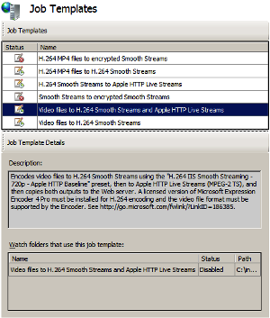
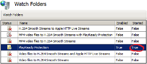

Encrypting On-Demand Smooth Streams
====================
by Dave Nelson

In IIS Transform Manager 1.0, you can configure a built-in **Smooth Streams to encrypted Smooth Streams** job template to add Microsoft PlayReady protection to previously encoded Smooth Streaming presentations. The **PlayReady Protection** task that's attached to this job template can also be attached to other job templates that output Smooth Streams so that the Smooth Streams can be encrypted in a task-chaining scenario.

This article applies to the following watch folders in IIS Transform Manager 1.0:

- PlayReady Protection
- H.264 MP4 video files to H.264 Smooth Streams (task-chaining)
- Video files to H.264 Smooth Streams and Apple HTTP Live Streams (task-chaining)
- Video files to VC-1 Smooth Streams (task-chaining)

In this article:

[Licensing](encrypting-on-demand-smooth-streams.md#license)  
[Getting Started](encrypting-on-demand-smooth-streams.md#get_started)  
[Installing Transform Manager](encrypting-on-demand-smooth-streams.md#install_tm)  
[Configuring the Transform Manager Service](encrypting-on-demand-smooth-streams.md#config_svc)  
[Production Notes](encrypting-on-demand-smooth-streams.md#prod_notes)  
[Configuring Job Templates](encrypting-on-demand-smooth-streams.md#config_jt)  
[Chaining the PlayReady Protection Task to a Job Template](encrypting-on-demand-smooth-streams.md#chain_task)  
[Configuring PlayReady Protection Task Properties](encrypting-on-demand-smooth-streams.md#config_task)  
[Configuring Watch Folders](encrypting-on-demand-smooth-streams.md#config_wf)  
[Transforming Smooth Streams to Encrypted Smooth Streams](encrypting-on-demand-smooth-streams.md#tm1)  
[Transforming Media Files to Encrypted Smooth Streams](encrypting-on-demand-smooth-streams.md#tm2)  
[Managing and Monitoring your Transform Jobs](encrypting-on-demand-smooth-streams.md#tm_jobs)

## Licensing

IIS Transform Manager is designed to work with other programs, such as programs that handle audio or video signals. It's solely your responsibility to ensure your compliance with any terms accompanying such other programs, and that you have obtained any necessary rights for your use of the programs.

## Getting Started

This section describes the software configuration and other requirements to run the media transforms that are described in this article.

### Installing Transform Manager

For specific installation instructions, see **Downloading and Installing** in the [Transform Manager Readme](iis-transform-manager-readme.md).

### Configuring the Transform Manager Service

Create an account for the Transform Manager service and then start the service. You must create the account and start the service in Internet Information Services (IIS) Manager. Unexpected results can occur if you start the Transform Manager service in the Services MMC console. For instructions, see [Configuring the Transform Manager Service](https://technet.microsoft.com/library/ff730170.aspx).

### Production Notes

- You can add the built-in **Robocopy** task in Transform Manager to a job template to move the encrypted Smooth Streaming output to a web server that's running [IIS Smooth Streaming](../../../downloads/microsoft/smooth-streaming.md) or to network-attached storage. For more information, see [Chaining the Robocopy Task to your Transformed Output](chaining-the-robocopy-task-to-your-transformed-output.md).
- This article describes a way to encrypt legacy Smooth Streaming presentations that the IIS Smooth Streaming feature in IIS Media Services 4 can deliver to Silverlight clients. For more information, see [Delivering Transform Manager Output to Clients](delivering-transform-manager-output-to-clients.md).
- The **PlayReady Protection** task in Transform Manager must acquire a content key or key seed from a PlayReady license server to encrypt content. In addition, the PlayReady license server issues licenses to Silverlight clients to enable playback of your encrypted Smooth Streaming presentations. A PlayReady Service Provider can provide these services for you, or you can create your own PlayReady license server by licensing the PlayReady Server SDK. For more information, see the [Microsoft PlayReady website](https://www.microsoft.com/PlayReady/Default.mspx).

## Configuring Job Templates

IIS Transform Manager includes a built-in **Smooth Streams to encrypted Smooth Streams** job template to which the **PlayReady Protection** task is attached. This task applies Microsoft PlayReady content protection to Smooth Streaming presentation files that you drop into the **PlayReady Protection** watch folder.

You can also add the **PlayReady Protection** task to other built-in job templates that produce Smooth Streaming output as part of a task-chaining workflow. For more information, see [Chaining the PlayReady Protection Task to a Job Template](encrypting-on-demand-smooth-streams.md#chain_task).

To configure job templates, do the following:

1. In IIS Manager, in the **Connections** pane, click **Job Templates**.  
    
2. In the **Job Templates** page, select the **Smooth Streams to encrypted Smooth Streams** job template or one of the other job templates that produces unencrypted Smooth Streaming output (for example, the **Video files to H.264 Smooth Streams and Apple HTTP Live Streams** job template). 

    | **Smooth Streams to encrypted Smooth Streams** | **Video files to H.264 Smooth Streams and Apple HTTP Live Streams** |
    | --- | --- |
    |  |  |
    | *Click image to enlarge* | *Click image to enlarge* |
  
 Note the name of the watch folder that the job template is bound to in     **Watch folders that use this job template** . We'll configure this watch folder to run the transformation jobs later in this article.
3. In the **Actions** pane, click **Edit**.  
    
4. In the **Edit Job Template** dialog box, on the **Basic Settings** tab, you can edit the job template **Name** and **Description** to give it more descriptive information for your environment.  

    | **Smooth Streams to encrypted Smooth Streams** | **Video files to H.264 Smooth Streams and Apple HTTP Live Streams** |
    | --- | --- |
    |  |  |
    | *Click image to enlarge* | *Click image to enlarge* |

 The     **Task definitions** list shows the tasks that are used by the job template.  

    |  > [!NOTE]
 > - The **Edit Job Template** dialog box will display a task configuration error message on the **Messages** tab if a required property value for the **PlayReady Protection** task isn't specified. You can ignore this message for now as we'll configure the required task properties later in this article. |
    | --- |
5. If you selected the **Smooth Streams to encrypted Smooth Streams** job template, select the **PlayReady Protection** task in the **Task definitions** list, click **Edit**, and then [configure the **PlayReady Protection** task properties](encrypting-on-demand-smooth-streams.md#config_task).  
      
  
 If you selected another job template, you must add the     **PlayReady Protection** task to the proper location in the     **Task definitions** list before configuring its properties. For more information, see     [Chaining the PlayReady Protection Task to a Job Template](encrypting-on-demand-smooth-streams.md#chain_task) .

### Chaining the PlayReady Protection Task to a Job Template

In Transform Manager, you can add the **PlayReady Protection** task to one of the built-in job templates to produce encrypted Smooth Streaming output as part of its workflow.

For more information about how to configure the task that creates the Smooth Streams before they're encrypted by the **PlayReady Protection task**, see the following configuration guidance:

| If you used this job template… | See the following: |
| --- | --- |
| H.264 MP4 files to H.264 Smooth Streams | [Using the MP4 to Smooth Task](https://blogs.iis.net/johndeu/archive/2011/04/29/iis-transform-manager-beta-using-the-mp4-to-smooth-task.aspx) |
| Video files to H.264 Smooth Streams and Apple HTTP Live Streams | [Configuring the Expression Encoder 4.0 SP2 Task](transforming-media-files-to-apple-http-live-streams.md#configure_task1) |
| Video files to VC-1 Smooth Streams | [Configuring the Expression Encoder 4.0 SP2 Task](transforming-media-files-to-on-demand-smooth-streams.md#configure_task) |

To add the **PlayReady Protection** task to the existing workflow, do the following (The **Video files to H.264 Smooth Streams and Apple HTTP Live Streams** job template is used as an example in the following procedure):

1. In the **Edit Job Template** dialog box, click **Add**.  
    
2. In the **Add Tasks** dialog box, select the **PlayReady Protection** task in the **Available tasks** list, and then click **OK**.  
    
3. In the **Edit Job Template** dialog box, select the **PlayReady Protection** task in the **Task definitions** list, and then click the **Move Up** or **Move Down** buttons until it's displayed below the task that creates the Smooth Streaming output that you want to encrypt.  
      
  
 In this example, both the     **Smooth Streams to Apple HTTP Live Streams** and     **PlayReady Protection** tasks will act on the Smooth Streaming output that the     **Expression Encoder 4.0 SP2** task creates.
4. Select the **Expression Encoder 4.0 SP2** task in the **Task definitions** list, and then click **Edit**. Note the value of **Output folder name** for this task, and then click **Cancel** to close the dialog box.  
    
5. Select the **PlayReady Protection** task in the **Task definitions** list, and then click **Edit**. In the **Edit PlayReady Protection Task** dialog box, in **Input folder name**, select the **Expression Encoder 4.0 SP2** task output folder name.  
    
6. [Configure the **PlayReady Protection** task properties](encrypting-on-demand-smooth-streams.md#config_task).

### Configuring PlayReady Protection Task Properties

The built-in **PlayReady Protection** task in Transform Manager creates encrypted Smooth Streaming presentations that are compliant with Microsoft PlayReady technologies. The task implements PlayReady Digital Rights Management on your Smooth Streams, enabling you to post your presentations to your web server with the confidence that they'll be used by Silverlight clients in the way that you specify.

The **PlayReady Protection** task in Transform Manager must acquire a content key (or a key seed that's used to generate a content key) from a PlayReady license server to encrypt content. In addition, the PlayReady license server issues the licenses to Silverlight clients, which are required to play your encrypted Smooth Streaming presentations. The license contains a content policy that specifies how the content can be used. For example, the policy can specify the number of times the encrypted presentation can be played and when the license expires. The content policy properties in a license are configured separately from the content encryption. A PlayReady Service Provider can provide these services for you, or you can create your own PlayReady license server by licensing the PlayReady Server SDK. For more information, see the [Microsoft PlayReady website](https://www.microsoft.com/PlayReady/Default.mspx).

This section describes how to configure the **PlayReady Protection** task properties to create encrypted Smooth Streams. To configure the task properties, do the following:

1. In the **Edit PlayReady Protection Task** dialog box, you can edit task properties in the **Properties** list. Select a property in the list, and then double-click the **Value** field to add or update the value.  
      
  
 The following guidance applies to properties of particular importance for this workflow:  

    | Name | Required | Description |
    | --- | --- | --- |
    | contentKey -or- keySeedValue | false | A content key is used to encrypt the Smooth Streams. Depending on how the PlayReady license server is configured, it will provide either a base64-encoded content key or a base64-encoded key seed that is hashed with the **keyID** value to generate a content key. Get one of these keys from your PlayReady Service Provider, and then type the 16-byte **contentKey** value or the 30-byte **keySeedValue** into the appropriate task property **Value** field. |
    | keyId | false | A key ID is globally unique identifier (GUID) that uniquely identifies a Smooth Streaming presentation (or a group of presentations). The PlayReady license server generates a different license for each key ID. Leave this value blank if you want to ensure that a unique GUID value is used to identify each Smooth Streaming presentation that's encrypted. When a value isn't specified for this property, a random value is automatically generated for each presentation to ensure that it has a unique value and that a different license is required to unlock the files. To specify a GUID value for a group of Smooth Streaming presentations (such as episodes from one program), type a valid GUID value. The encryption process will specify the same key ID for all of the Smooth Streaming presentations and the PlayReady license server will generate one license to unlock all of the files. |
    | licenseAcquisitionUrl | true | Type the webpage address on a PlayReady license server from which Silverlight clients can obtain a license to play the encrypted Smooth Streams. The general URL format is `http://[server name]/playready/rightsmanager.asmx`. However, some PlayReady Service Providers might require you to use a different URL. Consult with your provider if you're not sure. |
2. After reviewing or modifying the properties in the **Edit PlayReady Protection Task** dialog box, click **OK**.
3. In the **Edit Job Templates** dialog box, click **OK** to save your modifications to the job template.

When the **PlayReady Protection** task runs, it embeds the key ID and license acquisition URL in the Smooth Streaming presentation client manifest (.ismc) file content header during the transformation. When a Silverlight client tries to access your encrypted content, it sends the key ID to the license acquisition URL of the PlayReady license server. The license server uses the key ID to do one of two things depending on how it's configured:

- If it's configured to use a content key, it generates a license with the content key that's associated with the key ID.
- If it's configured to use a key seed, it generates a license with a content key that's derived from the key ID and the key seed on the server.

In either case, the license server generates a license derived from the content key, digitally signs it, and downloads it to the client computer. Both the content key and key seed are the primary protectors of the file, so you should make sure that they remain confidential. Neither the content key or key seed are stored in the content header, and clients can't access either of these seeds.

The Silverlight PlayReady DRM component on the local computer verifies the license, including any content policies such as the license expiration date, before the Silverlight client can play the Smooth Streaming presentation.

|  > [!NOTE]
 > - You can specify **keyID** and **keySeedValue** values in the Smooth Streaming presentation server manifest (.ism) file content header to override the property values in the **PlayReady Protection** task definition. This provides another option to ensure that your Smooth Streaming presentations are uniquely identified for licensing purposes. For more information, see William Zhang's blog, [How to add PlayReady protection in a Transform Manager job template](https://blogs.msdn.com/b/playready4/archive/2011/09/02/how-to-add-playready-protection-in-a-transform-manager-job-template.aspx). |
| --- |

## Configuring Watch Folders

To run encryption jobs on Smooth Streams, you must configure the watch folder in Transform Manager that uses the job template that you configured in the [previous section](encrypting-on-demand-smooth-streams.md#config_task). The watch folder detects when specified media file types (either Smooth Streaming presentation files or media asset files) arrive in it, and then Transform Manager runs the job template tasks (including the **PlayReady Protection** task) against the files. You can use the **Edit Watch Folder** property sheet to specify the watch folder location, the media file types that it "watches" for, the task scheduler that runs the tasks in it, the user account that tasks impersonate, as well as many other settings.

To configure the watch folder, do the following:

1. In IIS Manager, in the **Connections** pane, click **Watch Folders**.  
    
2. In the **Watch Folders** page, select the watch folder that uses the job template that you configured in the [previous section](encrypting-on-demand-smooth-streams.md#config_task). You can confirm that you're using the right watch folder by looking at the **Job template** value in the **Watch Folder Details** pane.  

    | **PlayReady Protection** | **Video files to H.264 Smooth Streams and Apple HTTP Live Streams** |
    | --- | --- |
    |  |  |
    | *Click image to enlarge* | *Click image to enlarge* |
3. In the **Actions** pane, click **Edit**.  
    
4. Configure required settings in the watch folder property sheet by using the instructions in [Configuring Watch Folders](https://technet.microsoft.com/library/ff730178.aspx). The following guidance applies to settings of particular importance for this workflow:  

    | Tab | Settings | Description |
    | --- | --- | --- |
    | Basic Settings | Input files | If you used the **PlayReady Protection** watch folder, in **File Filter**, type **\*.ism**, and then select the **Parse playlist file** check box. This combination of options specifies that the watch folder watches for IIS Smooth Streaming presentation manifest (.ism) files and that the watch folder job manager won't schedule a job for the Smooth Streaming presentation until all of the video (.ismv) and audio (.isma) files that are referenced in the manifest are present. If you added the **PlayReady Protection** task to a job template that transforms media files to Smooth Streams, in **File filter**, specify one or more of the file formats supported by Expression Encoder. The supported string format is an asterisk (\*), followed by a period, and then the file name extension (for example, **\*.wmv** and **\*.mp4** are valid file filters). If you type **\*** to specify that the job template acts on all file types, only the [supported file formats](https://msdn.microsoft.com/library/cc294687(Expression.40).aspx) will be processed. Specifying multiple file formats (for example, in a comma-delimited list) isn't supported. |
    | Scheduler | Scheduler | In **Scheduler**, select **Local Task Scheduler** to specify that Windows Task Scheduler on the local computer be used to run jobs, monitor and report job status, and allocate CPU resources to tasks. For large computation-intensive jobs (such as encoding and transcoding) where CPU resources might not be sufficient, you can shift the jobs from the local computer to computers in a High Performance Computing (HPC) cluster, and then configure the watch folder to use the HPC Task Scheduler on the head node in the HPC cluster. For more information about how to use Transform Manager with an HPC cluster, see [High-Performance Transcoding with IIS Transform Manager and Windows HPC Server](high-performance-transcoding-with-iis-transform-manager-and-windows-hpc-server.md). |
    | Scheduler | Concurrent jobs and Priority | Use these settings to manage computer resources. **Concurrent jobs** controls how many jobs can run at the same time in the watch folder. The value is **1** by default, which means that if you drop 10 playlist files in the watch folder, only one will begin processing immediately while the rest go into a job queue. You can adjust this setting depending on the physical memory and number of CPUs available. If jobs fail due to low available memory and CPU resources, increase the amount of available RAM and/or CPUs, or reduce the number of concurrent jobs to **1**. Selecting the **Unlimited** check box disables the concurrency setting and immediately schedules all playlist files that are detected in the watch folder for processing. **Priority** controls the priority that jobs are given when scheduled by a watch folder. If multiple watch folders are running on the computer, you can assign a **Priority** value to each one. This setting enables jobs that are in high-priority watch folders to be created and run first. If you drop media assets in a watch folder, but another watch folder that has a higher priority level is actively running jobs, the jobs for the dropped media assets aren't created and queued for processing until the higher-priority watch folder finishes all of its jobs. |
    | Advanced Settings | Credentials | You must specify a user account for the watch folder to impersonate. The tasks in the job template that's bound to the watch folder will run under the security context of this user account. You must ensure that it has the required permissions for the tasks that are run. For more information about how to create this account, see [Creating Watch Folder Impersonation Accounts](https://technet.microsoft.com/library/hh147633.aspx). |
5. Click **OK** to save your modifications to the watch folder.
6. On the **Watch Folders** page, select the watch folder, and then, in the **Actions** pane, click **Enable**.  
       
  
 The watch folder is now enabled, but not yet started. 

    | **PlayReady Protection** | **Video files to H.264 Smooth Streams and Apple HTTP Live Streams** |
    | --- | --- |
    |  |  |
    | *Click image to enlarge* | *Click image to enlarge* |
  
 Watch folders that are enabled will automatically start when the Transform Manager service is restarted. This setting is provided to start watch folders after a service recycle event or after a computer restart.
7. In the **Actions** pane, click **Start**.  
       
  
 The watch folder is now active and ready to accept dropped media assets (either Smooth Streaming presentation files or media asset files). 

    | **PlayReady Protection** | **Video files to H.264 Smooth Streams and Apple HTTP Live Streams** |
    | --- | --- |
    |  |  |
    | *Click image to enlarge* | *Click image to enlarge* |

    |  > [!NOTE]
 > - You can't start a watch folder if another active watch folder thread is already using the same watch folder root path. |
    | --- |

## Transforming Smooth Streams to Encrypted Smooth Streams

The **PlayReady Protection** watch folder's job manager will schedule a job for the Smooth Streaming presentation, and when all of the media files that are referenced in the Smooth Streaming presentation server manifest (.ism) file are present, move the manifest file and media assets as a group to the watch folder's WorkQueue directory.

To begin transforming content, copy-and-paste the ISM file, the Smooth Streaming client manifest (.ismc) file, and all of the bitrate streams (.isma and ismv) files that are referenced in the ISM file into the watch folder directory by using Windows Explorer or another file-movement mechanism such as command line, FTP, or WebDav.  

The watch folder directory is specified in the **Watch folder path** setting on the **Basic Settings** tab of the watch folder property sheet.  

|  > [!NOTE]
 > - Don't drop multiple ISM manifest files in the watch folder at the same time if they reference the same streams. The job manager will schedule jobs for media files that are referenced in one ISM manifest, and when all of the streams that are referenced in the manifest are present, move the manifest and streams as a group to the watch folder's WorkQueue directory. Another manifest that references the same streams then can't be processed because the streams were removed from the watch folder with the previous manifest. To schedule jobs for this manifest, you must drop the missing streams into the watch folder again. |
| --- |

## Transforming Media Files to Encrypted Smooth Streams

A job is created for each media asset that's dropped in a watch folder and meets the watch folder file filter requirements. For example, if the **File filter** setting for a watch folder is set to detect all Windows Media Video (WMV) files, a job is created for each WMV file that's dropped in the watch folder. Media files with file-name extensions that don't match the watch folder's **File filter** setting are ignored.

To begin transforming content, copy-and-paste the media assets into the watch folder directory by using Windows Explorer or another file-movement mechanism such as command line, FTP, or WebDav.  

The watch folder directory is specified in the **Watch folder path** setting on the **Basic Settings** tab of the watch folder property sheet.  

## Managing and Monitoring your Transform Jobs

After you drop Smooth Streaming presentation files or media assets into a watch folder, the watch folder's job manager creates a job for the presentation or assets and moves the associated files into the watch folder's WorkQueue directory. The files are moved from the watch folder into the WorkQueue quickly if they're small. The watch folder might not discover larger files for up to 60 seconds. If the files don't disappear after 60 seconds, make sure that you're in the correct watch folder or that you've enabled and started the correct watch folder.

The WorkQueue directory contains folders that store the jobs as they're being processed. Media assets that are successfully processed are placed in the Finished folder while assets that can't be processed are placed in the Failed folder. These folders are visible by default so that you can retrieve their contents more easily. The WorkQueue directory contains other folders that temporarily store jobs as they're run through the job workflow. These folders are hidden folders and to view them, you must turn on the **Folder views** option in Windows that shows hidden files, folders, and drives.  

As jobs are processed through the WorkQueue folders, you can use the Job Monitor pages in IIS Manager to view the progress of and manage currently running and queued jobs. For more information, see [Running and Monitoring Jobs](https://technet.microsoft.com/en-us/library/ff730174(v=ws.10).aspx).

As jobs are run, job files (which include the original media source files, job manifest files, and the transformed output for completed jobs) accumulate in the watch folder WorkQueue folders. They can eventually clutter the disk and potentially impact performance. For more information about how to configure settings to delete these files automatically from the WorkQueue after a specified amount of time, see [Running File Maintenance](https://technet.microsoft.com/library/hh147635.aspx).
  
  
[Discuss in IIS Forums](https://forums.iis.net/1145.aspx)