Sending Transform Manager Job Status Notifications to a Remote Web Application
====================
by [Mario Doiron](https://github.com/doiron)

You can configure a new notifications feature in [IIS Transform Manager 1.0](https://go.microsoft.com/?linkid=9772659) to POST web requests with job status changes to a remote web application or service. This enables web developers to build a custom Transform Manager job-monitoring system. The following are some of the benefits to be gained from building such an application:

- Users don't need to be logged-on to the local Transform Manager computer to view job status. The remote web application allows users to view job status from anywhere.
- Users don't need to be part of the local Administrators group to view job status. The web application can allow/deny user access to reports, without having to grant administrative rights on the Transform Manager computer.
- The web application can receive notifications from multiple Transform Manager computers, providing a global status on the cluster.
- The web application can filter notifications from unwanted watch folders on a Transform Manager computer.
- The web application that receives the job status information can be customized to suit your needs.

This article describes a sample ASP.NET MVC 3 web application on the Windows Azure platform that receives Transform Manager job status.

## Licensing

IIS Transform Manager is designed to work with other programs, such as programs that handle audio or video signals. It's solely your responsibility to ensure your compliance with any terms accompanying such other programs, and that you have obtained any necessary rights for your use of the programs.

## About the POST Message Body

IIS Transform Manager sends job status information in the HTTP POST request body in a notification. The following is an example of the XML syntax in the POST message body:

[!code-xml[Main](sending-transform-manager-job-status-notifications-to-a-remote-web-application/samples/sample1.xml)]

Let's take a closer look at each of the XML elements:

- **IISTransformManager**. The root XML element.
- **queue**. The job instance status.
- **workItem**. The collection of attributes that describe the job instance.
- **jobName**. The unique job identifier that is created by Transform Manager.
- **folder**. The watch folder that the job was submitted to.
- **jobDefinitionId**. The unique identifier that is used by Transform Manager to identify a specific job definition.
- **jobTemplateId**. The unique identifier that is used by Transform Manager to identify a specific job template.
- **jobSchedulerId**. The unique identifier that is used by Transform Manager to identify a specific job scheduler.
- **manifestName**. The job manifest that is created by Transform Manager.
- **instanceFileName**. The file that triggered the creation of this job instance.
- **queueTime**. The date/time of the job status change.
- **progress**. The job progress as a percentage-completed value.
- **submitTime**. The date/time the job was submitted.
- **startTime**. The date/time the job was started.
- **endTime**. The date/time the job ended (finished, failed, or canceled).
- **priority**. The watch folder priority value.
- **status**. The current job status.
- **taskCount**. The number of tasks in the job template.
- **taskIndex**. The last task index that was reported.
- **log**. The job instance log entries. This element is only included if the job status is 'Failed' and Transform Manager is configured to include job instance logs for failed jobs. For more information about how to configure notifications to include log information, see [Configuring Job Status Notifications](https://go.microsoft.com/?linkid=9772675).

## Creating a Sample Web Application

In this section, I'll show you how to integrate IIS Transform Manager notifications into a sample ASP.NET MVC 3 web application that is hosted in the Windows Azure Fabric. This section contains the following topics:

- [Requirements](sending-transform-manager-job-status-notifications-to-a-remote-web-application.md#requirements)
- [Creating the Web Application](sending-transform-manager-job-status-notifications-to-a-remote-web-application.md#create_app)
- [Modeling the Data](sending-transform-manager-job-status-notifications-to-a-remote-web-application.md#model_data)
- [Adding the Controller](sending-transform-manager-job-status-notifications-to-a-remote-web-application.md#add_controller)
- [Creating the View](sending-transform-manager-job-status-notifications-to-a-remote-web-application.md#create_view)
- [Testing the Web Application in Visual Studio](sending-transform-manager-job-status-notifications-to-a-remote-web-application.md#test_app)
- [Testing the Web Application in Transform Manager](sending-transform-manager-job-status-notifications-to-a-remote-web-application.md#transformmanager)

### Requirements

To create the sample web application to which Transform Manager will send notifications, install the following software on a computer that is running either the Windows 7 or Windows Server 2008 R2 operating system:

- [Microsoft Visual Studio 2010](https://go.microsoft.com/?linkid=9772680) and [Visual Studio 2010 Service Pack 1](https://go.microsoft.com/?linkid=9772676)
- [Windows Azure Tools SDK](https://go.microsoft.com/?linkid=9772677)
- [ASP.NET MVC 3](https://go.microsoft.com/?linkid=9772678)

### Creating the Web Application

Creating an ASP.NET MVC 3 Azure Web Role is not straightforward. Fortunately, there is a way to get MVC 3 up-and-running in Windows Azure. This section describes how to get MVC 3 assemblies deployed on a Windows Azure instance using techniques desribed in Steve Marx's blog [ASP.NET MVC 3 in Windows Azure](https://go.microsoft.com/?linkid=9772692). It involves creating a blank Windows Azure solution, adding an ASP.NET MVC 3 Web Application Project to the solution, and then configuring the ASP.NET MVC 3 Web Application Project as an Azure Web Role.

- [Create a Blank Windows Azure Solution](sending-transform-manager-job-status-notifications-to-a-remote-web-application.md#step1)
- [Create an ASP.NET MVC 3 Web Application Project](sending-transform-manager-job-status-notifications-to-a-remote-web-application.md#step2)
- [Add References to the ASP.NET MVC 3 Web Application Project](sending-transform-manager-job-status-notifications-to-a-remote-web-application.md#step3)
- [Configure the ASP.NET MVC 3 Web Application Project References](sending-transform-manager-job-status-notifications-to-a-remote-web-application.md#step4)
- [Configure the ASP.NET MVC 3 Web Application Project as an Azure Web Role](sending-transform-manager-job-status-notifications-to-a-remote-web-application.md#step5)
- [Add RoleEntryPoint](sending-transform-manager-job-status-notifications-to-a-remote-web-application.md#step6)
- [Configure Global.asax.cs](sending-transform-manager-job-status-notifications-to-a-remote-web-application.md#step7)
- [Configure Data Connection Settings](sending-transform-manager-job-status-notifications-to-a-remote-web-application.md#step8)

##### Create a Blank Windows Azure Solution

1. In Visual Studio, create a new Windows Azure solution.  
    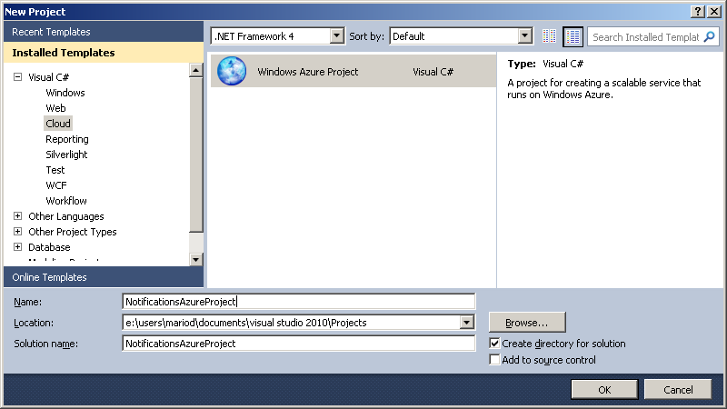
2. After you click **OK** in the **New Project** dialog box, the **New Windows Azure Project** dialog box is displayed.  
      
  
 Click **OK** in this dialog box as the ASP.NET MVC 3 Web Role is not available to add to the Windows Azure solution.

##### Create an ASP.NET MVC 3 Web Application Project

1. In **Solution Explorer**, right-click the Windows Azure solution that you created in the previous section, and then click **Add** &gt; **New Project**.  
    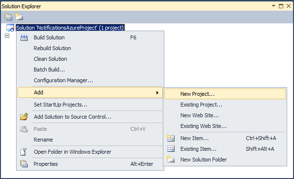
2. Create a new **ASP.NET MVC 3 Web Application** project.  
    
3. After you click **OK** in the **Add New Project** dialog box, the **New ASP.NET MVC 3 Project** dialog box is displayed.  
    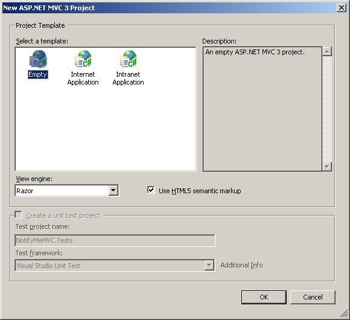  
  
 In this dialog box, select the **Empty** project template, and then click **OK**.

##### Add References to the ASP.NET MVC 3 Web Application Project

1. In **Solution Explorer**, right-click **References**, and then click **Add Reference**.  
    
2. In the **Add Reference** dialog box, on the **.NET** tab, select the following reference assemblies:  

    - Microsoft.Web.Infrastructure
    - Microsoft.WindowsAzure.CloudDrive
    - Microsoft.WindowsAzure.Diagnostics
    - Microsoft.WindowsAzure.ServiceRuntime
    - Microsoft.WindowsAzure.StorageClient
    - System.Data.Services.Client
    - System.Web.Helpers
    - System.Web.Razor
    - System.Web.WebPages
    - System.Web.WebPages.Deployment
    - System.Web.WebPages.Razor
  
 To select multiple components at once, press the CTRL key on your keyboard and then click each of the component names.  
      
  
 After you've selected all of the components, click **OK**.

##### Configure the ASP.NET MVC 3 Web Application Project References

1. In Solution Explorer, in **References**, select the following references:  

    - Microsoft.Web.Infrastructure
    - System.Web.Helpers
    - System.Web.Mvc
    - System.Web.Razor
    - System.Web.Routing
    - System.Web.Services
    - System.Web.WebPages
    - System.Web.WebPages.Deployment
    - System.Web.WebPages.Razor
  
   To select multiple references at once, press the CTRL key on your keyboard and then click each of the reference names. After you've selected all of the references, right-click the selected references, and then click **Properties**.  
    
2. In **Properties**, set the **Copy Local** property value to **True**.  
    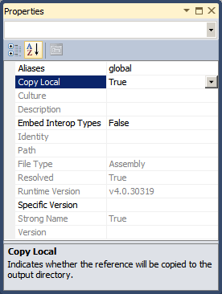
3. Close the **Properties** box.

##### Configure the ASP.NET MVC 3 Web Application Project as an Azure Web Role

1. In **Solution Explorer**, right-click the **Roles** folder, and then click **Add** &gt; **Web Role Project in solution**.  
    
2. In the **Associate with Role Project** dialog box, select the new ASP.NET MVC3 Web Application Project, and then click **OK**.

##### Add RoleEntryPoint

In order for the MVC Web Role to launch correctly, we must include a new class in the root of the project that inherits from the *RoleEntryPoint* class.

1. In **Solution Explorer**, right-click the ASP.NET MVC 3 Web Application Project, and then click **Add** &gt; **Class**.  
    
2. In **Name**, enter the project name as the class file name, and then click **Add**.  
    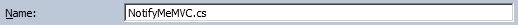
3. Replace the new class syntax with the following code:   

    [!code-csharp[Main](sending-transform-manager-job-status-notifications-to-a-remote-web-application/samples/sample2.cs)]

    [!code-console[Main](sending-transform-manager-job-status-notifications-to-a-remote-web-application/samples/sample3.cmd)]

##### Configure Global.asax.cs

1. In **Solution Explorer**, in the ASP.NET MVC 3 Web Application Project, right-click **Global.asax**, and then select **View Code**.  
    
2. Locate the *RegisterRoutes* static function and update the Default MapRoute. In our sample application, we replace 'Home' with our own 'JobMon' controller:   

    [!code-console[Main](sending-transform-manager-job-status-notifications-to-a-remote-web-application/samples/sample4.cmd)]
3. In the *Application\_Start* function, add a call to *SetConfigurationSettingPublisher* by pasting in the following code:  

    [!code-csharp[Main](sending-transform-manager-job-status-notifications-to-a-remote-web-application/samples/sample5.cs)]

##### Configure Data Connection Settings

1. In **Solution Explorer**, right-click the Azure Web Role, and then click **Properties**.  
    
2. In **Settings**, add a *DataConnectionString* of type *Connection String* set to **UseDevelopmentStorage**.  
    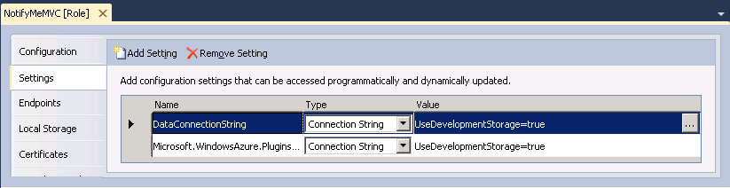

The ASP.NET MVC 3 Azure Web Role is now configured and we can start building the Job Notification MVC 3 application in Azure.

### Modeling the Data

In order to model the data, we must build the following model classes in the MVC Models project directory.

- [NotificationModel](sending-transform-manager-job-status-notifications-to-a-remote-web-application.md#notificationmodel)
- [NotificationDataServiceContext](sending-transform-manager-job-status-notifications-to-a-remote-web-application.md#notificationdataservicecontext)
- [NotificationDataSource](sending-transform-manager-job-status-notifications-to-a-remote-web-application.md#notificationdatasource)
- [NotificationComparer](sending-transform-manager-job-status-notifications-to-a-remote-web-application.md#notificationcomparer)

These model classes are used to insert and retrieve the POSTed XML data.

##### Building the NotificationModel Class

This class is the object model representation of the XML data in the POST message body. It inherits from the *TableServiceEntity* so that we can use it to talk to Azure Table Storage.

[!code-csharp[Main](sending-transform-manager-job-status-notifications-to-a-remote-web-application/samples/sample6.cs)]

We will need to include the following empty constructor that feeds unique default values to the base constructor.

[!code-csharp[Main](sending-transform-manager-job-status-notifications-to-a-remote-web-application/samples/sample7.cs)]

We will also need the following list of public properties that make up the entire POSTed XML data.

[!code-csharp[Main](sending-transform-manager-job-status-notifications-to-a-remote-web-application/samples/sample8.cs)]

Finally, a few static classes are needed to parse the XML into an instance object.

[!code-csharp[Main](sending-transform-manager-job-status-notifications-to-a-remote-web-application/samples/sample9.cs)]
   

[!code-csharp[Main](sending-transform-manager-job-status-notifications-to-a-remote-web-application/samples/sample10.cs)]

##### Building the NotificationDataServiceContext Class

This class defines the table name and provides a handle to query the data. It inherits *TableServiceContext*, which is where most of the logic takes place.

[!code-csharp[Main](sending-transform-manager-job-status-notifications-to-a-remote-web-application/samples/sample11.cs)]

[!code-csharp[Main](sending-transform-manager-job-status-notifications-to-a-remote-web-application/samples/sample12.cs)]

[!code-csharp[Main](sending-transform-manager-job-status-notifications-to-a-remote-web-application/samples/sample13.cs)]

##### Building the NotificationDataSource Class

This class provides an abstraction from the *NotificationDataServiceContext* class above. We are only going to implement a *Select* method to fetch all of the data, and add a means to add new notifications to the database. A full implementation of this model could include much more functionality, such as *Delete* and *Update*.

[!code-csharp[Main](sending-transform-manager-job-status-notifications-to-a-remote-web-application/samples/sample14.cs)]

[!code-csharp[Main](sending-transform-manager-job-status-notifications-to-a-remote-web-application/samples/sample15.cs)]

##### Building the NotificationComparer Class

This class is used to ensure that the data is displayed in the right order. We want the latest POST to be at the top of the list. We will also use this to apply a Distinct() filter to avoid multiple rows per job instance.

[!code-csharp[Main](sending-transform-manager-job-status-notifications-to-a-remote-web-application/samples/sample16.cs)]

[!code-csharp[Main](sending-transform-manager-job-status-notifications-to-a-remote-web-application/samples/sample17.cs)]

[!code-csharp[Main](sending-transform-manager-job-status-notifications-to-a-remote-web-application/samples/sample18.cs)]

[!code-csharp[Main](sending-transform-manager-job-status-notifications-to-a-remote-web-application/samples/sample19.cs)]

[!code-csharp[Main](sending-transform-manager-job-status-notifications-to-a-remote-web-application/samples/sample20.cs)]

We now have a model that can be leveraged to parse new notifications, insert them into a database, and select distinct jobNames in a sorted order. We can now start configuring a Controller.

### Adding a Controller

1. In **Solution Explorer**, in the ASP.NET MVC 3 Web Application Project, right-click **Controllers**, and then click **Add** &gt; **Controller**.  
    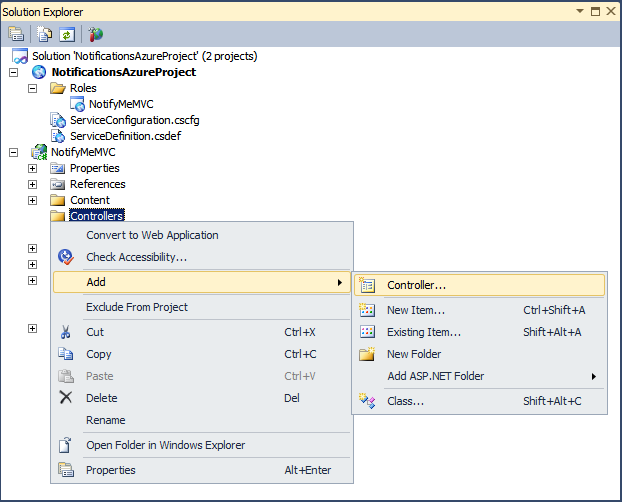
2. In the **Add Controller** dialog box, add an empty controller named **JobMonController**, and then click **Add**.  
    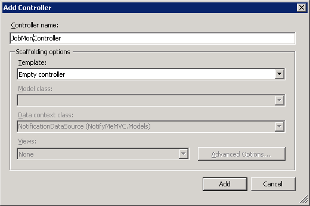
3. Update the new *JobMonController* class syntax with the code below. This code adds two public functions, one to handle Job Monitor pageview requests from users and another one to handle Transform Manager POST requests. 

    > [!NOTE]
    > The POST function must accept un-authenticated requests because IIS Transform Manager doesn't use authentication to POST the updates.

    [!code-csharp[Main](sending-transform-manager-job-status-notifications-to-a-remote-web-application/samples/sample21.cs)]

    [!code-csharp[Main](sending-transform-manager-job-status-notifications-to-a-remote-web-application/samples/sample22.cs)]

    [!code-csharp[Main](sending-transform-manager-job-status-notifications-to-a-remote-web-application/samples/sample23.cs)]

    [!code-csharp[Main](sending-transform-manager-job-status-notifications-to-a-remote-web-application/samples/sample24.cs)]

### Creating a View

1. In **Solution Explorer**, in the ASP.NET MVC 3 Web Application Project, right-click **Views**, and then click **Add** &gt; **New Folder**.  
    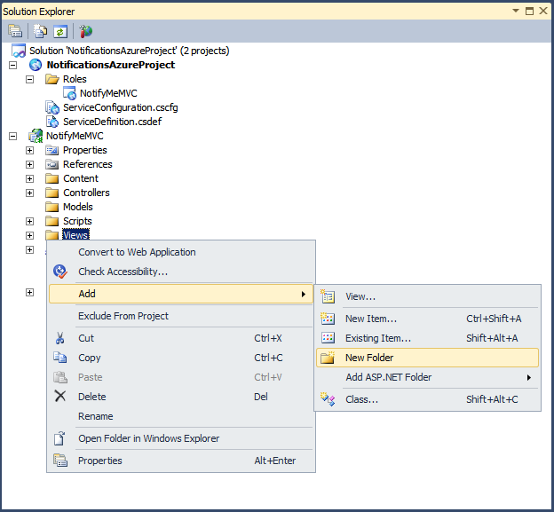
2. Name the new folder **JobMon**. It is important that this name match the controller name's prefix.  
    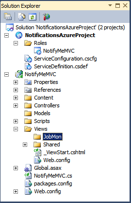
3. Right-click the **JobMon** folder, and then click **Add** &gt; **View**. The **Add View** dialog box is displayed.  
    
4. Configure the following settings in the dialog box, and then click **Add**: 

    - **View name**. Enter the name of the existing public function of our controller class: **Index**.
    - **Create a strongly-typed view**. Select this check box.
    - **Model class**. Select **NotificationModel** in the list.
    - **Scaffold template**. Select **List** in the list.

    > [!NOTE]
    > Optionally, we can edit the .\Views\JobMon\Index.cshtml file to update the displayed table columns. First, we can remove most of the columns in the table header:

    [!code-html[Main](sending-transform-manager-job-status-notifications-to-a-remote-web-application/samples/sample25.html)]

    Then, we must update the content rows to map to the columns in the updated table header.

    [!code-cshtml[Main](sending-transform-manager-job-status-notifications-to-a-remote-web-application/samples/sample26.cshtml)]
5. (Optional) Add some style.  
  
 The ASP.NET MVC 3 Web Application Project contains a file that hosts the Cascading Style Sheets (CSS) for the Views. We can make the report table borders a bit more distinct. If you know a great web designer, now is a good time to ask for the latest HTML 5 table mockups and CSS classes. For now, we can edit the project file \Content\Site.css and paste some extra style for adding table borders.  

    [!code-console[Main](sending-transform-manager-job-status-notifications-to-a-remote-web-application/samples/sample27.cmd)]

    [!code-css[Main](sending-transform-manager-job-status-notifications-to-a-remote-web-application/samples/sample28.css)]

    [!code-css[Main](sending-transform-manager-job-status-notifications-to-a-remote-web-application/samples/sample29.css)]

### Testing the Web Application in Visual Studio

When we run the Windows Azure solution for the first time, we should see the web browser open with a web page that looks similar to this.  

Earlier we wrote a *Post* function within the **JobMonController** to allow Transform Manager to send us job instance updates. Transform Manager can access this function by sending notifications to the following URI: `http://127.0.0.1:91/JobMon/Post`, where **JobMon** is the controller name and **Post** is the name of the public function in the controller. We will need to remember the URI value when we configure the notifications feature in Transform Manager, for testing against the Windows Azure Development Fabric.

One very important detail to note is the port value. When the Azure Development Fabric launches, its logic initializes the port on which the Web Application will be served. During the development phase of this project, that port number is certain to change from time to time. As we can see from the previous screenshot, the port number is set to **91**.

On a cleaner machine, the port value is usually **81** and increases from there. Check the port value whenever you run the project. If it has changed, you will need to update the notifications URI setting in Transform Manager with the new port value (for example to `http://127.0.0.1:92/JobMon/Post`). To minimize the number of port changes, wait until Transform Manager is idle (not running any jobs and posting any updates). Otherwise, if Transform Manager is actively using that port, the Azure Development Fabric will determine that the port is in use and try the next one.

### Testing the Web Application in Transform Manager

To test all of the XML elements, including the &lt;log /&gt;, we can configure a new watch folder in Transform Manager in which all jobs will fail. First we will create a new job template with a command-line task that calls a non-existent executable file, and then we will bind the job template to a new watch folder.

You can install Transform Manager either on the local computer or on a remote computer. For requirements and installation instructions, see the **Installation Notes** in the [Transform Manager Readme](https://go.microsoft.com/?linkid=9772776).

##### Create a new Job Template

1. In Transform Manager, in the **Connections** pane, select **Job Templates**.  
    
2. In the **Actions** pane, click **New**.
3. In the **New Job Template** property sheet on the **Basic Settings** tab, enter a friendly name for the job template in **Name**.
4. Click the **Add** button to add a task to the **Task definitions** list.
5. In the **Add Tasks** dialog box, in the **Available tasks** list, select the built-in **Command Line** task, and then click **OK**.
6. In the **New Job Template** property sheet, select the **Command Line** task in the **Task definitions** list, and then click **Edit**.
7. In the **Edit Command Line Task** dialog box, in **Command line**, enter a command-line string that will cause all jobs to fail. The easiest way to do this is to specify the name of an executable file that doesn't exist.  
    
8. Click **OK** to close the **Edit Command Line Task** dialog box, and then click **OK** to close the **New Job Template** property sheet.

##### Create a new Watch Folder

1. In Transform Manager, in the **Connections** pane, select **Watch Folders**.  
    
2. In the **Actions** pane, click **New**.
3. In the **New Watch Folder** property sheet, on the **Basic Settings** tab, specify values for **Name**, **Job template**, **Physical path**, and **File filter** as shown in the following screenshot.  
    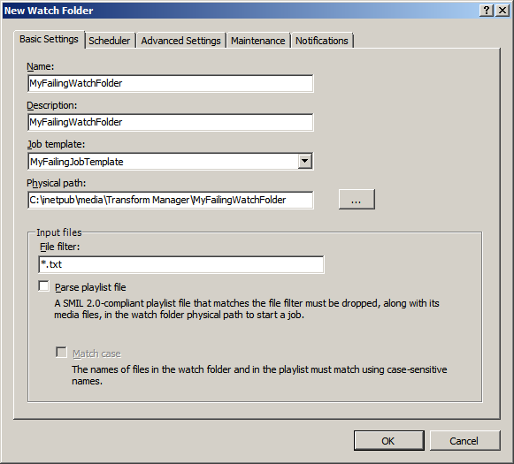  
  
    > [!NOTE]
    > In **Job template**, be sure to select the new job template we created in the previous section. For more information about how to configure watch folder settings, see [Configuring Watch Folders](https://go.microsoft.com/?linkid=9772777) .
4. Click the **Notifications** tab and configure the URI and event options.  
    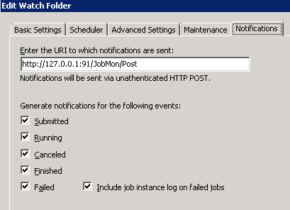  
  
 For testing purpose, we will enter the URI of the active running project and select all of the event check boxes. For more information about how to configure these settings, see [Configuring Job Status Notifications](https://go.microsoft.com/?linkid=9772675) .
5. Click **OK** to close the **New Watch Folder** property sheet.
6. Select the new watch folder in the **Watch Folders** page, and then in the **Actions** pane, **Enable** and then **Start** the watch folder.
7. Make sure that the Azure Web Application is running and listening to incoming requests.
8. In the **Actions** pane, click **Explore Watch Folder** to open the watch folder directory.
9. Drop a file that matches the watch folder's **File filter** setting into the watch folder directory. In our case, this is a .txt file.  
    

The dropped file should disappear after a short time. This means that Transform Manager has picked up the file and started to process it as a job instance.

##### Refresh the Report

In our Azure ASP.NET MVC3 Web Application, we should start seeing some data in the table. The following screenshot displays the data that appears after our test job has failed.  

From this we can see that the job failed trying to run BadFailingCommandLine.exe because the system could not find the file specified. It's quite obvious because we know that the executable file doesn't exist.

## Closing Notes

During this walkthrough we saw the benefits of having an external facing web application hosting the IIS Transform Manager job status updates. We learned about the POST request message body that is sent to notify our web application of status updates. Then, we looked at how such a web application could be built using an ASP.NET MVC3 Web Application hosted within the Azure Fabric. Finally, we finished the walkthrough with a simple test to view a failed job's instance log entries.