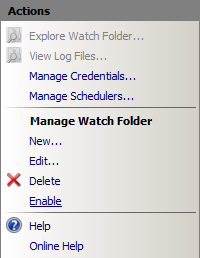
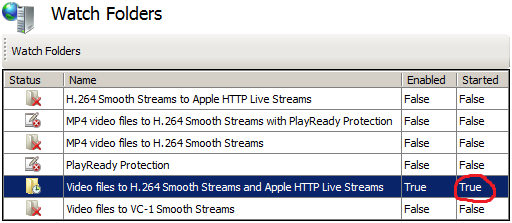
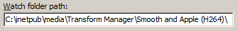

Transforming Media Files to Apple HTTP Live Streams
====================
by Dave Nelson

This article describes how to configure the default **Video files to H.264 Smooth Streams and Apple HTTP Live Streams** job template to transform Expression Encoder 4-supported media files to the MPEG-2 Transport Stream (MPEG-2 TS) container format in conformance with the [Apple HTTP Live Streaming Protocol Specification](https://developer.apple.com/library/ios/#documentation/NetworkingInternet/Conceptual/HTTPLiveStreaming/_index.html). As part of the transformation, an .m3u8 manifest file is created to form a complete Apple HTTP Live Streaming presentation that you can deliver to Apple mobile digital devices from a Web server that's running the [IIS Smooth Streaming](https://www.iis.net/downloads/microsoft/smooth-streaming) feature in IIS Media Services 4.

This article applies to the following watch folder in IIS Transform Manager 1.0:

- Video files to H.264 Smooth Streams and Apple HTTP Live Streams

In this article:

[Licensing](transforming-media-files-to-apple-http-live-streams.md#license)  
[Getting Started](transforming-media-files-to-apple-http-live-streams.md#get_started)  
[Installing Transform Manager](transforming-media-files-to-apple-http-live-streams.md#install_tm)  
[Choosing your Edition of Expression Encoder](transforming-media-files-to-apple-http-live-streams.md#choose_ee)  
[Configuring the Transform Manager Service](transforming-media-files-to-apple-http-live-streams.md#configure_svc)  
[Production Notes](transforming-media-files-to-apple-http-live-streams.md#prod_notes)  
[Configuring the Video files to H.264 Smooth Streams and Apple HTTP Live Streams Job Template](transforming-media-files-to-apple-http-live-streams.md#configure_jt)  
[Configuring the Expression Encoder 4.0 SP2 Task](transforming-media-files-to-apple-http-live-streams.md#configure_task1)  
[Configuring the Smooth Streams to Apple HTTP Live Streams Task](transforming-media-files-to-apple-http-live-streams.md#configure_task2)  
[Configuring the Video files to H.264 Smooth Streams and Apple HTTP Live Streams Watch Folder](transforming-media-files-to-apple-http-live-streams.md#configure_wf)  
[Running your Transform Jobs](transforming-media-files-to-apple-http-live-streams.md#run_jobs)  
[Managing and Monitoring your Transform Jobs](transforming-media-files-to-apple-http-live-streams.md#manage_jobs)

## Licensing

IIS Transform Manager is designed to work with other programs, such as programs that handle audio or video signals. It's solely your responsibility to ensure your compliance with any terms accompanying such other programs, and that you have obtained any necessary rights for your use of the programs.

## Getting Started

This section describes the software configuration and other requirements in order to run the media transform that's described in this article.

### Installing Transform Manager

For specific installation instructions, see **Downloading and Installing** in the [Transform Manager Readme](iis-transform-manager-readme.md).

### Choosing your Edition of Expression Encoder

The task workflow described in this article requires an integrated Expression Encoder 4.0 SP2 transcoding task to convert media files to H.264-encoded Smooth Streams as an intermediary step. The Smooth Streams are then repackaged (transmuxed) to the Apple HTTP Live Streaming (HLS) format. Expression Encoder 4 is the only integrated encoder available for use with IIS Transform Manager 1.0. Other third-party encoders can be used with Transform Manager, provided that they offer a command-line executable interface or create an integrated task using the [Transform Manager Task API](https://msdn.microsoft.com/en-us/library/ff728121(v=vs.90).aspx).

The H.264 IIS Smooth Streaming encoding presets that are used require the encoding profiles and Silverlight player templates provided by the Pro Edition of [Microsoft® Expression Encoder 4 Service Pack 2 (SP2)](https://www.microsoft.com/expression/products/EncoderPro_Overview.aspx). If you purchased Expression Studio 3 from a store, and it's installed on your computer, you can download the Trial edition of Expression Studio 4 Ultimate or Expression Studio 4 Web Professional, and the full version of Expression Studio 4 (which includes Expression Encoder 4 Pro) will automatically be enabled. For more information, see [How to Upgrade](https://www.microsoft.com/expression/try-it/).

After installing Expression Encoder 4 Pro, be sure to install [Expression Encoder 4 (SP2)](https://www.microsoft.com/download/en/details.aspx?id=27870) to enable the **Expression Encoder 4.0 SP2** transcoding task in Transform Manager.

For specific installation instructions, see **Installation Notes** in the [Transform Manager Readme](iis-transform-manager-readme.md).

### Configuring the Transform Manager Service

Create an account for the Transform Manager service and then start the service. You must create the account and start the service in Internet Information Services (IIS) Manager. Unexpected results can occur if you start the Transform Manager service in the Services MMC console. For instructions, see [Configuring the Transform Manager Service](https://technet.microsoft.com/library/ff730170.aspx).

### Production Notes

- For a list of the video file formats that can be transcoded by the integrated **Expression Encoder 4.0 SP2** task, see [Supported file formats](https://msdn.microsoft.com/library/cc294687(Expression.40).aspx).
- You can add the default **Robocopy** task in Transform Manager to your job template in order to copy the transformed Apple HLS output to a Web server running IIS Smooth Streaming or to network-attached storage. For more information, see [Chaining the Robocopy Task to your Transformed Output](chaining-the-robocopy-task-to-your-transformed-output.md).
- To learn how to create an HTML5 webpage that clients on Apple mobile digital devices can use to play the Apple HLS output, see [Delivering Transform Manager Output to Clients](delivering-transform-manager-output-to-clients.md).

|  > [!NOTE]
 > - Computation-intensive tasks, such as encoding and transcoding, can consume a large amount of memory and CPU resources and might affect Web server performance. You shouldn't run Transform Manager on the local Web server if it's also used in a production environment to fulfill HTTP requests. |
| --- |

## Configuring the Video files to H.264 Smooth Streams and Apple HTTP Live Streams Job Template

This section describes how to configure the default **Video files to H.264 Smooth Streams and Apple HTTP Live Streams** job template to transcode media files to H.264-encoded Smooth Streams, and then repackage the Smooth Streams as Apple HTTP Live Streams. This approach assumes that you want to convert media files directly to Apple HTTP Live Streams for use by clients on Apple mobile digital devices.

Job templates are modifiable definitions of the tasks that are run during the transform. You can modify task properties for this job template to output alternate Smooth Streaming encodings by selecting from all of the H.264 IIS Smooth Streaming Expression Encoder presets that are integrated with the Transform Manager installation.

### Configuring the Expression Encoder 4.0 SP2 Task

1. In IIS Manager, in the **Connections** pane, click **Job Templates**.  
    
2. In the **Job Templates** page, select the **Video files to H.264 Smooth Streams and Apple HTTP Live Streams** job template.  
      
  
 Note the name of the watch folder that this job template is bound to in     **Watch folders that use this job template** . We'll configure this watch folder to run the transcoding/repackaging jobs later in this article.
3. In the **Actions** pane, click **Edit**.  
    
4. In the **Edit Job Template** dialog box, you can edit the job template **Name** and **Description** to give it a more descriptive information for your environment. For example, if you decide to change the default H.264 IIS Smooth Streaming encoding preset to another H.264-encoding preset in the next step, you can edit the **Name** and **Description** to reflect your choice.  
      
  
 The     **Task definitions** list shows the tasks that are used by this job template. The first task (    **Expression Encoder 4.0 SP2** ) transcodes media files to H.264-formatted Smooth Streams and provides the output to the second task (    **Smooth Streams to Apple HTTP Live Streams** ), which repackages the Smooth Streams to MPEG-2 TS container format. This is an example of a task-chaining workflow.
5. To change the preset used by this task to another Expression Encoder preset, select the **Expression Encoder 4.0 SP2** task and then click **Edit**.  
    
6. In the **Edit Expression Encoder 4.0 SP2 Task** dialog box, in **preset**, double-click the **Value** field, and then type the name of a new preset file that is included in the default installation of Transform Manager.  
      
  
 You can choose from any of the H.264 IIS Smooth Streaming preset files that are installed with Transform Manager, or from any custom H.264-encoding presets that you designed in Expression Encoder.  
    
7. (Optional) Edit the following additional task default values in the **Properties** list. 

    - The **templateName** and **templatePath** properties are used to specify the Expression Encoder 4.0 SP2 Silverlight player template that's used. By default, the task is configured to use the Standard player template that's stored in the default installation path for Expression Encoder: %ProgramFiles(x86)%\Microsoft Expression\Encoder 4\Templates\en\Standard. Modify these values, if desired, to point to other Expression Encoder 4 Silverlight player templates that are included in the Transform Manager installation, or to custom Silverlight player templates that you designed in Expression Encoder.
    - Enable the **createSubDirectory** property if you want the **Expression Encoder 4.0 SP2** task to output to a uniquely named subdirectory for each job. This is disabled by default to give you better control of the naming of the output location when you use Transform Manager.
8. Note the virtual folder name that's specified in **Output folder name**.  
      
  
 The virtual output folder stores the transcoded output for the next task in the workflow, which you'll configure in the     [next section](transforming-media-files-to-apple-http-live-streams.md#configure_task2) .
9. After reviewing or modifying the settings in the **Edit Expression Encoder 4.0 SP2 Task** dialog box, click **OK**.
10. Proceed to the [next section](transforming-media-files-to-apple-http-live-streams.md#configure_task2) to configure the next task in the workflow.

### Configuring the Smooth Streams to Apple HTTP Live Streams Task

1. To update the properties used by the **Smooth Streams to Apple HTTP Live Streams** task, select it, and then click **Edit**.  
    
2. In the **Edit Smooth Streams to Apple HTTP Live Streams Task** dialog box, you can edit task properties in the **Properties** list. Select a property in the list, and then double-click the **Value** field to update the value.  
      
  
 You can edit the following properties for this task: 

    | Name | Required | Value | Description |
    | --- | --- | --- | --- |
    | allowcaching | false | true | Enables the MPEG-2 TS segments to be cached on Apple devices for later playback. |
    | backwardcompatible | false | false | Enables playback of the MPEG-2 TS presentation on devices that use the Apple iOS 3.0 mobile operating system. |
    | codecs | false | false | Enables codec format identifiers, as defined by RFC 4281, to be included in the Apple HTTP Live Streaming playlist (.m3u8) file. |
    | encrypt | false | false | Enables encryption of MPEG-2 TS segments by using the Advanced Encryption Standard (AES) with a 128-bit key (AES-128). |
    | key | false |  | The hexadecimal representation of the 16-octet content key value that is used for encryption. |
    | keyuri | false |  | An alternate URI to be used by clients for downloading the key file. If no value is specified, it is assumed that the Live Smooth Streaming publishing point provides the key file. |
    | log | false |  | The file name to use for a log file (with a .log file name extension) that records the conversion activity. If you specify a log file name, the file is stored in the task output folder. |
    | manifest | false |  | The file name to use for the converted Apple HTTP Live Streaming playlist file (a file with an .m3u8 file name extension). If no value is specified, the following default value is used: &lt;ISM\_file\_name&gt;-m3u8-aapl.m3u8 |
    | maxbitrate | true | 1600000 | The maximum bit rate, in bits per second (bps), to be converted to MPEG-2 TS. On-demand Smooth Streams at or below this value are converted to MPEG-2 TS segments. Smooth Streams above this value are not converted. Most Apple devices can play media encoded at bit rates up to 1,600 Kbps. |
    | overwrite | false | true | Enables existing files in the output folder to be overwritten if converted output files have identical file names. |
    | passphrase | false |  | A passphrase that is used to generate the content key identifier. |
    | pid | false |  | The program ID of the MPEG-2 TS presentation. Different encodings of MPEG-2 TS streams in the same presentation use the program ID so that clients can easily switch between bit rates. |
    | segment | false | 10 | The duration of each MPEG-2 TS segment, in seconds. 10 seconds is the Apple-recommended setting for most Apple mobile digital devices. |
3. Make sure that value specified in **Input folder name** is the same as the **Output folder name** for the **Edit Expression Encoder 4.0 SP2** task that you configured in the [previous section](transforming-media-files-to-apple-http-live-streams.md#configure_task1).  
    
4. After reviewing or modifying the settings in the **Edit Smooth Streams to Apple HTTP Live Streams Task** dialog box, click **OK**.
5. In the **Edit Job Templates** dialog box, click **OK** to save your modifications to the job template.

## Configuring the Video files to H.264 Smooth Streams and Apple HTTP Live Streams Watch Folder

To run transform jobs on media files, you must configure the default watch folder in Transform Manager that uses the job template that you configured in the previous section. The watch folder will detect when media file types that you specify arrive in it, and then Transform Manager will run the tasks that are included in the job template that's bound to the watch folder against the media files. You can use the **Edit Watch Folder** property sheet to specify the watch folder location, the media file types that it should "watch" for, the task scheduler that should run the tasks in it, the user account that tasks should impersonate, as well as many other settings.

1. In IIS Manager, in the **Connections** pane, click **Watch Folders**.  
    
2. In the **Watch Folders** page, select the **Video files to H.264 Smooth Streams and Apple HTTP Live Streams** watch folder. This watch folder uses the job template that you configured in the [previous section](transforming-media-files-to-apple-http-live-streams.md#configure_jt). You can confirm this by looking at the **Job template** value in the **Watch Folder Details** pane.  
    
3. In the **Actions** pane, click **Edit**.  
    
4. Configure required settings in the watch folder's property sheet using the instructions in [Configuring Watch Folders](https://technet.microsoft.com/library/ff730178.aspx). The following guidance applies to settings of particular importance for this workflow: 

    | Tab | Settings | Description |
    | --- | --- | --- |
    | Basic Settings | Input files | In **File filter**, specify one or more of the file formats supported by Expression Encoder. The supported string format is an asterisk (\*), followed by a period, and then the file name extension (for example, **\*.wmv** or **\*.mp4** are valid file filters). If you type **\*** to specify that the job template acts on all file types, only the [supported file formats](https://msdn.microsoft.com/library/cc294687(Expression.40).aspx) will be processed. Specifying multiple file formats (for example, in a comma-delimited list) isn't supported. |
    | Scheduler | Scheduler | In **Scheduler**, you'll typically select **Local Task Scheduler** to specify that Windows Task Scheduler on the local computer be used to run jobs, monitor and report job status, and allocate CPU resources to tasks. For large computation-intensive jobs (such as encoding and transcoding) where CPU resources might not be sufficient, you can shift the jobs from the local computer to computers in a High Performance Computing (HPC) cluster, and then configure the watch folder to use the HPC Task Scheduler on the head node in the HPC cluster. For more information about how to use Transform Manager with an HPC cluster, see [High-Performance Transcoding with IIS Transform Manager and Windows HPC Server](high-performance-transcoding-with-iis-transform-manager-and-windows-hpc-server.md). |
    | Scheduler | Concurrent jobs and Priority | Use these settings to manage computer resources. **Concurrent jobs** controls how many jobs can run at the same time in the watch folder. The value is **1** by default, which means that if you drop 10 files in the watch folder, only one will begin processing immediately while the rest will go straight into a job queue. You can adjust this setting depending on the amount of physical memory and number of CPUs that you have on your server. Encoding tasks can consume a lot of CPU and memory resources and encoding jobs might fail with high concurrency settings. If you encounter these types of job failures, increase the amount of available RAM and/or CPUs, or reduce the number of concurrent jobs to **1**. Selecting the **Unlimited** check box disables the concurrency setting and immediately schedules all files that are detected in the watch folder for processing. **Priority** controls the priority that jobs are given when scheduled by a watch folder. If multiple watch folders are running on the computer, you can assign a **Priority** value to each one. This setting enables jobs that are in high-priority watch folders to be created and run first. If you drop media assets in a watch folder, but another watch folder that has a higher priority level is actively running jobs, the jobs for the dropped media assets aren't created and queued for processing until the higher-priority watch folder finishes all of its jobs. |
    | Advanced Settings | Credentials | You must specify a user account for the watch folder to impersonate. The tasks in the job template that's bound to the watch folder will run under the security context of this user account. You must ensure that it has the required permissions for the tasks that are run. For more information about how to create this account, see [Creating Watch Folder Impersonation Accounts](https://technet.microsoft.com/library/hh147633.aspx). |
5. Click **OK** to save your modifications to the watch folder.
6. On the **Watch Folders** page, select the watch folder, and then, in the **Actions** pane, click **Enable**.  
      
  
 The watch folder is now enabled, but not yet started.  
      
  
 Watch folders that are enabled will automatically start when the Transform Manager service is restarted. This setting is provided to reliably start watch folders after a service recycle event or after a computer restarts.
7. In the **Actions** pane, click **Start**.  
      
  
 The watch folder is now active and ready to accept files.  
       

    |  > [!NOTE]
 > - You can't start a watch folder if another active watch folder thread is already using the same watch folder root path. |
    | --- |

## Running your Transform Jobs

A job is created for each media asset that's dropped in a watch folder and meets the watch folder file filter requirements. For example, if the **File filter** setting for a watch folder is set to detect all Windows Media Video (.wmv) files, a job is created for each .wmv file that's dropped in the watch folder. Media files with file-name extensions that don't match the watch folder's **File filter** setting are ignored.

To begin transforming content, copy-and-paste the media assets into the watch folder directory using Windows Explorer or another file-movement mechanism such as command line, FTP, or WebDav.  

The watch folder directory is specified in the **Watch folder path** setting on the **Basic Settings** tab of the watch folder property sheet.  

After you drop specified assets in a watch folder, the watch folder's job manager creates a job for each file and moves them one at a time into the watch folder's WorkQueue directory. The files will be moved from the watch folder into the WorkQueue quickly if they're small. The watch folder might not discover larger files for up to 60 seconds. If the files don't disappear after 60 seconds, make sure that you're in the correct watch folder or that you have enabled and started the correct watch folder.

The WorkQueue directory contains folders that store the jobs as they're being processed. Assets that are processed successfully are placed in the watch folder's Finished folder while media assets that can't be processed are placed in the Failed folder. These folders are visible by default so that you can retrieve their contents more easily. The WorkQueue directory contains other folders that temporarily store jobs as they're run through the job workflow. These folders are hidden folders and to view them, you must turn on the **Folder views** option in Windows that shows hidden files, folders, and drives.  

As jobs are run, job files (which include the original media source files, job manifest files, and the transformed output for completed jobs) accumulate in the watch folder WorkQueue folders. They can eventually clutter the disk and potentially impact performance. For more information about how to configure settings to automatically delete these files from the WorkQueue after a specified period of time, see [Running File Maintenance](https://technet.microsoft.com/library/hh147635.aspx).

## Managing and Monitoring your Transform Jobs

As jobs are processed through the WorkQueue folders, you can use the **Job Monitor** pages in IIS Manager to view the progress of and manage currently running and queued jobs. For more information, see [Running and Monitoring Jobs](https://technet.microsoft.com/en-us/library/ff730174(v=ws.10).aspx).
  
  
[Discuss in IIS Forums](https://forums.iis.net/1145.aspx)