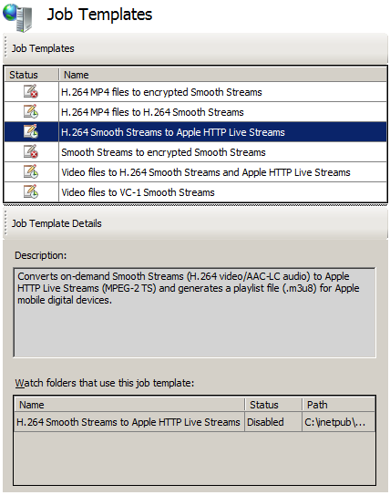
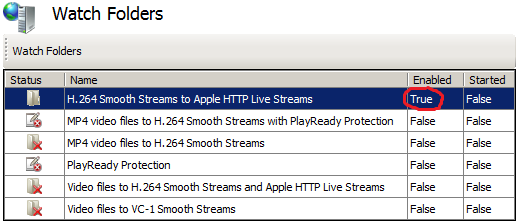
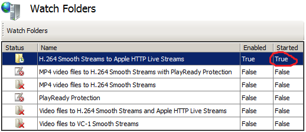

# Transforming On-Demand Smooth Streams to Apple HTTP Live Streams

by Dave Nelson

This article describes how to configure the default **H.264 Smooth Streams to Apple HTTP Live Streams** job template in IIS Transform Manager 1.0 to transform H.264-encoded Smooth Streams to the MPEG-2 Transport Stream (MPEG-2 TS) container format in conformance with the [Apple HTTP Live Streaming Protocol Specification](https://developer.apple.com/library/ios/#documentation/NetworkingInternet/Conceptual/HTTPLiveStreaming/_index.html). As part of the transformation, an .m3u8 manifest file is created to form a complete Apple HTTP Live Streaming presentation that you can deliver to Apple mobile digital devices from a Web server that's running the [IIS Smooth Streaming](https://www.iis.net/downloads/microsoft/smooth-streaming) feature in IIS Media Services 4. This workflow is shown in the following diagram.  

This article applies to the following watch folder in IIS Transform Manager 1.0:

- H.264 Smooth Streams to Apple HTTP Live Streams

## Licensing

IIS Transform Manager is designed to work with other programs, such as programs that handle audio or video signals. It's solely your responsibility to ensure your compliance with any terms accompanying such other programs, and that you have obtained any necessary rights for your use of the programs.

## Getting Started

This section describes the software configuration and other requirements in order to run the media transform that's described in this article.

### Installing Transform Manager

For specific installation instructions, see **Downloading and Installing** in the [Transform Manager Readme](iis-transform-manager-readme.md).

### Configuring the Transform Manager Service

Create an account for the Transform Manager service and then start the service. You must create the account and start the service in Internet Information Services (IIS) Manager. Unexpected results can occur if you start the Transform Manager service in the Services MMC console. For instructions, see [Configuring the Transform Manager Service](https://technet.microsoft.com/library/ff730170.aspx).

### Production Notes

- This article describes a way to transform legacy Smooth Streaming presentations to Apple HTTP Live Streams (HLS) that can be delivered by the [IIS Smooth Streaming](https://www.iis.net/downloads/microsoft/smooth-streaming) feature in IIS Media Services 4 to clients on Apple mobile digital devices. The following video and audio encoding profiles are supported:

  - **Video**. H.264 Baseline Profile Level 3.0 (iPhone®/iPod®/iPod touch®), Main Profile Level 3.1 (iPad®)
  - **Audio**. AAC-LC up to 48 kHz, stereo audio

> For more information about the supported encoding profiles for Apple mobile digital devices, see [Recommended Encoding Settings for HTTP Live Streaming Media](https://developer.apple.com/library/ios/#technotes/tn2224/_index.html#//apple_ref/doc/uid/DTS40009745-CH1-SETTINGSFILES) on the Apple Developer website.

- The Smooth Streams must contain both audio and video.
- Apple recommends that you not use B-frames when encoding streams for iPhone and iPod devices.
- Although the iPhone 3GS can play content that's at a level higher than Baseline 3.0, it's not recommended if you plan to target older iPhone devices and iPod touch devices.
- You shouldn't use AAC-LC audio at bitrates higher than 64 Kbps when targeting iPhone/iPod devices.
- You can add the default **Robocopy** task in Transform Manager to your job template in order to move the transformed Apple HLS output to a Web server running IIS Smooth Streaming or to network-attached storage. For more information, see [Chaining the Robocopy Task to your Transformed Output](chaining-the-robocopy-task-to-your-transformed-output.md).
- To learn how to create an HTML5 webpage that clients on Apple mobile digital devices can use to play the Apple HLS output, see [Delivering Transform Manager Output to Clients](delivering-transform-manager-output-to-clients.md).

## Configuring the H.264 Smooth Streams to Apple HTTP Live Streams Job Template

This section describes how to configure the default **H.264 Smooth Streams to Apple HTTP Live Streams** job template to repackage Smooth Streams as Apple HTTP Live Streams.

Job templates are modifiable definitions of the tasks that are run during the transform. You can modify task properties for this job template to specify the maximum bitrate to convert, the .m3u8 playlist file name, the segment length in the stream, as well as many other settings.

### Configuring the Smooth Streams to Apple HTTP Live Streams Task

1. In IIS Manager, in the **Connections** pane, click **Job Templates**.  
    
2. In the **Job Templates** page, select the **H.264 Smooth Streams to Apple HTTP Live Streams** job template.  
    
  
    Note the name of the watch folder that this job template is bound to in **Watch folders that use this job template**. We'll configure this watch folder to run the repackaging jobs later in this article.
3. In the **Actions** pane, click **Edit**.  
    
4. In the **Edit Job Template** dialog box, you can edit the job template **Name** and **Description** to give it a more descriptive information for your environment.  
    
  
    The **Task definitions** list shows the task that's used by this job template.
5. To update the properties used by the **Smooth Streams to Apple HTTP Live Streams** task, select it, and then click **Edit**.  
    
6. In the **Edit Smooth Streams to Apple HTTP Live Streams Task** dialog box, you can edit task properties in the **Properties** list. Select a property in the list, and then double-click the **Value** field to update the value.  
    
  
   You can edit the following properties for this task:

   | Name | Required | Value | Description |
   | --- | --- | --- | --- |
   | allowcaching | false | true | Enables the MPEG-2 TS segments to be cached on Apple devices for later playback. |
   | backwardcompatible | false | false | Enables playback of the MPEG-2 TS presentation on devices that use the Apple iOS 3.0 mobile operating system. |
   | codecs | false | false | Enables codec format identifiers, as defined by RFC 4281, to be included in the Apple HTTP Live Streaming playlist (.m3u8) file. |
   | encrypt | false | false | Enables encryption of MPEG-2 TS segments by using the Advanced Encryption Standard (AES) with a 128-bit key (AES-128). |
   | key | false |  | The hexadecimal representation of the 16-octet content key value that is used for encryption. |
   | keyuri | false |  | An alternate URI to be used by clients for downloading the key file. If no value is specified, it is assumed that the Live Smooth Streaming publishing point provides the key file. |
   | log | false |  | The file name to use for a log file (with a .log file name extension) that records the conversion activity. If you specify a log file name, the file is stored in the task output folder. |
   | manifest | false |  | The file name to use for the converted Apple HTTP Live Streaming playlist file (a file with an .m3u8 file name extension). If no value is specified, the following default value is used: &lt;ISM\_file\_name&gt;-m3u8-aapl.m3u8 |
   | maxbitrate | true | 1600000 | The maximum bit rate, in bits per second (bps), to be converted to MPEG-2 TS. On-demand Smooth Streams at or below this value are converted to MPEG-2 TS segments. Smooth Streams above this value are not converted. Most Apple devices can play media encoded at bit rates up to 1,600 Kbps. |
   | overwrite | false | true | Enables existing files in the output folder to be overwritten if converted output files have identical file names. |
   | passphrase | false |  | A passphrase that is used to generate the content key identifier. |
   | pid | false |  | The program ID of the MPEG-2 TS presentation. Different encodings of MPEG-2 TS streams in the same presentation use the program ID so that clients can easily switch between bit rates. |
   | segment | false | 10 | The duration of each MPEG-2 TS segment, in seconds. 10 seconds is the Apple-recommended setting for most Apple mobile digital devices. |
7. If you want to make the repackaged output available for a subsequent task in a task-chaining scenario, specify a virtual folder name in **Output folder name**.  
    
8. After reviewing or modifying the settings in the **Edit Smooth Streams to Apple HTTP Live Streams Task** dialog box, click **OK**.
9. In the **Edit Job Templates** dialog box, click **OK** to save your modifications to the job template.

## Configuring the H.264 Smooth Streams to Apple HTTP Live Streams Watch Folder

To run transform jobs on media files, you must configure the default watch folder in Transform Manager that uses the job template that you configured in the [previous section](transforming-on-demand-smooth-streams-to-apple-http-live-streams.md#config_jt). The watch folder will detect when media file types that you specify arrive in it, and then Transform Manager will run the tasks that are included in the job template that's bound to the watch folder against the media files. You can use the **Edit Watch Folder** property sheet to specify the watch folder location, the media file types that it should "watch" for, the task scheduler that should run the tasks in it, the user account that tasks should impersonate, as well as many other settings.

1. In IIS Manager, in the **Connections** pane, click **Watch Folders**.  
    
2. In the **Watch Folders** page, select the **H.264 Smooth Streams to Apple HTTP Live Streams** watch folder. This watch folder uses the job template that you configured in the [previous section](transforming-on-demand-smooth-streams-to-apple-http-live-streams.md#config_jt). You can confirm this by looking at the **Job template** value in the **Watch Folder Details** pane.  
    
3. In the **Actions** pane, click **Edit**.  
    
4. Configure required settings in the selected watch folder's property sheet using the instructions in [Configuring Watch Folders](https://technet.microsoft.com/library/ff730178.aspx). The following guidance applies to settings of particular importance for this workflow: 

    | Tab | Settings | Description |
    | --- | --- | --- |
    | Basic Settings | Input files | In **File Filter**, type **\*.ism**, and then select the **Parse playlist file** check box. This combination of options specifies that the watch folder watches for IIS Smooth Streaming presentation manifest (.ism) files and that the watch folder's job manager won't schedule a job for the Smooth Streaming presentation until all of the video (.ismv) and audio (.isma) files that are referenced in the manifest are present. |
    | Scheduler | Scheduler | In **Scheduler**, you'll typically select **Local Task Scheduler** to specify that Windows Task Scheduler on the local computer be used to run jobs, monitor and report job status, and allocate CPU resources to tasks. You can shift the jobs from the local computer to computers in a High Performance Computing (HPC) cluster, and then configure the watch folder to use the HPC Task Scheduler on the head node in the HPC cluster instead. For more information about how to use Transform Manager with an HPC cluster, see [High-Performance Transcoding with IIS Transform Manager and Windows HPC Server](high-performance-transcoding-with-iis-transform-manager-and-windows-hpc-server.md). |
    | Scheduler | Concurrent jobs and Priority | Use these settings to manage computer resources. **Concurrent jobs** controls how many jobs can run at the same time in the watch folder. The value is **1** by default, which means that if you drop 10 playlist files in the watch folder, only one will begin processing immediately while the rest will go straight into a job queue. You can adjust this setting depending on the amount of physical memory and number of CPUs that you have on your server. If jobs fail due to low available memory and CPU resources, increase the amount of available RAM and/or CPUs, or reduce the number of concurrent jobs to **1**. Selecting the **Unlimited** check box disables the concurrency setting and immediately schedules all playlist files that are detected in the watch folder for processing. **Priority** controls the priority that jobs are given when scheduled by a watch folder. If multiple watch folders are running on the computer, you can assign a **Priority** value to each one. This setting enables jobs that are in high-priority watch folders to be created and run first. If you drop media assets in a watch folder, but another watch folder that has a higher priority level is actively running jobs, the jobs for the dropped media assets aren't created and queued for processing until the higher-priority watch folder finishes all of its jobs. |
    | Advanced Settings | Credentials | You must specify a user account for the watch folder to impersonate. The tasks in the job template that's bound to the watch folder will run under the security context of this user account. You must ensure that it has the required permissions for the tasks that are run. For more information about how to create this account, see [Creating Watch Folder Impersonation Accounts](https://technet.microsoft.com/library/hh147633.aspx). |
5. Click **OK** to save your modifications to the watch folder.
6. On the **Watch Folders** page, select the watch folder, and then, in the **Actions** pane, click **Enable**.  
      
  
    The watch folder is now enabled, but not yet started.  
      
  
    Watch folders that are enabled will automatically start when the Transform Manager service is restarted. This setting is provided to reliably start watch folders after a service recycle event or after a computer restarts.
7. In the **Actions** pane, click **Start**.  
      
  
    The watch folder is now active and ready to accept Smooth Streaming presentations.  
      

    > [!NOTE]
    > You can't start a watch folder if another active watch folder thread is already using the same watch folder root path.

## Running your Transform Jobs

The watch folder's job manager will schedule a job for media files that are referenced in a Smooth Streaming presentation server manifest (.ism) file, and when all of the media files that are referenced in the .ism manifest are present, move the manifest file and media assets as a group to the watch folder's WorkQueue directory.

To begin transforming content, copy-and-paste the .ism file, the Smooth Streaming client manifest (.ismc) file, and all of the bitrate streams (.isma and ismv) files that are referenced in the .ism file into the watch folder using Windows Explorer or another file-movement mechanism such as command line, FTP, or WebDav.  

The watch folder directory is specified in the **Watch folder path** setting on the **Basic Settings** tab of the watch folder property sheet.  

> [!NOTE]
> You shouldn't drop multiple .ism manifest files in the watch folder at the same time if they reference the same media files. The watch folder's job manager will schedule jobs for media files that are referenced in one playlist, and when all of the media files that are referenced in the playlist are present, move the playlist file and media assets as a group to the watch folder's WorkQueue directory. Another playlist that references the same media files then can't be processed because the media files have been removed from the watch folder with the previous playlist. To schedule jobs for this playlist, you must drop the missing media files into the watch folder again.

After you drop Smooth Streaming presentation files in a watch folder, the watch folder's job manager creates a job for the presentation and moves the presentation files into the watch folder's WorkQueue directory. The files will be moved from the watch folder into the WorkQueue quickly if they're small. The watch folder might not discover larger files for up to 60 seconds. If the files don't disappear after 60 seconds, make sure that you're in the correct watch folder or that you've enabled and started the correct watch folder.

The WorkQueue directory contains folders that store the jobs as they're being processed. Assets that are processed successfully are placed in the watch folder's Finished folder while media assets that can't be processed are placed in the Failed folder. These folders are visible by default so that you can retrieve their contents more easily. The WorkQueue directory contains other folders that temporarily store jobs as they're run through the job workflow. These folders are hidden folders and to view them, you must turn on the **Folder views** option in Windows that shows hidden files, folders, and drives.  

As jobs are run, job files (which include the original media source files, job manifest files, and the transformed output for completed jobs) accumulate in the watch folder WorkQueue folders. They can eventually clutter the disk and potentially impact performance. For more information about how to configure settings to automatically delete these files from the WorkQueue after a specified period of time, see [Running File Maintenance](https://technet.microsoft.com/library/hh147635.aspx).

## Managing and Monitoring your Transform Jobs

As jobs are processed through the WorkQueue folders, you can use the **Job Monitor** pages in IIS Manager to view the progress of and manage currently running and queued jobs. For more information, see [Running and Monitoring Jobs](https://technet.microsoft.com/en-us/library/ff730174(v=ws.10).aspx).