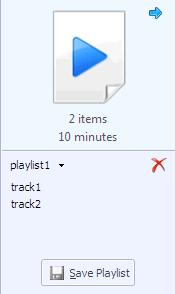
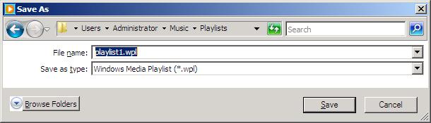
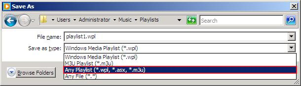
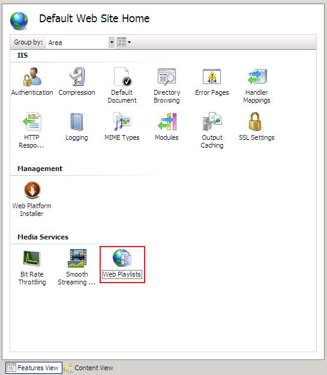
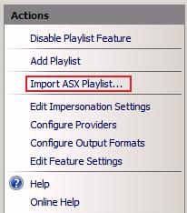
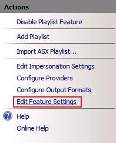

Using Windows Media Player Playlist Files in Web Playlists
====================
by Dave Nelson

By default, [Windows Media Player 11](https://www.microsoft.com/windows/products/winfamily/mediaplayer/default.mspx) in [Windows Server 2008](https://www.microsoft.com/windowsserver2008/default.aspx) creates playlists in WPL format (files with .wpl file name extensions). This article describes how to create copies of the playlist files in ASX format (files with .asx file name extensions) so that you can import them into the [Web Playlists](https://www.iis.net/downloads/microsoft/web-playlists) extension for Internet Information Services (IIS). When you import the ASX files in Web Playlists, the equivalent Web playlist files (files with .isx file name extension) are created, which you must then edit to enable them in the Web Playlists feature. This article describes how to edit ISX files in two different ways, depending upon whether you want to serve the media files referenced in the playlist media entries either from the original user folder or from a Web site directory.

This article contains the following sections:

- [Prerequisites](using-windows-media-player-playlist-files-in-web-playlists.md#reqs)
- [Saving WPL Playlist Files as ASX Playlist Files in Windows Media Player](using-windows-media-player-playlist-files-in-web-playlists.md#wpl)
- [Importing ASX Playlist Files to the Web Playlists Feature](using-windows-media-player-playlist-files-in-web-playlists.md#asx)
- [Enabling your Imported Web Playlist](using-windows-media-player-playlist-files-in-web-playlists.md#isx)
- [Setting Playback Options](using-windows-media-player-playlist-files-in-web-playlists.md#playback)
- [Related Articles](using-windows-media-player-playlist-files-in-web-playlists.md#related)

## Prerequisites

To install the Web Playlists extension for IIS 7.0 and above, see the **Installation Notes** section in the [IIS Media Services Readme](../iis-media-services/iis-media-services-readme.md).

> [!NOTE]
> This article assumes that you have created playlists in Windows Media Player on the local server computer using default Player settings. For more information about installing Windows Media Player 11 and creating Windows Media Player playlists, see the [Related Articles](using-windows-media-player-playlist-files-in-web-playlists.md#related) section.

## Saving WPL Playlist Files as ASX Playlist Files in Windows Media Player

Windows Media Player creates its playlists in WPL format by default. This section shows how to create an ASX-formatted version of a Windows Media Player playlist (.wpl) file to import into the Web Playlists feature.

**To create ASX-formatted playlist files**

1. In the Windows Media Player Library, in the Contents pane, select the playlist that you want to add to the Web Playlists feature. Then, in the Details pane, click **Edit in List Pane**.  
      
  
   This will add the playlist to the List pane in Windows Media Player. In the following example, we show in the List pane a simple playlist (named **playlist1**) that contains two tracks (named **track1** and **track2**).  
    
2. Click the down arrow next to the playlist name, and then click **Save Playlist As**.  
      
  
   This action will open the **Save As** dialog box with default values.  
    
3. In the **Save As** dialog box, in **Save as type**, select **Any Playlist (\*.wpl, \*.asx, \*.m3u)**.  
    
4. In the **Save As** dialog box, in **File name**, change the file name extension from **wpl** to **asx**.  
    
5. In the **Save As** dialog box, click **Save**.  
    

## Importing ASX Playlist Files to the Web Playlists Feature

This section shows how to import the ASX-formatted Windows Media Player playlist file that you created in the [previous section](using-windows-media-player-playlist-files-in-web-playlists.md#wpl).

**To import ASX-formatted playlist files**

1. In IIS Manager, select the Web site or virtual directory from which you want to serve your Windows Media Player playlist files (.wpl files), and then in the Contents pane, click the **Web Playlists** icon.  
    
2. In the **Actions** pane, click **Open Feature**.  
      
  
   This action displays the **Web Playlists** feature page. If you have not previously created Web playlists for the site or virtual directory, the page will be empty as shown below.  
    
3. In the **Actions** pane, click **Import ASX Playlist**.  
    
4. In the **Open** dialog box, navigate to the location where the playlist file in ASX format is stored, select it, and then click **Open**.  
      
  
   The Windows Media Player playlist file (playlist1.asx) in imported to the **Web Playlists** feature as a Web playlist file (playlist1.isx), as shown below:  
    

## Enabling your Imported Web Playlist

After you import your ASX-formatted Windows Media Player playlist file, there are a couple of approaches to take regarding how you want to serve the media that is referenced in it. You can either leave the media files where they reside in your user folder, or you can copy them to a folder in your Web site root directory or virtual directory. Your choice really depends on whether you want to maintain multiple copies of your media files.

If you choose the first option (leave the media files where they are), then you must do the following:

1. In the Web Playlists feature, set impersonation settings so that it can access the files in the user folder.
2. In the Web Playists feature, enable Absolute/UNC paths.
3. In the ISX file, change relative URIs for the media entries to physical paths.
4. In the ISX file, change the **srcType** from relative URI to physical path.
5. In the ISX file, remove the **param** container with invalid **extraparam** attributes.

If you choose the second option (copy the media files to your Web site or virtual directory), then you must do the following:

1. Copy your media files to a folder in the Web root directory or to the virtual directory.
2. In the ISX file, update the relative URIs for the media entries.
3. In the ISX file, remove the **param** container with invalid **extraparam** attributes.

The following sections provide details on both approaches:

- [Serve the media files from user folders](using-windows-media-player-playlist-files-in-web-playlists.md#user)
- [Serve the media files from the Web site](using-windows-media-player-playlist-files-in-web-playlists.md#web)

### Serve the media files from user folders

1. In the Web Playlists feature, set impersonation settings so that it can access the files in the user folder. For detailed instructions, see [Web Playlists for IIS - Serving Media Content from User Folders](web-playlists-for-iis-serving-media-content-from-user-folders.md).
2. In the Web Playlists feature, enable Absolute/UNC paths.  
  
   a. In the **Actions** pane, click **Edit Feature Settings**.  
      
  
   b. In the **Edit Feature Settings** dialog box, select **Allow absolute/UNC paths**.  
    
3. In a text editor, such as Notepad, change the relative URI for each media entry in the ISX to a physical path. For example:  
  
   Change: `<ref src="..\track1.wma">`  
   To: `<ref src="C:\Users\Administrator\Music\track1.wma">`
  
    **Tip** You can use the **Replace** feature in Notepad to make this change to all media entries at once.
4. In the text editor, change the **srcType** for each media entry in the ISX to a physical path. For example:  
  
   Change: &lt;param name="srcType" value="relativeURI" /&gt;  
   To: &lt;param name="srcType" value="physicalPath" /&gt;  
  
    **Tip** You can use the **Replace** feature in Notepad to make this change to all media entries at once.
5. When you import the Windows Media Player ASX playlist file, the Web Playlists feature groups the unsupported playlist attributes as **extraParam** values in a **param** container in the ISX playlist file. You must remove (or comment-out) the **param** container with invalid **extraParam** attributes for each media entry in the ISX.  
  
   In the following example, we comment-out the **param** (beginning and ending comment marks shown in red). Also, for brevity, we show only the first and last **extraParam** values (for the track length and number) in the example:  
  
&lt;!--&lt;param name="extraParam" value="&amp;lt;Duration value=&amp;quot;00:04:36.532&amp;quot; /&amp;gt;  
  
...  
  
Value=&amp;quot;4&amp;quot;" /&gt;--&gt;  
  
    **Tip** Because **extraParam** values vary for each track, do the following when using the **Replace** feature in Notepad:  
  
 Change: &lt;param name="extraParam"  
 To: &lt;!--&lt;param name="extraParam"  
  
 -and-  
  
 Change: &lt;param name="title"  
 To: --&gt;&lt;param name="title"

> This will comment-out the **param** container with the **extraParam** attributes, as shown in the above example.

### Serve the media files from the Web site

1. Copy the media files referenced in the Windows Media Player playlist (.wpl) file to a folder in the Web site directory or to a virtual directory. For example, if you imported the .asx version of the playlist to the Default Web site, copy the files to: &lt;*systemdrive*&gt;\inetpub\wwwroot\media.
2. In a text editor, such as Notepad, update the relative URI for each media entry in the ISX. For example:  
  
   Change: &lt;ref src="..\track1.wma"&gt;  
   To: &lt;ref src="media/track1.wma"&gt;  
  
    **Tip** You can use the **Replace** feature in Notepad to make this change to all media entries at once.
3. When you import the Windows Media Player ASX playlist file, the Web Playlists feature groups the unsupported playlist attributes as **extraParam** values in a **param** container in the ISX playlist file. You must remove (or comment-out) the **param** container with invalid **extraParam** attributes for each media entry in the ISX.  
  
   In the following example, we comment-out the **param** (beginning and ending comment marks shown in red). Also, for brevity, we show only the first and last **extraParam** values (for the track length and number) in the example:  
  
&lt;!--&lt;param name="extraParam" value="&amp;lt;Duration value=&amp;quot;00:04:36.532&amp;quot; /&amp;gt;  
  
...  
  
Value=&amp;quot;4&amp;quot;" /&gt;--&gt;  
  
    **Tip** Because **extraParam** values vary for each track, do the following when using the **Replace** feature in Notepad:  
  
 Change: &lt;param name="extraParam"  
 To: &lt;!--&lt;param name="extraParam"  
  
 -and-  
  
 Change: &lt;param name="title"  
 To: --&gt;&lt;param name="title"

> This will comment-out the **param** container with the **extraParam** attributes, as shown in the above example.

## Setting Playback Options

After updating the ISX, clients will be able to play the media items referenced in it. By default, clients will have full control of the playback experience, such as the ability to skip (both forward and backward) to different entries in the playlist and to seek within a currently playing track. You can limit a client's ability to seek or skip playlist media entries by configuring media entry settings in the Web Playlists feature. For more information, see IIS Media Services Help.

To access this help, press F1 while using the Web Playlists feature in IIS Manager.

## Related Articles

- [Desktop Experience Overview](https://technet.microsoft.com/library/cc772567.aspx)
- [Use Windows Media Player to create the perfect playlist for every occasion](https://windowshelp.microsoft.com/Windows/Help/5276da52-d480-4c59-a0a0-08f9c80a30321033.mspx)
