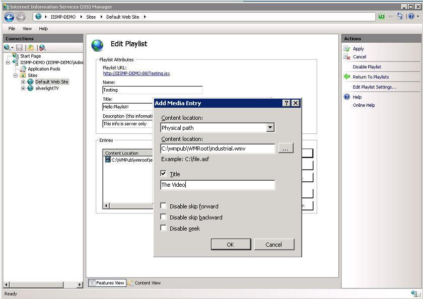
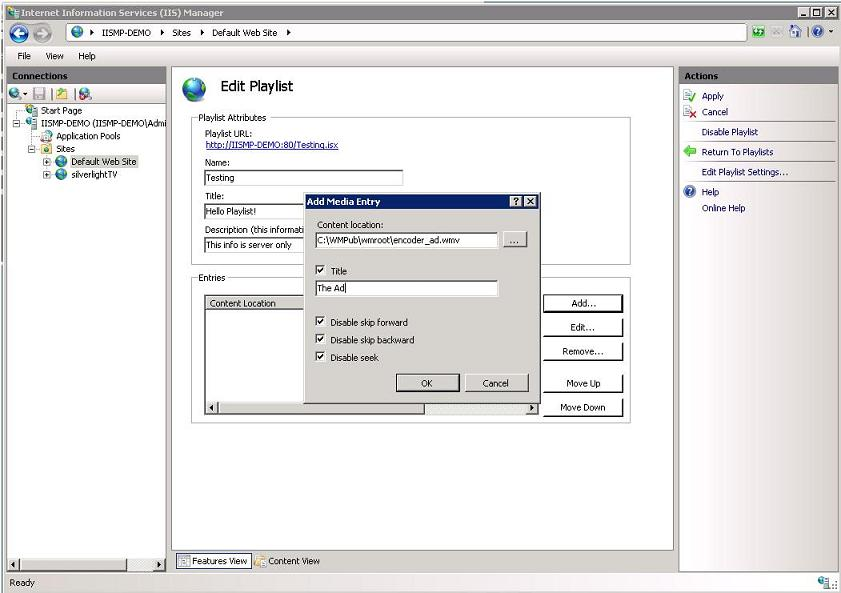
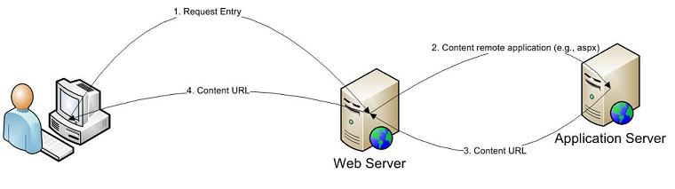

Web Playlists for IIS 7 - Creating a Simple Playlist
====================
by [Vishal Sood](https://twitter.com/vishalsood)

Web Playlists for Internet Information Services (IIS) 7 provides the ability to control media delivery to clients and limit a client's ability to seek or skip individual entries in the playlist. Server administrators can enable or disable seek/skip behavior through fields in the playlist entry. This article describes how to create a playlist by using the Web Playlists module in IIS Manager.

## Prerequisites

To install the Web Playlists extension for IIS 7, see the **Installation Notes** section in the [IIS Media Services Readme](../iis-media-services/iis-media-services-readme.md).

## Creating a Simple Playlist

A playlist is a list of media entries. Each entry has a list of possible client playback controls that can be enforced from the server side: Seek, Skip Forward (Next), Skip Backward (Previous). These controls are useful in situations where you want to limit playback of a media entry on the client, including RIAA compliance, monetization (advertisements), or other needs such as training, etc.

### Creating a Playlist in IIS Manager

The first step is to create a list of media entries and optionally apply properties to media entries that limit a clients ability to seek, skip forward or skip backward. The steps involved are:

1. Create an empty playlist.
2. Add media entries to the playlist. 

    - Select media entries (either one at a time or in bulk) for the playlist.
    - Set the properties for the element(s) and add them to the playlist.
3. Ensure that the order of media entries in the playlist is correct.
4. Set properties for the playlist.
5. Click Apply.

**Scenario**: The following section shows the steps to create a playlist that begins with an advertisement (which cannot be seeked/skipped) followed by a media file that can be seeked/skipped.

#### Create an Empty Playlist

1. In IIS Manager, go the Web site that you want to create a playlist for and open the **Playlists** feature in the **Media Services** category.
2. In the **Actions** pane, click **Add Playlist**.

    

    

##### Set Playlist Properties

The following properties are available to be set:

- **Name**. This is the playlist file name. This is a unique name that cannot be shared by other playlists.
- **Title** (optional). This is the title for the playlist.
- **Description** (optional). This can be used by playlist creator to store some information to later distinguish this playlist from other playlists. This information is not passed on to the client.
- **Media entries**. See [Add Media Entries to the Playlist](web-playlists-for-iis-7-creating-a-simple-playlist.md#entries).

#### Add Media Entries to the Playlist

1. In the **Add/Edit Playlist** page, in the **Media entries** area, click **Add** to open the **Add Media Entry** dialog box. The details in this dialog box apply to all the media entries that you select.
2. In the **Add Media Entry** dialog box, add the following details to add media entries:

   - **Location type**. In the dropdown list, select whether the media content referenced by the playlist is local or remote. 

       - Local content can be on the local disk (**Relative URI**/**Physical path**) or on a UNC share (**Physical path**) that is accessible to the playlist handler.
       - Remote content is a URL to a media file (for example, http://&lt;myServer&gt;/myfile.wmv) or to another playlist file. Web Playlists cannot control seek/skip behavior for remote content.

     See the sections later in this article that describe how to add nested playlists and integrate with Web applications to obtain content location.

   - **Content location**. Use the **Browse** button to populate a comma-delimited list of content items. You can select multiple items to add to the playlist at once. To select adjacent items, press and hold the SHIFT key while selecting. To select nonadjacent items, press and hold the CTRL key while selecting.

     > [!NOTE]
     > If you are using IIS Manager to connect to a remote server, ensure that the paths correspond to the remote computer. The **Browse** button is disabled in this case.

   - **Title** (optional). The playlist title.
   - **Disable skip forward** (optional). Disallows the content to be skipped so that the next entry is played before the current entry is played. (For example, a particular site may want to disable skip on all advertisements on the site.)

     > [!NOTE]
     > Disable skip forward has a dependency on the playlist handler attribute **allowSkipAfterMinPercent**, which specifies when skip forward is enabled. For example, If this attribute value is set to **80**, it means that after 80 percent of the content has been viewed, **Skip Forward** will be enabled (if disabled) in the player and the user will be able to skip to the next item in the playlist. If you want to disallow this, ensure that this value is set to 100.

   - **Disable skip backward** (optional). Disallows the content to be skipped so that it can be played again from the beginning. This is very helpful in the cases where you want to disallow viewing/listening to a media item repeatedly (for example, with online radio stations).
   - **Disable seek** (optional). Disallows seeking within the content. In most players, the **Seek** bar will be disabled. However, in cases where it is enabled, the Web server disallows seek.

     

     

#### Ensure that the Order of Entries in the Playlist is Correct

The presentation order of media entries in a playlist is very important, as the playlist is played in that order. The order goes from top to bottom. This means that content on top will be played before content below. Therefore, it is important to ensure that you have the correct order in the playlist. For example, if you want users of your content to be able to get to the content only after playing an advertisement, you must ensure that the advertisement is placed above the content in the playlist. (You may additionally want to disable skip forward if you want to enforce viewing the advertisements.)

After media entries are added, you can re-order them in the playlist by selecting an entry and using the **Move Up** and **Move Down** buttons to reposition media entries in the playlist.

## Nested Playlists

A nested playlist is a playlist that is added as a media entry to another playlist. A user consuming a nested playlist would see it as a client-side playlist (a file with a .asx file name extension) contained in another client-side playlist. The media entries in a nested playlist are known only when it is requested by the user, providing an additional dynamic aspect to the playlist. The default number of nesting levels supported by nested playlists is **5**, which is the default number supported by Silverlight and Windows Media Player.

> [!NOTE]
> Since Web Playlists has a dynamic model, the number of levels cannot be known as playback starts. If the nesting level is more than 5, some content may not be delivered and the request will fail.

A nested playlist entry can be added by using the Playlists feature the same way any other media entry is added. For example, in the **Content location** box, you can give the path/URL to a playlist (for example, `C:\media\play.isx` or `http:\\media\play.isx`).

### Configuration Settings for Nested Playlists

The following configuration entries are used for nested playlist functionality:

- **maximumPlaylistDepth**. Defines how many levels of nested playlists are supported. The default value is **5**, which means that 5 levels are possible. This entry is not configurable through the feature in IIS Manager.

### Playlist Settings for Nested Playlists

In case of nesting, the settings in the master playlist are used. This is done because the master playlist has the best idea of what it takes to go through the entire set of media entries (including other playlists). The settings in the nested playlists are ignored.

- **Enable playlist lifetime timeout**. The lifetime of the playlist. The value of this attribute in the outermost playlist applies to the entire session. Attribute values in nested playlists are ignored. This value sets the session lifespan for the playlist.
- **Enable playlist inactivity timeout**. The time after which the session information for the playlist is invalid. The value of this attribute in the outermost playlist applies to the entire session. Attribute values in nested playlists are ignored. This value sets the Inactive session timeout for the playlist.

### Controlling Nested Playlist Playback

A general rule of thumb for player playback controls is that they are applicable only to the media entry they are associated with.

When the media entry is a nested playlist, the media entry flags determine if the nested playlist media entry can be skipped. After a client begins playing the nested playlist, the skip/seek logic is then governed by the media entries in the nested playlist. At this point, the parent playlist flags are still in force because the parent entry is not yet completed. The nested media entry is marked as completed only after the entire playlist has been played.

The **Seek** control in players is ignored when a media entry is a nested playlist.

## Adding HTTPD Media Entries

Web Playlists can use media entries that begin with the httpd:// URL prefix to request that an external application, such as an ASP page, ASP.NET, or PHP application computes the correct content path/URL to serve. Server variables can be included in the URL while requesting these applications using the {var\_name} syntax (for example, httpd://{SERVER\_NAME}:{SERVER\_PORT}/pre.aspx). Remote applications can use this information to determine the correct content to serve. The call flow is best captured by the following figure:

In the Web Playlists feature in IIS Manager, you can use any location type with an httpd:// media entry. Set the **Location type** to match the content location returned by the remote application that served the request. For example, if the remote application returns a physical path such as `C:\media\file.asf`, then **Location type** should be set to **Physical path**.

In the Web Playlists feature in IIS Manager, simply add a media entry that uses the httpd:// syntax in the **Content location** field.

### Sample Playlist and Web Application

For illustration, consider the following sample playlist:

[!code-html[Main](web-playlists-for-iis-7-creating-a-simple-playlist/samples/sample1.html)]

For this playlist, when the client requests the first entry during playback, Web Playlists downloads the response from the **pre.aspx** page. The request uses two server variables (**SERVER\_NAME** and **SERVER\_PORT**) which are replaced by appropriate values while requesting the ASPX page.

Here is a very simplified example of what the pre.aspx page could look like.

[!code-aspx[Main](web-playlists-for-iis-7-creating-a-simple-playlist/samples/sample2.aspx)]

The ASPX page returns a path to advertisement.wmv. However, you can include any logic to compute the correct path/URL to be returned. For example, you can get values from a database based on the request parameters. You can also pass other server variables in the request such as IP address to get location-specific data from any database in your existing architecture.

> [!NOTE]
> It is really important to set **ContentType** to **text/plain** as that is required by Web Playlists.

## Playlist XML Format

With the Web Playlists Release Candidate (RC) release, we playlist format for the default implementation has been changed from a plain XML to a SMIL-based format.

The playlist format used by Web Playlists is an accordance with the SMIL specification available [here](http://www.w3.org/AudioVideo/). Having said that, Web Playlists does not fully implement the SMIL specification, the support for SMIL is limited to a sub-set. The set of modules supported by Web Playlists are as under:

### Supported SMIL Modules

IIS Web Playlists has limited support for following SMIL modules (refer to SMIL specification [here](http://www.w3.org/AudioVideo/) for more details on these modules):

- Structure Module - smil, head and body tags
- Media Object Models – limited to support for ref, audio, video and param tags only
- Meta Information module – limited to meta tags only
- Timing and Synchronization module – limited to seq tag only

### Supported SMIL Elements

Web Playlists has limited support for following SMIL elements:

- Doctype – This tag is ignored by back-end but written by the UI
- smil: This is the main tag and will be used to identify a valid Web Playlists file.
- head: This contains all the meta information about the playlists, like title
- body: This tag is used by SMIL writers to support XHTML translations. We will ignore this tag while processing the playlists. Note: UI will add this tag while writing the playlist
- audio: This could be used to add an audio reference
- video: This could be used to add a video reference
- ref: This is the generic entry for both audio and video. Note: UI will add all entries with the ref tag only.
- param: This tag is used within a ref tag to add any custom properties. We will use this tag to specify the following: 

    - canSeek flag (Note: lowercase is important)
    - canSkipForward flag (Note: lowercase is important)
    - canSkipBack flag (Note: lowercase is important)
    - srcType flag which tells what is the kind of entry in the playlist context: physical path, relative path or a remote entry
- meta: this tag is used inside the head tag to specify description and session attributes like inactivity timeout and idle timeout. This is an optional attribute. 

    - description field for server-side text description for admin use
- seq: this tag is used to specify an order in the playlist.

### Sample SMIL-based Web Playlist

[!code-html[Main](web-playlists-for-iis-7-creating-a-simple-playlist/samples/sample3.html)]

## Adding Entries Protected by Credentials

In certain cases, media entries that need to be added to the playlist are protected by credentials (username/password). Playlists allows access to these entries using the Impersonation Settings option in the playlist configuration. These settings can be accessed and set through the UI in IIS Manager.

These settings map a path to a username and password. These are global settings and apply to all playlist at that level or below in the site hierarchy.

The following procedure add credentials for a specific path:

1. In the **Actions** pane, click **Edit Impersonation Settings**.

    
2. Click **Add**.

    
3. In the **Add Impersonation Setting** dialog box, enter the path that you want to provide credentials for and chose a Logon method. This path can be a UNC path or a simple local path. The Logon methods are identical to those used for Virtual Directories. See [More Information](web-playlists-for-iis-7-creating-a-simple-playlist.md#info) later in this article for more details.
4. Click **Set**.

    
5. In the **Set Credentials** dialog box, provide the user name and password for the path given earlier.

    
6. The path impersonation setting is now set.

    
7. The Playlist handler uses the path to determine the correct credentials to use. See the following figure.

    

## Playing the Playlist

The smil playlist referred above is read by the server and send the client in the form of a client-side playlist (a file with a .asx file name extension). The Playlist handler does the following to create client-side playlist file (.asx).

1. The title meta tag is mapped to title element under the ASX element
2. A LastModified PARAM is added as a param element under the ASX. This indicates the last modified time for the playlist on the server
3. Playlist extraParam meta tag is mapped as-is without any processing as sub-elements to the playlist in the ASX syntax.(e.g., Author element in playlist below)
4. Entry Name is mapped to Entry Name in the ASX syntax.
5. Ref Element in smil is translated by the server into a obfuscated URL and then passed on as ref element for an ASX entry.
6. The attribute "canSkipForward" if False, maps to the PARAM tag CANSKIPFORWARD in ASX.
7. The attribute "canSkipBack" if False, maps to PARAM tag CANSKIPBACK in ASX.
8. The attribute "canSeek" if False, maps to PARAM tag CANSEEK in ASX.
9. If all three "canSkipFwd", "canSkipBack" and "canSeek" are set to False, they map to ASX ENTRY attribute CLIENTSKIP.
10. The session ID is added to output format to obfuscate the URLs and associate them to a server session that keeps track of what has been downloaded by the client. This is used by the server to enforce seek/skip options.

The playlist in the example above results in the following ASX when accessed by the client:

[!code-xml[Main](web-playlists-for-iis-7-creating-a-simple-playlist/samples/sample4.xml)]

When the player tries to play the playlist, The param tags above act as hints to player / developer writing the player. If there is an attempt to ignore the hints, then the server-side logic ensures the sanctity of the media controls: **Disable Skip Forward**, **Disable Skip Backward**, and **Disable Seek**.

In addition to supporting client-side playlist format asx, the Release Candidate (RC) release of the playlist also supports outputting in other xml / text formats using XSL Translations. Please refer to the walkthrough on [Extending output formats using XSLT](https://go.microsoft.com/fwlink/?LinkID=127991).

## For More Information

- ASX Elements – [https://msdn.microsoft.com/library/ms910265.aspx](https://msdn.microsoft.com/library/ms910265.aspx)
- PARAM Tags in ASX - [https://msdn.microsoft.com/library/bb249281(VS.85).aspx](https://msdn.microsoft.com/library/bb249281(VS.85).aspx)
- ClientSkip Attribute for ENTRY - [https://msdn.microsoft.com/library/ms910279.aspx](https://msdn.microsoft.com/library/ms910279.aspx)
- Logon Type - [https://msdn.microsoft.com/library/ms691229(VS.85).aspx](https://msdn.microsoft.com/library/ms691229(VS.85).aspx)
