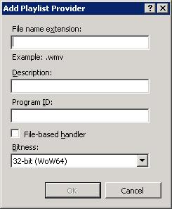

Web Playlists for IIS 7.0 - Extending Web Playlists through Custom Providers
====================
by [Vishal Sood](https://twitter.com/vishalsood)

Web Playlists allows you to extend its default behavior by writing custom providers. It provides a COM interface that can be implemented in either a .NET-based or native custom provider.

## Writing custom providers

### Implementing the interfaces

The interfaces included in the Playlists provider interface are:

- **IPlaylistProvider**. The root interface for the custom provider. It allows you to add any code that needs to be run while initializing or shutting down the provider.
- **IPlaylistRequestInfo**. Enables a custom provider to access HTTP request attributes. These are exposed as server variables in the Internet Information Services (IIS) pipeline. This interface also allows a way for a custom provider to write some data to the provider in the form of a string.
- **IPlaylistInfo**. Defines a playlist skeleton. It contains a collection of playlist entries in the form of **IPlaylistEntryInfoCollection**.
- **IPlaylistEntryInfo**. Represents individual entries in a playlist. This contains properties such as Title, CanSeek, etc.
- **IPlaylistEntryInfoCollection**. Allows a custom provider to traverse a list of playlist entries in the form of **IPlaylistEntry** info objects.
- **IPlaylistFileInfo** (optional). Contains file information when the playlist is stored in a file and allows a method to access the file stream. This is useful as the IIS pipeline already has this information and the custom provider need not duplicate the functionality. IPlaylistFileInfo is useful if you are planning to write a file-based provider. It enables you to use file information from the IIS pipeline and get access to the file contents without having to implement the logic in the provider to open files, etc.

All but **IPlaylistFileInfo** are mandatory interfaces that must be implemented by a custom provider.

### Sample code

The code sample in this section shows how to add an advertisment in front of the requested URL. This sample serves as a example tutorial for writing a custom provider (thus, it contains hard-coded strings). It is not supported and confers no rights.

[!code-csharp[Main](web-playlists-for-iis-extending-web-playlists-through-custom-providers/samples/sample1.cs)]

## Building a custom provider

### Building a .NET-based provider

Building a .NET-based provider is a two step process.

1. **Create a Type library (you can skip this step if you have access to released playlisthandler.dll)**

    [!code-unknown[Main](web-playlists-for-iis-extending-web-playlists-through-custom-providers/samples/sample-127299-2.unknown)]

    [!code-unknown[Main](web-playlists-for-iis-extending-web-playlists-through-custom-providers/samples/sample-127299-3.unknown)]

 where     `<Path to Web Playlist Include>` is the location where unzipped the Interface files too.
2. **Import Types into as assemblly**

    1. **Use the .tlb created in step 1**

        [!code-unknown[Main](web-playlists-for-iis-extending-web-playlists-through-custom-providers/samples/sample-127299-4.unknown)]
    2. **Use the released playlisthandler.dll**

        [!code-unknown[Main](web-playlists-for-iis-extending-web-playlists-through-custom-providers/samples/sample-127299-5.unknown)]
3. **Compile the custom provider with reference to assembly created in step 2**

    [!code-console[Main](web-playlists-for-iis-extending-web-playlists-through-custom-providers/samples/sample6.cmd)]

### Building a native provider (C++)

In the [Resources](web-playlists-for-iis-extending-web-playlists-through-custom-providers.md#Resources "Resources") section, you will find the link to Web Playlists interface files. After unzipping the file please follow the steps below:

1. Include the header file for the appropriate platform in your source code
2. Use your IDE (for example, Visual Studio) to build the provider dll.

## Installing and running custom providers

### Using the Playlists feature to add configuration entries for custom providers

1. In Internet Information Services (IIS) Manager, at the site level, click **Playlists**. (Ref: Figure 1)  
      
    *Figure 1. IIS 7.0 Manager - Open the Playlists page*
2. In the **Actions** pane, click **Configure Providers**. You will see the list of providers that are registered for the site. (Ref. Figure 2)  
      
    *Figure 2. IIS 7.0 Manager - Open the Playlist providers page*
3. In the **Actions** pane, click **Add**. (Ref. Figure 3)  
      
    *Figure 3. Open the Add Playlist Provider dialog box*
4. In the **Add Playlist Provider** dialog box, fill in the following details. Click **OK** when you are done. (Ref. Figure 4, 5)  

    - **Provider name**. Enter a friendly name for the provider. It is only used to identify the provider in the Playlist providers page.
    - **Description**. Enter a description for the provider. You could use this field to briefly describe what the provider does. It is only used by the administrator to help identify the provider.
    - **Program ID**. Enter the COM ProgID that is used in the provider code. It is used to detect and load the provider at runtime.
    - **File extension**. Enter the file name extension that will be used for playlists that the provider will work with. The Playlists feature already handles Web playlists (file with .isx file name extensions). This field adds the handler mapping to the IIS config so that the Playlists feature can handle requests for this extension.
    - **File-based handler** (optional). As explained previously, this is an optional field. If your provider stores the playlist in a file, checking this option allows the IIS pipeline provide the needed file details and a stream to access file contents.
    - **Bitness** (64-bit systems only). Select whether the provider works as 32-bit through WOW layer, 64-bit, or both. The relevant configuration entries are added to the IIS config to handle the requests.

      
    *Figure 4. Add Playlist Provider dialog box*  
      
    *Figure 5. Bitness options for custom provider configuration*

## Manually registering custom providers

After you have added the relevant configuration entries by following the steps in the previous section, you must register the provider.

#### Registering a native custom provider

For 32-bit systems, do the following to register a native custom provider:

1. Launch a command shell with administrator privileges (on the **Start** menu, right-click **Command Prompt**, and then click **Run as administrator**).
2. Type the following command: **%WINDIR%\system32\regsvr32.exe &lt;*providerdllname*.dll&gt;** where *providerdllname*.dll is the provider dll.

For 64-bit systems, do the following to register a native custom provider:

1. Launch a command shell with administrator privileges (on the **Start** menu, right-click **Command Prompt**, and then click **Run as administrator**).
2. Type the following command: 

    - For native 64 bit **- %WINDIR%\system32\regsvr32.exe &lt;*providerdllname*.dll&gt;** where *providerdllname*.dll is the provider dll.
    - For 32 bit supported through WOW layer - **%WINDIR%\syswow64\regsvr32.exe &lt;*providerdllname*.dll&gt;** where *providerdllname*.dll is the provider dll.

#### Registering a .NET-based custom provider

For 32-bit systems, do the following to register a .NET-based custom provider:

1. Launch a command shell with administrator privileges (on the **Start** menu, right-click **Command Prompt**, and then click **Run as administrator**).
2. In Command Prompt, navigate to the .NET Framework directory (for example, C:\Windows\Microsoft.NET\Framework\v2.0.50727).
3. Type the following command: **RegAsm.exe &lt;*providerdllname*.dll&gt;** where *providerdllname*.dll is the provider dll.

For 64-bit systems, do the following to register a .NET-based custom provider:

1. Launch a command shell with administrator privileges (on the **Start** menu, right-click **Command Prompt**, and then click **Run as administrator**).
2. In Command Prompt, navigate to the .NET Framework directory (for example, C:\Windows\Microsoft.NET\Framework64\v2.0.50727).
3. Type the following command: **RegAsm.exe &lt;*providerdllname*.*dll*&gt;** where *providerdllname*.dll is the provider dll.

For 64 bit systems, when you run as 32 bit through WOW layer, do the following to register a .NET-based custom provider

1. Launch a command shell with administrator privileges (on the **Start** menu, right-click **Command Prompt**, and then click **Run as administrator**).
2. In Command Prompt, navigate to the .NET Framework directory (for example, C:\Windows\Microsoft.NET\Framework\v2.0.50727).
3. Type the following command: **RegAsm.exe &lt;*providerdllname*.dll&gt;** where *providerdllname*.dll is the provider dll.

## Resources

**Web Playlists Interface**. [Download](https://www.iis.net/community/files/media/WebPlaylists-SDK.zip) this file and unzip the contents into a directory on your computer. The directory location will serve as your Web Playlists Include path.

**Web Playlists Extensibility Support**. View the Web Playlists Programming Reference and Programming Guide on the [Microsoft Developer Network (MSDN)](https://msdn.microsoft.com/en-us/library/dd146275.aspx).

## Summary

In this walkthrough we learned how to write a custom provider and install it on the system. The writing portion should serve as a starting point; We recommend that you check out the Software Development Kit (SDK) for more detailed information.

The code sample in this document is just for tutorial purposes and to serve as an example. It is not supported and confers no rights.

[Discuss in IIS Forums](https://forums.iis.net/1145.aspx)