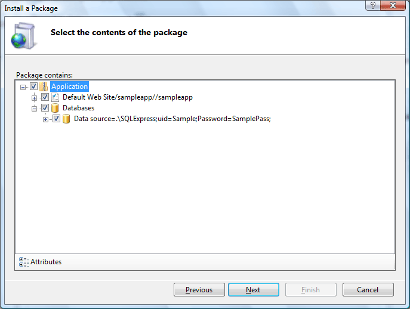

# Centralized Web Farm Management

Deploy and manage web sites and applications across large farms of web servers from a central place.

IIS makes it easy to centrally deploy and manage configuration and content across a farm of web servers.

## Share Configuration and Content

An innovative feature called [Shared Configuration](/IIS/manage/managing-your-configuration-settings/shared-configuration_264) enables administrators to:

* Place IIS configuration on a shared volume (network file share or shared disk).
* Point multiple web servers at that single configuration file.

Web content can also be shared on a network volume across multiple servers. This shared content enables updates of both configuration and content to automatically apply to all web sites connected to the share. All of the [IIS configuration and management tools](powerful-admin-tools.md) (`AppCmd.exe`, IIS Manager, etc.) work with IIS configuration, whether local or shared.

## Package, Archive, Migrate, and Synchronize

  

IIS supports the [Microsoft Web Deployment Tool](iis/publish/using-web-deploy/introduction-to-web-deploy.md), which provides support for synchronizing:

* Configuration and content.
* All types of web application dependencies including GAC assemblies, COM dlls, SQL databases, SSL certificates, and much more.

The Microsoft web Deployment Tool simplifies the deployment, management, and migration of:

* Web applications
* Web sites
* Entire Web servers. 

Developers can package a web site: content, configuration, certificates, and databases. These packages can be directly deployed to a server or packaged and shared with others. IT Professionals can enable developers to deploy these packages to a server and delegate access to non-admins. IT Professionals can use the tool in their infrastructure to:

* Synchronize servers on both IIS 6.0 and IIS 7.0
* Migrate from IIS 6.0 to IIS 7.0

Here are just a few of the features that the tool enables:

* Create a package that contains content, configuration, and SQL databases. This package can be used for deployment or sharing with others.
* Use the package as a way to version your application or create backups.
* Enable non-administrators to deploy packages and granularly control their access.
* Synchronize or migrate both sites and servers running IIS 6.0 and IIS 7.0.
