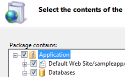

Centralized Web Farm Management
-------------------------------

Deploy and manage Web sites and applications across large farms of Web servers from a central place.

IIS7 makes it simple to centrally deploy and manage configuration and content across a farm of Web servers.

## Share Configuration and Content

An innovative new feature called [Shared Configuration](/learn/manage/managing-your-configuration-settings/shared-configuration_264) enables Administrators to place IIS configuration on a shared volume (network file share or shared disk) and point multiple Web servers at that single configuration file. Web content can also be shared on a network volume across multiple servers, enabling updates of both configuration and content to automatically apply to all Web connected to the share. All of the [IIS configuration and management tools](/overview/control/PowerfulAdminTools), from the command line tool AppCmd.exe to the admin tool IIS Manager, work seamlessly against IIS configuration whether local or shared.

## Package, Archive, Migrate and Synchronize

  

IIS7 also supports the new [Microsoft Web Deployment Tool](/learn/publish/using-web-deploy), which provides support for synchronizing not only configuration and content, but all types of Web application dependencies including GAC assemblies, COM dlls, SQL databases, SSL certificates, and much more. The Microsoft Web Deployment Tool is a tool for simplifying the deployment, management and migration of Web applications, sites and even entire servers. Developers can package a Web site, automatically including content, configuration, certificates and databases. These packages can be directly deployed to a server or packaged and shared with others. IT Professionals can enable developers to deploy these packages to a server and delegate access to non-admins. IT Professionals can also use the tool in their infrastructure to synchronize servers easily on both IIS 6.0 and IIS 7.0, or even to accomplish a migration from IIS 6.0 to IIS 7.0.

Here are just a few of the features that the tool enables:

*   Create a package that contains content, configuration and SQL databases for deployment or sharing with others.
*   Use the package as a way to version your application or create backups.
*   Enable non-administrators to deploy packages and granularly control their access.
*   Synchronize or migrate both sites and servers running IIS 6.0 and IIS 7.0.