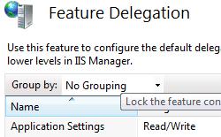

Delegated Remote Management
---------------------------

IIS7 provides built-in support for delegating administration tasks to Web site owners, allowing basic configuration and management tasks to be performed securely and without Administrative intervention.

## Distributed Configuration

IIS7's configuration is clean, well-structured XML that is easy to read and edit. Configuration values are stored as easy to understand strings; for example, bitmasks or integer values are now persisted as easy to understand enumerations. IIS7 configuration shares a similar grammar and syntax with ASP.NET configuration, and it can also be stored alongside ASP.NET configuration in web.config files!

Administrators have full control over where configuration lives. By default, IIS7 stores global configuration and Web site defaults centrally in a new file named ApplicationHost.config. This file contains locking information which dictates whether configuration overrides can be stored alongside ASP.NET configuration in web.config files. Web site and application configuration often needs to move along with the code and content that makes up the site, as the site is published from development to test or production servers. IIS7 enables configuration to be stored in a web.config file in the same directory as the site or application content, which can easily be copied from machine to machine. Web.config files can also be stored on back-end file server and referenced from multiple front-end Web servers, thus avoiding costly and error-prone replication and manual synchronization issues.

## Delegated Administration

With IIS7, Administrators have powerful and flexible control over configuration and management of the Web server. Using the built-in Feature Delegation function of IIS Manager, Administrators can delegate Web site and application administration to non-Administrators, and set feature-level policy to govern whether Web site owners have read-only, read-write, or restricted access to any given feature.

While optional, delegating access to non-Administrators has many important benefits. Enabling a developer basic constrained access to his/her Web site allows for self-service of basic administration tasks, reducing the need for Administrative intervention for basic configuration tasks. Feature delegation also allows Developers to do basic trouble-shooting and diagnostics, related to configuration, without requiring additional support. Enabling delegated administration also allows Web site owners to publish configuration settings along with the application, reducing the time to bring a new or updated application online. For example, Administrators may decide to delegate administrative control of the default document setting or other properties used for that Web site. This allows the Web site owner to configure which document is served by default, allowing them to change this setting over time without asking for Administrator help, and even provides them a way to deploy a new default document quickly and easily.

Administrators can also lock specific configuration settings so that they cannot be changed. Configuration locking ensures that security policy, like the ability to execute scripts, cannot be overridden by a content developer who has been delegated administrative access to the Web site.

## Secure, Remote Administration

IIS7 remote administration is done over HTTP/SSL, so it can traverse easily through firewalls, while protecting sensitive information by encrypted all data that passes between the management tool and the server. Using IIS Manager, it is easy to configure which port the remote administration service runs on, and which certificate should be used to enable SSL encryption. Whether managing a server locally or remote, IIS Manager provides the same rich administration experience in a secure, easy to use way.

IIS 7.0 Manager for Remote Administration provides Web developers and administrators with a firewall-friendly way to remotely manage IIS 7.0 Web servers over a secure Internet connection, by using Windows Vista, Windows XP, or Windows Server 2003. IIS 7.0 Manager for Remote Administration offers the same improved interface available on Windows Server 2008 to manage and configure the Web server. Server administrators can perform almost any task remotely as if they were sitting in front of the server. Server administrators can use the remote administration feature of IIS 7.0 Manager to add user accounts and to allow site owners and Web application developers to connect to, modify, and view settings of any sites or applications for which they have been delegated permission. Users of shared hosting services allow their changes to affect only their site, not other sites or the entire server.