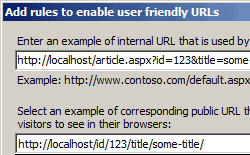

Scalable Web Infrastructure
---------------------------

Implement a scalable Web infrastructure with built-in HTTP-based load balancing and intelligent request handling and routing.

## Application Request Routing and Load Balancing

Application Request Routing (ARR) enables Web server administrators and hosting providers and to increase Web application reliability and scalability through rule-based routing and load balancing of HTTP server requests. With ARR, administrators can optimize resource utilization for application servers to reduce management costs for Web farms and shared hosting environments.

ARR automatically determines the best content server to service each request based on HTTP response header information, server variables, and sophisticated load balancing algorithms. With ARR, administrators can optimize resource utilization for application servers to reduce management costs for Web farms and shared hosting environments. ARR lets administrator create, manage, and apply load balancing rules to Server Farms in IIS 7.0 Manager. Administrators can then easily add or remove servers from a Server Farm to increase or decrease available capacity to match demand, without impacting the application’s availability. ARR also includes real traffic and URL test monitoring capabilities to determine the health of individual servers and configuration settings. Administrators can view aggregated runtime statistics in IIS 7.0 Manager.

## URL Rewriter

Using URL Rewriter, ARR gives administrators the ability to create powerful routing rules based on HTTP headers and server variables to determine the most appropriate content server for each request. URL Rewriter is an IIS 7.0 Extension that gives IIS administrators the ability to create powerful rules to implement easy-to-remember URLs for Web site pages, improve search results by making site URLs search engine-friendly, map static URLs, and enforce a consistent host name for a site. Using rule templates, rewrite maps and other functionality integrated into IIS Manager, administrators can easily set up rules to define URL rewriting behavior based on HTTP headers and server variables. URL Rewriter integrates seamlessly into IIS 7.0 Manager and supports both user-mode and kernel-mode caching for faster performance, and Failed Request Tracing to troubleshoot application logic execution.