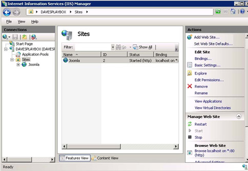

Deploying Joomla! via Packages in a Hosting Environment
====================
by [Simon Tan](https://github.com/simtan)

## Introduction

Joomla! is an open source content management system (CMS) for publishing content to the World Wide Web and intranets. This document provides step-by-step instructions on how to easily create a package containing the Joomla! application for one-click deployment in a hosting environment. For more information about the Joomla! application, visit the link: [*Windows Web App page for Joomla!*](https://www.microsoft.com/web/gallery/joomla16.aspx).

Here is a zipped PDF of this complete document: [JoomlaDocPDF](deploying-joomla-via-packages-in-a-hosting-environment/_static/deploying-joomla-via-packages-in-a-hosting-environment-993-joomla-v051.zip)

## Requirements

Environment Requirements:

- Windows Server 2008 R2 or greater
- IIS 7.0 or above
- Web Deploy 2.0

Application Requirements:

- PHP 5.2
- MySQL 5.1
- Windows Cache 1.1 for PHP

For information about how to install the necessary components, see the section Step 1. Set Up Your Servers for Hosting.

## Procedure

This procedure describes how to install Joomla! using IIS with Web Deploy. IIS with Web Deploy makes installing sites simple and extremely flexible for Hosting Service Providers by allowing them to create deployment packages that include the site, its content, and its database. The package can then be deployed by importing it into IIS via the console or a script. For more information about Web Deploy, refer to the link: [*Web Deploy 2.0 : The Official Microsoft IIS Site*](https://www.iis.net/downloads/microsoft/web-deploy).

This procedure requires three basic steps:

Step 1. Set Up Your Servers for Hosting  
Step 2. Create an Application Package for Deployment  
Step 3. Deploy a Customer Site using IIS with Web Deploy 

### Step 1. Set Up Your Servers for Hosting

#### Overview

This step describes the server components that are required to support deployment of install packages via Web Deploy.

#### Prerequisites

While it is possible to run a web server and database server on the same machine, it is not recommended due to performance and security reasons. We recommend that you use two separate machines running Windows Server 2008 R2: one acting as the Web server and one acting as the database server.

> [!NOTE]
> Both machines must be connected to the Internet to download the required server components.

To simplify installation of the Web server components, installing Web Platform Installer (Web PI) on both machines is highly recommended. Web PI is a tool that automates the installation of a vast majority of server components and other products for Microsoft's Web Platform.

#### Install Web Server Components on Your Web Server and Database Server

To install the required components on your Web server and database server using Web PI 3.0, visit the link: [*Install Spotlight Components plus PHP/MySQL related components using Web PI*](https://www.microsoft.com/web/gallery/install.aspx?appid=IIS7;NETFramework35;NETFramework4;ASPNET;MVC;WDeploy;FTPServer;MediaServices3;ManagementService;CGI;URLRewrite2;SMO;PHP52;WinCache52_11;MySQLConnector;SQLDriverPHPForIIS "Install Components") and click **Install,** follow the onscreen instructions. 

> [!NOTE]
> A complete list of components that are installed by default with Web PI 3.0 is included in the Products Installed by Default using Web PI section of this document. You can also review the list of products before installation begins.

#### Install MySQL on Your Database Server

To install MySQL, [click here on this link](http://dev.mysql.com/downloads/mysql/5.1.html) to download MySQL 5.1 and complete the steps described in the **Install MySQL on Your Database Server** in this document.

#### Next Steps

- If the Web Deploy 2.0 component is newly installed, you must configure it to allow delegated deployments. Refer to the link: [*Configure the Web Deploy Component on the Web Server*](../../web-hosting/joining-the-web-hosting-gallery/configure-site-for-web-deploy-publishing.md) for more information.
- After you install and configure the server components, validate your server configuration by following the procedures described at the link: [*Validate Your Server Configuration*](../../web-hosting/joining-the-web-hosting-gallery/validate-your-server-configuration.md).

### Step 2. Create an Application Package for Deployment

This step describes how to export an application package that can be used to quickly provision IIS sites and includes these substeps:

A. Create an IIS Web Site  
B. Install the Application to the IIS Application Web Site  
C. Enable Permalinks for Your Application (Optional)  
D. Export the Package from the IIS Application Web Site 

#### A. Create an IIS Web Site for this Application

1. Open Internet Information Services (IIS) Manager.   
  
   The Internet Information Services (IIS) Manager application opens.  
     
2. Expand your server connection, and click **Sites**.
3. In the Actions area, click the **Add Web Site** link. The Add Web Site dialog box appears.  
    
4. Enter a site name for your Web site.
5. In the Physical path field, type the physical path to the folder in which the application is installed, or click the browse button (...) to navigate to the folder.
6. In the Binding area, select the protocol for your Web site from the Type drop-down list.
7. Type the IP address to your Web site in the IP address drop-down list. The default value is All Unassigned.
8. Type a port number in the Port field.
9. Type a host name for the Web site in the Host name field.
10. If you want the Web site to be immediately available and do not need to make further changes, select the **Start Web site immediately** check box.
11. Click **OK**.

#### B. Install the Application to the IIS Application Web Site

1. Open Web Platform Installer (Web PI) locally from the Web server. The Web Platform Installer application opens.  
    
2. Select **Joomla!**, and click **Install**. The Web Platform Installation window appears.  
    
3. Click **I Accept** to accept the end-user license agreement.   
    
4. From the Web Site drop-down list, select the Web site you created earlier in this procedure.
5. In the application name field, enter an application name if it is different from the default value.  
   The remaining fields are populated automatically based on your Web site information.
6. Click **Continue**.  
    
7. From the Create a new or use an existing database drop-down list, select **Create new database**.
8. Enter the following information in the appropriate fields to create a new database:  

   - Database administrator user name and password—User name and password to allow administrative access to this database.
   - Database user name and password—User name and password to allow general access to this database.
   - Database server—Name of the server on which this database resides.
   - Database name—Name of this database.
   - Database prefix—Prefix added to database table names used to identify this database.
   - Load sample data—Indicate whether you want to load sample data into this database.
   - Web site name—Name of your Web site.
   - Site administrator—User name for the Web site specified in the Website Name field.
   - Site administrator password—Password for the Web site administrator.
   - Site administrator email address—Email address for the Web site administrator.

     > [!NOTE]
     > You must scroll down to view all required fields.
9. Click **Continue**.  
    
10. Once the Web PI process is complete, you can do one of the following:

    - Click **Finish** to complete the installation process. If you click Finish to complete the installation process, proceed to step C. Enable Permalinks (Optional) to continue creating an application package for deployment.
    - Click **Launch Joomla!** to launch your Joomla application. If you click Launch Joomla! link, the Joomla! application page appears:  
        

For information about setting up your Joomla! site, refer to the link: [*Joomla! documentation Web page*](http://help.joomla.org/).

#### C. Enable Permalinks (Optional)

By default, Joomla uses query string parameters for all the URLs it generates for your Web site. You can change this default behavior by enabling Search Engine Friendly URLs, a feature which relies on the URL rewriting functionality. To enable permalinks in Joomla, complete these steps:

1. If it does not already exist, create and open a Web.config file located in the root of the Joomla! install directory; for example: `C:\inetpub\wwwroot\joomla`
2. Paste the following XML code into the file:  

    [!code-xml[Main](deploying-joomla-via-packages-in-a-hosting-environment/samples/sample1.xml)]

    **IMPORTANT!** The backslashes (\) in the source code above indicate new lines. The backslashes are not part of the code and should be removed (along with the new line) before you paste the code into the Web.config file.
3. Save the web.config file.
4. Open a Web browser, and log in to the Joomla administrator console at http://localhost/joomla/administrator/.
5. Select **Site** &gt; **Global Configuration** to configure the following SEO settings:  

    - Search Engine Friendly URLs - **Yes**
    - Add suffix to URLs - **No**
6. Click **Apply** to save the configuration.

#### D. Export the Package from the IIS Application Web Site

1. Open IIS Manager.  
   The Internet Information Services (IIS) Manager application opens.  
    
2. In the Connections navigation pane, expand **Sites**, and select the Web site you just created.  
    
3. Click the **Export Application** link located in the Deploy section of the Actions pane.  
  
   The Export Application Package (Select the Contents of the Package) dialog box appears.  
    
4. Click **Manage Components**.  

   The Manage Components dialog box appears.  
    
5. Double-click the second row of the Provider Name column.  
    
6. Select **dbMySql** from the drop-down list.  
    
7. Double-click the second row of the Path column, and enter the connection string for your package export.  
    
8. Click outside of the box in which you entered the connection string, and click **OK**.  

   The newly created parameter now appears in the Export Application Package (Select Parameters) dialog box.  
    
9. Rename the parameters:  

   - Select **Parameter 1**, and click **Edit**.  
     The Edit Parameter dialog box appears.  
       
   - Enter **SiteName** in the Name field, and click **OK**.
   - Repeat these steps to rename Parameter 2 to "ConnectionString."

     The parameters appear renamed in the Export Application Package (Select Parameters) dialog box.   
     
10. Click **Next**.  
  
    The Export Application Package (Save Package) dialog box appears.  
    
11. Enter the path to the application package, or click Browse to locate the application file.
12. Click **Next**.  
    The Export Application Package (Export Progress and Summary) dialog box displays the progress of the export process. Once the process is complete, a summary report appears.  
    
13. Click **Finish**.Use this application package to deploy to customer Web sites as described in Step 3. Deploy a Customer Site using IIS with Web Deploy.

### Step 3. Deploy a Customer Site using IIS with Web Deploy

#### Overview

When deploying a customer site, most Hosting Service Providers use a control panel that allows them to capture the information required for deployment. This information can then be passed to scripts that create the user, configure the site for hosting, create a database, and import the application package. Here are the basic steps required to deploy a customer site:

A. Create a Customer Application Web Site  
B. Create a Customer Application Database  
C. Import the Application Package using a CLI Command or PowerShell Script 

#### A. Create a Customer Application Web Site

To create a customer application Web site, complete the steps described in A. Create an IIS Web Site for this Application.

**Tips:** 

- When you create the Web site in IIS, give your application a user-friendly name by creating a fully qualified domain name (FQDN) for the host header and adding that FQDN to your Domain Name Service.
- You can automate this process using a script similar to the one described in the section Automated Deployment Script.

#### B. Create a Customer Application Database

To create a customer application database, complete these steps:

1. Open a command-line prompt (or MySQL Manager) at the MySQL bin directory. If you used the default installation path, the bin directory path will be similar to the following: `C:\Program Files\MySQL\MySQL Server 5.1\bin`
2. Enter the administrator password, and press **Enter**.
3. Type the following command to create the database, and press **Enter**.  
 mysql&gt; create database Joomla;
4. Type this command to create a user, and press **Enter**.  
 mysql&gt; create user ‘Joomla01'@'localhost' identified by ‘password';
5. Type this command to grant permissions, and press **Enter**.  
 mysql&gt; grant all on Joomla. \* to ‘Joomla01'@'localhost';

> [!TIP]
> You can automate this process using a script similar to the one described in the section MySQL Database Creation Script.

#### C. Import the Application Package using a CLI Command or PowerShell Script

Once you export the application package (as described in Step 2. Create an Application Package for Deployment), you can easily import the package into the customer site using the CLI command or PowerShell script listed below. These methods allow you to add the parameters that are required to configure an application for use.

The examples in this topic show how to import Joomla! into an IIS Web site and install the application database. This package is configured to allow two parameters: one for the IIS site name and one for the database connection string.

##### *CLI Command*

[!code-console[Main](deploying-joomla-via-packages-in-a-hosting-environment/samples/sample2.cmd)]

##### *PowerShell MSDeploy Script*

[!code-console[Main](deploying-joomla-via-packages-in-a-hosting-environment/samples/sample3.cmd)]

## Sample Powershell Scripts

##### *Automated Website Deployment Script*

[!code-powershell[Main](deploying-joomla-via-packages-in-a-hosting-environment/samples/sample4.ps1)]

##### *MySQL Database Creation Script*

[!code-powershell[Main](deploying-joomla-via-packages-in-a-hosting-environment/samples/sample5.ps1)]

#### Install MySQL on Your Database Server

1. Download the latest stable version of MySQL from the [official website](http://www.mysql.com/) and run the installer on a dedicated **database server.**  
 The MySQL Server Instance Configuration Wizard appears.  
    

    
2. Click the **Dedicated MySQL Server Machine** option button, and click **Next**.
3. Click **Next**.  
    
4. For concurrent connections, click the **Online Transaction Processing (OLTP)** option button (since this option reflects the workload of a typical shared hosting database server), and then click **Next**.  
    
5. Click the **Enable TCP/IP Networking** check box, and then click the **Add firewall exception for this post** check box.
6. Clear the **Enable Strict Mode** check box if it is checked.  
    
7. Click the Best Support For Multilingualism option button to enable support for the UTF-8 character set.  
    **IMPORTANT!** You must choose the Best Support for Multilingualism option button since several applications in the Web Application Gallery require UTF-8 support in the database.
8. Click **Next**.  
    
9. Click the **Include Bin Directory in Windows PATH** check box, and click **Next**.
10. Since MySQL is installed on the database server (which is different than the Web server that runs the Web Deploy web server component), you must complete these steps to ensure Web Deploy can access the database server:  

    - Copy mysqldump.exe (typically located in `C:\Program Files\MySQL\MySQL Server 5.1\bin`) to your **Web server** in `C:\mysqldump\mysqldump.exe`.
    - On the **Web server**, set a registry key (`HKEY\_LOCAL\_MACHINE\SOFTWARE\Microsoft\IIS Extensions\MSDeploy\1\mysqldumppath`) to string value == "c:\mysqldump\mysqldump.exe"

> [!NOTE]
> If you lose the credentials to your MySQL database, refer to the link: [*Resetting the Root Password: Windows Systems*](http://dev.mysql.com/doc/refman/5.1/en/resetting-permissions.html#resetting-permissions-windows) to reset your password.

## Products Installed by Default using Web PI

This table provides additional information about the products that are installed by default using Web PI:

| Product | Description |
| --- | --- |
| .NET Framework 3.5 SP1 | .NET Framework 3.5 SP1 is a full cumulative update that contains many new features building incrementally upon .NET Framework 2.0, 3.0, 3.5, and includes cumulative servicing updates to the .NET Framework 2.0 and .NET Framework 3.0 subcomponents. For more information, refer to the link: [*Microsoft Download Center*](https://www.microsoft.com/downloads/en/details.aspx?FamilyID=ab99342f-5d1a-413d-8319-81da479ab0d7&amp;displaylang=en). |
| .NET Framework 4.0 | The .NET Framework is Microsoft's comprehensive and consistent programming model for building applications that have visually stunning user experiences, seamless and secure communication, and the ability to model a range of business processes. For more information, refer to the link: [*.NET Framework Developer Center*](https://msdn.microsoft.com/en-us/netframework/aa569263). |
| ASP.NET | ASP.NET is a free web framework that enables great Web applications. Used by millions of developers, it runs some of the biggest sites in the world. For more information, refer to the link: [Microsoft ASP.net](https://www.asp.net/get-started). |
| ASP.NET MVC | ASP.NET MVC is part of the ASP.NET Web application framework and is one of the two different programming models you can use to create ASP.NET Web applications. For more information, refer to the link: [*Microsoft ASP.net*](https://www.asp.net/mvc/whatisaspmvc). |
| ASP.NET MVC3 | ASP.NET MVC 3 builds on top of the features in ASP.NET MVC 1 and 2, adding on great features that both simplify your code and allow for deeper extensibility. For more information, refer to the link: [*Microsoft ASP.net*](https://www.asp.net/mvc/mvc3). |
| ASP.NET Web Pages | The ASP.NET Web Forms page framework is a scalable common language runtime programming model that can be used on the server to dynamically generate Web pages. For more information, refer to the Microsoft .net Framework SDK at the link: [*Introduction to ASP.NET Pages*](https://quickstarts.asp.net/QuickStartv20/aspnet/doc/pages/pages.aspx). |
| Common Gateway Interface (CGI) | CGI is a standard for interfacing external programs with information servers on the Internet. For more information, refer to the link: [*CGI: Common Gateway Interface*](http://www.w3.org/CGI/). |
| FTP Publishing Service | The FTP Publishing Service for IIS allows Web content creators to publish content more easily and securely to IIS Web servers using modern Internet publishing standards. For more information, refer to the link: [*FTP Publishing Service*](https://www.iis.net/downloads/microsoft/ftp). |
| IIS 7 Web Server | Internet Information Services (IIS) for Windows Server is a flexible, secure and easy-to-manage Web server for hosting anything on the Web. For more information, refer to the link: [IIS](https://www.iis.net/overview). |
| IIS Remote Management Service | Internet Information Services (IIS) Manager for Remote Administration provides end users and administrators with the ability to securely manage remote IIS servers from Windows 7, Windows Vista, Windows XP, and Windows Server 2003. For more information, refer to the link: [*IIS Manager for Remote Administration*](https://www.iis.net/downloads/microsoft/iis-manager). |
| Media Services 3.0 | IIS Media Services, an integrated HTTP-based media delivery platform, delivers true HD (720p+) live and on-demand streaming, DVR functionality, and real-time analytics support to computers, TVs, and mobile devices. For more information, refer to the link: [*IIS Media Services*](https://www.iis.net/media). |
| Microsoft Driver for PHP for SQL Server 2.0 in IIS | The Microsoft Drivers for PHP for SQL Server provide connectivity to Microsoft SQL Server from PHP applications. For more information, refer to the link: [*Microsoft Drivers for PHP for SQL Server*](https://www.microsoft.com/downloads/en/details.aspx?FamilyID=80e44913-24b4-4113-8807-caae6cf2ca05&amp;displaylang=en). |
| Microsoft SQL Server 2008 | SQL Server delivers on Microsoft's Data Platform vision by helping your organization manage your data by enabling you to store data from structured, semi-structured, and unstructured documents within the database. For more information, refer to the link: [*Microsoft SQL Server 2008*](https://www.microsoft.com/sqlserver/2008/en/us/default.aspx). |
| Microsoft Web Deploy 2.0 | Web Deploy (Web Deployment Tool) simplifies the migration, management and deployment of IIS Web servers, Web applications and Web sites. For more information, refer to the link: [*Web Deploy*](https://www.iis.net/downloads/microsoft/web-deploy). |
| MySQL Connector/Net 6.2.3 | Connector/Net is a fully-managed ADO.NET driver for MySQL. For more information, refer to the link: [*MySQL Download Connector/Net*](http://dev.mysql.com/downloads/connector/net/6.2.html). |
| PHP Driver for SQL Server | The SQL Server Driver for PHP v1.1 is designed to enable reliable, scalable integration with SQL Server for PHP applications deployed on the Windows platform. For more information, refer to the link: [*SQL Server Driver for PHP*](https://www.microsoft.com/sqlserver/2005/en/us/php-driver.aspx). |
| PHP | PHP is a general-purpose scripting language that can be embedded into HTML and is especially suited for Web development. For more information, refer to the link: [*PHP*](http://www.php.net/). |
| SQL Server 2008 Management Objects | The SQL Server Management Objects (SMO) is a .NET Framework object model that enables software developers to create client-side applications to manage and administer SQL Server objects and services. For more information, refer to the link: [*Microsoft TechNet SQL Server Management Objects (SMO)*](https://technet.microsoft.com/en-us/library/ms162169.aspx). |
| URL Rewrite 2.0 | IIS URL Rewrite 2.0 enables Web administrators to create powerful rules to implement URLs that are easier for users to remember and easier for search engines to find. For more information, refer to the link: [*URL Rewrite*](https://www.iis.net/downloads/microsoft/url-rewrite). |
| Windows Cache 1.1 for PHP | Windows Cache Extension for PHP is a PHP accelerator that is used to increase the speed of PHP applications running on Windows and Windows Server. For more information, refer to the link: [*Windows Cache Extension for PHP*](https://www.iis.net/downloads/microsoft/wincache-extension). |

## Related Information

- [*Web Deployment Tool (MS Deploy) Forum*](https://forums.iis.net/1144.aspx)
- [*PHP Manager for IIS 7 Community*](https://www.iis.net/downloads/community/2010/09/php-manager-for-iis-7)
- [*Configure and Optimize the Microsoft Web Platform for PHP Applications*](../../application-frameworks/install-and-configure-php-on-iis/index.md)