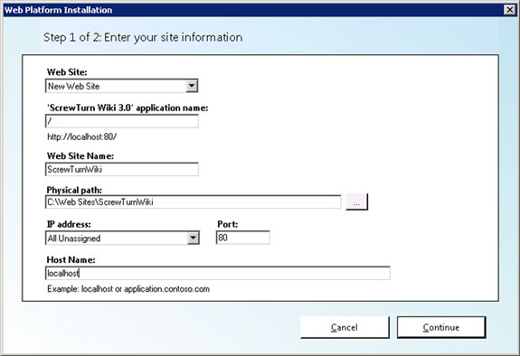
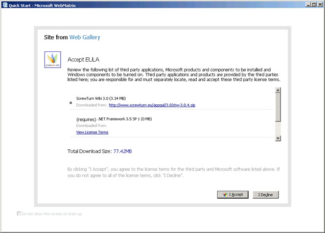

ScrewTurn Wiki
====================
by [Simon Tan](https://github.com/simtan)

## Introduction

ScrewTurn Wiki is a free, open source wiki application that is based on Microsoft ASP.NET 3.5 and allows you to create, manage and share wikis.

## Requirements

For information about technical requirements for your IIS environment, refer to [Install Server Components](../../web-hosting/joining-the-web-hosting-gallery/install-server-components.md).

## Procedure

### Step 1. Install the application in an IIS test environment.

To install the application, you can use Web Platform Installer or WebMatrix. These procedures are described in this step.

#### Web Platform Installer

The Microsoft Web Platform Installer 2.0 (Web PI) is a free tool that allows you to easily install and run the most popular free web applications for blogging, content management and more with the built-in Windows Web Application Gallery. For more information about Web PI, refer to the [Microsoft Web Platform Installer 2.0](https://www.microsoft.com/web/downloads/platform.aspx) Web site.

To use Web PI to install this application, complete these steps:

1. From the Windows Start menu, click **Programs**, and then click **Web Platform Installer**.  
  
 The Web Platform Installation window appears.  
    
2. Click the **Web Applications** tab, select the **ScrewTurn Wiki 3.0** check box, and click **Install**.  
  
    
3. Select the **ScrewTurn Wiki 3.0** check box, and click **I Accept**.  
  
    
4. Select **Mixed Mode Authentication**, enter a password, and click **Continue**. 

    Once the preinstallation steps complete, the site information window appears.  

5. In the Web Site list, click **New Web Site**.
6. Enter an application name in the application name field.
7. Enter a web site name in the Web Site Name field.
8. Enter a physical path in the Physical path field.
9. In the IP address list, click **All Unassigned**, and enter **80** in the Port field.
10. Enter a host name in the Host Name field, and click **Continue**.  
  
 The application information window appears.  
    
11. In the Choose your database list, click **SQL Server**.
12. In the Create a new or use an existing database list, click **Create new database**.
13. Enter a database administrator user name in the Database Admin Username field.
14. Enter a password in the Database Admin Password field.
15. Click **Continue**.  
  
 Once the installation process completes, the final installation window appears.  
    
16. Click **Finish**.  
  
 The ScrewTurn Wiki web page appears. From this web page, you can edit the ScrewTurn Wiki home page and create new pages.  
    

#### WebMatrix

WebMatrix is a free, easy way to customize and build Web sites from popular open-source applications, such as WordPress, Drupal, and Joomla. In addition, you can build sites from the ground up using ASP.NET, PHP, HTML and a number of other leading technologies. For more information about WebMatrix, refer to the [WebMatrix](https://www.microsoft.com/web/webmatrix/) Web site.

To use WebMatrix to install this application, complete these steps:

1. Launch WebMatrix.  
  
 The WebMatrix home page appears.  
    
2. Click **Site From Web Gallery**.  
  
 The Site From Web Gallery page appears.  
    
3. Click **ScrewTurn Wiki**, and then click **Next**.  
  
    
4. Click **SQL Server**, and choose the location in which you want to install the database from the drop-down list.
5. Click **Next**.   
  
    
6. Click **Mixed Mode Authentication**, and enter a password for your administrator.
7. Click **Next**.  
  
 The Accept EULA page appears.  
    
8. Click **I Accept** to agree to the end-user license agreement.  
  
 WebMatrix installs the ScrewTurn Wiki software on your local computer. During installation, this page appears.  
    
9. Enter information based on your environment, and click **Next**.  
  
 Once installation is complete, this page appears.  
    
10. Click **OK**.   
  
 The ScrewTurn Wiki application starts as indicated in bottom-left corner of the page.  
    
11. Click **Settings** in the left navigation area.  
  
    
12. Select **.Net 4 (Integrated)** from the Select .NET Framework Version drop-down list.
13. Select **Publish &gt; Configure**.  
  
 The Publishing Settings dialog box appears.  
    
14. Add your hosting provide and domain-specific information, and click **Validate Connection**.
15. If the connection was successful, click **Apply**, and then click **Publish**.  
  
 The Publish Preview dialog box appears.  
    
16. Click **Continue**.  
  
 The status of the publishing process is indicated in the bottom-left corner of the page.  
    
17. Once publishing is complete, go to your domain, and verify DotNetNuke is running.  
    

### Step 2. Build the application package from the IIS site.

To build the application package from the IIS site, complete the steps described in [Export a Package through IIS Manager](../using-web-deploy/export-a-package-through-iis-manager.md).

### Step 3. Install the application on the target server.

To install the application on the target server, complete the steps described in [Import a Package through IIS Manager](../using-web-deploy/import-a-package-through-iis-manager.md).