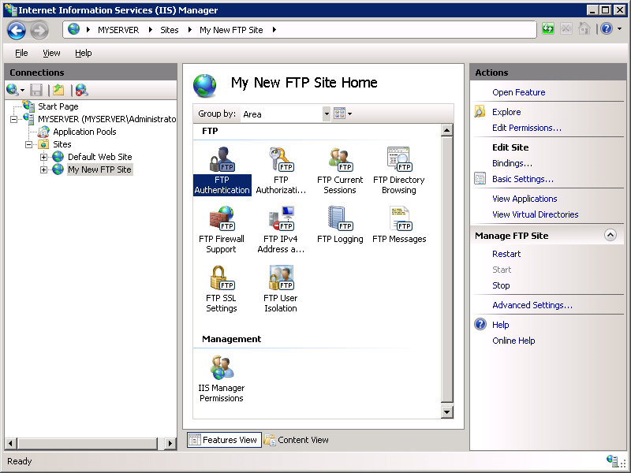

Configure FTP with IIS Manager Authentication in IIS 7
====================
by [Robert McMurray](https://github.com/rmcmurray)

## Compatibility

| Version | Notes |
| --- | --- |
| IIS 7.5 | The FTP 7.5 service ships as a feature for IIS 7.5 in Windows 7 and Windows Server 2008 R2. |
| IIS 7.0 | The FTP 7.0 and FTP 7.5 services were shipped out-of-band for IIS 7.0, which required downloading and installing the service from the following URL: [https://www.iis.net/download/FTP](https://www.iis.net/downloads/microsoft/ftp). |

## Introduction

Microsoft has completely rewritten a new FTP service for Windows Server® 2008. This FTP service incorporates many new features that enable web authors to publish content better than before, and offers web administrators more security and deployment options.

This document walks you through configuring FTP authentication for IIS 7 Manager accounts in two ways: using the new FTP user interface and by directly editing the IIS 7 configuration files. It contains:

- [Prerequisites](configure-ftp-with-iis-manager-authentication-in-iis-7.md#01)
- [Configuring the IIS 7 Management Service](configure-ftp-with-iis-manager-authentication-in-iis-7.md#02)
- [Creating a New FTP Site and Configuring an IIS 7 Manager Account](configure-ftp-with-iis-manager-authentication-in-iis-7.md#03)
- [Additional Information](configure-ftp-with-iis-manager-authentication-in-iis-7.md#04)

> [!NOTE]
> This walkthrough contains a series of steps in which you log in to your FTP site using an IIS Manager account. These steps should only be followed on the server itself using the loopback address or over SSL from a remote server. If you prefer to use a separate user account instead of an IIS 7 Manager account, create the appropriate folders and set the correct permissions for that user account when necessary.

## Prerequisites

You must install the following items to complete the procedures in this article:

1. IIS 7 must be installed on your that is running Windows Server 2008 or Windows Server 2008 R2, and the Internet Information Services Manager must be installed.
2. The new FTP service. 

    - If you are using Windows Server 2008 R2, the new FTP service is installed as feature of the IIS role in Server Manager.
    - If you are using Windows Server 2008 you can download and install the FTP service from the [https://www.iis.net/](https://www.iis.net/) web site using one of the following links: 

        - [FTP 7.5 for IIS 7.0 (x64)](https://go.microsoft.com/fwlink/?LinkId=143197)
        - [FTP 7.5 for IIS 7.0 (x86)](https://go.microsoft.com/fwlink/?LinkId=143196)

The "Network Service" account is used by the COM process that handles authentication extensibility; therefore, you must grant the account specific permissions to certain folders to enable this form of authentication. To grant the "Network Service" account "read" permissions to the IIS "config" folder:

1. Open a command prompt.
2. Type the following command: 

    [!code-console[Main](configure-ftp-with-iis-manager-authentication-in-iis-7/samples/sample1.cmd)]
3. Close the command prompt.

Create a root folder for FTP publishing:

1. Create a folder at "%SystemDrive%\inetpub\ftproot" .
2. Set the permissions to allow access for the COM process that handles authentication extensibility: 

    - Open a command prompt.
    - Type the following command: 

        [!code-console[Main](configure-ftp-with-iis-manager-authentication-in-iis-7/samples/sample2.cmd)]
    - Close the command prompt.

> [!NOTE]
> The settings listed in this walkthrough specify "%SystemDrive%\inetpub\ftproot" as the path to your FTP site. You are not required to use this path; however, if you change the location for your site you will have to change the site-related paths that are used throughout this walkthrough.

## Configuring the IIS 7 Management Service

IIS 7 offers an optional management service that allows remote administration using non-Windows accounts. The steps in this section lead you through the steps to install and configure this service.

> [!NOTE]
> The IIS 7 Management Service must be installed in order to use IIS 7 Manager Authentication with FTP, but the service does not need to be started.

### Step 1: Install the IIS Management Service

In this first step, you install the IIS 7 management service.

1. Click **Server Manager** in the Windows Start menu.  
    
2. Click **Roles** in the tree view, locate the Web Server role and click **Add Role Services**.  
    
3. If **Management Service** is not checked, check the box next to it and click **Next**. Otherwise, click **Cancel**.  
    
4. When prompted to confirm the service selections, click **Install**.  
    
5. When the service installation is complete, click **Close** to exit the wizard and close **Server Manager**.  
    

### Step 2: Configure the IIS Management Service and Add an IIS 7 Manager

In this second step, you configure the IIS 7 management service for IIS 7 Managers.

1. Go to the IIS 7 Manager. In the **Connections** pane, click the server-level node in the tree. Double-click the **Management Service** icon.  
    
2. Select the option for **Windows credentials or IIS Manager credentials. C** lick **Apply** in the **Actions** pane.  
    
3. Go to the IIS 7 Manager. In the **Connections** pane, click the server-level node in the tree. Double-click the **IIS Manager Users** icon.  
    
4. In the **IIS Manager Users** feature, click **Add User** in the **Actions** pane.  
    
5. When the **Add User** dialog appears, enter "ftpmanager" for **User Name** and "P@ssw0rd" for **Password. C** lick **OK**.  
    

#### Summary

To recap the items that you completed in this section:

- You installed the IIS 7 management Service.
- You configured the IIS 7 management Service to use both Windows and IIS 7 Manager Credentials.
- You created an IIS 7 manager that you will use later.

## Creating a New FTP Site and Configuring an IIS 7 Manager Account

This section of the document walks you through the steps required to create a new FTP site from scratch and then configure the site to use the IIS 7 manager account that you created in the previous section.

### Step 1: Use the FTP Site Wizard to Create an FTP Site

In this first step, you create a new FTP site that can only be opened by the local administrator account.

1. Go to the IIS 7 Manager. In the **Connections** pane, click the **Sites** node in the tree.
2. Right-click the **Sites** node in the tree and click **Add FTP Site**, or click **Add FTP Site** in the **Actions** pane.  
    
3. When the **Add FTP Site** wizard appears: 

    - Enter "My New FTP Site" in the **FTP site name** box, then navigate to the "%SystemDrive%\inetpub\ftproot" folder that you created in the Prerequisites section. > [!NOTE]
 > If you choose to type in the path to your content folder, you can use environment variables in your paths; for example: "%SystemDrive%\inetpub\ftproot"
    - Click **Next**.

    
4. On the next page of the wizard: 

    - Choose an IP address for your FTP site from the **IP Address** drop-down, or choose to accept the default selection of "All Unassigned." Because you will be using an IIS 7 manager account later in this walk-through, make sure that you restrict access to the server -- enter the local loopback IP address for your computer by typing "127.0.0.1" in the **IP Address** box.
    - You would normally enter the TCP/IP port for the FTP site in the **Port** box. For this walk-through, choose to accept the default port of 21.
    - For this walk- through, you will not use a host name, so make sure that the **Virtual Host** box is blank.
    - Make sure that the **SSL** **Certificate** drop-down is set to "Not Selected" and that the **Require SSL** option is not selected.
    - Click **Next**.

    
5. On the next page of the wizard: 

    - In **Authentication** settings, select **Basic**.
    - In **Authorization** settings, choose "Specified users" from the **Allow access to** drop-down. Type "administrator" in the box, and select both **Read** and **Write** in **Permissions** options.
    - Click **Finish**.

    

### Step 2: Configure the FTP Site to Use IIS 7 Manager Authentication

This section walks you through the steps required to enable IIS 7 Manager Authentication for the FTP site that you just created. Use the following steps:

1. Go to the IIS 7 Manager. Click the node for the FTP site that you created earlier. Double-click the **FTP Authentication** icon to open the FTP authentication feature page.  
    
2. When the **FTP Authentication** page displays, click **Custom Providers** in the **Actions** pane.  
    
3. When the **Custom Providers** dialog displays, click the check box for **IIS Manager Authentication. C** lick **OK**.  
    
4. Your **FTP Authentication** page should now show both **Basic Authentication** and **IIS Manager Authentication** enabled. If desired, disable **Basic Authentication** by highlighting it and clicking **Disable** in the **Actions** pane.  
    
5. You now must enable access for the IIS 7 manager account. Click the node for the FTP site in the tree view. Double-click the **IIS Manager Permissions** icon to open that feature.  
    
6. On the IIS Manager Permissions page, click **Allow User** in the **Actions** pane.  
    
7. When the **Allow User** dialog displays, choose the **IIS Manager** option. Click **Select**.  
     
8. When the **Users** dialog box displays, select the "ftpmanager" user. Click **OK**.  
    
9. Click **OK** to close the **Allow User** dialog box.  
    
10. You must add an authorization rule so that the IIS 7 manager account can log in. Click the node for the FTP site in the tree view. Double-click the **FTP Authorization Rules** icon to open the FTP authorization rules feature page.  
    
11. When the **FTP Authorization Rules** page displays, click **Add Allow Rule** in the **Actions** pane.  
    
12. When the **Add Allow Authorization Rule** dialog box opens: 

    - Select **Specified users**, then type "ftpmanager" in the text box.
    - For **Permissions**, select both **Read** and **Write**.
    - Click **OK**.

    

#### Summary

To recap the items that you completed in this section:

1. You created a new FTP site named "My New FTP Site": 

    - You specified the site's content root at "%SystemDrive%\inetpub\ftproot".
    - You bound the FTP site to the local loopback address for your computer on port 21, choosing not to use Secure Sockets Layer (SSL) for the FTP site.
    - You configured Basic Authentication to the FTP site, and created an authorization rule that allows the administrator account both "Read" and "Write" permissions for the FTP site.
2. You configured the FTP site to use an IIS 7 Manager account: 

    - You enabled IIS 7 Manager Authentication.
    - You granted access to the site for an IIS 7 manager account.
    - You created an authorization rule that allows the IIS 7 manager account both "Read" and "Write" permissions for the FTP site.

## Additional Information

After completing all of the steps in the **Configuring the IIS 7 Management Service** and **Creating a New FTP Site and Configuring an IIS Manager account** sections of this walkthrough, you are now able to log in using the "ftpmanager" account that you created. To use the command-line FTP.EXE client on your IIS server:

1. Open a command prompt.
2. Type the following command: 

    FTP localhost
3. When prompted for your USER name, enter your user name and password. For example: 

    [!code-console[Main](configure-ftp-with-iis-manager-authentication-in-iis-7/samples/sample3.cmd)]
4. The FTP service should log you into the FTP site using the IIS 7 Manager account.

For more information regarding the IIS Management Service, see [Remote Administration for IIS Manager](../../manage/remote-administration/remote-administration-for-iis-manager.md).