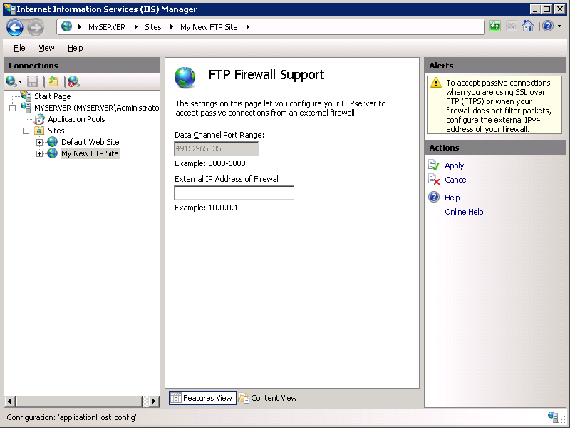

# Configuring FTP Firewall Settings in IIS 7

by [Robert McMurray](https://github.com/rmcmurray)

## Compatibility

| Version | Notes |
| --- | --- |
| IIS 7.5 | The FTP 7.5 service ships as a feature for IIS 7.5 in Windows 7 and Windows Server 2008 R2. |
| IIS 7.0 | The FTP 7.0 and FTP 7.5 services were shipped out-of-band for IIS 7.0, which required downloading and installing the service from the following URL: [https://www.iis.net/download/FTP](https://www.iis.net/downloads/microsoft/ftp). |

## Introduction

Microsoft has created a new FTP service that has been completely rewritten for Windows Server® 2008. This FTP service incorporates many new features that enable web authors to publish content better than before, and offers web administrators more security and deployment options.

This document walks you through configuring the firewall settings for the new FTP server.

## Prerequisites

The following items are required to be installed to complete the procedures in this article:

1. IIS 7 must be installed on your Windows 2008 Server, and Internet Information Services (IIS) Manager must be installed.
2. The new FTP service. You can download and install the FTP service from the <https://www.iis.net/> web site using one of the following links:

    - [FTP 7.5 for IIS 7 (x64)](https://go.microsoft.com/fwlink/?LinkID=143197)
    - [FTP 7.5 for IIS 7 (x86)](https://go.microsoft.com/fwlink/?LinkId=143196)
3. You must create a root folder for FTP publishing:

    - Create a folder at `%SystemDrive%\inetpub\ftproot`
    - Set the permissions to allow anonymous access:

      - Open a command prompt.
      - Type the following command:

         [!code-console[Main](configuring-ftp-firewall-settings-in-iis-7/samples/sample1.cmd)]
      - Close the command prompt.

**Important Notes**:

- The settings listed in this walkthrough specify `%SystemDrive%\inetpub\ftproot` as the path to your FTP site. You are not required to use this path; however, if you change the location for your site you will have to change the site-related paths that are used throughout this walkthrough.
- Once you have configured your firewall settings for the FTP service, you must configure your firewall software or hardware to allow connections through the firewall to your FTP server.

  - If you are using the built-in Windows Firewall, see the ([Optional) Step 3: Configure Windows Firewall Settings](configuring-ftp-firewall-settings-in-iis-7.md#Step3) section of this walkthrough.
  - If you are using a different firewall, please consult the documentation that was provided with your firewall software or hardware.

## Use the FTP Site Wizard to Create an FTP Site With Anonymous Authentication

In this section you, create a new FTP site that can be opened for Read-only access by anonymous users. To do so, use the following steps:

1. Go to IIS 7 Manager. In the **Connections** pane, click the **Sites** node in the tree.
2. Right-click the **Sites** node in the tree and click **Add FTP Site**, or click **Add FTP Site** in the **Actions** pane.

    
3. When the **Add FTP Site** wizard appears:

   - Enter "My New FTP Site" in the **FTP site name** box, then navigate to the `%SystemDrive%\inetpub\ftproot` folder that you created in the Prerequisites section.

      > [!NOTE]
      > If you choose to type in the path to your content folder, you can use environment variables in your paths.

   - Click **Next**.

     
4. On the next page of the wizard:

   - Choose an IP address for your FTP site from the **IP Address** drop-down, or choose to accept the default selection of "All Unassigned." Because you will be accessing this FTP site remotely, you want to make sure that you do not restrict access to the local server and enter the local loopback IP address for your computer by typing "127.0.0.1" in the **IP Address** box.
   - You would normally enter the TCP/IP port for the FTP site in the **Port** box. For this walk-through, you will choose to accept the default port of 21.
   - For this walkthrough, you do not use a host name, so make sure that the **Virtual Host** box is blank.
   - Make sure that the **Certificates** drop-down is set to "Not Selected" and that the **Allow SSL** option is selected.
   - Click **Next**.

     
5. On the next page of the wizard:

   - Select **Anonymous** for the **Authentication** settings.
   - For the **Authorization** settings, choose "Anonymous users" from the **Allow access to** drop-down. Select **Read** for the **Permissions** option.
   - Click **Finish**.

     
6. Go to IIS 7 Manager. Click the node for the FTP site that you created. The icons for all of the FTP features display.

    

### Summary

To recap the items that you completed in this step:

1. You created a new FTP site named "My New FTP Site", with the site's content root at `%SystemDrive%\inetpub\ftproot`.
2. You bound the FTP site to the local loopback address for your computer on port 21, choosing not to use Secure Sockets Layer (SSL) for the FTP site.
3. You created a default rule for the FTP site to allow anonymous users "Read" access to the files.

## Step 1: Configure the Passive Port Range for the FTP Service

In this section, you configure the server-level port range for passive connections to the FTP service. Use the following steps:

1. Go to IIS 7 Manager. In the **Connections** pane, click the server-level node in the tree.

    
2. Double-click the **FTP Firewall Support** icon in the list of features.

    
3. Enter a range of values for the **Data Channel Port Range**.

    
4. Once you have entered the port range for your FTP service, click **Apply** in the **Actions** pane to save your configuration settings.

### Notes

1. The valid range for ports is 1024 through 65535. (Ports from 1 through 1023 are reserved for use by system services.)
2. You can enter a special port range of "0-0" to configure the FTP server to use the Windows TCP/IP dynamic port range.
3. For additional information, please see the following Microsoft Knowledge Base articles:

    - [174904 - Information about TCP/IP port assignments](https://support.microsoft.com/kb/174904/)
    - [929851 - The default dynamic port range for TCP/IP has changed in Windows Vista and in Windows Server 2008](https://support.microsoft.com/kb/929851/)

4. This port range will need to be added to the allowed settings for your firewall server.

## Step 2: Configure the external IPv4 Address for a Specific FTP Site

In this section, you configure the external IPv4 address for the specific FTP site that you created earlier. Use the following steps:

1. Go to IIS 7 Manager. In the **Connections** pane, click the FTP site that you created earlier in the tree, Double-click the **FTP Firewall Support** icon in the list of features.

   
2. Enter the IPv4 address of the external-facing address of your firewall server for the **External IP Address of Firewall** setting.

   
3. Once you have entered the external IPv4 address for your firewall server, click **Apply** in the **Actions** pane to save your configuration settings.

### Summary

To recap the items that you completed in this step:

1. You configured the passive port range for your FTP service.
2. You configured the external IPv4 address for a specific FTP site.

## (Optional) Step 3: Configure Windows Firewall Settings

Windows Server 2008 contains a built-in firewall service to help secure your server from network threats. If you choose to use the built-in Windows Firewall, you will need to configure your settings so that FTP traffic can pass through the firewall.

There are a few different configurations to consider when using the FTP service with the Windows Firewall - whether you will use active or passive FTP connections, and whether you will use unencrypted FTP or use FTP over SSL (FTPS). Each of these configurations are described below.

> [!NOTE]
> You will need to make sure that you follow the steps in this section walkthrough while logged in as an administrator. This can be accomplished by one of the following methods:

- Logging in to your server using the actual account named "Administrator".
- Logging on using an account with administrator privileges and opening a command-prompt by right-clicking the Command Prompt menu item that is located in the Accessories menu for Windows programs and selecting "Run as administrator".

One of the above steps is required because the User Account Control (UAC) security component in the Windows Vista and Windows Server 2008 operating systems prevents administrator access to your firewall settings. For more information about UAC, please see the following documentation:

- <https://go.microsoft.com/fwlink/?LinkId=113664>

> [!NOTE]
> While Windows Firewall can be configured using the **Windows Firewall** applet in the Windows Control Panel, that utility does not have the required features to enable all of the features for FTP. The **Windows Firewall with Advanced Security** utility that is located under **Administrative Tools** in the Windows Control Panel has all of the required features to enable the FTP features, but in the interests of simplicity this walkthrough will describe how to use the command-line **Netsh.exe** utility to configure the Windows Firewall.

### Using Windows Firewall with non-secure FTP traffic

To configure Windows Firewall to allow non-secure FTP traffic, use the following steps:

1. Open a command prompt: click **Start**, then **All Programs**, then **Accessories**, then **Command Prompt**.
2. To open port 21 on the firewall, type the following syntax then hit enter:

   [!code-console[Main](configuring-ftp-firewall-settings-in-iis-7/samples/sample2.cmd)]
3. To enable stateful FTP filtering that will dynamically open ports for data connections, type the following syntax then hit enter:

   [!code-console[Main](configuring-ftp-firewall-settings-in-iis-7/samples/sample3.cmd)]

**Important Notes**:

- Active FTP connections would not necessarily covered by the above rules; an outbound connection from port 20 would also need to be enabled on server. In addition, the FTP client machine would need to have its own firewall exceptions setup for inbound traffic.
- FTP over SSL (FTPS) will not be covered by these rules; the SSL negotiation will most likely fail because the Windows Firewall filter for stateful FTP inspection will not be able to parse encrypted data. (Some 3rd-party firewall filters recognize the beginning of SSL negotiation, e.g. AUTH SSL or AUTH TLS commands, and return an error to prevent SSL negotiation from starting.)

### Using Windows Firewall with secure FTP over SSL (FTPS) traffic

The stateful FTP packet inspection in Windows Firewall will most likely prevent SSL from working because Windows Firewall filter for stateful FTP inspection will not be able to parse the encrypted traffic that would establish the data connection. Because of this behavior, you will need to configure your Windows Firewall settings for FTP differently if you intend to use FTP over SSL (FTPS). The easiest way to configure Windows Firewall to allow FTPS traffic is to list the FTP service on the inbound exception list. The full service name is the "Microsoft FTP Service", and the short service name is "ftpsvc". (The FTP service is hosted in a generic service process host (Svchost.exe) so it is not possible to put it on the exception list though a program exception.)

To configure Windows Firewall to allow secure FTP over SSL (FTPS) traffic, use the following steps:

1. Open a command prompt: click **Start**, then **All Programs**, then **Accessories**, then **Command Prompt**.
2. To configure the firewall to allow the FTP service to listen on all ports that it opens, type the following syntax then hit enter:

    [!code-console[Main](configuring-ftp-firewall-settings-in-iis-7/samples/sample4.cmd)]
3. To disable stateful FTP filtering so that Windows Firewall will not block FTP traffic, type the following syntax then hit enter:

    [!code-console[Main](configuring-ftp-firewall-settings-in-iis-7/samples/sample5.cmd)]

## More Information about Working with Firewalls

It is often challenging to create firewall rules for FTP server to work correctly, and the root cause for this challenge lies in the FTP protocol architecture. Each FTP client requires two connections to be maintained between client and server:

- FTP commands are transferred over a primary connection called the *Control Channel*, which is typically the well-known FTP port 21.
- FTP data transfers, such as directory listings or file upload/download, require a secondary connection called *Data Channel*.

Opening port 21 in a firewall is an easy task, but this means that an FTP client will only be able to send commands, not transfer data. This means that the client will be able to use the Control Channel to successfully authenticate and create or delete directories, but the client will not be able to see directory listings or be able to upload/download files. This is because data connections for FTP server are not allowed to pass through the firewall until the Data Channel has been allowed through the firewall.

> [!NOTE]
> This may appear confusing to an FTP client, because the client will seem to be able to successfully log in to the server, but the connection may appear to timeout or stop responding when attempting to retrieve a directory listing from the server.

The challenges of working with FTP and firewalls doesn't end with the requirement of a secondary data connection; to complicate things even more, there are actually two different ways on how to establish data connection:

- *Active Data Connections*: In an active data connection, an FTP client sets up a port for data channel listening and the server initiates a connection to the port; this is typically from the server's port 20. Active data connections used to be the default way of connecting to FTP server; however, active data connections are no longer recommended because they do not work well in Internet scenarios.
- *Passive Data Connections*: In a passive data connection, an FTP server sets up a port for data channel listening and the client initiates a connection to the port. Passive connections work much better in Internet scenarios and recommended by [RFC 1579 (Firewall-Friendly FTP)](https://www.ietf.org/rfc/rfc1579.txt).

> [!NOTE]
> Some FTP clients require explicit action to enable passive connections, and some clients don't even support passive connections. (One such example is command-line Ftp.exe utility that ships with Windows.) To add to the confusion, some clients attempt to intelligently alternate between the two modes when network errors happen, but unfortunately this does not always work.

Some firewalls try to remedy problems with data connections with built-in filters that scan FTP traffic and dynamically allow data connections through the firewall. These firewall filters are able to detect what ports are going to be used for data transfers and temporarily open them on firewall so that clients can open data connections. (Some firewalls may enable filtering FTP traffic by default, but it is not always the case.) This type of filtering is known as a type of Stateful Packet Inspection (SPI) or Stateful Inspection, meaning that the firewall is capable of intelligently determine the type of traffic and dynamically choose how to respond. Many firewalls now employ these features, including the built-in Windows Firewall.
