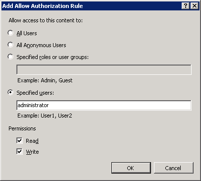
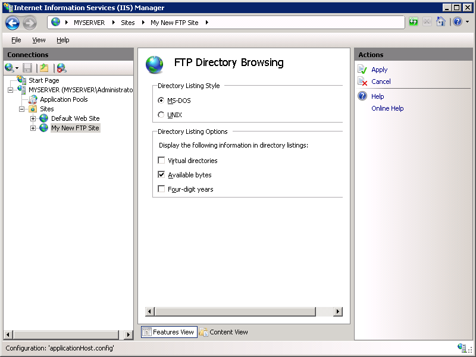
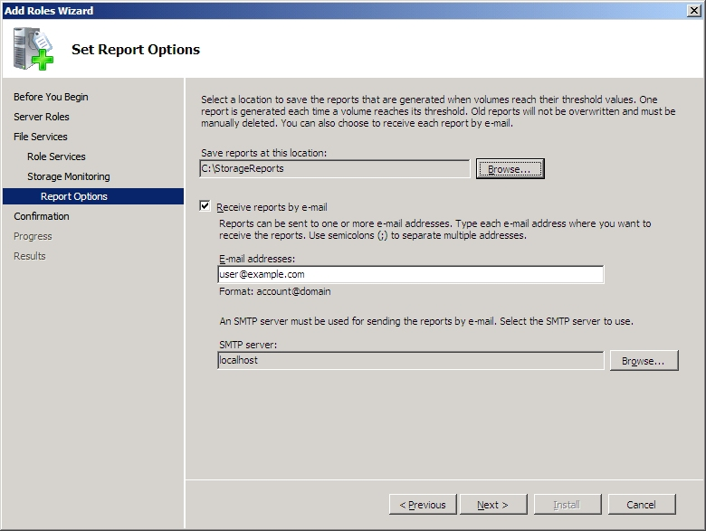
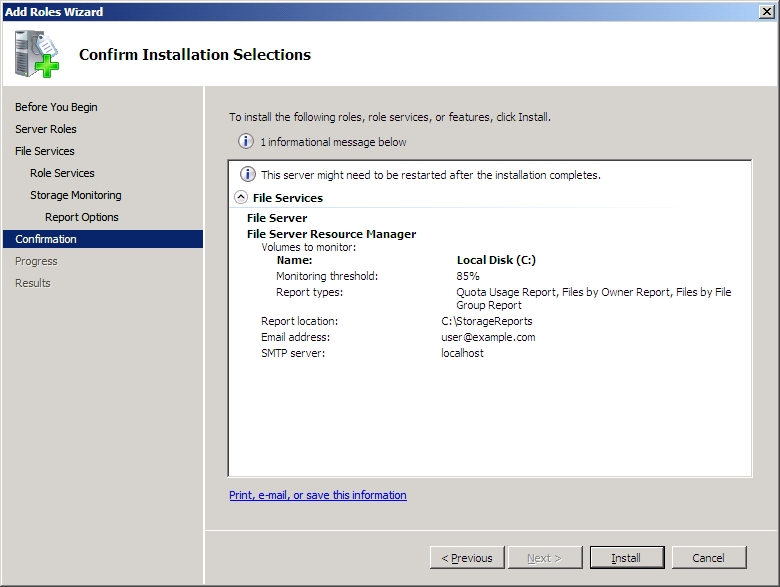
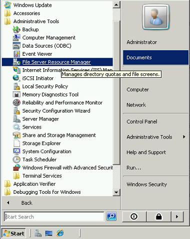

# Using FSRM Folder Quotas with FTP in IIS 7

by [Robert McMurray](https://github.com/rmcmurray)

## Compatibility

| Version | Notes |
| --- | --- |
| IIS 7.5 | The FTP 7.5 service ships as a feature for IIS 7.5 in Windows 7 and Windows Server 2008 R2. |
| IIS 7.0 | The FTP 7.0 and FTP 7.5 services were shipped out-of-band for IIS 7.0, which required downloading and installing the service from the following URL: <https://www.iis.net/downloads/microsoft/ftp>. |

## Introduction

Microsoft has created a new FTP service that has been completely rewritten for Windows Server© 2008. This FTP service incorporates many new features that enable web authors to publish content better than before, and offers web administrators more security and deployment options.

This document walks you through using the folder-based quotas provided by Windows Server 2008's File Server Resource Manager (FSRM) with the new FTP service to create a publicly accessible FTP site with a fixed quota size. It contains:

- [Create a New FTP Site](#01)
- [Installing and Configuring the File Server Resource Manager Service](#02)

> [!NOTE]
> This walkthrough contains a series of steps in which you log on to your FTP site using the local administrator account. These steps should only be followed on the server itself using the loopback address or over SSL from a remote server. If you prefer to use a separate user account instead of the administrator account, you must create the appropriate folders and set the correct permissions for that user account when necessary.

### Prerequisites

The following items are required to be installed to complete the procedures in this article:

- IIS 7.0 must be installed on your Windows 2008 Server 2008, and the Internet Information Services Manager must be installed.
- The new FTP service. You can download and install the FTP service from the <https://www.iis.net/> web site using one of the following links:

  - [FTP 7.5 for IIS 7.0 (x64)](https://go.microsoft.com/fwlink/?LinkId=143197)
  - [FTP 7.5 for IIS 7.0 (x86)](https://go.microsoft.com/fwlink/?LinkId=143196)
- You must create a root folder for FTP publishing:

  - Create a folder at `C:\inetpub\ftproot`
  - Set the permissions to allow anonymous access:

    - Open a command prompt.
    - Type the following command:

       [!code-console[Main](using-fsrm-folder-quotas-with-ftp-in-iis-7/samples/sample1.cmd)]
    - Close the command prompt.

> [!NOTE]
> The settings listed in this walkthrough specify `C:\inetpub\ftproot` as the path to your FTP site. You are not required to use this path; however, if you change the location for your site you will have to change the site-related paths that are used throughout this walkthrough.

## Create a New FTP Site

In this section we create a new FTP site that can be opened for Read-only access by anonymous users and Read/Write access by the administrator account.

### Step 1: Use the FTP Site Wizard to Create an FTP Site with Anonymous Authentication

Create an FTP site where users will be able to access content anonymously. Use the following steps:

1. Go to the IIS 7.0 Manager. In the **Connections** pane, click the **Sites** node in the tree.
2. Right-click the **Sites** node in the tree and click **Add FTP Site**, or click **Add FTP Site** in the **Actions** pane.  
    
3. When the **Add FTP Site** wizard appears:

    - Enter "My New FTP Site" in the **FTP site name** box, then navigate to the `C:\inetpub\ftproot` folder that you created in the Prerequisites section.

        > [!NOTE]
        > If you choose to type in the path to your content folder, you can use environment variables in your paths; for example: `%SystemDrive%\inetpub\ftproot`

    - Click **Next**.  
        
4. On the next page of the wizard:

    - Choose an IP address for your FTP site from the **IP Address** drop-down, or choose to accept the default selection of "All Unassigned." Because you will be using the administrator account later in this walk-through, you make sure that you restrict access to the server and enter the local loopback IP address for your computer by typing "127.0.0.1" in the **IP Address** box.
    - You would normally enter the TCP/IP port for the FTP site in the **Port** box. For this walk-through, you will choose to accept the default port of 21.
    - For this walk- through, you will not use a host name, so make sure that the **Virtual Host** box is blank.
    - Make sure that the **Certificates** drop-down is set to "Not Selected" and that the **Allow SSL** option is selected.
    - When you have completed these items, click **Next**.  
         
5. On the next page of the wizard:

    - Select **Anonymous** for the **Authentication** settings.
    - For the **Authorization** settings, choose "Anonymous users" from the **Allow access to** drop-down, and select **Read** for the **Permissions** option.
    - When you have completed these items, click **Finish**.  
        
6. Go to the IIS 7.0 Manager. Click the node for the FTP site that you created. The icons for all of the FTP features display.  
    

### Step 2: Add Basic Authentication to your FTP site

We need to add Basic Authentication so that users can log in. To do so, use the following steps:

1. Go to the IIS 7.0 Manager. Click the node for the FTP site that you created earlier. Double-click the **FTP Authentication** icon to open the FTP authentication feature page.  
    
2. When the **FTP Authentication** page displays, highlight **Basic Authentication.** Click **Enable** in the **Actions** pane.  
    
3. Go to the IIS 7.0 Manager. Click the node for the FTP site to display the icons for all of the FTP features again.
4. We must add an authorization rule so that the administrator can log in. Double-click the **FTP Authorization Rules** icon to open the FTP authorization rules feature page.  
    
5. When the **FTP Authorization Rules** page displays, click **Add Allow Rule** in the **Actions** pane.  
    
6. When the **Add Allow Authorization Rule** dialog box displays:

    - Select **Specified users**, then type "administrator" in the box.
    - For **Permissions**, select both **Read** and **Write**.
    - Click **OK**.  
        

### Step 3: Show Available Bytes for the FTP Site

We must configure the FTP site so that users will be able to see the available bytes for the site. Use the following steps:

1. Go to IIS 7.0 Manager. Click the node for the FTP site that you created earlier. Double-click the FTP Directory Browsing icon to open the FTP directory browsing page.  
    
2. Check the box for **Available bytes**, then click **Apply** in the **Actions** pane.  
    

### Summary

To recap the items that you completed in this step:

1. You created a new FTP site named "My New FTP Site", with the site's content root at `C:\inetpub\ftproot`.
2. You bound the FTP site to the local loopback address for your computer on port 21, choosing not to use Secure Sockets Layer (SSL) for the FTP site.
3. You created a default rule for the FTP site to allow anonymous users "Read" access to the files.
4. You added an authorization rule that allows the administrator account both "Read" and "Write" permissions for the FTP site.
5. You added Basic Authentication to the FTP site.
6. You configured the FTP site to display the available bytes to users.

## Installing and Configuring the File Server Resource Manager Service

This section of the walkthrough leads you through the steps to install the File Server Resource Manager (FSRM) service and configure a folder quota.

### Step 1: Install the File Server Resource Manager (FSRM)

1. In **Server Manager** under **Roles**, click **Add Role** in the **Roles Summary**.  
    
2. In the **Select Server Roles** dialog, check **File Services. C** lick **Next**.  
    
3. On the **Introduction to File Services** page, click **Next**.  
    
4. On the **Select Role Services** page, check the **File Server Resource Manager** service. Click **Next**.  
    
5. On the **Configure Storage Utilization Monitoring** page, click the **Options** button.  
    
6. In the **Volume Monitoring Options** dialog, check the **Quota Usage Report** option. Click **OK**.  
    
7. On the **Configure Storage Utilization Monitoring** page, click **Next**.  
    
8. On the **Set Notification Options** page, customize the location for your reports and email settings. Click **Next**.  
    
9. On the **Confirm Installation Selections** page, verify your choices. Click **Install**.  
    
10. When the installation is completed, click **Close**.  
    
11. Expand the **Roles** node in **Server Manager.** You should now see the **File Services** role displayed with all of its related information.  
    

### Step 2: Creating a Folder Quota

1. Under the Windows **Administrative Tools** menu, click **File Server Resource Manager**.  
    
2. In the **File Server Resource Manager**, expand **Quota Management** in the tree view and click **Quotas**, then click **Create Quota** in the Actions pane.  
    
3. In the **Create Quota** dialog box, navigate to the `C:\inetpub\ftproot` folder that you created in the Prerequisites section. Choose a template from the list of available templates to apply to your folder. Click **Create**.  
    
4. The **File Server Resource Manager** should now display the quota settings for your FTP site.  
    

### Summary

To recap the items that you completed in this step:

1. You added the File Services role to your server, and added the File Server Resource Manager role service.
2. You added a folder quota for your FTP site's content directory.

Once folder quotas have been enabled for a content path for an FTP site and the site has been configured to display the available bytes, FTP will return the available bytes every time a directory listing command is sent by and FTP client.

> [!NOTE]
> Some graphical FTP clients may not show this information unless they support some form of viewing the activity log for the FTP session.
