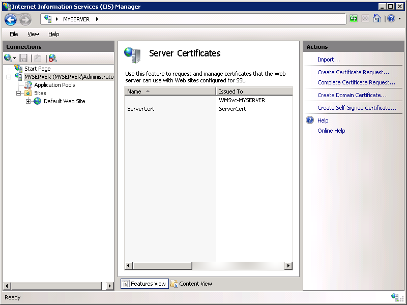
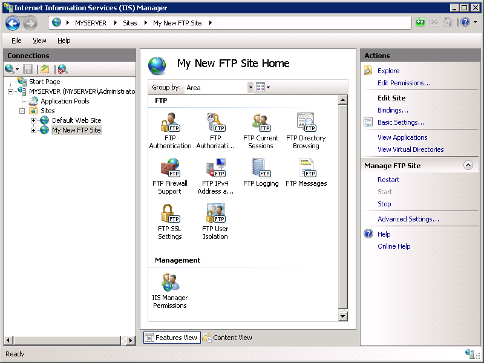

Using FTP Over SSL in IIS 7
====================
by [Robert McMurray](https://github.com/rmcmurray)

## Compatibility

| Version | Notes |
| --- | --- |
| IIS 7.5 | The FTP 7.5 service ships as a feature for IIS 7.5 in Windows 7 and Windows Server 2008 R2. |
| IIS 7.0 | The FTP 7.0 and FTP 7.5 services were shipped out-of-band for IIS 7.0, which required downloading and installing the service from the following URL: [https://www.iis.net/download/FTP](https://www.iis.net/downloads/microsoft/ftp). |

## Introduction

Microsoft has created a new FTP service that has been completely rewritten for Windows Server® 2008. This FTP service incorporates many new features that enable web authors to publish content better than before, and offers web administrators more security and deployment options.

One of the features is FTP over Secure Sockets Layer (SSL), which allows sessions to be encrypted between an FTP client and server. This document walks you through: setting up an FTP site; and, configuring that site to use SSL with the new FTP user interface, which allows you to directly edit the IIS 7.0 configuration files. It contains:

- [Prerequisites](using-ftp-over-ssl-in-iis-7.md#01)
- [OPTIONAL: Creating a Self-signed SSL Certificate](using-ftp-over-ssl-in-iis-7.md#02)
- [Creating an SSL-enabled FTP Site Using the IIS 7.0 Manager](using-ftp-over-ssl-in-iis-7.md#03)
- [Adding SSL-based FTP Publishing by Editing the IIS 7.0 Configuration Files](using-ftp-over-ssl-in-iis-7.md#04)

> [!NOTE]
> This walk-through contains a series of steps where you log in to your FTP site using the local administrator account. These steps should only be followed on the server itself using the loopback address or over SSL from a remote server. If you prefer to use a separate user account instead of the administrator account, you must create the appropriate folders and set the correct permissions for that user account when necessary.

## Prerequisites

The following items are required to be installed to complete the procedures in this article:

1. IIS 7.0 must be installed on your Windows 2008 Server, and the Internet Information Services Manager must be installed.
2. The new FTP service. You can download and install the FTP service from the [https://www.iis.net/](https://www.iis.net/) web site using one of the following links: 

    - [FTP 7.5 for IIS 7.0 (x64)](https://go.microsoft.com/fwlink/?LinkID=143197)
    - [FTP 7.5 for IIS 7.0 (x86)](https://go.microsoft.com/fwlink/?LinkID=143196)
3. You will need to create a root folder for FTP publishing: 

    - Create a folder at `%SystemDrive%\inetpub\ftproot`
    - Set the permissions to allow access for the administrators group: 

        - Open a command prompt.
        - Type the following command: `ICACLS "%SystemDrive%\inetpub\ftproot" /Grant administrators:F /T`
        - Close the command prompt.

> [!NOTE]
> The settings listed in this walkthrough specify `%SystemDrive%\inetpub\ftproot` as the path to your FTP site. You are not required to use this path; however, if you change the location for your site you must change the site-related paths that are used throughout this walkthrough.

## OPTIONAL: Creating a Self-signed SSL Certificate

In this optional task you will create a self-signed SSL certificate that you will use for testing your FTP site.

> [!NOTE]
> If you are setting up an FTP site for Internet-based activity, you would obtain an SSL certificate from one of the many Certification Authorities, such as VeriSign, Thawte, DigiCert, etc. For more information about Certification Authorities, see the following page on the Microsoft Developer Network Web site:

[https://msdn.microsoft.com/en-us/library/bb540797(VS.85).aspx](https://msdn.microsoft.com/en-us/library/bb540797(VS.85).aspx)

1. Open the Internet Information Services (IIS 7.0) Manager.
2. Click your computer at the top node of the **Connections** tree, then double-click the **Server Certificates** feature.  
    
3. Click **Create Self-Signed Certificate** in the **Actions** pane.  
    
4. Enter "My FTP Certificate" as the name for the new certificate, then click **OK**.  
    

## Creating an SSL-enabled FTP Site Using the IIS 7.0 Manager

### Step 1: Use the FTP Site Wizard to Create an SSL-based FTP Site

In this first step, you create a new FTP site that can only be opened using your administrator account.

1. Go to IIS 7.0 Manager. In the **Connections** pane, click the **Sites** node in the tree.
2. Right-click the **Sites** node in the tree and click **Add FTP Site**, or click **Add FTP Site** in the **Actions** pane.  
    
3. When the **Add FTP Site** wizard appears: 

    - Enter "My New FTP Site" in the **FTP site name** box, then navigate to the `%SystemDrive%\inetpub\ftproot` folder that you created in the Prerequisites section.> [!NOTE]
> If you choose to type in the path to your content folder, you can use environment variables in your paths.
    - Click **Next**.

    
4. On the next page of the wizard: 

    - Choose an IP address for your FTP site from the **IP Address** drop-down, or choose to accept the default selection of "All Unassigned." Because you will use the administrator account later in this walk-through, make sure that you restrict access to the server and enter the local loopback IP address for your computer by typing "127.0.0.1" in the **IP Address** box.
    - You would normally enter the TCP/IP port for the FTP site in the **Port** box. For this walk-through, choose to accept the default port of 21.
    - For this walk- through, you do not use a host name, so make sure that the **Virtual Host** box is blank.
    - Make sure that the **Certificates** drop-down is set to your SSL certificate. For example, if you followed the optional step to create a self-signed certificate, the drop-down box should say "My FTP Certificate".
    - Make sure that the **Allow SSL** option is selected.
    - Click **Next**.

    
5. On the next page of the wizard: 

    - Select **Basic** for the **Authentication** settings.
    - For the **Authorization** settings: 

        - Choose "Specified users" from the **Allow access to** drop-down.
        - Type "administrator" for the user name.
        - Select **Read** and **Write** for the **Permissions** option.
    - When you have completed these items, click **Finish**.

    

#### Summary

You have successfully created a new SSL-based FTP site using the new FTP service.

To recap the items that you completed in this step:

- You created a new FTP site named "My New FTP Site", with the site's content root at `%SystemDrive%\inetpub\ftproot`.
- You bound the FTP site to the local loopback address for your computer on port 21.
- You chose to require Secure Sockets Layer (SSL) for the FTP site, and selected your SSL certificate.
- You enabled Basic Authentication and created an authorization rule for the local administrator account for Read and Write access.

### Step 2: Configuring Additional FTP SSL Settings

The SSL policy for FTP is customizable on a site-by-site basis. Different settings can be specified for the control and data channels. In this step, you configure additional SSL settings for your FTP site that ensure that all user credentials are encrypted, even if all other FTP activity is not.

1. Go to the IIS 7.0 Manager. Click the node for the FTP site that you created in Step 1. The icons for all of the FTP features display.  
    
2. In order to configure the SSL options, double-click the **FTP SSL Settings** icon to open the SSL settings feature page.  
    
3. When the **FTP SSL Settings** page displays, select the **Custom** option, and then click the **Advanced** button.  
     
4. When the **Advanced SSL Policy** dialog box is displayed: 

    - Select the **Require only for credentials** option for the control channel.
	    > [!NOTE]
        > This setting requires that all user names and password are encrypted via SSL, but the client can choose whether to encrypt all other control channel activity.
    - Select the **Allow** option for the data channel.> [!NOTE]
> This setting allows the client to choose whether to encrypt any data channel activity.
    - When you have completed these items, click **OK**.  
        
5. On the **FTP SSL Settings** page, click **Apply** in the **Actions** pane to save the SSL settings.  
    

#### Summary

To recap the items that you completed in this step:

- You configured the control channel SSL policy to require that all user credentials are encrypted, and allowed FTP clients to determine whether to encrypt all other control channel activity.
- You configured the data channel SSL policy to allow FTP clients to determine whether to encrypt any data channel activity.

### Logging in To Your FTP Site

In Step 1, you created an FTP site that can be accessed by the administrator account. In Step 2, you configured the control channel SSL policy to require that all user credentials are encrypted while allowing FTP clients to choose whether or not all other control channel and data channel activity be encrypted.

When logging in to the FTP server using an SSL-capable FTP client, the FTP server supports the following explicit security options:

- TLS-C/TLS - Use TLS for the connection with RFC2228 defaults. This means that there is no implicit protection of the data connection.
- TLS-P/SSL - Use TLS for the connection. This means that the data connection is implicitly protected.

These settings can be configured when specifying the SSL connection options in most 3rd-part FTP clients.

## Adding SSL-based FTP Publishing by Editing the IIS 7.0 Configuration Files

You can also add SSL-based FTP publishing to an existing Web site by editing the IIS 7.0 configuration files.

> [!NOTE]
> Editing your applicationHost.config file requires full administrative permissions. Use one of two methods:

- Log in to your computer using the local "administrator" account.

Or

- If you are logged in using an account with administrative permissions that is not the local "administrator" account, open Notepad using the "Run as Administrator" option.

> [!NOTE]
> One of the above steps is required because the User Account Control (UAC) security component in the Windows Vista and Windows Server 2008 operating systems prevents access to your applicationHost.config file. For more information about UAC, please see the following documentation:

- [https://go.microsoft.com/fwlink/?LinkId=113664](https://go.microsoft.com/fwlink/?LinkId=113664)

The following steps walk you through all of the required settings to add FTP publishing for the Default Web Site.

### Step 1: Retrieve the Hash for your SSL Certificate:

1. In the **Server Certificates** feature, double-click your SSL certificate. For example, if you followed the optional step to create a self-signed certificate, you would double-click the certificate that is named "My FTP Certificate".
2. Click the **Details** tab.
3. Scroll through the fields until you locate the **Thumbprint** value.
4. Highlight the **Thumbprint** value, the data displays as:  
 "57 68 6F 61 20 44 75 64 65 2C 20 49 49 53 20 52 6F 63 6B 73"
5. Copy the hex data from the text box and paste it in the clipboard. Then, open Windows Notepad and paste the data into a blank document.

> [!NOTE]
> You will use this information later.

### Step 2: Add FTP to your Default Web Site

1. Using a text editor such as Windows Notepad, open your applicationHost.config file, which is located in your `%SystemRoot%\System32\inetsrv\config` folder by default.
2. Locate the section for your Default Web Site. It should resemble the following example: 

    [!code-xml[Main](using-ftp-over-ssl-in-iis-7/samples/sample1.xml)]
3. Create a new binding element in the bindings collection. Set the value of the protocol attribute on the new binding element to contain "ftp", then change the port value of the bindingInformation attribute to contain "21". Your Default Web Site's settings should now resemble the following example: 

    [!code-xml[Main](using-ftp-over-ssl-in-iis-7/samples/sample2.xml)]
4. Add an &lt;ftpServer&gt; section beneath the closing &lt;bindings&gt; tag that will contain your authentication and SSL settings.
    > [!NOTE]
    > The authentication settings for FTP sites are configured at the site-level, unlike authentication for Web sites, which can be configured per URL. 

    [!code-xml[Main](using-ftp-over-ssl-in-iis-7/samples/sample3.xml)]
5. Copy and paste the thumbprint data from the SSL certificate into the serverCertHash attribute of the SSL element. Remove all the spaces from the thumbprint data.
    > [!NOTE]
    > If you do not convert the hex data to uppercase, it will not show up in IIS Manager later.
	
	Your Default Web Site settings should now contain something like the following example: 

    [!code-xml[Main](using-ftp-over-ssl-in-iis-7/samples/sample4.xml)]
6. Scroll to the bottom of your applicationHost.config file and add a location section for your Default Web Site that will contain your authorization settings.
    > [!NOTE]
    > As shown in this example, the authorization settings for FTP sites are configured per URL. 

    [!code-xml[Main](using-ftp-over-ssl-in-iis-7/samples/sample5.xml)]
7. Save your applicationHost.config file.

You should now be able to log in to your Default Web Site using an SSL-based FTP client.

#### Summary

In this task you added SSL-based FTP publishing to your Default Web Site by editing the IIS 7.0 configuration files. To recap the items that you completed in this task:

- You added an FTP binding to the Default Web Site.
- You enabled FTP basic authentication and disabled FTP anonymous authentication for the Default Web Site.
- You configured the site to require SSL for all control channel and data channel activity.
- You configured the administrator account for Read/Write permissions for the Default Web Site.