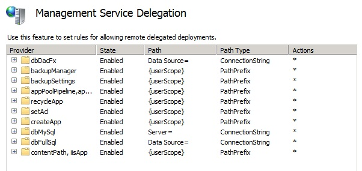

dbDacFx Provider for Incremental Database publishing
====================
by [Ahmed ElSayed](https://github.com/ahmelsayed)

## Introduction

In V3 we are adding a new database sync provider that is called dbDacFx. As the name suggests, this provider is making use of the new Data-Tier Applications Framework (Dacpac Framework) for syncing database. Right now we already have dbFullSql that is using Shared Management Objects (SMO) for syncing SQL Server databases and scripts. We have dbMySql that is used to sync MySQL databases. The main difference between dbDacFx and dbFullSql (beside the different framework used) is the type of database sync.

In dbFullSql we do a full database sync every time. That is the way SMO works, it will only sync a full database to another. One of the problems this introduced was trying to add duplicate objects in the database on a sync. For example, if you have a table ‘Department' in your database then you sync it once to the server. After that you make some changes in that database and try to sync again. SMO will attempt to insert that table again, and will give you the error

[!code-sql[Main](dbdacfx-provider-for-incremental-database-publishing/samples/sample1.sql)]

This is because it is trying to sync the whole database again. The solution for this error was to add source settings ScriptDropsFirst=true which will allow you to script drops for every object that is in the source database, this way when you try to add it to the destination it will drop it first before attempting to add it. With the new dbDacFx there is no need to do such a thing, and that is thanks to Dacpac framework.

## Dacpac an Incremental Database Sync

Dacpac Framework is a new release from SQL Server team that enables incremental updates to databases. Dacpac will diff the two databases and calculate what needs to be added to the destination database to make it similar to the source and then generates a Dacpac with that info in it. This Dacpac can then be applied to the destination database.

This means that updating one table, or adding one new table to your database won't require you to re-sync the whole database again, and Dacpac will just do an incremental update to the destination. Unlike SMO, Dacpac files are binary files and not plain SQL Scripts. This is important to keep in mind as they are incremental updates and diffs and applying the Dacpac to a database will always diff the two and determines what should be applied. It is also important to know that Dacpac will sync data by default in an incremental fashion as well. To turn it off we have added a provider setting in our Web Deploy provider (dbDacFx) that allows you to turn data syncing off using the provider setting IncludeData=false on the source.

## Azure Support

SMO has some limitations when it comes to SQL Azure support. Dacpac on the other hand supports syncing from and to SQL Azure completely and is actually the recommended way to sync your database with Azure. dbDacFx provider is also supported on Azure Websites and can sync databases that are linked to those sites.

## Transactions are split into 2

Dacpac framework handles transactions a bit differently. Dacpac splits transactions into 2 sessions, schema and data. If there is an error while applying the schema the schema will be pulled back. If the schema is applied correctly without any error, the changes will be committed, and then it will start a new transaction for the data. Sometimes data insertion will fail (e.g. null value in a NOT NULL column, or a non cluster index in Azure) in this case the data will be rolled back but not the schema. This is by design of Dacpac framework itself. This is also the default behavior of the dbDacFx provider, but it can be controlled using the provider setting IncludeTransactionalScripts=false.

## Dacpac is .NET 4 only

It is also worth mentioning that Dacpac Framework –unlike SMO- takes a hard dependency on .NET 4 Framework. Therefore, installing .NET 4 is important for Dacpac to run. Also the msdeploy.exe should run in a .NET 4 process, otherwise the dbDacFx provider will not work. For WMSvc, on Windows 8 WMSvc is a .NET 4 process therefore it can load Dacpac Framework without any issues. However, on Windows Server 2008 and 2008 R2 WMSvc is a .NET 2.0 process and it won't be able to load Dacpac. We worked around this issue by having WMSvc launch our own msdeploy.exe executable in a new .NET 4 process that will do the sync locally on the machine running WMSvc. This way Windows Server 2008 and 2008 R2 will still be able to run the new provider and sync databases using Dacpac. The MsDepSvc runs as a .NET 4 process on Windows 2008 and 2008 R2 so it can load Dacpac Framework. If you have changed the run time for MsDepSvc to run in .NET 2, then it will do the same thing as WMSvc.

## Setting up Dacpac Framework and dbDacFx Provider

### Prerequisites:

You will fist need to install these prerequisites

1) Microsoft SQL Server 2012 Data-Tier Application Framework (dacframework.msi)

2) Microsoft System CLR Types for Microsoft SQL Server 2012 (SQLSysClrTypes.msi)

3) Microsoft SQL Server 2012 Transact-SQL ScriptDom (SQLDOM.msi)

They all can be found here:   
[https://www.microsoft.com/en-us/download/details.aspx?id=29065](https://www.microsoft.com/en-us/download/details.aspx?id=29065)

### WMSvc Delegation Rule:

If you are using WMSvc, you will need a delegation rule on that machine to allow for using this provider. We install one by default that has a path of "Data Source=" and a Path Type of ConnectionString. it looks like thisThis delegation rule will only enforce the path to be a connection string, but you can change it.
  

## Using dbDacFx Provider:

Using the dbDacFx provider is very simple and very similar to that of dbFullSql. This is a simple example in which we will create a new database and copy an existent database content to it.

[!code-console[Main](dbdacfx-provider-for-incremental-database-publishing/samples/sample2.cmd)]

This command will use the dbDacFx provider to sync these 2 databases together on the local SQL Express instance you have on that machine. If NewDatabase doesn't exist, we will try to create it and if the user specified in the connection string doesn't have the permissions to create databases, we will fail with that error.

dbDacFx includes data by default and also enables transactions by default. You can turn off these options by using IncludeData=false and IncludeTransactionScripts=false, like this

[!code-console[Main](dbdacfx-provider-for-incremental-database-publishing/samples/sample3.cmd)]

This sync will only sync the schema in and without transactions. This is not advised however, because in the case of a failure, the destination database will be left in a weird state.

You can also remote over WMSvc or MsDepSvc and we will take care of figuring out the .NET version and handle that appropriately. In this example it's syncing a database ‘OldDatabase' from the local SQL Express to the SQL Express on the machine ‘RemoteMachine'

[!code-console[Main](dbdacfx-provider-for-incremental-database-publishing/samples/sample4.cmd)]

That remote machine must have the correct delegation rule, and the user ‘iisAdmin' should have access to the Default Web Site.

### Dacpac Actions

There are 3 different Dacpac actions that the dbDacFx provider expose Deploy, Script, and Report.

#### Deploy

Deploy is the default option and what we have been using so far. This is the option that actually syncs 2 databases. Deploy can also sync a database to (and from) a .dacpac file. Dacpac files are binary files that hold the content of a database and can be applied later on another database. Using dbDacFx provider you can sync a database to a dacpac file or sync from a dacpac file to a database. This is done by simply replacing the connection string in the provider path with a file location on the local hard disk. For example,

[!code-console[Main](dbdacfx-provider-for-incremental-database-publishing/samples/sample5.cmd)]

This will create a database.dacpac file. Later applying this file using the provider like this

[!code-console[Main](dbdacfx-provider-for-incremental-database-publishing/samples/sample6.cmd)]

Will work exactly as syncing the OldDatabase to the NewDatabase directly.

#### Script

This option generates a SQL script that can be applied to move the database to another. This script will only include schema and is specific for the 2 databases that it was generated on. The script will update the schema in an incremental fashion as well. For example,

[!code-console[Main](dbdacfx-provider-for-incremental-database-publishing/samples/sample7.cmd)]

The script will be displayed on the cmd window and you can copy it to a file. Alternatively, you can pipe the output of the cmd into a file (using &gt;), but you will have to remove the msdeploy.exe traces from before and after the script.

#### Report

This option will generate an XML report of the database content and what will be added to the destination database. This report can only be parsed by an XML parser and can't be applied by the dbDacFx provider on any database. This is how to get an XML report using the Report action

[!code-console[Main](dbdacfx-provider-for-incremental-database-publishing/samples/sample8.cmd)]

Like the Script, this XML report will be displayed on the cmd window and you can copy it to a file later. Alternatively, you can pipe the output of the cmd into a file (using &gt;), but you will have to remove the msdeploy.exe traces from before and after the script.

### dbDacFx Command Timeout

This command timeout is used to specify the time out on the launched exe in the case of a .NET 2 service. When WMSvc or MsDepSvc (running as .NET 2) launch the msdeploy.exe executable, they wait for this process if it is not reporting anything back. You can specify the commadTimeout in seconds like this (in this case it is 100 seconds timeout). **Default** timeout is *120 seconds*.

[!code-console[Main](dbdacfx-provider-for-incremental-database-publishing/samples/sample9.cmd)]

### Dacpac Options

Dacpac Framework supports a lot of different settings and options that you can apply on the dacpac files. A list and explanation of all the options can be found here [https://msdn.microsoft.com/library/microsoft.sqlserver.dac.dacdeployoptions.aspx](https://msdn.microsoft.com/library/microsoft.sqlserver.dac.dacdeployoptions.aspx).   
All these options are exposed through dbDacFx provider and applied as provider settings. They will also show up in the help listing for the provider

[!code-console[Main](dbdacfx-provider-for-incremental-database-publishing/samples/sample10.cmd)]

## Troubleshooting dbDacFx Errors

Most error codes and workarounds (including dbDacFx errors) can be found here: [https://www.iis.net/learn/publish/troubleshooting-web-deploy/web-deploy-error-codes](../troubleshooting-web-deploy/web-deploy-error-codes.md)