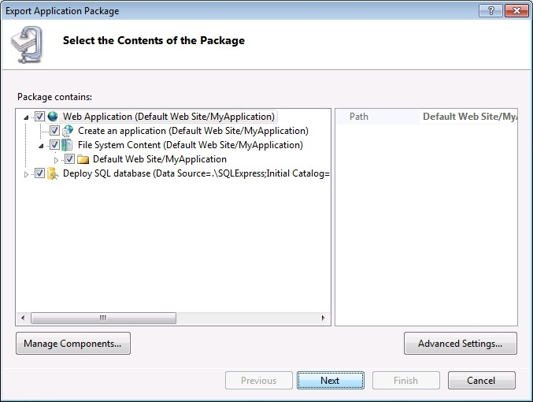
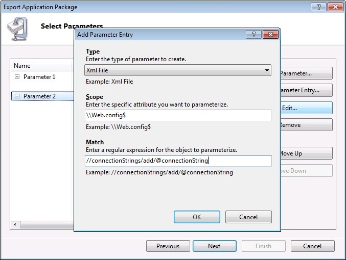
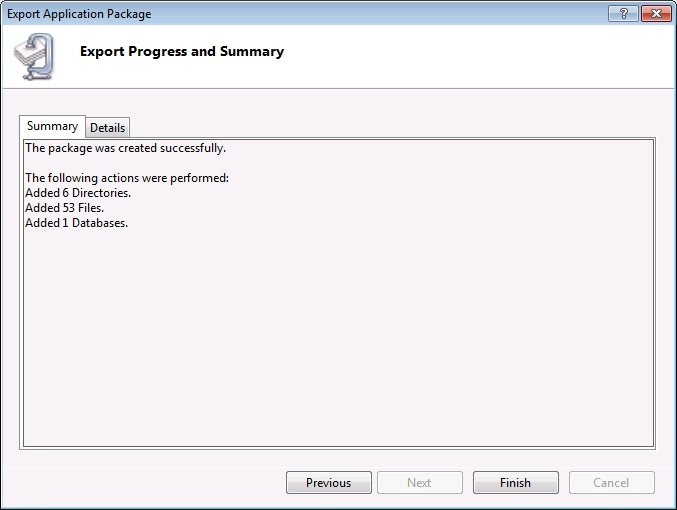

Export a Package through IIS Manager
====================
by Faith A

This quick guide will help you create a package of your Web application using the IIS Manager, including a SQL database.

### Prerequisites

This guide requires the following prerequisites:

- .NET Framework 2.0 SP1 or greater
- Web Deployment Tool
- IIS 7.0 or above, or IIS Remote Manager

### Prerequisites if you're using SQL

Note: The second and third pre-requisites will be installed automatically if you install the Web Deployment Tool using the Web Platform Installer

- SQL Server Express or Standard, either local or remote
- SQL Server 2008 Management Objects (SMO) - [x86](https://go.microsoft.com/fwlink/?LinkId=123708&amp;clcid=0x409) or [x64](https://go.microsoft.com/fwlink/?LinkId=123709&amp;clcid=0x409)
- SQL CLR Types - [x86](https://go.microsoft.com/fwlink/?LinkId=123721&amp;clcid=0x409) or [x64](https://go.microsoft.com/fwlink/?LinkId=123722&amp;clcid=0x409)

Note: If you have not already installed the Web Deployment Tool, see [Installing the Web Deployment Tool](use-the-web-deployment-tool.md "Installing the Web Deploy").

### Export a Package

1. Always make a backup. Run the following command to backup an IIS 7.0 or above server:  

    [!code-console[Main](export-a-package-through-iis-manager/samples/sample1.cmd)]
2. Open the IIS Manager by clicking Start &gt; Run and typing inetmgr.
3. In IIS Manager, expand the Server node and the Sites node, then select the Default Web Site/MyApplication.
4. In the right-hand Actions pane under **Manage Packages**, click the **Export Application...** link to launch the wizard.  
    
5. By default, the package will contain the site or application you have selected (in this case the Default Web Site/MyApplication) and its content folders. Click on the **Manage Components** button.  
    
6. The first row is your iisapp provider entry, which is your application. In the second row, choose the **dbFullSql** provider from the **Provider Name** drop-down. If you hover over a provider, you will see a description and example path.  
    
7. Enter the path to your database or script file in the **Path** column.   
 (Example: "Data Source=.\SQLExpress;Database=MyApplicationDb;User id=MyAppUser;Password=SomePassWord;" without the quotes.)  
    
8. You'll notice that the database now shows up in the package contents tree view. Click **Next** to continue the wizard.  
    
9. Next you will see parameters that are generated based on the two providers that you added in the previous step. We're going to give them friendlier names and descriptions. Select the second parameter in the list, **Parameter 2**, and click on the **Add Parameter Entry** button.  
    
10. We're going to create a parameter entry that points to the connection string inside the application's Web.config file. You'll notice that the parameter entry has 3 fields to fill out.  
    
11. Choose the type of parameter you want. In this case, we'll choose XmlFile because we want to point to the Web.config file.  
    
12. Enter the scope for the parameter entry. The scope is a regular expression that tells us what file to locate in the package. In this case, we'll choose the Web.config file but we'll add \\ to indicate the start of the file and $ to indicate the end of the file name so that Web.config.bak wouldn't also be updated.  
    
13. Then we'll add a match. For an XmlFile parameter entry, the match is an xpath query that indicates a particular element or attribute in the XML file. We'll add an xpath pointing to the connection string attribute. Click **OK** to accept the entry.  
    
14. You now have parameters that will allow a user installing this package to set the application path (site and app name where they want this app to be installed) and change the connection string (which will be updated in 2 places, first when running the SQL script and second inside the Web.config file). Click **Next** to continue.  
    
15. Finally, choose a location to save your package. For this example, we chose C:\MyApplication.zip.  
    
16. The wizard will now complete the packaging process and save the package to disk. When it is complete, you will see a Summary page that gives you an overview of what actions were performed.  
    

### Summary

Congratulations! You have now created a package based on the Default Web Site. It contains the application, which contains content files and an entry that will mark the folder as an application in IIS, and a SQL database.

[Discuss in IIS Forums](https://forums.iis.net/1144.aspx)