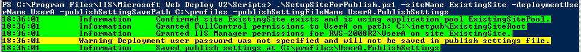
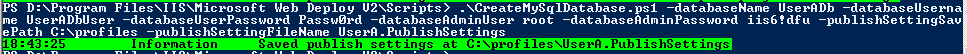

PowerShell scripts for automating Web Deploy setup
====================
by Kristina Olson

## PowerShell scripts for automating Web Deploy setup

#### Description:

The v2.1 release of Web Deploy installs several PowerShell scripts that make it easy to configure your IIS server so that users can publish to it by using Web Deploy. This page shows you how to use these scripts to create a default publishing site, enable publishing for a new or existing site and user, create publishing SQL or MySQL databases, or to set up delegation rules – all using PowerShell.

The scripts that you will use are:

- SetupSiteForPublish.ps1
- CreateSqlDatabase.ps1
- CreateMySqlDatabase.ps1
- AddDelegationRules.ps1

#### Requirements:

- The server must have an operating system that comes with IIS7—this means either Windows Server 2008 or Windows Server 2008 R2. You must be an administrator on the machine.
- In the [Web Platform Installer](https://go.microsoft.com/fwlink/?LinkId=145510), search for "hosting" and install either the "Recommended Server Configuration for Hosting Providers" product bundle or "Web Deployment Tool 2.1 for Hosting Servers." Alternatively, make sure the following conditions are met: 

    - PowerShell2 must be installed (this is built into Windows Server 2008 R2; for Windows Server 2008, you can get PowerShell2 as an update from here: [https://support.microsoft.com/kb/968930](https://support.microsoft.com/kb/968930). A restart may be required.
    - The Web Server (IIS) role must be enabled in Server Manager.
    - The Web Management Service role service of IIS ("Management Service") must be enabled in Server Manager
    - To use the PowerShell database scripts, the server must have access to a SQL or MySQL database. SQL Server Management Objects must also be installed for SQL.
    - Web Deploy must be installed with the Management Service Integration component. (For this option to appear in the Web Deploy installer, the Web Management Service must be enabled first.)

#### General PowerShell instructions:

1. Launch a PowerShell command window 

    1. Click on the PowerShell icon in the task bar or click **Start**, type **PowerShell**, and select **Windows PowerShell**.  (The blue icon)
2. Make sure your execution policy allows for running scripts 

    1. Type "Get-ExecutionPolicy". If it is Restricted (the default) you must reset to a more permissive setting such as by typing "Set-ExecutionPolicy AllSigned". The AllSigned setting will allow running signed scripts, but prompt you in case they are not trusted

    1. For more information on execution policy settings see [Using the Set-ExecutionPolicy Cmdlet](https://technet.microsoft.com/en-us/library/ee176961.aspx).
3. Change to the Web Deploy scripts directory 

    1. Type "cd '%programfiles%\IIS\Microsoft Web Deploy v2\Scripts'" (but replace %programfiles% with the actual path, such as C:\Program Files).

#### Use the SetupSiteForPublish script to create a default publishing web site (no databases):

Run the SetupSiteForPublish.ps1 script with no arguments:

What this does:

The script creates a user and site for non-admin publishing and saves the publish profile information in a file on the desktop. More specifically, it creates a site called WDeploySite with physical site root at %systemdrive%\inetpub\WDeploySite. The site will have a matching application pool, WDeployAppPool, and will be assigned to port 8080 by default (or the next available port if another site is using 8080). The script also creates a non-administrator local Windows user called WDeploySiteuser and grants that user Full Control ACLs on the WDeploySite folder and IIS Manager Permissions to the site. The settings information is saved to the desktop in a file called WDeploy.PublishSettings - this file may be consumed by WebMatrix (or potentially Visual Studio) for publishing to the site. This profile does NOT contain any database publishing information at this point.

#### Enable Web Deploy Publishing for any Site and User using the SetupSiteForPublish script:

**Script**: SetupSiteForPublish.ps1

**Description**: For a specified site and user account, enables the specified user to publish to the specified site. The script creates the user account, site, and application pool; sets the directory ACLs and IIS Manager permissions for the site; and saves the setting information in a file.

**Parameters**:

| Name | Description | Default Value | Notes |
| --- | --- | --- | --- |
| siteName | Name of the site. If site does not exist, it will be created. | WDeploySite |  |
| sitePhysicalPath | Physical file location for the site content. If the directory does not exist, it will be created. | %systemdrive%\inetpub\WDeploySite |  |
| siteAppPoolName | Name of the application pool that will be associated with the site. If the application pool does not exist, it will be created. | WDeployAppPool | It is recommended to dedicate one application pool per site. |
| sitePort | Port for the site bindings. | First port from 8080-8200 that is not in use by another site. | A firewall rule may be required to open the port for remote traffic. |
| deploymentUserName | Name of the user to be given access to the site. If the user does not exist, a non-administrator user will be created. | WDeploySiteuser |  |
| deploymentUserPassword | Password for the deployment user. If a password is not specified, one will be automatically generated and saved in the settings file. | [autogenerated] |  |
| managedRunTimeVersion | If specified, will try to set the specified run-time version for the application pool. If a matching runtime version is not found, the application pool defaults will be used. | Application pool defaults | Example format "v2.0" or "v4.0" |
| publishSettingSavePath | An existing directory where the settings file will be saved. | Current user's desktop | Must be an existing directory. If the directory specified does not exist, an error will result. |
| publishSettingFileName | Name of the settings file, including the extension. | WDeploy.PublishSettings | Remember to include the extension. If the file already exists, the site information in it will be overwritten. |

**Examples**:

Enable publishing for an existing user on an existing site (the password will not be saved in the settings file):

[!code-unknown[Main](powershell-scripts-for-automating-web-deploy-setup/samples/sample-127166-1.unknown)]

Enable publishing for a new user on a new site, with a custom name and location for the publish settings file:

[!code-unknown[Main](powershell-scripts-for-automating-web-deploy-setup/samples/sample-127166-2.unknown)]

[](powershell-scripts-for-automating-web-deploy-setup/_static/image7.png)

The PublishSettings file also contains the new user password. Notice that the connection string fields are empty - they can be filled by hand or you can add this to the profile using the database generation scripts:

[!code-xml[Main](powershell-scripts-for-automating-web-deploy-setup/samples/sample3.xml)]

#### Create a SQL database for a publishing account using the CreateSqlDatabase script:

**Script**: CreateSqlDatabase.ps1

**Description**: Creates a database, a login, a database user that has db\_owner permissions to the database, and saves the corresponding connection string information in a settings file.

**Parameters**:

| Name | Description | Default Value | Notes |
| --- | --- | --- | --- |
| databaseName | Name of the database to be created. | wDeploySqldb |  |
| databaseUserName | Name of the database user and login. | wdeploySqlUser | Specify a new user every time, or you may end up resetting a user's login password and invalidating the user's previous connection credentials. |
| databaseUserPassword | Password for the database user and login. If no password is specified, one will automatically be generated. | [autogenerated] | In some cases the auto-generated password may contain characters that cause issues with certain publishing clients. Consider modifying the script if you are using the script for automated database creation. |
| databaseAdminUser | SQL server administrator user name (typically "sa"). | REQUIRED |  |
| databaseAdminPassword | Password for the SQL server administrator account. | REQUIRED |  |
| sqlServerInstanceName | Location of the SQL server. | .\SQLExpress |  |

General

| publishSettingSavePath | An existing directory where the settings file will be saved. | Current user's desktop | Must be an existing directory. If the directory specified does not exist, an error will result. |
| --- | --- | --- | --- |
| publishSettingFileName | Name of the settings file, including the extension. | WDeploy.PublishSettings | Remember to include the extension. If the file already exists, the site information in it will be overwritten. |

**Examples**:

Create a database with user using the defaults (local SQLExpress database):

.\CreateSqlDatabase.ps1

Create a new database and add the connection string information to existing publish settings file "c:\profiles\UserA.PublishSettings":

[!code-unknown[Main](powershell-scripts-for-automating-web-deploy-setup/samples/sample-127166-4.unknown)]

[](powershell-scripts-for-automating-web-deploy-setup/_static/image13.png)

#### Create a MySQL database for a publishing account using the CreateMySqlDatabase script:

**Script**: CreateMySqlDatabase.ps1

**Description**: Creates a database, a database user with all privileges on the database (at localhost), and saves the connection string information in a settings file

**Parameters**:

| Name | Description | Default Value | Notes |
| --- | --- | --- | --- |
| databaseName | Name of the database to be created. | WDeployDb |  |
| databaseUserName | Name of the database user. | WDeployUser |  |
| databaseUserPassword | Password for the database user and login. If no password is specified, one will automatically be generated. | [autogenerated] | In some cases the auto-generated password may contain characters that cause issues with certain publishing clients. Consider modifying the script if you are using the script for automated database creation. |
| databaseAdminUser | Name for the database administrator, typically "root". | REQUIRED | You will be prompted for this parameter if not supplied |
| databaseAdminPassword | Password for the server administrator account. | REQUIRED | You will be prompted for a value for this parameter if you do not provide one. |
| serverHostName | Location of the MySQL server | localhost | \*see note below table |

General

| publishSettingSavePath | An existing directory where the settings file will be saved. | Current user's desktop | Must be an existing directory. If the directory specified does not exist, an error will result. |
| --- | --- | --- | --- |
| publishSettingFileName | Name of the settings file, including the extension. | WDeploy.PublishSettings | Remember to include the extension. If the file already exists, the site information in it will be overwritten. |

\*If you specify a non-localhost value for serverHostName and do not modify the permissions for the user, the user may not be able to access his or her database. By default the permissions granted in this script provide the database user access from the local machine. If the database server is not hosted on the same machine, the permission granting section of the PowerShell script should be modified to grant more general permissions, such as by changing the following line of script to allow access from any machine:

Default script permissions line:

[!code-powershell[Main](powershell-scripts-for-automating-web-deploy-setup/samples/sample5.ps1)]

Modified script permissions line:

[!code-powershell[Main](powershell-scripts-for-automating-web-deploy-setup/samples/sample6.ps1)]

**Examples**:

Create a database with user using the defaults:

[!code-unknown[Main](powershell-scripts-for-automating-web-deploy-setup/samples/sample-127166-7.unknown)]

[](powershell-scripts-for-automating-web-deploy-setup/_static/image16.png)

Create a new database and add the connection string information to existing publish settings file "c:\profiles\UserA.PublishSettings":

[!code-unknown[Main](powershell-scripts-for-automating-web-deploy-setup/samples/sample-127166-8.unknown)]

[](powershell-scripts-for-automating-web-deploy-setup/_static/image19.png)

#### Set up Delegation Rules for the server using the AddDelegationRules script:

**Script**: AddDelegationRules.ps1

**Description**: This script is run automatically at setup time by the installer during a full install, but if you did not do a full install or wish to repair the rules at any time, you can re-run this AddDelegationRules script.

**Parameters**:

| Name | Description | Default Value | Notes |
| --- | --- | --- | --- |
| elevatedUsername | Name for the user account that will be granted write access to the server's applicationHost.config file. This user will be used as the run-as user on the appPoolPipeline, appPoolNetFx and createApp rules. | WDeployUser | Creates only a local Windows user and will not work if shared configuration is enabled. The password for this user account will be reset if the script is run a second time. |
| elevatedPassword | Automatically generated if not specified. | [autogenerated] |  |
| adminUsername | Name for an Administrator user account that will be used as the run-as user on the recycleApp rule. | WDeployAdmin | Creates only a local Windows user and will not work if shared configuration is enabled. The password for this user account will be reset if script is run a second time. |
| adminPassword | Automatically generated if not specified | [autogenerated] |  |
| ignorePasswordResetErrors | Switch. If elevated/adminUsername references an existing account, this switch allows the script to reset the password for the account. | [omitted - resetting user passwords not allowed] | Resetting a user password can result in the user losing access to data. This switch should be used with caution. For more information, see [https://windows.microsoft.com/en-US/windows-vista/What-are-the-risks-of-resetting-a-password](https://windows.microsoft.com/en-US/windows-vista/What-are-the-risks-of-resetting-a-password)*.* Note also that the new user password is not stored and cannot be retrieved later. |
  
  
[Discuss in IIS Forums](https://forums.iis.net/1144.aspx)