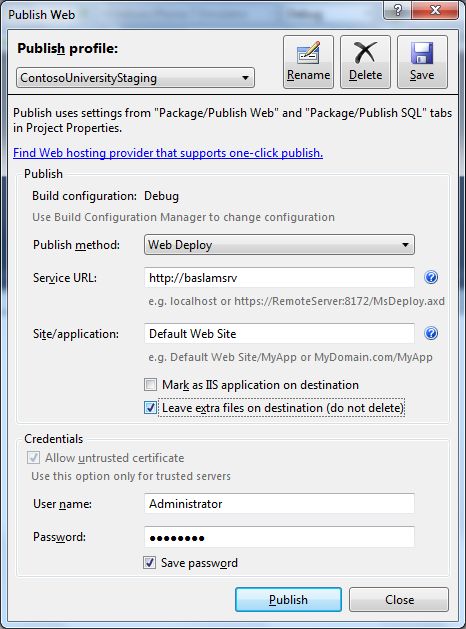

# Testing Web Deploy publishing from Visual Studio 2010 and WebMatrix

by Ben Byrd

## Summary

So far, we have configured Web Deploy on a server so non-administrators can deploy content to a single site (Default Web Site) as well as databases. In this walkthrough, we will test that we can publish from Visual Studio 2010 and WebMatrix to this server.

## Testing Administrator Deployment from Visual Studio 2010

1. Start Visual Studio 2010 and load up the [Contoso University C# solution](https://code.msdn.microsoft.com/ASPNET-MVC-Application-b01a9fe8)
2. Click the ContsoUniversity Web Application Project (WAP)
3. Click the Publish dropdown in the toolbar and click "New…"  
     
4. Fill in the dialog as below: 

   1. Service URL. This is perhaps the most important component of this whole screen. Since we are deploying as Administrator, we can simply deploy using the Remote Agent Service. Entering a URL of the form http://{serverName} causes Visual Studio 2010 to deploy using the Remote Agent Service. Not the HTTP prefix.
   2. Site/application. This is the name of the IIS site and application we are deploying to. For now, we will just deploy to Default Web Site.
   3. Enter Administrator in User name and the password for the Administrator user on the server.   
       
5. Click Publish. The Output window will show the deployment as it proceeds. Notice that Visual Studio 2010 is indeed deploying your application over the Remote Agent Service:  
    
6. If your application does not render in a browser, you may be running into one of two common problems: 

    1. Check that the remote application pool is set to the correct .NET version (4.0 in this case)
    2. Check if you have all of the application's dependencies installed on the remote. In this case, we need ASP.NET MVC and SQL Server Compact on the remote. Since they can be bin-deployed by Visual Studio 2010, we right-click the WAP and click "Add Deployable Dependencies". Check the two dependencies and re-publish:  
        

## Testing Non-Administrator Deployment from Visual Studio 2010

1. Start Visual Studio 2010 and load up the Contoso University solution
2. Click the ContsoUniversity Web Application Project (WAP)
3. Click the Publish dropdown in the toolbar and click "New…"  
    
4. Fill out the dialog like below:  
    

    Note that the Service URL field is slightly different for non-administrator deployments. Filling in just the server name in this field is equivalent to filling in https://{serverName}:8172/MsDeploy.axd, which instructs Web Deploy to deploy using the Web Management Service, which supports non-administrator deployments.
5. Click Publish. The Output Windows shows that Web Deploy is indeed deploying over the Web Management Service:  
    
6. If the application does not render correctly in the browser, follow the troubleshooting steps given above in "Testing Administrator Deployment from Visual Studio 2010"

## Testing Non-Administrator Deployment from WebMatrix

Notice that a small XML containing Web Deploy settings was generated at the end of "PowerShell Scripts for Automating Web Deploy Setup" with the extension of .PublishSettings. the XML contains the following values:

[!code-xml[Main](testing-web-deploy-publishing-from-visual-studio-2010-and-webmatrix/samples/sample1.xml)]

Visual Studio 2010 SP1 does not consume this settings file, but WebMatrix can use it to publish to the server using Web Deploy.

1. Copy the settings file to a computer where WebMatrix is installed
2. Start WebMatrix
3. Click **Site from Template** and click **Bakery** to create a very simple ASP.NET site.   
      
    
4. Click **Publish   
**
5. Click **Import publish settings** and import the settings file   
    
6. Click **Save** to publish the application.

If publishing to this server succeeds, we know that Web Deploy is set up correctly. If you are seeing issues, read Troubleshooting Common Web Deploy Problems.
