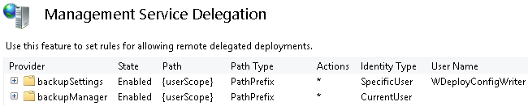

# Web Deploy Automatic Backups

by [Elliott Hamai](https://github.com/ehamai)

## Introduction

In V3, Web Deploy is introducing an automatic server-side backup feature for IIS 7 and above. When automatic backups are configured on the server and a user publishes to his site using Web Deploy, it will first take a backup of the live site and store it on the server before committing any changes to the site. If the publish failed for some reason or the user wants to restore an earlier version of his website, they will be able to restore from these backups without involving a server administrator. This feature needs to be enabled and configured by a server administrator before an end user may take advantage of it.

## When Backups are created

When Web Deploy detects that a user is publishing with a contentPath, iisApp, or appHostConfig provider, it will automatically start a backup (if enabled on the server). In many cases, these providers are also included in publishes using Web Matrix and Visual Studio. Here is a command line example of a sync which will initiate a backup on "remoteComputerName" using the Web Deployment Agent.

[!code-console[Main](web-deploy-automatic-backups/samples/sample1.cmd)]

If the source provider is a manifest, then Web Deploy will inspect all of the providers in the manifest to determine if any of the providers in the manifest is a contentPath, iisApp, or appHostConfig provider. If it is, then it will initiate a backup for ALL providers (see the section on "Known Issues and Limitations" for exceptions to this) in the manifest. However if there are conflicting provider paths (like one is pointing to site "foo" while the other is pointing to site "bar", Web Deploy will not take a backup.

## What a Backup Contains

By default, Web Deploy will use whatever providers you specified for your publish (*except for setAcl which is never included*) in order to create the backup. So if I publish with an iisApp and dbFullSql provider, Web Deploy will take a backup of your iisApp and dbFullSql providers on the server. This will include all the content and configuration belonging to web application along with database script which can be used to republish the web application. You can change this default behavior by modifying the ExcludedProviders backup setting, or by specifying skip rules before doing a publish.

These backups are valid Web Deploy packages which can be copied and used with Web Deploy against any compatible IIS server.

## Configuring Automatic Backup Feature on the Server (For server administrators)

In order to provide the automatic backup feature to users, a server administrator needs to provision space on the server where these backups can be stored. This space can be either physically located on the server or can be on a network share accessible from the server.

The amount of the space required will depend upon how large individual applications are and the number of backups you are planning to store on the server. If you want to control the space taken by backups you should use create a separate folder for each site and use Windows File Server Resource Manager (FSRM) for limiting quotas of individual folders. As a security best practice, you should also ACL these folders so that each user has read/write access to only his folder.

Backups can either be enabled globally on the server so that all sites can take advantage of it or these can be configured on per site basis.

### Configuring Backup Settings on the Server for Global usage automatically using PowerShell

The PowerShell script to configure the Backup feature at the server level can be found under `%programfiles%\IIS\Microsoft Web Deploy V3\scripts\BackupScripts.ps1`. To load it, simply navigate to that directory in PowerShell and run:

[!code-console[Main](web-deploy-automatic-backups/samples/sample2.cmd)]

This will load the following functions into the session that you can use to configure backups.

1. **TurnOn-Backups**: Turns on/off backups for the entire server.
2. **Configure-Backups**: Sets the default server or site-specific backup settings.
3. **Configure-BackupSettingsProvider**: Controls server settings for how much control a site administrator will have over their backup behavior.
4. **Get-BackupSettings**: Queries server or site-specific backup settings
5. **Reset-BackupSettings**: Resets server or site-specific backup settings

**TurnOn-Backups Function:**

Allows a server administrator to turn backups on or off at a *SERVER* scope, without overwritting site specific settings. By default, backups are turned off. Even after turning backups on, backups must still be "enabled" at the server or site level in order for backups to be taken.

[!code-powershell[Main](web-deploy-automatic-backups/samples/sample3.ps1)]

**Configure-Backups:**

Allows a server administrator to configure the default backup behavior at the *SERVER* or *SITE* specific scope. If an administrator specifies a setting at the server scope and a site has already specified a site specific setting, Web Deploy will prefer the site specific settings over the server settings. If a server administrator would like for the server settings to take preference, he/she should reset the site backup settings which would cause the site to automatically inherit its settings from the server.

[!code-powershell[Main](web-deploy-automatic-backups/samples/sample4.ps1)]

**Configure-BackupSettingsProvider**:

Site administrators can modify their site specific backup settings by using the BackupSettingsProvider with Web Deploy. This function allows a server administrator to control exactly which settings a site administrator can configure.

[!code-powershell[Main](web-deploy-automatic-backups/samples/sample5.ps1)]

**Get-BackupSettings**

Queries the server or a sites specific backup settings.

[!code-powershell[Main](web-deploy-automatic-backups/samples/sample6.ps1)]

**Reset-BackupSettings**

Resets the server or a sites backup settings. If you reset a sites backup settings, it will automatically inherit from the servers backup settings.

[!code-powershell[Main](web-deploy-automatic-backups/samples/sample7.ps1)]

### Configuring Backup Settings on the Server for Global usage manually in IIS Config

**Global Backup Settings**

The following global backup settings may be configured directly in the IIS Configuration system under `%windir%\system32\inetsrv\config\applicationhost.config`.

- **enabled** - (Default = "false") Controls whether backups are turned on or not.
- **backupPath** - (Default = "{sitePathParent}\{siteName}\_snapshots") Where on the server a backups will be stored. It also upports path replacement variables for "{sitePathParent}" and "{siteName}" which are determined at run-time.

  - sitePathParent - The physical file path of the parent of your sites content. For example, if your site's application lives under `c:\inetpub\wwwroot\siteName`, then sitePathParent would be `c:\inetpub\wwwroot\`.
  - siteName - The name of your site.

> **Example**: The default schema sets this path to "{sitePathParent}\{siteName}\_snapshots" so that each backup will be placed under a sibling folder of your site content instead of within it.
>
> **WARNING:** Make sure that your backupPath does not live under your sites content path or your backups will be deleted on each publish.

- **numberOfBackups** - (Default = "4") The number of backups per site that will be stored on the server. When the maximum number of backups has been created, the oldest backup will be deleted.
- **continueSyncOnBackupFailure** - (Default = "true") Allows users to either fail a sync or continue a sync if a backup fails to complete for any reason.
- **excludedProviders**- (Default = Empty Set) A list of Web Deploy providers to always exclude from a backup. For example, if database backups are managed separately in your environment, you use this setting to exclude database backups as part of web Deploy backups by excluding dbFullSQLProvider For more details, refer to the section "Controlling what a backup contains"

> [!NOTE]
> Although Web Deploy will technically allow you to backup almost every provider, there are some providers which cannot be restored in a meaningful way because of the nature of those providers. Basically any providers which are "set-only" providers and not "synchronization" providers fall into this category. Here is a list of built-in providers that are recommended to be added to the ExcludedProviders setting:
>
> - appHostAuthOverride
> - appPoolEnable32Bit
> - appPoolNetFx
> - appPoolPipeline
> - createApp
> - setAcl
> - DBSqlPackage (Not installed by default with Web Deploy but is listed here because it is not currently supported with the backup feature)

- **backupSettingsProvider** - (Default: All attribute settings are "false") Gives a system administrator control over which backup settings can be set by a web site administrator. You can allow web site administrators to control any of the above settings "enabled", "numberOfBackups", "continueOnBackupFailure", and "excludedProviders" for their site. This can be done by setting properties "canSetEnabled", "canSetNumberOfBackups" etc to true as specified in following example.

Complete details about these settings and there allowed values can be found in BackupManagerSchema `%windir%\system32\inetsrv\config\schema\BackupManagerSchema.xml` in the IIS Configuration system.

Below is a sample configuration that can be added under `<system.webServer>` (see the full schema for more details). *You do not have to specify all of the settings below as they all have default settings specified in the schema, but they are specified here to show as an example*.

[!code-xml[Main](web-deploy-automatic-backups/samples/sample8.xml)]

> Let us say that we have a site named "foo" that lives under `c:\foo\wwwroot` on the server. The configuration above tells Web Deploy to:

1. Turn on the Backup featureKeep a maximum of 2 backups.
2. Store each backup in a folder under `c:\foo\foo\_siteBackups`.
3. Fail a publish if a backup operation fails for any reason.
4. Exclude backing up SQL databases with the dbFullSql provider.
5. Allow web site administrators to use the backupSettingsProvider to configure the settings "enabled", "numberOfBackups", "continueOnBackupFailure", and "excludedProviders" for their site.

### Configuring Backup Settings on the Server for specific sites

The automatic backup feature also allows you to set site specific settings by specifying each backup setting using a `<location>` tag in the applicationHost.config file. If a setting is not specified in the location tag, then it will be inherited from the server settings. Here is an example of what a sites backup settings may look like:

[!code-xml[Main](web-deploy-automatic-backups/samples/sample9.xml)]

If you would like to allow site administrators to be able to set their own site specific settings, you need to configure the "canSet\*" attributes of the BackupSettingsProvider element in the **server** backup settings (not the site backup settings).

### Security considerations for automatic backups

While storing these backups on the server, it should be ensured that each user only has access to their own content. Web Deploy by default (during a Full install) configures BackupManager delegation rule to ensure that it is impersonating as the user who is publishing while creating backups. This implies that the publishing user account will also need to have "write" file privileges to the backup directory.

If you do not want to use the end users identity to create their backups, you can simply delete this delegation rule and Web Deploy will use the identity of the WMSVC service to write to the backup directory.

> [!NOTE]
>  
> - Delegation rules only apply for non-administrative users connecting through WMSvc. For administrators (connecting through Web Deploy agent), their own identity is used.
> - If you want to configure delegation rules manually, [run our AddDelegationRules.ps1 script](powershell-scripts-for-automating-web-deploy-setup.md).
> - The Backup feature comes with 2 new provider delegation rules (BackupSettings and BackupManager) as shown below.
>
> 

## Configuring Site-Level Backup Settings on the Server (For Site/server Administrators)

Server administrators can choose to delegate some of the backup administration to site administrators. If allowed, site administrators can configure the backup behavior for their own sites.

> [!NOTE]
> msdeploy.exe is located under `%programfiles%\IIS\Microsoft Web Deploy V3`

**Listing site backup settings:** Perform a "dump" operation while passing the name of your site into the backupSettings provider. The -xml flag will also list out whether the setting is writeable or not.

[!code-console[Main](web-deploy-automatic-backups/samples/sample10.cmd)]

**Configure backup settings:** Perform a "sync" operation while passing in the name of your site, plus any settings that you would like to change.

[!code-console[Main](web-deploy-automatic-backups/samples/sample11.cmd)]

> [!NOTE]
> Your server admin must allow delegation of these settings before you can change these.

**Controlling failure behavior:** You can control the behavior of whether you would like the publish to continue or not in case of backup failure by modifying the "continueSyncOnBackupFailure" backup setting. If "continueSyncOnBackupFailure" is set to false and a backup fails, the publish will fail and no site content or databases will be modified.

**Adding a provider to list of providers to exclude from a backup:** Specify a semi-colon delimited list of providers. You can use addExcludedProviders option to append providers to the global list.

[!code-console[Main](web-deploy-automatic-backups/samples/sample12.cmd)]

**Reset site backup settings to server defaults:** Perform a "delete" operation.

[!code-console[Main](web-deploy-automatic-backups/samples/sample13.cmd)]

## Publishing to a Backup-Enabled Server (For Web Developers)

**Automatically Creating backup**

When a user publishes to a backup-enabled server using one of the supported providers (iisApp, appHostConfig, contentPath), a backup will automatically be taken before any data is applied, so long as the backup is not skipped. There is no specific action required on end user's part.

**Manually Creating a Backup**

A user may manually force a backup to be created by using the BackupManager provider, so long as backups are configured and enabled for the site being published to. There are two methods of creating a manual backup.

1. Specifying a destination site path - This will take a simple iisApp backup of your destination site.

    [!code-console[Main](web-deploy-automatic-backups/samples/sample14.cmd)]
2. Specifying a source manifest file - This will allow you to take a backup of multiple providers (i.e. iisApp, dbFullSql, etc.)

    [!code-console[Main](web-deploy-automatic-backups/samples/sample15.cmd)]

An example of a simple manifest file for the second option could look something like this:

[!code-xml[Main](web-deploy-automatic-backups/samples/sample16.xml)]

**Skipping Backup during Publish**

If a client wants to prevent a backup from being taken, they can either disable backups on the server as a persisted setting using the backupSettings provider, or disable the Backup rule from being run on the server for each individual publish. Here is an example of how to disable the Backup rule from running during a publish:

[!code-console[Main](web-deploy-automatic-backups/samples/sample17.cmd)]

## Managing Backups (For Web Developers/Site administrators)

The BackupManager provider offers clients the ability to list, restore, and delete backups. Here are some examples of how this is done:

**Listing Backups for a Site:** Perform a "dump" operation to see all backups for a site

[!code-console[Main](web-deploy-automatic-backups/samples/sample18.cmd)]

**Restoring a Specific Backup for a Site:** Performs a "sync" operation to apply a backup

[!code-console[Main](web-deploy-automatic-backups/samples/sample19.cmd)]

**Restore the Latest Backup for a Site:**

[!code-console[Main](web-deploy-automatic-backups/samples/sample20.cmd)]

**Restore the Latest Backup for a Site which also contains a Database:** Assumes that the latest backup also happens to contain a database backup. The connectionString provider setting is used to connect to the database that you are restoring to and is necessary for restoring any backup with a database unless you apply a skip rule to skip database restoration.

[!code-console[Main](web-deploy-automatic-backups/samples/sample21.cmd)]

**Restore the Latest Backup for a Site without Overwriting App\_Data by using Skips:**

[!code-console[Main](web-deploy-automatic-backups/samples/sample22.cmd)]

**Delete a Backup for a Site:**

[!code-console[Main](web-deploy-automatic-backups/samples/sample23.cmd)]

## Known Issues &amp; Limitations-

There are several scenarios in which Web Deploy will not automatically take a backup for you even if it is enabled on the server:

1. **The client is publishing using an earlier version of Web Deploy than V3 RC.**
2. **The server does not have at least Web Deploy V3 RC installed.**
3. **More than 1 database is specified in a manifest** - Web Deploy only supports taking a backup of a single database per publish.
4. **The path of the provider you are using is not a relative site path -** The contentPath provider accepts physical file paths as well as relative site paths. If a physical path is specified then Web Deploy will not count that provider towards initiating the backup. The apphostConfig provider accepts an empty path. If an empty path is specified, then Web Deploy will not take a backup at all.
5. **Conflicting Relative paths in a manifest** - If there are multiple providers in a manifest that have conflicting relative site paths, then Web Deploy will not take a backup. For instance, if you're publishing with multiple iisApp providers to different sites - one pointing to site "foo" while the other pointing to site "bar" - Web Deploy will not take a backup.

Other known issues:

1. **Installing Web Deploy V2 Breaks BackupSettings Delegation Rule** - If you install V2 after V3, the BackupSettings delegation rule will no longer work if it was configured to run with the default WDeployConfigWriter user. To get around this, simply run the V3 AddDelegationRule.ps1 (located under `%programfiles%\IIS\Microsoft Web Deploy\Scripts`) script from PowerShell.
