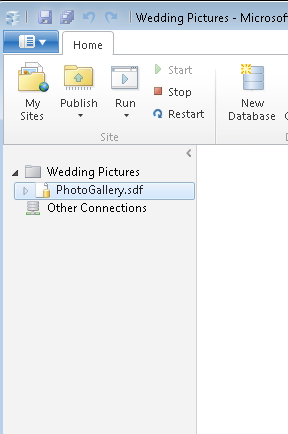
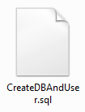
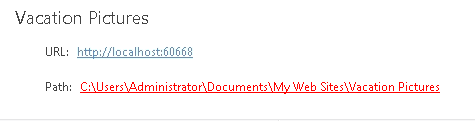

Web Deploy Parameterization
====================
by Web Deploy Team

## Introduction to Parameterization

Web application development most often involves deploying code in different environments: development, staging, or production servers. Each environment might use a different set of resources, like database connection information, and Web Deploy is built with features that help transform web applications as they are deployed into different environments. In order to transform an application during deployment, different parts of the applications can be "parameterized", and, at deployment time, Web Deploy takes a user's input to replace different pieces of information within the application.

## Different Ways to Deploy Applications: Live Synchronization, Web Platform Installer, and Visual Studio

The Web Deploy tool can be used to deploy an application in a couple of different ways. A web application can be **synchronized live**, from one server (perhaps the development server) to another server (perhaps the server that hosts the application on the web). Web applications can also be packaged into a .zip file, to be downloaded and installed by a wider, more general audience of developers. This is a model commonly used by "platform"-like apps (for example, Wordpress), and the application can later be easily installed by using a guided UI, namely [**Microsoft Web Platform Installer**](https://www.microsoft.com/web/downloads/platform.aspx). Finally, Web Deploy is used behind the scenes by **Visual Studio** when developing and deploying web application (WAP) projects. In this case, Visual Studio automatically parameterizes most of the necessary parts of the web applications, with the ability to create custom parameters if necessary.

## Creating and Parameterizing an Application to be Deployed with Microsoft Web Platform Installer

Microsoft provides an easy way to install over 50 popular web applications, like Wordpress, Joomla, Drupal, and DotNetNuke. These applications can be installed relatively quickly and easily with a guided UI by using either the [Microsoft Web Platform Installer](https://www.microsoft.com/web/downloads/platform.aspx) or [Microsoft WebMatrix](https://www.microsoft.com/web/webmatrix/). Behind the scene, these UIs use the Web Deploy tool to install the application from a .zip package. In order to create an application package so that it can be installed by using one of these tools, a number of steps must be taken, including parameterizing parts of the application.

The following steps are required to turn an application into a .zip package that can be deployed with the Web Platform Installer:

1. Create an application.
2. Create a "manifest" file. This file tells the Web Deploy tool the different actions that are required to install the application. This includes things like copying files and setting up a database.
3. Create a parameter file. This is the "parameterization" file that Web Deploy uses to identify the parts of the application that need to be transformed at the time of installation based on user input.
4. Create a .zip file that contains the application, the manifest file, and the parameter file.
5. Create an XML file that the Web Platform Installer will use to display and install the application.

This article presents each of these steps in detail.

#### Step 1 - Create an Application

An easy way to create an application to experiment with web deploy parameterization is to use WebMatrix. WebMatrix can be installed using the Microsoft Web Platform Installer, which you can download [here](https://www.microsoft.com/web/downloads/platform.aspx). After installing Web Platform Installer, search for "WebMatrix" and **install** it:

After WebMatrix finishes installing, run the program and at the start screen select **Site From Template**:

The **Site from Template** page appears.

Since the photo gallery template application can use a Microsoft SQL Server database, it is a good choice for showing how Web Deploy parameterization can be used.

On the **Site from Template** page, select **Photo Gallery**. In the **Site Name** box, enter the name "Vacation Pictures". Next, click **OK** to install the Photo Gallery application.

Out of the box, the photo gallery application uses a file-based, SDF database. However, most real-world applications use a non-file based database, so you will convert (or "migrate") the SDF database into a Microsoft SQL Server database. If you don't have SQL Server, use Web Platform Installer to search for "SQL Server Express 2008 R2". Next, click **Add,** and then click **Install** to install it:

During the application setup, remember the administrative username ("sa") and the password that you enter:

Now that a SQL server instance is available, navigate back to WebMatrix. In the bottom left corner of WebMatrix, click the **Databases** tab to open the databases workspace.

When the database workspace is open, click the database file **, PhotoGallery.sdf**, in the left pane:

This should light up the **Migrate** button in the ribbon control at the top of the application. Click **Migrate** to begin the migration:

The **Migrate Database** dialog box appears:

Leave the default database name and SQL server name unchanged. Change the dropdown from **Windows Authentication** to **Database Authentication**. In **Login** and **Password** boxes, enter the database administrator's username and password (if you installed SQL Express, use the same values that you entered during installation.)

Click **OK**. The database migration begins.

After migration completes, you can verify that the application still works by running the application in a web browser. In the top control ribbon, click **Run** to launch the application in a web browser:

This should bring up an application that looks similar to this:

Now you have an application that is ready to be packaged and parameterized so that other developers can download and install it by using Web Platform Installer. The next step is to set up a file that will tell Web Deploy the steps required to install the application.

#### Step 2 - Create a "manifest" file

The Web Deploy tool can perform a number of functions, including copying files, web server configuration settings, and databases. Each of these functions is made possible by a Web Deploy "**provider**". In order to install the application you just created, you'll use the **iisApp** provider, which helps copy files and create the application on the server; the **setAcl** provider, which sets necessary file permissions; and the **dbFullSql** provider, which sets up the database. In order to tell Web Deploy to use multiple providers during setup, you need to create a Manifest.xml file that declares these three providers in the following way ([you can copy a sample from here](web-deploy-parameterization.md#Manifest.xml)):

[!code-xml[Main](web-deploy-parameterization/samples/sample1.xml)]

Let's have a closer look at each of these entries.

##### IISApp Provider

The **iisApp** entry points to the folder where the application content is located. For example:

[!code-unknown[Main](web-deploy-parameterization/samples/sample-127169-2.unknown)]

The **path** value would be different if the application had a different name. 

##### SetAcl Provider

The **setAcl** entry tells Web Deploy to grant read, write, and execute permissions to the "App\_Data" directory when the application is installed. For example:

[!code-unknown[Main](web-deploy-parameterization/samples/sample-127169-3.unknown)]

Different applications might require special permissions on other folders. In that case, you would create a different **setAcl** entry for each permission setting that was required. 

##### DbFullSQL Provider

The **dbFullSQL** provider entries point to different SQL scripts that are used to create a database and user ("CreateDBAndUser.sql") and to set up the database tables ("VacPicDBSchema.sql") at installation time.

The CreateDBAndUser.sql script is a fairly simple script that can be [copied from here](web-deploy-parameterization.md#CreateDBAndUser.sql):

The VacPicDBSchema.sql is the script that creates all the tables in the database that the application uses. This file can created using the Web Deploy command line tool. From the command line, navigate to where Web Deploy is installed (typically %programfiles%\IIS\Microsoft Web Deploy &lt;LatestVersion&gt;) and enter the following command:

msdeploy -verb:sync -source:dbfullsql="data source=.\SQLExpress;initial catalog=PhotoGallery;user id=sa;password=&lt;AdminPassword&gt;" -dest:dbfullsql="c:\VacPicDBSchema.sql"

Make sure to replace &lt;AdminPassword&gt; with the appropriate SQL administrator password.

At a basic level, the above command uses the **dbFullSql** provider to copy data from a database using a database connection string ("-source:dbfullsql=…") and copies it to a database script file ("-dest:dbfullsql=…")

##### More Information About Providers and Manifext.xml

For more information about the above providers, and other providers that can be used in a manifest file, see the [web application package reference page](../../develop/windows-web-application-gallery/reference-for-the-web-application-package.md).

#### Step 3 - Create a parameter file

After you create the manifest file that tells Web Deploy how to install the application, you need to create a parameter file that tells Web Deploy how to transform certain settings so that the application can be customized to work in a specific user's deployment environment.

The basic pieces that would be useful to transform are:

- The application name: if the end user that is installing your application wants to change the application name, you'll need to parameterize the application name.
- The database name: a user might need to configure your application to run on a database that uses a different name. If so, you'll need to parameterize the database connection information.

Web Deploy reads parameterization information from an XML file. In this case, you'll call the file Parameters.xml. For this demo, the parameters file can be [copied from here](web-deploy-parameterization.md#Parameters.xml) and looks like this (on the website, this XML file can be expanded into a code box like is used on [this page](https://blogs.iis.net/kateroh/archive/2009/10/24/web-pi-extensibility-custom-feeds-installing-custom-products.aspx)):

Next, you'll learn now to parameterize the application name and the database name.

##### Parameterizing the Application Name

Web Deploy parameterization can be used to transform different kinds of input. Normally this involves searching for text in an XML file or text file and replacing it with different text. In the case of the application name, the file copying and the creation of the web site on the destination computer is handled by a Web Deploy provider. So, in order to parameterize the application name, you will actually have to parameterize the provider that you previously declared in the Manifest.xml file.

The provider in the manifest file can be thought of as the **Source** provider, which will read information from the application package that a user downloads. In turn, when the application is installed, a **Destination** provider is used behind the scenes to copy the content and create a web site on the user's machine. The Manifest.xml file contains the **Source** provider information, so in order to allow a user to change the application name; you need to parameterize the provider that was defined in the Manifest.xml file.

In the Parameters.xml file linked to above, this parameterization is accomplished with the first XML entry:

[!code-xml[Main](web-deploy-parameterization/samples/sample4.xml)]

The important XML tag to notice is **parameterEntry**. This tells Web Deploy a few things: **one**, that you are parameterizing a provider in the manifest (kind="ProviderPath"); **two**, that you are parameterizing an **iisApp** provider (scope="iisapp"); **finally**, that you only want to replace entries in the manifest file that have the value "Vacation Pictures."

The second entry in the parameter file ('name="SetAclParameter1"') just makes sure that the **setAcl** provider in our Manifest.xml file uses the same name entered by the user for the **iisApp** provider, which is accomplished with the line 'defaultValue="{Application Path}/App\_Data"'. The value in the brackets, {Application Path}, references the name of the first parameter.

##### Parameterizing the Database Name

The rest of the entries in the Parameters.xml file deal with parameterizing the database connection information. The 2nd-6th entries in the parameters file gather information from the UI when a user is installing the application through Web Platform Installer. These entries prompt the user for the database server which will host the database for the application ("Database Server"), the name of the database to create ("Database Name"), the database user to associate with the database ("Database Username"), and the password for that user ("Database Password"). To create the database and user, Web Deploy also needs the database administrator user ("Database Administrator") and password ("Database Administrator Password").

Finally, all of the information entered by the user is used by Web Deploy to actually execute the scripts that create the database (CreateDBAndUser.sql) and setup the tables (VacPicDBSchema.sql). These are the 7th and 8th entries in Parameters.xml:

[!code-xml[Main](web-deploy-parameterization/samples/sample5.xml)]

Again, since Web Deploy uses a provider to synchronize database information (as declared in the Manifest.xml file), these two parameter entries are 'type="ProviderPath"'.

Our "Vacation Pictures" application also keeps track of the database connection in the Web.config file. This parameterization is handled by the final entry in Parameters.xml.

##### More Information about Creating the Parameters.xml File

For more information about creating the Parameters.xml file, including the meaning of various tags and the different kinds of parameter entries, see the [web application package reference page](../../develop/windows-web-application-gallery/reference-for-the-web-application-package.md).

#### Step 4 - Create a Zip File that Contains the Application, the Manifest File, and the Parameter File

You now have the basic building blocks needed to deploy the application using Web Platform Installer, so you can now package the application into the appropriate package format. The package just needs to contain the Parameters.xml file, the Manifest.xml file, and the database installation scripts at the top (root) level of the zip package, and the application content in a subfolder.

In the lower left corner of WebMatrix, click the **Site** tab to navigate to the site's content.

The site page has a link to where the application content lives:

Click the link to navigate to the application content. Navigate up another level from this folder and create a new folder called "VacationPicsWPIInstaller". Copy the application content folder, the Manifest.xml and Parameters.xml files, and the database installation scripts into the newly created folder:

With all of the files selected, right click-&gt;Send to-&gt;Compressed (zipped) folder:

This zipped file can be named anything, but to work better with the demo, name it "VacationPicsWPIInstaller.zip".

This package now contains everything that is needed to deploy it with Web Platform Installer.

#### Step 5 - Create an XML File that the Web Platform Installer Will Use to Display and Install the Application

The applications and products listed by Web Platform Installer are defined inside an XML file. In turn, to install our application by using the Web Platform Installer, we need to create an XML "feed" that Web Platform Installer will use to display and install our application.

##### Create a Custom Feed

A feed that works with the application created in this demo can be [copied from here](web-deploy-parameterization.md#VacationFeed.xml):

Two values need to be modified in order for the feed to work properly. First, in the middle of the feed is the path to where the "VacationPicsWPIInstaller.zip" is located on disk. It should look like:

[!code-unknown[Main](web-deploy-parameterization/samples/sample-127169-6.unknown)]

Change this value to point to wherever your application zip file lives.

Second, the Web Platform Installer uses a hash to verify that the file the application hasn't been tampered with. To generate a hash for your zip package, download a tool called File Checksum Integrity Verifier, which can be found [here](https://download.microsoft.com/download/c/f/4/cf454ae0-a4bb-4123-8333-a1b6737712f7/windows-kb841290-x86-enu.exe).

After unpacking the application, run this command from the command line to generate a hash for your application package:

[!code-console[Main](web-deploy-parameterization/samples/sample7.cmd)]

This will output the hash of the file, which will look something like this:

Copy the long number and use it to replace the value in the feed XML that looks like:

[!code-unknown[Main](web-deploy-parameterization/samples/sample-127169-8.unknown)]

##### Add the Custom Feed to Web Platform Installer

Now that we have a custom feed, we need to tell Web Platform installer to load this feed. Inside Web Platform installer, click the **options** link at the bottom of the application:

Fill out the path to the custom application feed, and then click **Add Feed**:

Finally, click **OK** to close the options dialog.

If everything works, a new entry will be displayed in the Web Platform Installer:

Click **Add** to test installing your application. If everything is working, you will be presented with a page to enter the parameters that you previously declared in the Parameters.xml file:

Fill out information for the application to finalize the installation. If everything is working, the application will launch inside WebMatrix after the installation completes. From there, you can click **Run** in the ribbon at the top of WebMatrix to view the application in a web browser.

For reference, you can download a copy of the original application used to create this demo from here:

##### More Information about Creating Custom Application Feeds

The feed linked in this demo is missing a lot of information that Web Platform Installer will normally display to a user, like the date and time of the application's creation, a thumbnail image for the application icon, and the name of the author of the application. More information about creating custom feeds can be found on [this blog post](https://blogs.iis.net/kateroh/archive/2009/10/24/web-pi-extensibility-custom-feeds-installing-custom-applications.aspx).

## Scripts for this demo

## CreateDBAndUser.sql

[!code-sql[Main](web-deploy-parameterization/samples/sample9.sql)]

## Manifest.xml

[!code-xml[Main](web-deploy-parameterization/samples/sample10.xml)]

## Parameters.xml

[!code-xml[Main](web-deploy-parameterization/samples/sample11.xml)]

## VacationFeed.xml

[!code-xml[Main](web-deploy-parameterization/samples/sample12.xml)]
  
  
[Discuss in IIS Forums](https://forums.iis.net/1144.aspx)