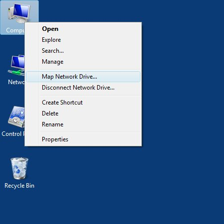
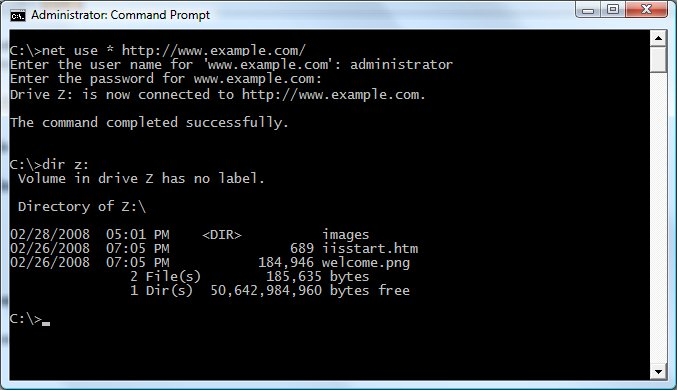

Using the WebDAV Redirector
====================
by [Robert McMurray](https://github.com/rmcmurray)

## Introduction

Microsoft has created a new WebDAV extension module that has been completely rewritten for Windows Server 2008 and Windows Server 2012. This new WebDAV extension module incorporates many new features that enable web authors to publish content better than before.

This document walks you through using the WebDAV redirector to publish content to an existing web site that has the new WebDAV module installed.

## Installing the WebDAV Redirector

### Prerequisites

- You must be running one of the following operating systems:

    - Windows Vista, Windows 7, or Windows 8
    - Windows Server 2008, Windows Server 2008 R2, or Windows Server 2012
- You must be connecting to a web server that already has the WebDAV module installed.  
    > [!NOTE]
    > See the     [Installing and Configuring WebDAV on IIS 7.0](https://go.microsoft.com/fwlink/?LinkId=105146) topic for more information.

### Windows Vista, Windows 7, Windows 8, or Windows 8.1

If you are using a desktop operating system like Windows Vista, Windows 7, Windows 8, or Windows 8.1, the WebDAV redirector is already installed.

### Windows Server 2008, Windows Server 2008 R2, Windows Server 2012, or Windows Server 2012 R2

If you are using a server operating system like Windows Server 2008 or later, you need to install the *Desktop Experience* feature. To do so, use the following steps:

1. Start the Windows **Server Manager**.
2. In the tree view, highlight the **Features** node.
3. In the details pane, click **Add Features**.
4. In the **Add Features Wizard**, check the **Desktop Experience** box, and then click **Next**.
5. Click **Install**.
6. When the **Add Features Wizard** has finished, click **Close**.
7. Click **Yes** when promoted to restart the computer.

## Mapping Drives using the WebDAV Redirector

Once the WebDAV Redirector has been installed, you can map drives to your web site using WebDAV. There are two ways to accomplish this:

- [Mapping Drives using the Map Network Drive Wizard](#002a)
- [Mapping Drives from a Command Prompt](#002b)

### Method 1: Mapping Drives using the Map Network Drive Wizard

To map a drive using the Map Network Drive Wizard, use the following steps:

1. Open the Map Network Drive wizard. This can be accomplished by using one of the following methods: 

    - Opening a folder in Windows Explorer and clicking **Tools**, then **Map Network Drive**:  
        
    - Opening the **Network and Sharing Center** in the Windows Control Panel and clicking **Tools**, then **Map Network Drive**:  
        
    - Right-clicking on the desktop icons for **Computer** or **Network**, then clicking **Map Network Drive**:  
        
2. When the Map Network Drive Wizard appears, enter the URL for your web site then click **Finish**:  
    
3. If prompted for credentials, enter your user name and password, then click **OK**.  
    
4. Once these steps have been completed, the networked drive should open in Windows Explorer:  
    

> [!NOTE]
> If you receive an error, please see the [Troubleshooting the WebDAV Redirector](#003) section for more information.

### Method 2: Mapping Drives from a Command Prompt

To map a drive from a command prompt, use the following steps:

- Click the Windows **Start** icon.
- Click **All Programs**.
- Click **Accessories**.
- Click **Command Prompt**.
- When the command prompt opens, type the following command:  

    [!code-console[Main](using-the-webdav-redirector/samples/sample1.cmd)]
  
 Where     *www.example.com* is the URL for your server.
- Once completed, you should have the next available drive letter mapped to your web site.

The following image shows what this might look like:

> [!NOTE]
> If you receive an error, please see the [Troubleshooting the WebDAV Redirector](#003) section for more information.

## Troubleshooting the WebDAV Redirector

The following list of error conditions is designed to help troubleshoot situations that you might see when working with WebDAV.

1. When attempting to map a drive to a WebDAV site, you receive the following error: 

    **System error 67 has occurred.  
  
 The network name cannot be found.**

    This can be caused by one of the following conditions:

    - IIS is not installed or is not running on the server that you are attempting to connect to.
    - You have not installed the WebDAV Redirector on your client system.
    - The WebClient service is not running on your client system.
    - You have not enabled WebDAV on your web site.
    - You are using Basic Authentication and connecting to your web site using HTTP instead of HTTPS.
    - You are connecting to a web site on your local network that is using Fully-Qualified Domain Names (FQDNs) for name resolution, your web site uses Windows Authentication, and you have not added the web site's FQDN to the proxy server bypass list on your client.
2. When attempting to map a drive to a WebDAV site, you receive the following error: 

    **System error 1920 has occurred.  
  
 The file cannot be accessed by the system.**

    This error occurs when the account that you are using does not have an authoring rule created for it.
3. When attempting to map a drive to a WebDAV site, you receive the following error: 

    **System error 5 has occurred.  
  
 Access is denied.**

    This can be caused by one of the following conditions:

    - The account that you are attempting to use does not exist.
    - You entered the incorrect password for the account that you are using.
    - The account that you are using does not have sufficient permissions for your web site's content.
    - You have not enabled any authentication methods for your web site.
4. When attempting to map a drive to a WebDAV site using HTTPS, you are prompted with the following dialog: 

    

    This occurs when the SSL certificate for the site that you are using does not match the name of the address that you used. For example, you are connecting to a site named *www.contoso.com*, but your SSL certificate was issued to *shopping.contoso.com*.
5. When attempting to map a drive to a WebDAV site, you receive the following error: 

    **System Error 1244 has occurred.  
  
 The operation being request was not performed because the user has not been authenticated.**

    This can be caused by one of the following conditions:

    - The server that you are connecting to does not have any authentication methods enabled.
    - The WebDAV client is running into the problems that are described in [KB941050](https://support.microsoft.com/kb/941050) or [KB943280](https://support.microsoft.com/kb/943280).
    - The logon type for content on a UNC share is incorrect; this setting is configured in the **Physical Path Credentials Logon Type** option in the **Advanced Settings** for a website or application, and is defined by the **logonMethod** attribute for the **[virtualDirectory](https://www.iis.net/configreference/system.applicationhost/sites/site/application/virtualdirectory)** settings for a website or virtual directory. For example: if the directory for your website's content is on a network share, you may need to change your settings from **Clear Text** to **Network** depending on your network configuration.
6. When attempting to map a drive to a WebDAV site, you receive the following error: 

    **System error 59 has occurred.  
  
 An unexpected network error occurred.**

    This can be caused by one of the following conditions:

    - The web site that you are attempting to connect to has been stopped.
    - The application pool for the web site that you are attempting to connect to has been stopped.
7. When attempting to map a drive to a WebDAV site, you receive the following error: 

    **System error 1397 has occurred.  
  
 Mutual Authentication failed. The server's password is out of date at the domain controller.**

    This error occurs when the WebDAV client is running into the problems that are described in [KB941298](https://support.microsoft.com/kb/941298).
8. When attempting to map a drive to a WebDAV site, you receive the following error: 

    **System error 58 has occurred.  
  
 The specified server cannot perform the requested operation.**

    This error occurs when the WebDAV server does not have the correct host name in its bindings. For example, if you have DNS entries for *contoso.com* and *www.contoso.com*, but you only have an IIS binding for *contoso.com*, you will see the error when you attempt to map a drive to *www.contoso.com*.
9. When attempting to map a drive to a WebDAV site, you receive the following error: 

    **System error 224 has occurred.  
  
 Access Denied. Before opening files in this location, you must first add the web site to your trusted sites list, browse to the web site, and select the option to login automatically.**

    This error occurs when the WebDAV site is not trusted by the WebDAV redirector. To resolve this issue, you need to add the website's URL to the list of trsuted sites. To do so, use the following steps:

    - Open the Windows **Control Panel**.
    - Open **Internet Options**.
    - Click the **Security** tab.
    - Click the **Trusted sites** icon.
    - Click the **Sites** button.
    - Type your website's URL in the **Add this website to the zone** text box, and then click the **Add** button.  
 (Note: You may need to uncheck the         **Require server verification (https:) for all sites in this zone** checkbox if your website uses an HTTP URL.)
    - Click the **Close** button.
    - Click the **OK** button.

## WebDAV Redirector Registry Settings

There are several settings that control the behavior of the WebDAV redirector that can be configured in the following registry key:

HKLM\SYSTEM\CurrentControlSet\Services\WebClient\Parameters

The following table details the various settings and values that are available. > [!NOTE]
 > After changing any of these values, the Web Client will need to be restarted or your computer will need to be rebooted.

**WARNING**: If you use Registry Editor incorrectly, you may cause serious problems that may require you to reinstall your operating system. Microsoft cannot guarantee that you can solve problems that result from using Registry Editor incorrectly. Use Registry Editor at your own risk.

| Value &amp; Description | Type | Values | Default |
| --- | --- | --- | --- |
| **AcceptOfficeAndTahoeServers** Specifies whether the WebClient service can connect to web sites that are running SharePoint or Office Web Server. | DWORD | | 0 | = | False | | --- | --- | --- | | 1 | = | True | | 1 |
| **AuthForwardServerList** Specifies a list of local URLs for forwarding credentials that bypasses any proxy settings. (Note: This requires Windows Vista SP1 or later.) | MULTI\_SZ | A carriage-return/line-feed separated list of URLs. | n/a |
| **BasicAuthLevel** Specifies whether the WebClient service can use basic authentication to talk to a server. > [!NOTE]
 > Using basic authentication can cause *serious security issues* as the username/password are transmitted in clear text, therefore the use of basic authentication over WebDAV is disabled by default unless the connection is using SSL. That being said, this registry key can override the default basic authentication behavior, but it is still *strongly discouraged*. | DWORD | | 0 | = | Basic authentication is disabled | | --- | --- | --- | | 1 | = | Basic authentication is enabled for SSL web sites only | | 2 | = | Basic authentication is enabled for SSL and non-SSL web sites | | 1 |
| **FileAttributesLimitInBytes** Specifies the maximum size that is allowed by the WebClient service for all properties on a specific collection. | DWORD | Size of attributes in bytes | 1,000,000 decimal (1 MB) |
| **FileSizeLimitInBytes** Specifies the maximum size in bytes that the WebClient service allows for file transfers. | DWORD | File size in bytes | 50,000,000 decimal (50 MB) |
| **InternetServerTimeoutInSec** Specifies the connection timeout for the WebClient service uses when communicating with non-local WebDAV servers. | DWORD | Time in seconds | 30 decimal |
| **LocalServerTimeoutInSec** Specifies the connection timeout for the WebClient service uses when communicating with a local WebDAV server. | DWORD | Time in seconds | 15 decimal |
| **SendReceiveTimeoutInSec** Specifies the timeout in seconds that WebDAV the WebClient service uses after issuing a request, such as "GET /file.ext" or "PUT /file.ext". | DWORD | Time in seconds | 60 decimal |
| **ServerNotFoundCacheLifeTimeInSec** Specifies the period of time that a server is cached as non-WebDAV by the WebClient service. > [!NOTE]
 > The WebClient service maintains a list of non-WebDAV servers that have been contacted. If the server is found in this list, a fail is returned immediately without attempting to contact the server. | DWORD | Time in seconds | 60 decimal |
| **SupportLocking** Specifies whether the WebClient service supports locking. | DWORD | | 0 | = | False | | --- | --- | --- | | 1 | = | True | | 1 |